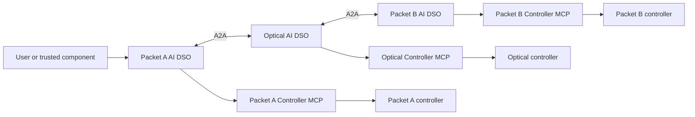

# Inter-domain automated networking

This repository documents the technical architecture and research design for an
Elsevier *Computer Networks* journal paper on federated AI-driven inter-domain
networking.

This project defines three autonomous domain agents, each with its own local
service-orchestrator capability, that establish and assure a network service
crossing independently operated packet, optical, and packet networks:

```text
client / server A
       |
 Packet A AI DSO         <-->  Optical AI DSO         <-->  Packet B AI DSO
       |                            |                            |
 controller A                 controller O                 controller B
       |                            |                            |
       +---------- customer service path ------------------------> server B
```

The agents collaborate on a user intent, but each operator retains control of
its credentials, policy, and network controller. The service-orchestrator
capabilities and the multi-domain topology database are federated across the
three agents: there is no central orchestrator or central topology database.
Each agent holds a replica of the complete topology, node relationships, and
approved configuration state contributed by every domain.



Start with the [system overview](docs/system-overview.md) for a first-read
explanation of the complete federation. The [domain-agent architecture](docs/domain-agent-architecture.md)
contains the detailed operating model, DSO LangGraphs, topology/configuration
federation, swarm optimization, game-theoretic negotiation and cost model,
domain closed loops, continual learning, message protocol, safety boundaries,
and implementation milestones. The [LangGraph node catalogue](docs/langgraph-node-catalog.md)
lists every workflow node and its execution method. The [implementation roadmap](docs/implementation-roadmap.md)
turns the architecture into incremental, testable delivery phases.

The [experimental validation plan](docs/experimental-validation.md) specifies
the journal study in detail: testbed profiles, workloads, matched baselines,
24 experiment families, independent checks, metrics, statistical analysis,
reproducibility artifacts, and the evidence required for each paper claim.

The [related-work and novelty assessment](docs/related-work-and-novelty.md)
compares this design with research papers and networking specifications,
identifies candidate contributions for the journal paper, and defines the
evidence needed to substantiate them. The literature search is dated
16 September 2026; proposed contributions are not claims of demonstrated results.

The recommended paper focus is service negotiation and recovery across
independently controlled packet and optical domains when state changes or an
operation partially fails. The [research protocol requirements](docs/domain-agent-architecture.md#research-protocol-requirements)
bind agreements to evidence, reservations, and controller execution conditions.
The [evaluation plan](docs/implementation-roadmap.md#journal-evaluation-plan)
compares the same federation with and without LLM assistance. Swarm optimization
and continual learning are optional research extensions whose value must be
measured separately. These are design recommendations, not implemented or
experimentally established guarantees.

## Core rule

Each agent's local service orchestrator may manage its local service lifecycle,
policy gates, reservation, execution request, and verification evidence. It
cannot issue an arbitrary device configuration or authorize another domain. A
domain Controller MCP Server accepts only a typed, policy-approved, locally
authorized configuration transaction after its owning agent has validated the
negotiated contract.

## First target scenario

An authorized user of packet domain A requests connectivity from `server-a` to
`server-b` with a specified bandwidth, latency, loss, availability, and
deadline. Packet domain A asks its optical neighbor for a feasible transport
envelope; the optical agent asks packet domain B for its egress envelope. The
agents negotiate only with their adjacent domains and obtain local reservations.
Each controller checks the agreed execution conditions before accepting its
local change. Failures can leave a partially applied service; the DSOs reconcile
receipts, release unused reservations, and attempt compensation where supported.
They report unresolved outcomes explicitly.

The result is a service contract and a verifiable end-to-end outcome based on a
shared, versioned view of the packet-optical-packet topology.
