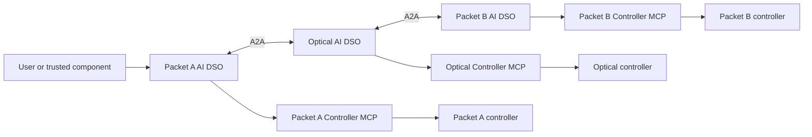

# Inter-domain automated networking

This project defines three autonomous domain agents, each with its own local
service-orchestrator capability, that establish and assure a network service
crossing independently operated packet, optical, and packet networks:

```text
client / server A
       |
 Packet A AI DSO         <-->  Optical AI DSO         <-->  Packet B AI DSO
       |                            |                            |
 controller A                 controller O                 controller B
       |                            |                            |
       +---------- customer service path ------------------------> server B
```

The agents collaborate on a user intent, but each operator retains control of
its credentials, policy, and network controller. The service-orchestrator
capabilities and the multi-domain topology database are federated across the
three agents: there is no central orchestrator or central topology database.
Each agent holds a replica of the complete topology, node relationships, and
approved configuration state contributed by every domain.



Start with the [system overview](docs/system-overview.md) for a first-read
explanation of the complete federation. The [domain-agent architecture](docs/domain-agent-architecture.md)
contains the detailed operating model, DSO LangGraphs, topology/configuration
federation, swarm optimization, game-theoretic negotiation and cost model,
domain closed loops, continual learning, message protocol, safety boundaries,
and implementation milestones. The [LangGraph node catalogue](docs/langgraph-node-catalog.md)
lists every workflow node and its execution method. The [implementation roadmap](docs/implementation-roadmap.md)
turns the architecture into incremental, testable delivery phases.

## Core rule

Each agent's local service orchestrator may manage its local service lifecycle,
policy gates, reservation, execution request, and verification evidence. It
cannot issue an arbitrary device configuration or authorize another domain. A
domain Controller MCP Server accepts only a typed, policy-approved, locally
authorized configuration transaction after its owning agent has validated the
negotiated contract.

## First target scenario

An authorized user of packet domain A requests connectivity from `server-a` to
`server-b` with a specified bandwidth, latency, loss, availability, and
deadline. Packet domain A asks its optical neighbor for a feasible transport
envelope; the optical agent asks packet domain B for its egress envelope. The
agents negotiate only with their adjacent domains, provision provisional local
reservations, then either commit every domain's approved local action or let
all reservations expire/roll back.

The result is a service contract and a verifiable end-to-end outcome based on a
shared, versioned view of the packet-optical-packet topology.
