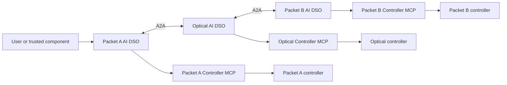

# Inter-domain automated networking

New here? Read the [project overview and paper report](docs/project-at-a-glance.md).

This repository develops the research design for an Elsevier *Computer Networks*
(COMNET) **agentic AI networking systems paper**. **ACO, PSO, Nash bargaining,
and continual learning are required core mechanisms**, coupled to autonomous
service provisioning and assurance across separately owned packet–optical networks.
The [paper plan](docs/paper-positioning.md) and
[coupled method](docs/agentic-system-method.md) define their roles and evidence requirements.

The organizing idea is **collective intelligence under independent ownership**:
can peer evidence, counteroffers, and learning improve joint service decisions?
This is a hypothesis to test, not a fifth algorithm or shared authority. The
[feedback design](docs/agentic-system-method.md#collective-intelligence-through-peer-feedback)
and E10/E11 experiments make its proposed benefits and costs measurable.

This project defines three autonomous domain agents, each with its own local
service-orchestrator capability, that establish and assure a network service
crossing independently operated packet, optical, and packet networks:

```text
client / server A
       |
 Packet A AI DSO         <-->  Optical AI DSO         <-->  Packet B AI DSO
       |                            |                            |
 controller A                 controller O                 controller B
       |                            |                            |
       +---------- customer service path ------------------------> server B
```

There is **one AI DSO per networking domain, and exactly one**: each is the sole
decision-making authority inside its own borders — one king per kingdom, with no
emperor above them. The agents collaborate on a user intent, but each operator
retains control of its credentials, policy, and network controller. Any owner may
refuse, and no majority can authorize another domain's resources.

The service-orchestrator capabilities and the multi-domain topology database are
federated across the three agents: there is no central orchestrator and no
central topology database. Each agent holds a replica of the complete topology,
node relationships, and approved configuration state contributed by every domain.



## Research questions

The five research questions test cross-owner service autonomy (RQ1), coupled
ACO–PSO optimization (RQ2), Nash bargaining between owners (RQ3), continual
adaptation and retention (RQ4), and grounded agent reasoning (RQ5). See the
[experimental plan](docs/experimental-validation.md#1-research-questions-and-claims).

| Required mechanism | Role in the full system |
| --- | --- |
| ACO | Discrete packet paths and optical route/channel candidates. |
| PSO | Continuous per-service bandwidth allocation on those candidates. |
| Nash bargaining | Mutually acceptable agreements between owners with distinct utilities. |
| Continual learning | Actual predictor updates from outcomes, improving later search/allocation/utility estimates. |

Each network belongs to a different person or organization. These are independent
administrative owners, not just different layers controlled by one operator.
Removing a required mechanism creates an evaluation ablation, not a reduced
version that fulfills the paper scope.

Correct refusal and honest unresolved reporting count as correct behavior, but
not successful service delivery. Report both outcomes separately.

Start with the [system overview](docs/system-overview.md) for a first-read
explanation of the complete federation. The [domain-agent architecture](docs/domain-agent-architecture.md)
contains the detailed operating model, DSO LangGraphs, topology/configuration
federation, swarm optimization, game-theoretic negotiation and cost model,
domain closed loops, continual learning, ownership boundaries,
and implementation milestones. The [LangGraph node catalogue](docs/langgraph-node-catalog.md)
lists every workflow node and its execution method. The [implementation roadmap](docs/implementation-roadmap.md)
turns the architecture into incremental, testable delivery phases.

**Current workspace:** this VM is for planning, architecture, design review and
optimization. Deployment and experimental validation belong in a separate
testbed environment; missing emulation tools here are expected and do not block
design work. The immediate priorities are to freeze the v1 scope, specify
implementable contracts, simplify the initial architecture, resolve findings at
the design level, and sequence implementation work. The next planned deliverable
is the **coupled ACO–PSO–Nash–learning specification and evaluation fixtures**,
incorporated into the v1 executable design specification; see the
[planning and design priorities](docs/implementation-roadmap.md#planning-and-design-priorities).

The data plane is implemented here, in **[`packet-network/`](packet-network)**
and **[`optical-network/`](optical-network)**: eight SR Linux routers across the
two packet domains, a four-ROADM Mininet-Optical line carrying one of two
wavelengths, and the `client-a` → `server-b` UDP service. On a prepared machine
it deploys with one command:

```bash
sudo scripts/service-up.sh
```

For a separate validation host starting from a fresh Ubuntu VM, work through the
[installation guide](docs/installation.md) first: it covers Docker,
Containerlab, Mininet, Open vSwitch and Mininet-Optical, including the three
edits those upstream projects need to build on Ubuntu 24.04.

The [data-plane specification](docs/data-plane.md) records the exact topology,
addressing, ownership boundary and capability limits the experiments pin
against. Operations are already scoped per domain: Packet A's tooling cannot
address Packet B's routers, each domain switches only its own service path, and
Packet A drives the sender while Packet B drives the receiver.

Each domain has a real provisioning choice. Both
packet domains can move the service between a primary and a backup core router;
the optical domain can carry it on either of two wavelengths, or refuse. That
gives eight joint configurations. What no domain can do is reroute around an
optical cut — both wavelengths ride the same fibre chain — so the fixture
deliberately offers a genuine choice for provisioning and none for
restoration. This supports a small bargaining and assurance demonstration, not
the entire optimization/learning claim. The DSO
federation above that data plane — peer cooperation, per-domain Controller
MCP servers, optimization, bargaining, and predictor learning — is documented here but not yet built; see
the [implementation roadmap](docs/implementation-roadmap.md).

The required [MCP server design](docs/mcp-server-design.md) has two
implementations: **Containerlab Packet MCP** and **Mininet-Optical MCP**. Deploy
the packet implementation separately as `packet-a-mcp` and `packet-b-mcp`, plus
one `optical-mcp`: three domain-scoped endpoints from two server types. These
servers are planned and wrap the existing packet gNMI and optical HTTP adapters.

The [known issues and follow-up register](docs/known-issues.md) records the
consequential findings from the 17 September 2026 repository assessment:
recovery when a router is unreachable, telemetry and receiver-evidence gaps,
lifecycle scoping and failure reporting, partial changes, optical retries and
health checks, and CLI consistency. Each open item includes source references
and the evidence needed to close it. The passing unit suite does not replace
the live integration checks listed there.

The [experimental validation plan](docs/experimental-validation.md) specifies
the journal study in detail: testbed profiles, workloads, matched baselines,
eleven experiment families, independent checks, metrics, statistical analysis,
reproducibility artifacts, and the evidence required for each paper claim. It
adds fixed-proposal-exchange A8, peer-informed decision comparisons (E10), and
feedback × continual-learning tests (E11), reusing centralized planning (E09).
It also records what the study deliberately does not test.

The [related-work and novelty assessment](docs/related-work-and-novelty.md)
compares this design with research papers and networking specifications,
identifies candidate contributions for the journal paper, and defines the
evidence needed to substantiate them. The literature search is dated
16 September 2026; proposed contributions are not claims of demonstrated results.

The full study requires a richer resource-allocation and learning workload than
the current single-flow fixture: multiple demands, meaningful continuous
bandwidth choices, diverse discrete candidates, and chronological condition
changes. Implement these in a reproducible simulator, then add actual
per-service enforcement before claiming measured allocation on the emulator.
The [evaluation plan](docs/experimental-validation.md) requires full-system,
component-removal, and interaction comparisons, including negative results.

Known algorithms and separate ownership are not novelty by themselves. The
candidate contribution is the specific coupled agentic method and demonstrated
service/owner benefits at measured cost. Hardware validation and LLM fine-tuning
are additional possibilities, not substitutes for the four required mechanisms.

## Core rule

Each agent's local service orchestrator may manage its local service lifecycle,
policy gates, reservation, execution request, and verification evidence. It
cannot issue an arbitrary device configuration or authorize another domain. A
domain Controller MCP Server accepts only a typed, policy-approved, locally
authorized configuration transaction after its owning agent has validated the
negotiated contract.

## First target scenario

An authorized user requests a service across Packet A, Optical, and Packet B.
Agents gather evidence, explore paths with ACO, allocate resources with PSO,
evaluate owner-specific utilities, and select a Nash agreement. Each owner
executes its approved local contribution; receiver evidence establishes the
actual service outcome. Completed outcomes update predictors for later decisions.

Begin all four mechanisms in the required allocation simulator. On the current
emulator, demonstrate only supported operations: verify the reference UDP flow,
diagnose a packet primary-path fault, use its backup, and verify fresh delivery.
An optical cut has no alternative and must be reported honestly. Do not label
sender offered load as a reserved bandwidth allocation.

The [complete demonstration sequence](docs/paper-positioning.md#5-implement-one-complete-agentic-demonstration-first)
connects optimization, bargaining, service verification, and learning. A small
integration checkpoint does not replace the required allocation and continual
learning experiments.
