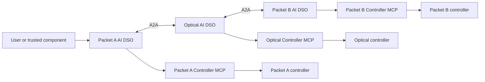

# Inter-domain automated networking

This repository documents the technical architecture and research design for an
Elsevier *Computer Networks* journal paper on federated AI-driven inter-domain
networking.

This project defines three autonomous domain agents, each with its own local
service-orchestrator capability, that establish and assure a network service
crossing independently operated packet, optical, and packet networks:

```text
client / server A
       |
 Packet A AI DSO         <-->  Optical AI DSO         <-->  Packet B AI DSO
       |                            |                            |
 controller A                 controller O                 controller B
       |                            |                            |
       +---------- customer service path ------------------------> server B
```

There is **one AI DSO per networking domain, and exactly one**: each is the sole
decision-making authority inside its own borders — one king per kingdom, with no
emperor above them. The agents collaborate on a user intent, but each operator
retains control of its credentials, policy, and network controller. Any owner may
refuse, and no majority can authorize another domain's resources.

The service-orchestrator capabilities and the multi-domain topology database are
federated across the three agents: there is no central orchestrator and no
central topology database. Each agent holds a replica of the complete topology,
node relationships, and approved configuration state contributed by every domain.



Start with the [system overview](docs/system-overview.md) for a first-read
explanation of the complete federation. The [domain-agent architecture](docs/domain-agent-architecture.md)
contains the detailed operating model, DSO LangGraphs, topology/configuration
federation, swarm optimization, game-theoretic negotiation and cost model,
domain closed loops, continual learning, message protocol, safety boundaries,
and implementation milestones. The [LangGraph node catalogue](docs/langgraph-node-catalog.md)
lists every workflow node and its execution method. The [implementation roadmap](docs/implementation-roadmap.md)
turns the architecture into incremental, testable delivery phases.

The data plane is implemented here, in **[`packet-network/`](packet-network)**
and **[`optical-network/`](optical-network)**: eight SR Linux routers across the
two packet domains, a four-ROADM Mininet-Optical line on channel 1, and the
`client-a` → `server-b` UDP service. On a prepared machine it deploys with one
command:

```bash
sudo scripts/service-up.sh
```

Starting from a fresh Ubuntu VM, work through the
[installation guide](docs/installation.md) first: it covers Docker,
Containerlab, Mininet, Open vSwitch and Mininet-Optical, including the three
edits those upstream projects need to build on Ubuntu 24.04.

The [data-plane specification](docs/data-plane.md) records the exact topology,
addressing, ownership boundary and capability limits the experiments pin
against. Operations are already scoped per domain: Packet A's tooling cannot
address Packet B's routers, each domain switches only its own service path, and
Packet A drives the sender while Packet B drives the receiver. The DSO
federation above that data plane — A2A, signed contracts, per-domain Controller
MCP servers, reservations, epochs — is documented here but not yet built; see
the [implementation roadmap](docs/implementation-roadmap.md).

The [experimental validation plan](docs/experimental-validation.md) specifies
the journal study in detail: testbed profiles, workloads, matched baselines,
nine experiment families, independent checks, metrics, statistical analysis,
reproducibility artifacts, and the evidence required for each paper claim. It
also records what the study deliberately does not test.

The [related-work and novelty assessment](docs/related-work-and-novelty.md)
compares this design with research papers and networking specifications,
identifies candidate contributions for the journal paper, and defines the
evidence needed to substantiate them. The literature search is dated
16 September 2026; proposed contributions are not claims of demonstrated results.

The paper focus is sovereign domain agents reasoning with one another to
autonomously establish a service that runs through all three domains, from an
intent submitted to any one of them. The
[research protocol requirements](docs/domain-agent-architecture.md#research-protocol-requirements)
bind agreements to evidence, reservations, and controller execution conditions.
The [evaluation plan](docs/implementation-roadmap.md#journal-evaluation-plan)
compares the same federation with and without LLM assistance. Behavior under
injected races, message faults, partitions, and coordinator replacement is a
separate protocol study and is explicitly out of scope. Swarm optimization and
continual learning are optional extensions whose value must be measured
separately. These are design recommendations, not implemented or experimentally
established guarantees.

## Core rule

Each agent's local service orchestrator may manage its local service lifecycle,
policy gates, reservation, execution request, and verification evidence. It
cannot issue an arbitrary device configuration or authorize another domain. A
domain Controller MCP Server accepts only a typed, policy-approved, locally
authorized configuration transaction after its owning agent has validated the
negotiated contract.

## First target scenario

An authorized user of packet domain A requests connectivity from `client-a`
(`10.10.0.2`) to `server-b` (`10.20.0.2`) with specified service objectives and a
deadline. The initial traffic profile uses the reference 1 Mbit/s offered load;
this does not establish reserved bandwidth. Packet domain A asks its optical
neighbor for a feasible transport envelope; the optical agent asks packet domain
B for its egress envelope. The agents negotiate through A2A and obtain the
local holds supported by the declared controller profile. Unchanged segments
contribute acceptance and fresh evidence without artificial configuration writes.
Each controller checks the agreed execution conditions before accepting its
local change. Failures can leave a partially applied service; the DSOs reconcile
receipts, release unused reservations, and attempt compensation where supported.
They report unresolved outcomes explicitly.

The result is a service contract and a verifiable end-to-end outcome based on a
shared, versioned view of the packet-optical-packet topology.

The first recovery changes Packet A or Packet B to its existing backup packet
path while retaining the fixed optical line. An unavailable optical line has
no alternate route in this baseline and must be reported accordingly.
