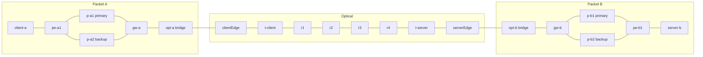
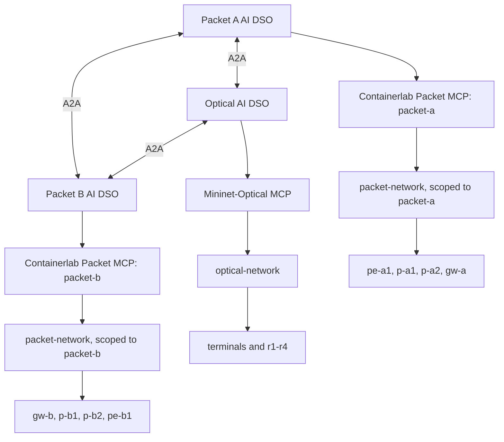
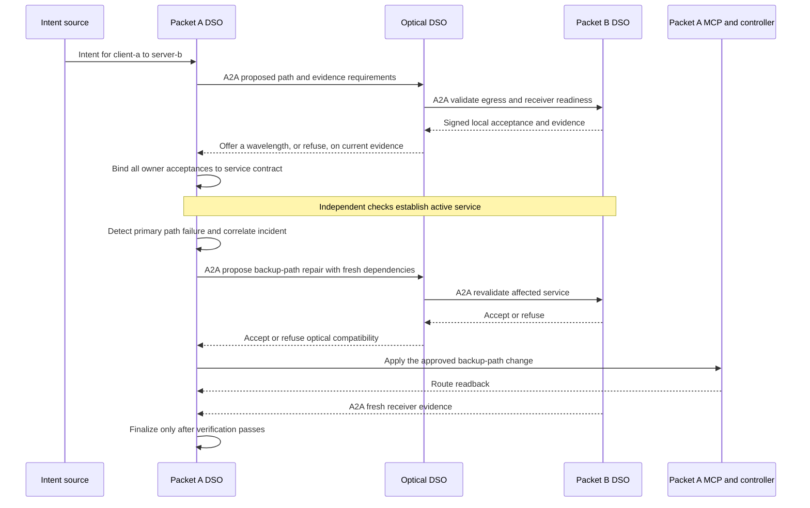

# Packet–optical data plane

The laboratory data plane this repository's architecture and experiments run
on. It is implemented here, in [`packet-network/`](packet-network) and
[`optical-network/`](optical-network), and can be deployed today:

```bash
sudo scripts/service-up.sh
```

That brings up both packet domains, the optical line between them, and one UDP
service from `client-a` to `server-b`. The [installation guide](installation.md)
prepares a fresh Ubuntu VM to run it; the component READMEs are the operating
references; this document is the specification the experiments pin against.

**Status:** deployable. The data plane and its domain-scoped operations exist
and are tested. The DSO federation above it — A2A, signed contracts, per-domain
Controller MCP servers, ACO/PSO optimization, Nash bargaining, and continual
predictor learning — does not, and is the work in the
[implementation roadmap](docs/old/implementation-roadmap.md). Nothing here supplies
those mechanisms.

The [known issues and follow-up register](docs/old/known-issues.md) qualifies the current
implementation: unit tests pass, but lifecycle handling, recovery, telemetry and
service verification have open findings. Its assessment did not run a live lab.
Consult the register before relying on CLI success, optical `configured` status
or receiver interval identity as evidence that a service is healthy or recovered.

## What is fixed

Pin these when constructing an experiment manifest, and record the separately
installed emulator version, container image digests, this repository's commit,
and any local patches alongside the results. A deliberate topology change gets
a different manifest and a different result label.

## Topology and ownership



| Owner | Inventory | Role |
| --- | --- | --- |
| Packet A | `client-a`, `pe-a1`, `p-a1`, `p-a2`, `gw-a`, `opt-a` | Source host, four routers, packet-side L2 attachment. |
| Optical | `clientEdge`, `t-client`, `r1`–`r4`, `t-server`, `serverEdge` | Two Ethernet edges, two terminals, four ROADMs. |
| Packet B | `opt-b`, `gw-b`, `p-b1`, `p-b2`, `pe-b1`, `server-b` | Packet-side L2 attachment, four routers, destination host. |

**20 named entities:** eight routers, two endpoints, two attachment bridges, two
optical edges, two terminals, four ROADMs. Interfaces, fibres, amplifiers and
channels are additional typed resources, not extra nodes. The optical monitor
set covers six terminal/ROADM nodes and is not the full inventory.

The Containerlab lab is `packet-qos`; containers are prefixed
`clab-packet-qos-`. Routers use `ghcr.io/nokia/srlinux:24.10.1`, type
`ixr-d3l`; endpoints and attachment bridges use `alpine:3.20`. Management runs
on `172.31.255.0/24`, kept separate from service traffic.

| Service address | Value |
| --- | --- |
| `client-a` | `10.10.0.2/24`, gateway `10.10.0.1` |
| `server-b` | `10.20.0.2/24`, gateway `10.20.0.1` |
| `gw-a` optical transit | `10.10.4.1/30` |
| `gw-b` optical transit | `10.10.4.2/30` |

The twelve Containerlab links:

| Endpoint 1 | Endpoint 2 |
| --- | --- |
| `client-a:eth1` | `pe-a1:e1-1` |
| `pe-a1:e1-2` | `p-a1:e1-1` |
| `pe-a1:e1-3` | `p-a2:e1-1` |
| `p-a1:e1-2` | `gw-a:e1-1` |
| `p-a2:e1-2` | `gw-a:e1-2` |
| `gw-a:e1-3` | `opt-a:eth1` |
| `gw-b:e1-1` | `opt-b:eth1` |
| `gw-b:e1-2` | `p-b1:e1-1` |
| `gw-b:e1-3` | `p-b2:e1-1` |
| `p-b1:e1-2` | `pe-b1:e1-1` |
| `p-b2:e1-2` | `pe-b1:e1-2` |
| `pe-b1:e1-3` | `server-b:eth1` |

Starting the optical line with `--attach` adds the two boundary attachments,
`opt-a`–`clientEdge` and `serverEdge`–`opt-b`, with veth pairs and L2 bridges.
There is no direct `opt-a`–`opt-b` bypass, so cross-domain transit depends on
the optical line being attached and configured. `inventory.py` is the source of
truth for the addressing above and its test suite checks it against the
topology file, so the two cannot drift.

## Optical configuration and limits

```text
clientEdge -- t-client == r1 == r2 == r3 == r4 == t-server -- serverEdge
```

Terminal Ethernet port **1** connects to WDM port **11**. The ROADM add/drop
port is **1**, west line port **111**, east **222**. The configured path is
`r1:1→222`, `r2:111→222`, `r3:111→222`, `r4:111→1`, with the rules matched to
whichever channel is carried; installed rules and direction should come from
controller readback rather than from this table.

Retuning a live service between the two channels costs roughly **90–100 ms** of
delivery (8/90 and 9/89 datagrams lost across two measured retunes, with no
other lossy interval in the run) at an unchanged 28.44 dB modelled gOSNR. Use
that as the disruption term for the action; it is a measurement on this
fixture, not a general property.

The terminals are **tunable across channels 1 and 2**, and carry one at a time.
Which one is a decision the optical domain owns, so it has a genuine strategy
set — offer channel 1, offer channel 2, or refuse — rather than a single
accept-or-refuse move. That is what makes negotiation measurable on this
fixture instead of merely assertable; see
[Service and search space](#service-and-search-space).

The builder uses **50-metre span segments**, unity-gain span amplifiers, a 3 dB
line boost, 0 dBm launch power and zero modelled ROADM insertion loss. Preserve
those for reproducibility and identify them as simplifying assumptions: this is
a short lab model, not a calibrated long-haul or hardware result. It closes at
roughly 28.4 dB gOSNR.

There is **no alternate optical route.** Both channels traverse the same fibre
chain, so a wavelength is a choice of carrier and not a protection path: a span
failure takes every channel with it. An optical cut with no valid alternative
must produce a degraded or unresolved service, or an escalation, followed by
reconciliation once repaired. It cannot produce an automatic optical reroute by
negotiation.

The fixture is deliberately asymmetric in this respect — a real strategy set
for **provisioning**, none at all for **restoration** — so one topology can
exercise both negotiation and truthful refusal. Simultaneous multi-channel
operation (a transceiver and add/drop port per channel, hence genuine spectrum
contention between concurrent services), tunable modulation and optical
protection remain extensions, not baseline actions.

Record monitor coverage and fresh OSNR/gOSNR evidence. A changed modelled gOSNR
is not automatically changed packet loss or delay: demonstrate the coupling at
the receiver before claiming an optical impairment caused packet QoS
degradation. For an optical-connectivity fault, independently verify that
packets actually stop crossing the attachment.

## Control boundary

The planned [MCP servers](mcp-server-design.md) are **Containerlab Packet MCP**
(separate Packet A and Packet B instances) and **Mininet-Optical MCP** (one
Optical instance). The diagram maps those three domain endpoints to the
implemented backend packages; the MCP servers themselves are not yet built.



The packet package carries the owning domain on every router and refuses an
operation that names a router outside the scope it was given, so Packet A's
tooling cannot address Packet B's four routers. The optical line is a single
owner with its own control API.

That scoping is a correctness guard, not an isolation boundary, and the
distinction matters for [E01](docs/old/experimental-validation.md#e01--domain-authority-identities-and-controller-boundaries).
Both packet domains are emulated on one host, addressed through one management
subnet, and reached with one set of device credentials; the emulation host's
container runtime is root-equivalent and is required by anything that drives
the lab. A run on this testbed therefore evidences *scoped control*, and must
be labelled as such rather than as isolation between operators. Separate
credentials per domain, separate hosts or namespaces, and a check at the device
rather than in the caller are what would raise it, and each is its own work
item.

The device interface is gNMI on port **57400**; the optical control API is
HTTP on **8080**, bound to loopback. There are no other network services: the
per-domain Controller MCP servers, their typed transaction tools and their
authorization are [Phase 2](docs/old/implementation-roadmap.md#phase-2--local-controller-mcp-server-and-transaction-safety)
work, and this data plane is what they will wrap.

A trusted **lab bootstrap** — `scripts/service-up.sh` — creates the shared
environment, joins the attachment namespaces and installs initial
configuration. Boundary setup legitimately needs both packet and optical
access; that does not grant any DSO arbitrary control at run time. Exclude
lab-wide deploy, destroy, reconfigure-all, attach and cleanup from runtime DSO
tools. Bootstrap is testbed lifecycle management, not a service decision-maker.

Endpoint ownership is already split: Packet A drives the sender on `client-a`,
Packet B the receiver on `server-b`. Do not run two copies of the flow against
one service. A driver may impose a fixed traffic schedule; it must not decide
repairs.

Each DSO keeps its own PostgreSQL/pgvector store and Neo4j projection. Nothing
in this data plane is a substitute for those, and it holds no durable service
state of its own.

## Action and capability profile

| Capability | What exists | What the federation must add |
| --- | --- | --- |
| Router configuration and telemetry | Static interfaces and routes over gNMI; interface counters with rates derived across reads. | Typed MCP wrappers and per-domain identity. |
| Packet A path change | `path backup` / `path primary --domain packet-a`. | Gate it on agreement and fresh readiness. |
| Packet B path change | `path backup` / `path primary --domain packet-b`. | Same, validated independently. |
| Precondition and readback | Refuses unless on the expected path, backup up and primary impaired; reads each write back; reports `mixed` on divergence. | Owner-approved execution, durable outcomes, and supported recovery. Writes are per-router, never atomic across them. |
| Optical participation | Inspect nodes, monitor OSNR/gOSNR, light or retune the service onto channel 1 or 2; terminal observations are not installed-rule readback. | Bind the wavelength choice to the owner-approved service and fresh independent evidence. |
| Optical alternate route or spectrum reservation | Not supported. Both channels share one fibre chain, and only one is carried at a time. | Reject unsupported requests; concurrent multi-channel operation and genuine spectrum contention are an explicit extension. |
| Per-service queues, VPNs or bandwidth isolation | Not present. No classifier, scheduler, policer or queue is configured anywhere. | Required per-service allocation enforcement for emulated PSO claims; otherwise continuous-allocation results remain simulation-only. A sender's offered rate is not a reservation. |
| Fault injection | `impair down/up --domain D`, applied at the gateway so the core router observes a propagated failure. | Fault schedules and independent outcome checking. |
| ACO, PSO, Nash bargaining, continual predictor learning | Not implemented in this fixture. | All four are required in the proposed agentic system; the data plane supplies observations and actuators, not the decision methods. |

The two path changes rewrite the next-hop-group reference of existing static
routes:

| Domain | Router and destination | Primary next hop | Backup next hop |
| --- | --- | --- | --- |
| Packet A | `pe-a1`, `10.20.0.0/24` | `10.10.1.2` | `10.10.1.6` |
| Packet A | `gw-a`, `10.10.0.0/24` | `10.10.2.1` | `10.10.3.1` |
| Packet B | `gw-b`, `10.20.0.0/24` | `10.20.2.2` | `10.20.3.2` |
| Packet B | `pe-b1`, `10.10.0.0/24` | `10.20.1.1` | `10.20.1.5` |

Both directions move together and the optical attachment is untouched, so a
domain on its backup path uses the same lightpath. A switch requires the domain
to be wholly on its primary, its backup core router up, and its primary
impaired — it is a repair, not a general optimiser. `--force` overrides only the
impairment check.

These are journalled per-router operations, **not atomic hardware
transactions**. If a second write fails the first has already applied, and the
domain reports `mixed` until reconciled. Controller-side rechecks do not
prevent a direct device write from outside. Advertise the guarantees that exist;
conditional acceptance and epoch fencing need their own implementation and
race tests, and belong above this layer.

Routing is entirely static: no IGP, no BGP, no BFD, no fast reroute. Nothing in
the data plane reconverges on its own. That is deliberate — it means every path
change is an explicit decision made above the data plane, with no protocol
racing it — but it also means recovery timings from this testbed do not
transfer to a network that already has sub-second protection.

## Fault observation

`impair down` disables the gateway-facing port of a domain's primary core link.
The far end — the primary core router — then reports a link that went away, and
that is what the readiness check reads. The injection point and the observation
point are deliberately different routers: a check that read back the
administrative state it had just set would confirm the injection, not the
network. Experiments that need a fault the readiness check cannot trivially see
(congestion, unidirectional loss, a silent black hole, optical degradation)
have to construct it separately; this one is a clean link failure.

## Service and search space

A structured intent requests `client-a` (`10.10.0.2`) to `server-b`
(`10.20.0.2`). The flow is UDP on port `5201` with a 1400-byte payload at a
**1 Mbit/s offered load** — generic UDP, not RTP and not a guaranteed-bandwidth
service. Calibrate delay and loss targets and observation windows before
calling any of it an SLA.

Only the receiver establishes delivery. Sender statistics show that packets
left the source. Receiver interval identities must advance for a sample to
count as fresh; the endpoint image's `stat` reports whole seconds, so file
timestamps cannot order a sample against an event in the same second.

The topology offers **two packet path options per packet domain and two
wavelengths**, so eight joint configurations, and current conditions can reduce
that further. Exact enumeration is the search baseline here.

That is enough for the [bargaining mechanism](docs/old/domain-agent-architecture.md#game-theoretic-coordination)
to be exercised rather than merely described: every participant has a real
choice, the optical contribution is no longer a constant, and a counteroffer
has somewhere to go. It is **not** enough to establish a search advantage — eight
candidates are exhaustively enumerable, so there is no better feasible optimum
for ACO to discover than a complete exact search under the same objective, and
[swarm search](docs/old/domain-agent-architecture.md#swarm-optimization-layer) needs a
separately labelled larger fixture before its contribution can be measured.

Two limits to state wherever results are reported. Both wavelengths ride the
same fibre, so this is not path diversity. And with one service there is no
spectrum contention. Multiple flows can compete for modeled or enforced transport
capacity without pretending the present optical line supports simultaneous
wavelength allocation.

For the revised journal scope, the [richer allocation and learning profile](docs/old/agentic-system-method.md)
is required: meaningful continuous bandwidth decisions, diverse discrete
candidates, competing service demands, and chronological condition changes.
Build those studies in P0 and label them as simulation. Add owner-scoped
per-service enforcement and independent flow measurements for P1-A before
claiming measured PSO allocation; use the current P1 fixture as the service
integration anchor. All four mechanisms remain required in the full system.

## A complete service example



The diagram shows the successful branch. Missing consent, stale evidence, an
unusable backup or a failed readback enters deferral or reconciliation instead.
Packet A repairs its own routes through its own controller; Optical and Packet
B retain their existing forwarding when no local change is needed. Participation
does not require an artificial configuration write in every domain.

See the [implementation roadmap](docs/old/implementation-roadmap.md) for the adapter and
federation work, and the [experimental validation plan](docs/old/experimental-validation.md)
for how this fixture is used and what it cannot evidence. The 57-node DSO
design is unchanged by any of it; the capabilities above determine which
workflow branches can actually execute.
