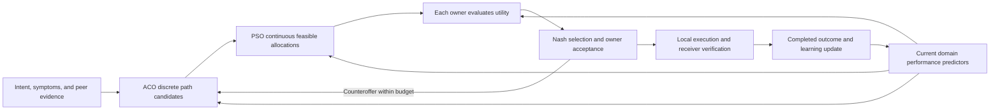

# Coupled agentic networking method

**Status:** required research design, 23 September 2026; not implemented.
**Scope:** service provisioning and assurance across independently owned packet,
optical, and packet domains. ACO, PSO, Nash bargaining, and continual learning
are mandatory in the full system. They are algorithms used by each DSO, not four
new agents or four extra authorities.

## Problem and ownership

There is one DSO per owner. Owners can have different resource costs, risk
tolerances, service priorities, and disagreement values. A proposal that is
technically feasible can still be unacceptable to an owner. Every affected owner
must approve its own contribution; no central planner or majority can override it.

Approved topology is shared, but current observations and policy decisions come
from the owning domain. Full topology disclosure is a research assumption, not
a privacy claim. A lab emulates independent owners using separate identities,
policies, inventories, and controller access; it does not establish actual
commercial deployment.

For a decision epoch, let:

| Symbol | Meaning |
| --- | --- |
| `S` | Active services plus the requests being considered. |
| `z_s` | Discrete packet path and optical route/channel choice for service `s`. |
| `b_s` | Continuous end-to-end allocated bandwidth for an admitted service. |
| `b_s_min, b_s_max` | Requested minimum and maximum bandwidth, in declared units. |
| `C_l` | Effective capacity of resource `l`, observed or modeled and labeled accordingly. |
| `theta_i,t` | Owner `i`'s performance-predictor parameters available before episode `t`. |
| `U_i(z,b;theta_i,t), d_i` | Owner utility and value of retaining its fallback. |

For a fixed admitted set, require `b_s_min <= b_s <= b_s_max` and
`sum_{s using l} b_s <= C_l`, plus packet/optical compatibility, current
availability, applicable QoT, owner policy, and user budget. Admission/refusal is
an explicit decision outside the continuous bandwidth vector; do not satisfy an
admitted request by silently reducing it below its minimum.

Multiple demands sharing bottlenecks make the continuous allocation meaningful.
A path label or channel number is not a continuous PSO coordinate. Per-domain
rate allocations must agree with the same end-to-end service rate. Reserving
optical transport capacity in a model is not a physical bandwidth-isolation claim.

## Coupling the four mechanisms



The diagram is a bounded iterative loop, not a claim that independent optimization
stages always find the global optimum. Replanning may revisit just the allocation
stage when the discrete path remains suitable. Every episode has total candidate,
fitness-evaluation, observation, and wall-time budgets.

### ACO: discrete exploration

Each DSO contributes owner-validated path segments and resource observations.
Virtual scouts construct compatible cross-domain alternatives using pheromone
and a normalized heuristic:

```text
P(edge e | current partial path) proportional to tau_e^alpha * eta_e^beta
```

The heuristic uses current capacity, observed/model-predicted delay and
disruption, declared costs, and optical feasibility. It cannot turn a prediction
into proof of capacity or QoT. Fix evaporation, exploration bounds, seeding,
candidate deduplication, and diversity rules before evaluation. Specify whether
pheromone is reset or carried across requests and keep that rule matched in
comparisons. Owner-reported verified outcomes can reinforce useful paths;
unverified model statements cannot.

Return a bounded diverse discrete candidate set, with infeasibility reasons.
Exact enumeration is the correctness reference on tiny fixtures; constrained
K-shortest paths is a required non-ACO comparator.

### PSO: continuous allocation conditional on discrete candidates

For each selected discrete candidate, particles represent the vector `b` of
service bandwidth allocations. Each owner validates its resource contribution.
Velocity and position updates use fixed, logged inertia and cognitive/social
coefficients; project/repair onto the declared capacity/bound constraints and
reject candidates that fail the independent feasibility check.

Use a predeclared fitness derived from the same service objective and owner
utility definitions as bargaining. One design is the weighted log-gain objective
below over feasible positive-gain allocations. Bounds and infeasible-particle
handling must be explicit; a finite penalty alone cannot authorize violation.
Retain diverse feasible allocations rather than only a single selfish optimum.

This is a bounded candidate search, not a global-optimality guarantee. Compare
with projected/constrained non-swarm optimization on the same fixed paths and,
where tractable, an exact or certified small-instance solution. If the allocation
subproblem is convex and a conventional solver suffices, report that result;
do not create artificial difficulty to justify PSO.

**Required capability extension:** the current fixture lacks per-service
bandwidth enforcement. First implement these allocations in the resource
simulator. For measured allocation claims, add owner-scoped packet shaping or
scheduling, service identifiers, optical-capacity accounting, and independent
per-service probes/readback. Validate contention and isolation. Changing sender
offered load alone is not resource allocation. Do not assume programmable
optical power, modulation, or simultaneous wavelengths that the adapter lacks.

### Nash bargaining: independent owner interests

For each feasible `(z,b)`, owners disclose attributable candidate-specific gains
`g_i = U_i(z,b;theta_i,t) - d_i`. Select among candidates accepted by all owners:

```text
maximize sum_i w_i * log(g_i)
subject to g_i > 0 for every affected owner,
           service/resource constraints and user budget
```

Use fixed disclosed weights, normalizations, utility units, and a deterministic
tie-break. No mutually positive-gain candidate means no Nash agreement; return
a feasible counteroffer or a reasoned refusal. Numerical selection never supplies
a missing owner's permission. Utilities include service value minus resource,
opportunity, change, and predicted disruption costs. Rates and policy coefficients
are owner-defined; learned performance estimates can change predicted costs but
cannot rewrite preferences or the disagreement rule.

PSO searches continuous allocations; Nash bargaining defines the owner-aware
selection criterion and final agreement. They are complementary, not competing
names for the same operation. No truthful reporting, strategy-proofness, Nash
equilibrium, or optimum over unsearched candidates is implied.

For the no-Nash ablation, distinguish a fixed-candidate selection comparison
from a full-system comparison. In the latter, replace the Nash-derived search
fitness as well as the selector with the declared alternative objective; otherwise
Nash still influences the candidates. Keep owner consent and gain constraints.

### Worked example: three owners choosing a service plan

**Illustrative only:** these are invented utility gains, not experimental
results. The example assumes the proposed allocation-capable profile, not
bandwidth enforcement already present in the current single-flow fixture.

Alice owns Packet A, Bob owns Optical, and Carol owns Packet B. A service
crosses all three networks. ACO explores discrete path/channel alternatives;
PSO searches continuous bandwidth allocations on those alternatives. Suppose
the search produces three plans that meet the technical service constraints
and user budget. Each owner then evaluates its benefit relative to its own
fallback: `g_i = U_i - d_i`.

Using fixed utility definitions and equal bargaining weights `w_i = 1`,
maximizing the sum of log gains is equivalent to maximizing the product of
strictly positive gains:

| Plan | Alice: Packet A gain | Bob: Optical gain | Carol: Packet B gain | Nash product |
| --- | ---: | ---: | ---: | ---: |
| X | 10 | 1 | 1 | 10 |
| Y | 4 | 4 | 3 | 48 |
| Z | 8 | -1 | 8 | Inadmissible |

Plan X strongly favors Alice. Plan Z is technically feasible but leaves Bob
worse off than his fallback, so it fails the positive-gain requirement; do not
evaluate a logarithm of its negative gain. **Nash selection favors Plan Y among
these candidates**, even though X has a higher total gain (12 versus 11).
Execution still requires each owner's actual acceptance. This is not a universal
fairness guarantee: utilities, fallback values, bargaining weights, and the
candidate set all affect the result.

The methods therefore complement one another:

1. **ACO finds discrete alternatives** that could carry the service.
2. **PSO searches their continuous allocations**, using the declared owner-aware
   fitness; the Nash objective can guide this search directly.
3. **Nash bargaining selects a mutually beneficial proposal.** A counteroffer
   can trigger a revised PSO allocation or new ACO alternatives within budget.
4. **Continual learning updates performance estimates after verification**, so
   later searches and utility estimates reflect observed delay or disruption.
   It does not automatically rewrite an owner's preferences or refusal rights.

Game theory supplies the owner-aware objective; swarm optimization supplies the
search; continual learning improves the estimates; agents coordinate the loop.
The example explains that division of work, not an improvement over a baseline.

## Collective intelligence through peer feedback

Collective intelligence is the group-level capability under study: owners use
one another's evidence, constraints, and outcome-informed estimates to revise
joint service decisions. It is an organizing hypothesis for the existing loop,
not a fifth optimizer, another DSO, a shared model, or permission to override
an owner. ACO scouts and PSO particles are search entities, not sovereign agents.
Shared approved topology is an input assumption; it does not make operational
observations fresh or reveal every owner's current decision.

Use the existing observation, reasoning, candidate, bargaining, and learning
nodes to implement three explicit feedback paths:

| Input from a peer or joint episode | Permitted influence | Recorded evidence |
| --- | --- | --- |
| Owner-attributed observation with source and time | Request corroboration, revise diagnosis, or rerank supported alternatives. | Consumed observation ID, receiving decision, and changed or retained proposal. |
| Constraint, utility evaluation, or counteroffer | Revisit PSO allocation if the path remains usable; revisit ACO if discrete choices must change. | Before/after path and allocation IDs, affected owner, search stage, and numerical gains. |
| Independently verified completed outcome | Update a domain-local predictor after scoring; use a promoted release in later proposals and bargaining estimates. | Outcome ID, predictor version, later prediction, and affected decision. |

Peer information is evidence to check, not executable instruction. Keep
provenance, observation freshness, local feasibility, and actual owner approval.
A changed utility estimate cannot weaken a hard policy or change the agreed
definition of the owner's preferences.

At each feedback step, record the input ID, episode/round, receiving owner and
workflow node, candidate versions before/after, predictor version, selected
supported action or `no_change`, a concise structured reason, and consumed
budgets. Record decision inputs and outputs, not private model chain-of-thought.
A delivered message that no decision consumed is not evidence of collaboration.

Before trials, fix observation/search/model budgets, maximum feedback rounds,
the episode deadline, freshness rules, and stop criteria. Duplicate or irrelevant
feedback need not trigger new search. Stop on a verified feasible agreement,
exhausted budget, or no supported revision, with explicit refusal/deferment when
necessary. The same total budget covers initial search and all revisions.

For example, a packet agent may propose an allocation that fits known capacities
but is unattractive to the optical owner because of disruption cost. A supported
counteroffer can trigger a different bandwidth allocation or route/channel
candidate; every owner then evaluates the revised plan. After delivery is
verified, the measured disruption can train a local predictor for later episodes.
This is illustrative behavior in the required richer profile, not a measured
improvement or an alternate optical route in the current emulator.

The [A8 comparison](experimental-validation.md#52-fixed-proposal-exchange-control-a8)
retains numerical ACO/PSO fitness queries, Nash selection, learning between
episodes, and all owner checks, but freezes the candidate pool after initial
proposal submission. It tests the added value of post-proposal peer feedback,
not whether all communication can be removed. E10/E11 and the existing E09
centralized comparison establish when collaboration helps and what it costs.
Trace changes require controlled outcome comparisons before causal benefit is
claimed; neither message volume nor an explanation establishes intelligence.

## Continual learning: actual updates across service episodes

The required learned object is a domain-local predictor of QoS and/or
change-disruption cost. A concrete initial design is a regularized incremental
regressor using bounded replay. Features can include path/resource identity,
allocated load, utilization, measured quality, and service context. Targets are
subsequently observed delay or disruption, with absent measurements marked missing.
Use separate targets/models where units or observation semantics differ.

For completed episode `t`, update only after its prediction and service result
have been scored:

```text
predict and decide with theta_i,t
observe completed service outcome
fit candidate theta_i,t+1 on new observations plus bounded past replay
evaluate on past-only validation and retained earlier-condition examples
promote a bounded release or retain theta_i,t
```

Freeze the update schedule, optimizer, replay size/sampling, feature schema,
regularization, clipping, and promotion thresholds before confirmatory trials.
Only earlier data may train, tune, or validate an update. A locked future
evaluation set never enters the learner. Freeze an active episode's predictor
version; a promoted release affects subsequent decisions.

The predictor feeds ACO heuristic estimates, PSO fitness estimates, and owner
risk/disruption estimates used in bargaining. Evidence collection still verifies
hard constraints. Log where changed predictions change candidate ranking,
allocation, owner gains, or the accepted service decision.

Learning must do more than store incidents, retrieve old text, or decay ACO
pheromone. Those are separate mechanisms. The frozen-learning ablation disables
predictor updates but keeps normal ACO/PSO operations. The memory-only ablation
retrieves prior outcomes with fixed predictors. No LLM weight retraining or
federated parameter averaging is implied.

Learning releases can be exchanged as attributable observations/models; each
receiving owner independently checks applicability. Online owner-approved
predictor promotion is required; unrestricted live experiments or automatic
changes to hard policy are not. Test sequential adaptation, recurring conditions,
and forgetting rather than simply retraining on the final full dataset.

## Agent reasoning and existing workflow nodes

The DSO observes, plans, invokes its numerical methods, negotiates, acts locally,
verifies, and learns. Its named LLM nodes can choose catalogued observations,
diagnose ambiguity, and propose supported counteroffers. Numerical ACO/PSO and
Nash calculations are not LLM guesses.

| Existing node(s) | Required responsibility |
| --- | --- |
| `swarm_state_refresh` | Load scoped resource observations, pheromone state, and current predictor versions. |
| `swarm_candidate_exploration` | Run bounded ACO and conditional PSO stages; retain separate timings, seeds, and evaluation counts. |
| `swarm_candidate_aggregation` | Preserve feasible diverse path/allocation pairs and score provenance. |
| `local_candidate_generation`, `candidate_verification` | Map to implemented local actions, reject unsupported resources/allocations, and dispatch validated reads. |
| `local_utility_evaluation`, `peer_contract_negotiation`, `bargaining_solution_gate` | Evaluate gains, exchange peer constraints, apply Nash selection, and obtain each owner's approval. |
| `advisory_reasoning`, `fault_and_impact_reasoning` | Select observations and supported replanning/diagnostic steps; numerical methods compute allocations and scores. |
| Learning workflow including `safe_experiment_runner` | Train/replay a predictor candidate, test it on past-only data, promote/reject it, and measure subsequent use. |
| `hypothesis_generation` | Suggest a bounded diagnostic or learning hypothesis when needed; deterministic templates retain learning in the no-LLM baseline. |

These are refinements of the existing 57 documented nodes, not implemented
capabilities or additional authorities. Required mechanisms need not run on every
healthy polling tick: record justified skips, cache reuse, and no-data learning
decisions. They must be implemented and exercised in the full study.

## Evaluation obligations and limits

The [experimental plan](experimental-validation.md) requires component ablations,
matched search budgets, owner-utility trade-offs, chronological learning tests,
and independent networking outcomes. Collective-intelligence evaluation adds
fixed-exchange A8, E10's peer-feedback comparisons, and E11's feedback × learning
interaction, alongside E09's matched centralized planner. Hold out
workload/condition combinations before development. Repeated samples within one adaptive stream are not
independent replications; reset and repeat whole streams with matched seeds.

Use a required richer simulator for mechanism studies and emulation for service
evidence. The present one-flow fixture can validate a service-control loop but
cannot alone show PSO allocation advantage, search scalability, or continual
learning under resource competition. Report simulator findings as simulation,
and measured findings only for the capabilities actually exercised.
