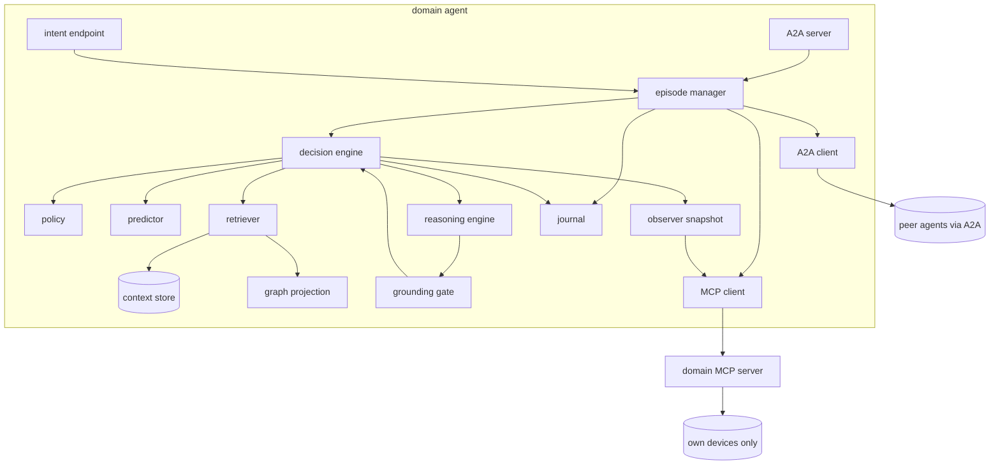
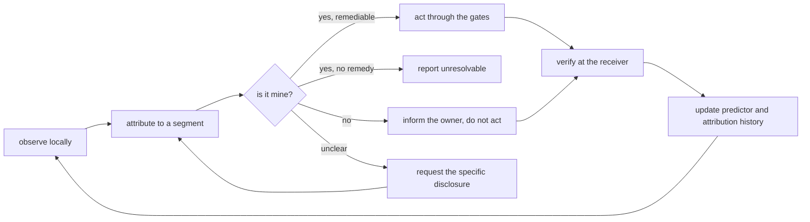

# Design: federated agentic networking

**Status:** design for implementation, 23 September 2026. Supersedes the
documents in [`old/`](old/), which remain available as source material.

**One sentence.** Three independently owned network domains, each operated by an
autonomous agent that reasons over its own context database and a federated
topology graph, negotiate one end-to-end service over A2A — and each agent
improves its decisions by learning from verified outcomes that only its peers
can observe.

This document is the build reference. The companion
[research and build plan](plan.md) says what to measure, what is novel about it,
and in what order to build.

---

## 0. At a glance

**What the system does.** Four capabilities, each defined below:

| | Capability | Where |
| --- | --- | --- |
| **Provision** | Enumerate the joint options, negotiate, execute per owner, or refuse honestly | §4, §5 |
| **Assure** | Attribute degradation to a segment; act if it is yours, refrain if it is not | §9 |
| **Learn** | Predict configuration quality — though two of three owners can only learn if the third tells them | §8 |
| **Disclose** | Decide what evidence a peer needs, and what to keep | §8.4, §11.3, §12.5 |

**The numbers that shape everything else.**

| | |
| --- | --- |
| Domains / agents | 3, one per owner, none above them |
| Joint configurations | **8** — small enough to enumerate exactly, so no search algorithm appears anywhere |
| Graph nodes (topology) | 14 — 8 routers, 4 ROADMs, 2 hosts |
| LangGraph nodes | **21** — 13 reasoning, 4 gates, 4 effectors (§6.9) |
| Path segments for attribution | **4**, bracketed by interfaces that already export counters (§9.1) |
| MCP servers | **3** endpoints from 2 implementations, one per domain (§13) |
| Knowledge kinds | **3** — structure replicated, state local, outcome held by one owner (§11.3) |

**The one structural fact everything rests on.** Packet A owns the sender,
Packet B owns the receiver, and only the receiver can establish delivery. No
agent can independently observe the outcome of a decision it participated in
(§2).

**Where to start reading.** §2 for why this is federated at all; §6.9 for the
node set; §9 for attribution; §11.3 for who knows what.

---

## 1. Scope

**In scope.** Three sovereign domain agents, each with a reasoning engine and
its own context database; retrieval-grounded judgment over a federated topology
graph and the agent's own history; peer negotiation over **A2A** with real
refusal;
per-domain policy and cost evaluation; continual learning from verified
outcomes; federated outcome sharing between owners; the existing packet–optical
emulator as the only environment.

The **agentic capabilities are the subject** of the study. The network is the
setting that makes them testable and the source of ground truth.

**Out of scope, and why.** The previous design required four mechanisms the
testbed could not evidence. Removing them costs no demonstrable result:

| Dropped | Reason |
| --- | --- |
| ACO | The joint candidate space is 8 configurations. Exhaustive enumeration is exact, instant, and needs no tuning. |
| PSO | Continuous allocation requires multiple services competing for enforced bandwidth. The data plane carries one flow and polices nothing. |
| Nash bargaining | Requires commensurable cross-owner utilities and numeric disagreement values. Neither can be measured here. Replaced by explicit accept/refuse plus transparent cost comparison. |
| Allocation simulator | No longer needed. Every claim below is evaluable on the emulator that already exists. |
| Neo4j + pgvector as separate servers | Kept the capability, changed the substrate: one embedded SQLite store per agent with a graph projected from it (§11). RAG and GraphRAG remain central to reasoning. |
| 57-node workflow catalogue | Replaced by 21 nodes across two graphs (§6.9), of which 13 are reasoning nodes and 4 are the gates that make the rest safe. |

**Kept.** One agent per owner with exclusive local authority. Federated
evidence. Negotiation where any owner may refuse. Continual learning. Receiver-
verified outcomes. The existing data plane.

---

## 2. Why this system is federated

Ownership in this topology creates an observation asymmetry that is not a design
choice and cannot be engineered away:

- **Packet A owns the sender** (`client-a`). It can prove packets left.
- **Packet B owns the receiver** (`server-b`). It alone can prove packets arrived.
- **Optical owns the line.** It sees channel power and margin, and nothing about
  packet delivery.

No agent can independently observe the outcome of a decision it participated in.
Packet A can choose a path and never learn whether the service worked. This is
already stated in the code: *"Only the receiver can establish delivery"*
(`../packet-network/traffic.py`).

Federated outcome sharing is therefore **structural**, not an enhancement. It is
the only mechanism by which two of the three agents learn anything. That
asymmetry is the subject of the study.

---

## 3. Agents and authority

One agent per owner. Exactly one. No agent above them.

| Agent | Owns | Action space | Observes |
| --- | --- | --- | --- |
| `agent-packet-a` | `pe-a1`, `p-a1`, `p-a2`, `gw-a`, sender on `client-a` | `path=primary`, `path=backup` | Own interface counters, own route state, sender liveness |
| `agent-optical` | `t-client`, `r1`–`r4`, `t-server` | `channel=1`, `channel=2`, `refuse` | Per-node OSNR/gOSNR, carried channels |
| `agent-packet-b` | `gw-b`, `p-b1`, `p-b2`, `pe-b1`, receiver on `server-b` | `path=primary`, `path=backup` | Own counters and routes, **receiver delivery evidence** |

**Authority rules.**

1. An agent may change only resources its owner holds. Enforced in code today by
   `assert_owned` (`../packet-network/inventory.py`).
2. An agent's action space is a fixed list of named procedures. There is no
   generic "configure device" verb, and no agent can invent an action.
3. Any agent may refuse any proposal, for any reason its policy states. No
   majority overrides a refusal.
4. An agent never executes another domain's contribution, and never holds
   another domain's credentials.

---

## 4. The candidate space

Three action spaces multiply to eight joint configurations:

| # | Packet A | Optical | Packet B |
| --- | --- | --- | --- |
| C1 | primary | ch 1 | primary |
| C2 | primary | ch 1 | backup |
| C3 | primary | ch 2 | primary |
| C4 | primary | ch 2 | backup |
| C5 | backup | ch 1 | primary |
| C6 | backup | ch 1 | backup |
| C7 | backup | ch 2 | primary |
| C8 | backup | ch 2 | backup |

Plus `refuse`, which the optical domain may return instead of a channel, and
which either packet domain may return for any candidate.

The initiating agent enumerates all eight. This is exact: there is no search
problem, and no search algorithm is required or claimed.

**Known limit, retained deliberately.** Both wavelengths ride the same fibre
chain, so no configuration survives an optical cut. The correct behaviour for a
cut is an honest report of an unresolvable service, not a reroute. This is a
property of the fixture and a tested case, not an omission.

---

### 4.1 Conditions: what makes this a learning problem

A healthy lab delivers ~1.0 on every configuration and ~0 when a link is cut.
That is a lookup table. The study needs delivered quality to be a genuine
function of **configuration × current condition**, so a condition harness is
part of the fixture, not an afterthought.

**Mechanism.** `tc netem` inside the lab containers, applied per link, driven by
a declared schedule. Loss, delay and jitter profiles are pinned per run and
published in the run bundle.

**Three visibility classes**, and the third is the one that matters:

| Class | Injected at | Who sees it locally | Who sees the effect |
| --- | --- | --- | --- |
| **Locally visible** | Inside one packet domain's core | That domain's discard counters | The receiver |
| **Modelled-only** | Optical launch power / amplifier gain (`../optical-network/spec.py`) | Optical agent's gOSNR | **Nobody** — it does not reach packets |
| **Locally invisible** | The optical attachment segment, between `gw-a` and `gw-b` | **No domain's counters** — but the loss is computable by differencing `gw-a` out-packets against `gw-b` in-packets, which needs both owners (§11.4) | The receiver alone |

The locally-invisible class is the experimental heart of the paper. It produces
service degradation that **no owner can detect from its own telemetry**, and
that only the receiver's owner can observe. Under such a condition, an agent
that does not receive shared outcomes cannot learn that anything is wrong — not
slowly, but *at all*.

The modelled-only class is equally deliberate: it gives the optical agent a
feature that looks informative and is not. An agent that learns to ignore its
own gOSNR in favour of a peer's delivery evidence is demonstrating exactly the
behaviour this study is about.

**Schedules.** Each run declares a chronological condition sequence: a
stationary regime, a gradual drift, an abrupt shift that inverts which
configuration is best, and a recurrence of an earlier regime. Recurrence is what
separates adaptation from forgetting.

---

## 5. Peer communication: A2A

Agents talk to each other over **A2A** (Agent-to-Agent). Nothing in this design
is invented protocol machinery: A2A already provides capability discovery, a
task lifecycle with a state for "waiting on the other party", and structured
data payloads. Pin the specification version in the run bundle.

### 5.1 Agent Cards

Each DSO publishes a card at `/.well-known/agent-card.json` declaring who it is,
what it owns, and what it can be asked to do. This is how an agent learns a
peer's action space instead of having it hard-coded.

```json
{
  "name": "agent-optical",
  "description": "Domain service orchestrator for the optical transport domain.",
  "url": "https://optical.lab.local/a2a",
  "version": "1.0.0",
  "capabilities": {"streaming": true, "pushNotifications": true},
  "skills": [
    {"id": "service-negotiation",
     "description": "Evaluate and negotiate a lightpath contribution to an inter-domain service.",
     "tags": ["negotiation", "optical"]},
    {"id": "assurance-evidence",
     "description": "Report channel occupancy and modelled optical margin for a service.",
     "tags": ["assurance"]}
  ],
  "domain": {"owner": "optical", "actions": ["channel=1", "channel=2", "refuse"]}
}
```

An agent that cannot present a valid card is not a peer. Cards are fetched at
startup and re-fetched on version change; the fetched set is journalled.

### 5.2 One episode is one A2A task per peer

The initiator opens an A2A **task** with each peer, sharing a `contextId` across
all of them so the three tasks are recognisably one episode.

| A2A task state | Means here |
| --- | --- |
| `submitted` | Announcement delivered, peer has not started |
| `working` | Peer is gathering evidence and evaluating |
| `input-required` | Peer has answered and awaits the next step — options sent, or proposal answered |
| `completed` | Peer executed its contribution and published its outcome |
| `rejected` | Peer refused the request outright |
| `failed` | Peer could not complete what it accepted |

Negotiation payloads travel as `DataPart`s. The human-readable rationale travels
alongside as a `TextPart`, so a transcript is legible to an operator without
parsing anything.

### 5.3 The six exchanges

| Exchange | Direction | Carries |
| --- | --- | --- |
| `ANNOUNCE` | initiator → peers | The service requirement |
| `OPTIONS` | peer → initiator | Feasible local actions, costs, predictions |
| `PROPOSE` | initiator → peers | One named joint configuration |
| `ACCEPT` / `REFUSE` / `COUNTER` | peer → initiator | The owner's answer and its grounds |
| `COMMIT` | initiator → peers | Authorisation to execute the agreed assignment |
| `OUTCOME` | any → all | Verified result; delivered as an A2A **artifact** |

**`ANNOUNCE`** — `DataPart` of a `message/send`:

```json
{
  "exchange": "ANNOUNCE",
  "episode_id": "ep-0142",
  "intent": {
    "source": {"domain": "packet-a", "endpoint": "client-a"},
    "destination": {"domain": "packet-b", "endpoint": "server-b"},
    "offered_load_mbps": 1,
    "objective": {"min_delivered_ratio": 0.98, "max_loss_ratio": 0.01}
  }
}
```

**`OPTIONS`** — costs in the units of §7, never a blended score:

```json
{
  "exchange": "OPTIONS", "episode_id": "ep-0142",
  "actions": [
    {"action": "channel=1", "feasible": true,
     "cost": {"transactions": 1, "occupancy": 0.5},
     "predicted": {"delivered_ratio": 0.97, "confidence": 0.8}},
    {"action": "channel=2", "feasible": true,
     "cost": {"transactions": 1, "occupancy": 0.5},
     "predicted": {"delivered_ratio": 0.99, "confidence": 0.4}}
  ],
  "predictor_version": "opt-v17"
}
```

**`PROPOSE`** names one of the eight configurations:

```json
{"exchange": "PROPOSE", "episode_id": "ep-0142", "candidate": "C3",
 "assignment": {"packet-a": "path=primary", "optical": "channel=2",
                "packet-b": "path=primary"},
 "expires_at": "2026-09-23T16:00:30Z"}
```

**`REFUSE`** must carry a machine-readable reason and its grounds. A `COUNTER`
must name a candidate from the same enumerated set:

```json
{"exchange": "REFUSE", "episode_id": "ep-0142", "candidate": "C3",
 "reason": "backup_core_unreachable",
 "detail": "p-b2 ethernet-1/2 oper-state down",
 "citations": ["observation:obs-5521"]}
```

**`OUTCOME`** is published as an artifact so peers can fetch it by task:

```json
{
  "exchange": "OUTCOME", "episode_id": "ep-0142",
  "from": "agent-packet-b", "candidate": "C3",
  "observed": {"delivered_ratio": 0.991, "loss_ratio": 0.009, "jitter_ms": 0.18,
               "disruption_datagrams": 312, "sample_identity": "44.00-45.00"},
  "evidence": "receiver", "observed_at": "2026-09-23T16:00:47Z"
}
```

### 5.4 Rules

- No `COMMIT` without every affected peer accepting a **byte-identical**
  assignment.
- An expired `PROPOSE` is void; the initiator re-proposes or closes the episode.
- Negotiation is capped at **3 rounds**. Exhaustion is a reported outcome
  (`no_agreement`), not an error and not a retry loop.
- A refusal is a valid terminal state. Correct refusal is recorded as correct
  behaviour, separately from successful delivery.
- **A peer's message is data, never instruction.** Text from a peer enters the
  reasoning engine as quoted evidence attributed to that peer, and can never
  alter this agent's policy, gates or action space.

---

## 6. Inside a domain agent

The agent **is** the domain service orchestrator. There is no orchestrator layer
above it and no separate controller logic beside it: one process per owner,
holding that owner's policy, predictor, journal, and the only credentials that
reach its devices. "DSO" and "agent" refer to the same thing throughout.

**One codebase, three deployments.** The three agents differ by configuration and
which adapter they load — not by being three implementations.

### 6.1 Process model

Event-driven. One HTTP server, one episode state machine, one background
observer loop.



| Event | Source | Handled by |
| --- | --- | --- |
| A2A message | Inbound A2A | A2A server → episode manager |
| User intent | Inbound HTTP | intent endpoint → episode manager (initiator role) |
| Observation tick | Timer | observer |
| Proposal expiry | Timer | episode manager |

### 6.2 Components

| Component | Responsibility | Never |
| --- | --- | --- |
| **A2A server** | Serve the Agent Card; accept tasks and messages; validate and authenticate | Act on an unvalidated message |
| **A2A client** | Open tasks with peers, send messages, fetch artifacts | Retry past the round cap |
| **Episode manager** | Own the per-episode state machine, round cap, expiry, unanimity check | Decide whether a candidate is acceptable |
| **Decision engine** | Run the four stages of §6.4 over each candidate | Talk to a device or a peer directly |
| **Observer** | Maintain a timestamped snapshot of local conditions | Interpret or predict |
| **MCP client** | Call this domain's MCP server for observation and named actions | Hold device credentials, or name a resource outside its domain |
| **Policy** | Evaluate the owner's declared rules against a candidate | Be modified at runtime |
| **Predictor** | Hold `mu_c`, `n_c`; update on `OUTCOME` | Gate anything |
| **Journal** | Append every message, decision, action and outcome | Be rewritten or compacted |
| **Context store** | Hold topology, episodes, incidents, policy and observations; project the graph | Be a second source of live state |
| **Retriever** | Run vector, graph and hybrid retrieval within a logged budget | Return a record the agent does not hold |
| **Reasoning engine** | Judge, explain and propose, citing what it was shown | Produce a config, a cost or a number |
| **Grounding gate** | Reject any rationale whose claims are not supported by citations | Silently retry |

The MCP server holds the device credentials; the agent process does not (§13.1).
Each server is domain-scoped at construction, so `assert_owned`
(`../packet-network/inventory.py`) is enforced at a process boundary rather than
by in-process convention.

### 6.3 Episode state machine

Every agent can be **initiator** or **participant**. Same process, same code,
different path.

**Initiator**

```text
IDLE --intent--> GATHERING --all OPTIONS--> PROPOSING
PROPOSING --any REFUSE/COUNTER, round < 3--> PROPOSING
PROPOSING --all ACCEPT--> COMMITTING --> VERIFYING --OUTCOME--> CLOSED(delivered)
PROPOSING --round cap--> CLOSED(no_agreement)
any --expiry--> CLOSED(expired)
```

**Participant**

```text
IDLE --ANNOUNCE--> OFFERED --PROPOSE--> EVALUATING
EVALUATING --> ACCEPTED | REFUSED | COUNTERED
ACCEPTED --COMMIT--> EXECUTING --> REPORTING --> CLOSED
```

Terminal states are `delivered`, `no_agreement`, `refused`, `expired`,
`unresolved`. Every one is journalled with its reason. `no_agreement` and
`refused` are **correct outcomes**, not errors.

### 6.4 The three gates

Reasoning happens at thirteen nodes (§6.9). Three gates constrain all of it, and
every candidate passes them before any agent acts on it. They are arithmetic and
comparison — never a model call.

**`feasibility_gate`.** Can this domain physically do it *now*? Packet: is the
target core router's interface up? Optical: is the channel supported and the
line reachable? Answers come from the observer snapshot (§6.5) — never from a
prediction, never from a retrieved record. Failure yields `feasible: false` plus
the observation that failed.

**`policy_gate`.** Does the owner permit it? A short declared rule list, e.g.
*"do not move to backup while the primary is healthy"* (already enforced in
`../packet-network/backup_path.py`), *"refuse if predicted delivered ratio is
below objective and confidence > 0.6"*. Policy is data, versioned, published in
the run bundle, and never modified at runtime.

**`agreement_gate`.** Did every affected owner accept a byte-identical
assignment, within the round cap, before expiry?

A fourth gate, `grounding_gate` (§10.3), constrains what the reasoning nodes may
*assert* rather than what the agent may *do*.

**Cost and prediction** are computed by `cost_and_predict`, also deterministic:
the cost vector of §7 and the EWMA read of §8, no judgment.

**Selection.** `select_candidate` is a reasoning node, but its deterministic
rule — lowest total cost, predicted delivered ratio as first tie-break,
candidate index last — is both its fallback and its comparator. Divergence from
the rule is journalled and is itself a result (E2).

### 6.5 Local state and freshness

The observer keeps one snapshot: interface oper-states, current path, carried
channel and worst margin, and the latest receiver sample. Each field carries the
time it was read.

**The feasibility gate requires a snapshot younger than 15 s**, and forces a
refresh otherwise. This is what stops a gate passing on stale evidence.

Two implementation notes grounded in the current code:

- A full `BackupPath.state()` opens **six** gNMI sessions (two for routes, four
  for readiness), and `_move_to` calls it twice around the writes — about
  fourteen sessions per path switch. Poll only oper-states on the tick; refresh
  route state on demand and after a commit.
- Each read currently opens and closes its own session, with
  `connect(attempts=3, retry_delay=5.0)` behind it. The adapter should hold one
  persistent session per router. This is a build task, not a design change.

### 6.6 Concurrency

**One active episode per agent.** A second `ANNOUNCE` arriving while an episode
is open is answered `REFUSE(reason="busy")`. With a single service in the
fixture this costs nothing and removes an entire class of interleaving bugs.
Revisit only if multi-service is ever added.

### 6.7 Crash recovery

The journal is append-only and replayable. On restart the agent reads it, finds
any episode not in a terminal state, and closes it as `unresolved` — recording
which of its own actions had already been applied.

It does **not** auto-resume. A partially applied change is reported for operator
attention, because nothing in the packet adapter is atomic across devices
(`../packet-network/backup_path.py` says so, and F6 remains open).

### 6.8 Module layout

```text
agent/
  __main__.py      load config, start endpoint + observer
  config.py        identity, peers, endpoints, alpha, k, round cap, freshness
  a2a/
    card.py        this agent's Agent Card, served at /.well-known/
    server.py      inbound A2A: tasks, messages, artifacts, auth
    client.py      outbound A2A: discovery, message/send, artifact fetch
  episode.py       state machine (§6.3)
  decide.py        four-stage pipeline (§6.4)
  policy.py        policy.yaml loader and gate evaluation
  predictor.py     EWMA store (§8)
  journal.py       append-only JSONL
  observe.py       snapshot loop (§6.5)
  reasoner.py      reasoning engine and prompt assembly (§10)
  grounding.py     citation resolution and the grounding gate (§10.3)
  context/
    store.py       SQLite schema, writes, retention
    graph.py       NetworkX projection built from topology records
    retrieve.py    vector, graph and hybrid retrieval (§11.4)
  mcp_client.py    typed client for this domain's MCP server (§13)

mcp/
  packet_server.py   packet-a-mcp / packet-b-mcp, domain-scoped at construction
  optical_server.py  optical-mcp
  contract.py        shared tool schemas and result attribution (§13.3)
```

Deployed three times:

| Instance | Adapter | Action space |
| --- | --- | --- |
| `agent-packet-a` | `packet.py`, domain `packet-a` | `path=primary`, `path=backup` |
| `agent-optical` | `optical.py` | `channel=1`, `channel=2`, `refuse` |
| `agent-packet-b` | `packet.py`, domain `packet-b` | `path=primary`, `path=backup` |

### 6.9 The LangGraph node set

Each agent is two LangGraphs over a shared node library. LangGraph's
checkpointer persists episode state at every node boundary, which is what crash
recovery (§6.7) needs to report *which* actions had already landed.

**Every node is one of three kinds**, and the kind is not negotiable:

| Kind | LLM | Why |
| --- | --- | --- |
| **Reasoning** | Yes | Judgment under incomplete evidence: what to look at, what it means, what to do, how to say it |
| **Gate** | Never | Safety, arithmetic and equality. An LLM cannot check its own grounding, and unanimity is a byte comparison |
| **Effector** | Never | Sending a message or invoking a named adapter action |

**Thirteen of twenty-one nodes are reasoning nodes.** Each is followed by
`grounding_gate`, each returns the typed judgment of §10.2, and each has a
deterministic fallback — so both graphs execute unchanged with the engine
disabled (ablation A1).

**Participant graph**

| Node | Kind | Does |
| --- | --- | --- |
| `a2a_receive` | Effector | Accept an A2A message, resolve task and `contextId`, journal |
| `triage_request` | **Reasoning** | Is this request coherent, addressed to this domain, and within this owner's remit? |
| `plan_observations` | **Reasoning** | Decide which telemetry is worth gathering for *this* question, within budget |
| `refresh_observations` | Effector | Execute that observation plan through the domain MCP server |
| `formulate_queries` | **Reasoning** | Decide what to traverse and what to search for (§11.6) |
| `retrieve_context` | Effector | Run the graph, vector or hybrid retrieval that was asked for |
| `evaluate_local_actions` | **Reasoning** | Which of this domain's actions to offer, and how to characterise each contribution |
| `grounding_gate` | **Gate** | Resolve every citation; accept the judgment or fall back |
| `a2a_dialogue` | **Reasoning** | Compose the outgoing message and interpret the peer's — including a refusal given in prose |
| `evaluate_proposal` | **Reasoning** | Accept, refuse or counter, and on what grounds |
| `diagnose` | **Reasoning** | On a fault: probable cause, blast radius, the next discriminating observation |
| `feasibility_gate` | **Gate** | Live oper-state and channel support. No prediction, no retrieval |
| `policy_gate` | **Gate** | The owner's declared rules |
| `cost_and_predict` | **Gate** | The cost vector (§7) and the EWMA read (§8). Arithmetic only |
| `execute_local` | Effector | Call `commit_change` on the domain MCP server for the agreed action |
| `verify_local` | **Reasoning** | Does the readback match what was agreed, and if not, what is true now? |
| `compose_outcome` | **Reasoning** | What to publish to peers, and what it means |
| `publish_outcome` | Effector | Emit the A2A artifact |
| `update_predictor` | **Gate** | EWMA update. Arithmetic only |
| `close_episode` | **Reasoning** | Journal the terminal state with an explanation an operator can read |

**Initiator graph** adds four and reuses the rest:

| Node | Kind | Does |
| --- | --- | --- |
| `a2a_discover` | **Reasoning** | Fetch peer Agent Cards; reason about which peers and skills this intent needs |
| `intake_intent` | **Reasoning** | Turn the request into the §5.3 structure, resolving endpoints via the graph |
| `assemble_candidates` | **Reasoning** | Enumerate the eight; interpret each peer's `OPTIONS`, including prose caveats |
| `select_candidate` | **Reasoning** | Choose among candidates all peers accepted, with a justification |
| `agreement_gate` | **Gate** | Byte-identical unanimity, round cap, expiry |

`select_candidate` is deliberately a reasoning node. The deterministic rule —
lowest total cost, predicted delivered ratio as first tie-break, candidate index
last — remains as its fallback **and as its comparator**: when the engine
departs from that rule, the divergence is journalled and is itself a result
(E2).

**Conditional edges**: `grounding_gate` (accept / refuse / counter / fall back),
`agreement_gate` (commit / re-propose / `no_agreement`), `feasibility_gate`,
`policy_gate`, `plan_observations` (budget exhausted), `verify_local` (applied /
partial), `publish_outcome` (only `agent-packet-b` observes delivery).

**What the three gates guarantee.** Whatever the reasoning nodes conclude, no
episode reaches an adapter without passing `feasibility_gate` on live
observation, `policy_gate` on declared rules, and `agreement_gate` on unanimity
— and no rationale reaches a peer without passing `grounding_gate`. That is the
entire safety argument, and it is four nodes wide.

**Checkpointing does not license auto-resume.** It tells the agent where it
stopped; it cannot make a half-applied device change safe. §6.7 stands: closed
as `unresolved`, reported, not retried.

---

## 7. Cost

Three terms, each measurable on this testbed. Reported as a vector, never summed
into a single currency.

| Term | Unit | How it is obtained |
| --- | --- | --- |
| `transactions` | count | Committed changes per device, counted by the adapter. A Packet path switch is 2; an optical retune is 1. |
| `disruption` | datagrams lost | Receiver-side loss attributable to the change window, from interval samples. |
| `occupancy` | fraction | Discrete resource committed: 1 of 2 wavelengths, 1 of 2 core routers. |

All three are **zero or unchanged for retain-current**, which is what stops the
system reconfiguring a healthy service for a marginal gain.

No energy term, no risk probability, no opportunity cost: nothing in this
environment can populate them honestly.

---

## 8. Continual learning

### 8.1 The learning problem

**Features and labels are owned by different parties.** This is the study's
subject, so it is stated precisely:

| Agent | Holds features | Holds labels |
| --- | --- | --- |
| `agent-packet-a` | Its action, its discard rates, its link utilisation | **No** |
| `agent-optical` | Its channel, per-node gOSNR, worst margin | **No** |
| `agent-packet-b` | Its action, its discard rates | **Yes** — receiver delivered ratio, loss, jitter |

Packet B holds every label and only some features. Packet A and Optical hold
features and no labels at all. **Neither side can build a good predictor
alone**, and this is caused by ownership, not by how a dataset was split.

### 8.2 The predictor

Each agent predicts **delivered ratio** for a candidate, from a feature vector.

**Model: online ridge regression with exponential forgetting** (recursive least
squares). Chosen because it updates in closed form per observation, needs no
training loop or framework, has exactly one forgetting parameter, and is
reproducible from a seed. Forgetting is what lets it track a regime shift.

```text
theta <- theta + K (y - x' theta)          per observed outcome
lambda in (0,1]                            forgetting factor, pinned per run
```

Features available to every agent: its own action, the joint candidate id, its
own local telemetry summary, and — **when sharing is enabled** — the peers'
declared actions and telemetry summaries from `OPTIONS`, plus the delivered
ratio from `OUTCOME`.

**Baseline: per-configuration EWMA** over the eight candidates. Reported
alongside, so the paper shows what the trivial predictor achieves and what the
feature model adds.

### 8.3 What sharing changes

An agent updates from:

- **Its own observations** — always, but these carry no label for A or Optical.
- **Peer `OUTCOME` artifacts** — only when sharing is enabled.

With sharing off, `agent-packet-a` and `agent-optical` have no target variable.
Their predictors do not converge slowly; they **do not update at all**. That is
the floor condition S0, and it is a property of the topology rather than a
handicap imposed for the experiment.

### 8.4 Deciding what to share

Sharing is not a switch the agents are handed — it is a decision they make, and
it is where the reasoning engine serves this paper directly.

| Decision | Node | Question |
| --- | --- | --- |
| What to disclose | `compose_outcome` | Which fields of this outcome does a peer need, and which are commercially sensitive? |
| What to request | `formulate_queries`, `a2a_dialogue` | Which peer holds evidence that would resolve my current uncertainty? |
| How to use it | `evaluate_proposal` | What does a peer's disclosure actually license me to conclude? |

Interpreting a peer's outcome requires knowing **which resources it traversed** —
a traversal over the federated topology graph (§11). An outcome without that
context is a number without a referent.

### 8.5 Boundaries

Learning changes **estimates**. It never changes an action space, relaxes a
gate, edits a policy, or authorises a commit. The predictor is deterministic
arithmetic; the reasoning engine reasons over its output and never replaces it.
Keeping them separate is what makes it possible to say whether a better decision
came from better reasoning or from a better estimate.

---

## 9. Service attribution and the domain assurance loop

Predicting a configuration's quality is not enough. When a running service
degrades, each owner must answer a harder question about its own infrastructure:

> **Is it me?**

An owner that reconfigures in response to someone else's fault has paid
disruption for nothing. An owner that does nothing while the fault is its own
has failed the service. Getting this right is the practical capability this
system exists to provide.

### 9.1 The path decomposes into four segments

Four SR Linux interfaces bracket the service path, and all four already expose
packet counters through `../packet-network/telemetry.py`:

```text
client-a → pe-a1 ─── p-a1|p-a2 ─── gw-a ))) optical ((( gw-b ─── p-b1|p-b2 ─── pe-b1 → server-b
           eth-1/1 in                eth-1/3 out       eth-1/1 in              eth-1/3 out
           10.10.0.1                 10.10.4.1         10.10.4.2               10.20.0.1
           └──── Packet A ──────────────┘   └─ Optical ─┘  └───── Packet B ────────┘
```

| Segment | Owner | Loss = |
| --- | --- | --- |
| Packet A | `agent-packet-a` | `pe-a1` eth-1/1 in − `gw-a` eth-1/3 out |
| Attachment | Optical | `gw-a` eth-1/3 out − `gw-b` eth-1/1 in |
| Packet B | `agent-packet-b` | `gw-b` eth-1/1 in − `pe-b1` eth-1/3 out |
| Last mile | `agent-packet-b` | `pe-b1` eth-1/3 out − receiver datagrams |

This **exactly partitions** end-to-end loss by owner. It is a subtraction, not a
correlation, and it needs only four counter values plus the receiver's count —
minimal disclosure for exact attribution.

**Honest limit.** These are per-*interface* counters, so the decomposition holds
because the fixture carries one service flow and negligible control traffic.
Multiple concurrent services would need per-flow accounting, and the paper must
say so rather than implying the method generalises for free.

### 9.2 Three attribution methods, strongest first

An agent uses the strongest method the current disclosure supports, and records
which one it used.

| Method | Needs | Strength |
| --- | --- | --- |
| **Segment decomposition** | Peer counters at the bracketing interfaces | Exact. Localises to a segment in one episode |
| **Configuration-conditional comparison** | Outcome history across candidates | Statistical. Needs repetition; confounded if several conditions move together |
| **Predictor coefficients** | Only the local RLS model (§8.2) | Weakest. Correlational, and for Optical the strongest local feature is modelled-only (§4.1) |

That ordering is itself a finding: the exact method is unavailable without
cross-owner disclosure, so an isolated agent is pushed onto the weakest evidence
it has — which for the optical domain is evidence that does not predict the
outcome at all.

### 9.3 What follows from attribution

| Attribution | Correct behaviour |
| --- | --- |
| Mine, and I have a remedy | Act locally: switch path or retune channel, through the gates |
| Mine, and I have none | Report unresolvable and escalate. The optical cut is this case |
| **Not mine** | **Do not act.** Inform the owner whose segment it is, with the evidence |
| Unattributable | Request exactly the disclosure that would resolve it, and say why |

**Correct non-action is a measured behaviour, not an absence of one.** A domain
that leaves a healthy configuration alone while another domain repairs itself
has behaved correctly, and the study counts it as such — alongside the
disruption cost avoided (§7).

The last row is where attribution and disclosure meet: an agent that can name
the one counter it needs is making a far cheaper request than one that asks a
peer for everything.

### 9.4 The loop



Each step maps to nodes already defined in §6.9: `plan_observations` chooses
what to look at, `formulate_queries` and `a2a_dialogue` request what is missing,
`diagnose` attributes, the three gates constrain acting, `verify_local` and the
receiver's `OUTCOME` close it, and `update_predictor` learns from it.

---

## 10. Reasoning engine

Every agent has one. It is the component that turns evidence into a judgment,
and it is the subject of the study — not an accessory to it.

### 10.1 What it decides

Thirteen nodes (§6.9) call the engine. They group into four jobs:

| Job | Nodes | Question |
| --- | --- | --- |
| **Frame** | `triage_request`, `intake_intent`, `a2a_discover` | What is being asked, by whom, of which domains? |
| **Look** | `plan_observations`, `formulate_queries` | What is worth observing and retrieving for *this* question? |
| **Judge** | `evaluate_local_actions`, `evaluate_proposal`, `select_candidate`, `assemble_candidates`, `diagnose`, `verify_local` | What do these facts mean, and what should this owner do? |
| **Say** | `a2a_dialogue`, `compose_outcome`, `close_episode` | What to tell peers and operators, and how to justify it |

The **Look** group matters more than it appears. An agent that decides what to
measure and what to retrieve — rather than being handed a fixed evidence bundle
— is the difference between an agent and a pipeline, and its cost is directly
measurable (observations taken, records retrieved, tokens spent).

### 10.2 The contract

The engine is invoked with a **question**, the **deterministic facts** for that
decision (gate results, costs, predictions, live observations), and the
**retrieved context** of §11. It must return:

```json
{
  "decision": "REFUSE",
  "rationale": "Moving to the backup core would carry the service over p-b2, which
                three previous episodes show delivering below the 0.98 objective
                whenever the optical line is on channel 1.",
  "citations": ["episode:ep-0098", "episode:ep-0111", "episode:ep-0127",
                "topology:link/p-b2:ethernet-1/2", "observation:obs-5521"],
  "confidence": 0.74,
  "alternative": "C4"
}
```

### 10.3 The grounding gate

Every load-bearing claim in `rationale` must cite either a **live observation**
or a **retrieved record**. The grounding gate parses the citations, checks each
one resolves to a record the agent actually holds, and checks the cited records
support the claim's direction.

An output that fails is **rejected, journalled as ungrounded, and replaced by
the deterministic fallback**. The rate at which this happens is a reported
metric, not a hidden retry.

This is what makes an LLM admissible in a network control path: it may reason,
but it may not assert.

### 10.4 Boundaries

| The reasoner judges | Deterministic code decides |
| --- | --- |
| Whether a feasible, permitted candidate is *wise* | Whether it is feasible (live observation) |
| Which observation would best discriminate between causes | Whether it is permitted (policy gate) |
| How to explain a refusal, a fault, or a trade-off | Every cost and every prediction |
| Which candidate to counter with | Whether unanimity was reached |

The reasoner never emits a device configuration, never computes a number that
enters the cost vector, and never authorises a commit. Learning remains
deterministic EWMA (§8): the engine reasons over the predictor's output, it does
not replace it.

Each decision point has a deterministic fallback, so the system runs end to end
with the engine disabled. That is ablation A1 — a comparison, not a degraded
mode.

---

## 11. Context database and retrieval

Each agent owns one embedded context store. It is the agent's memory and the
substrate for both retrieval modes.

### 11.1 Why embedded

The old design specified PostgreSQL, Neo4j and pgvector per agent — nine
services for three agents, and two sources of topological truth that can drift.
This graph has **fourteen nodes** (eight routers, four ROADMs, two hosts).

| Layer | Choice | Rationale |
| --- | --- | --- |
| Records and vectors | SQLite + `sqlite-vec` | One file, no server, trivially archived into a run bundle |
| Graph | NetworkX, **projected from the records at load** | Traversal on 14 nodes is microseconds; a derived projection cannot drift from its source |

The graph being derived rather than stored is the substantive improvement: there
is exactly one authoritative topology record set, and the graph is a view of it.

### 11.2 Collections

| Collection | Holds | Embedded |
| --- | --- | --- |
| `topology` | Nodes, interfaces, links, ownership, revision — **all three domains** | no |
| `episodes` | Past negotiations: intent, candidates, decisions, outcomes | yes |
| `incidents` | Faults: symptoms, diagnosis, action, resolution | yes |
| `policy` | The owner's declared rules **with their rationale text** | yes |
| `observations` | Evidence snapshots, bounded retention | no |

### 11.3 Three kinds of knowledge, three disclosure regimes

The old design said "the topology database is federated" and left it there.
That conflates three things which behave very differently, and the distinction
is what the study measures.

| Kind | Example | Default | Analogy |
| --- | --- | --- | --- |
| **Structure** | Nodes, interfaces, links, ownership, addressing | **Fully replicated**, revision-signed by each owner | OSPF: every participant holds the whole map |
| **Live state** | Interface oper-state, route state, counters, gOSNR | **Local**, disclosable by decision | BGP: reachability is announced, internals are hidden |
| **Service outcome** | Delivered ratio, loss, jitter at the receiver | **Held by one owner only** | No analogy — it is in no routing protocol |

A graph query may traverse the whole `client-a → server-b` path across owner
boundaries. A state query stops at the border. Reasoning about another domain's
*structure* is always permitted; asserting another domain's current *condition*
requires that domain to have disclosed it, and the claim must cite the
disclosure (§10.3).

**Why full state replication would not dissolve the problem.** Suppose every
agent streamed its live state to the others, OSPF-style. A link-state database
carries adjacency, metrics and up/down. Delivered ratio, loss and jitter are an
**endpoint application measurement** at a host one owner operates. They appear
in no routing protocol, no LSDB, and no standard telemetry export. The
asymmetry this study is about is not topological and not even about network
state — it is specifically about *service outcome evidence*, and no amount of
routing-protocol-style flooding produces it.

### 11.4 Evidence that exists only across the boundary

One class of fault is visible to **no owner individually and to two owners
jointly**. The gateway transit prefix `10.10.4.0/30` spans the optical line:

```text
gw-a ethernet-1/3 (10.10.4.1)  ))) optical (((  gw-b ethernet-1/1 (10.10.4.2)
```

Those two interfaces bracket the attachment segment. Packets lost on it appear
as `gw-a` out-packets exceeding `gw-b` in-packets — a difference **neither owner
can compute alone**, because neither holds the other's counters. Both counters
are already collected by `../packet-network/telemetry.py`.

This gives the study a second evidence type alongside the receiver's outcome,
and a stronger framing than one-way disclosure: collaboration reveals a fault
that is genuinely invisible to every party acting alone. It is also cheap —
the impairment is `tc netem` on one segment, and the detector is a subtraction.

### 11.5 Retrieval modes

**Vector RAG** — similarity over `episodes`, `incidents`, `policy`. Answers
*"what happened in situations like this one?"*

**Graph retrieval** — traversal over the projected topology. Answers *"what is
on this path?"*, *"what else depends on this resource?"*, *"what is the blast
radius of this link?"*

**GraphRAG (hybrid)** — the mode that does the real work: traverse the graph to
identify the resources structurally implicated, then retrieve episodes and
incidents that reference *those* resources. Structure narrows the search;
similarity ranks what survives.

### 11.6 What each decision point retrieves

| Decision point | Graph step | Vector step |
| --- | --- | --- |
| `intake_intent` | Resolve endpoints to attachment points and owning domains | Similar past intents, for normalisation |
| `evaluate_proposal` | Resources this candidate commits in **my** domain, and what else they carry | Episodes using the same candidate; policy rules touching those resources |
| `diagnose` | Service path traversal; resources shared with the reported symptom | Incidents with similar symptom signatures on overlapping resources |

### 11.7 Rules

1. **Retrieval informs; it never authorises.** No retrieved record can satisfy a
   feasibility gate. Gates read live observation.
2. **Everything retrieved is citable.** A record that cannot be cited by id is
   not usable by the reasoner.
3. **Retrieval is bounded and logged.** A per-decision cap on records and tokens,
   with the full retrieved set journalled, so any decision can be replayed.
4. **Peer records carry provenance.** Topology replicated from another owner is
   marked with that owner and revision, never silently merged.

---

## 12. Security and trust

Ported from the previous design's control list and adapted for A2A, which makes
each agent a network-reachable surface it was not before. Seven controls, plus
three the old list predates.

### 12.1 Peer identity

1. **Authenticate peers with mTLS and an allowlist of operator identities.**
   Both the Agent Card endpoint and the task endpoints are reachable; both are
   authenticated. An agent presenting a valid card from an unallowlisted
   identity is not a peer.
2. **Authenticate users locally.** The initiating agent checks entitlement for
   its own domain before an intent becomes an episode. Its peers authenticate
   *it*, not the end user.

### 12.2 Message integrity

3. **Sign every exchange and bind it.** `OPTIONS`, `PROPOSE`, `ACCEPT`/`REFUSE`/
   `COUNTER`, `COMMIT` and `OUTCOME` each carry issuer, recipient, `episode_id`,
   topology and policy revisions, nonce, timestamp and expiry. Retain replay
   records.

   This matters most for `COMMIT`, which is the one message that authorises a
   device change. A replayed `COMMIT` is a reconfiguration nobody agreed to.

### 12.3 What an agent may reach

4. **Two tool classes, never one.** Telemetry and inventory access is read-only
   and domain-scoped. Controller access is a named allowlist of
   prepare/commit/rollback operations. Both are served by the domain MCP server
   (§13.2), so the allowlist is the tool schema: an action absent from it cannot
   be requested. There is no generic verb in either class.
5. **No secrets in replicated state, and none in the agent.** Topology objects
   carry structure, ownership and revisions — never credentials, keys, or the
   management addresses that would reach a peer's devices. Device credentials
   live in the domain MCP server, not in the agent process that handles peer
   text (§13.1). `../packet-network/inventory.py`
   holds management IPs today; those stay inside their domain and are stripped
   from anything replicated.

### 12.4 Approval and verification

6. **Approve twice.** `policy_gate` runs before an agent accepts a proposal, and
   again before it commits. Time passes between agreement and execution, and
   conditions change within it — an approval is not a lease.
7. **A successful local commit does not prove service.** Verification uses the
   receiver's evidence and the segment counters at the domain handoffs (§9.1),
   never the readback of the write that was just performed.

### 12.5 Controls the old list predates

8. **Peer content is data, never instruction.** `a2a_dialogue` now feeds peer
   prose — a refusal reason, a caveat on an offer — into a reasoning engine.
   That text enters as quoted evidence attributed to its sender, inside a
   delimited field, and can never alter this agent's policy, action space,
   gates, or what it discloses. Injection attempts are journalled, not obeyed.
9. **Retrieved records cannot authorise.** A record from the context store may
   inform a judgment and must be cited; it can never satisfy `feasibility_gate`,
   which reads live observation only (§11.7).
10. **Every disclosure is journalled.** Each field sent to a peer is recorded
    with its recipient, episode and justification. This is a security control
    and simultaneously the measurement the study depends on — disclosure volume
    is a headline metric, so it cannot be reconstructed after the fact.

### 12.6 Journal integrity

Entries are hash-chained: each record commits to its predecessor, so the
correlation chain cannot be rewritten after an episode closes. Run bundles are
evidence for the paper as well as an audit trail, and both uses need the same
property.

**Not claimed.** These controls assume honest-but-self-interested owners. They
do not defend against a peer that lies about its own telemetry or outcomes —
that is stated as out of scope in the plan, and it is the obvious follow-on
study.

---

## 13. Controller access: the domain MCP server

An agent never touches a device directly. Each domain runs one **MCP server**
that owns its controller access, and the agent is its only client.

```text
agent-packet-a ──MCP──> packet-a-mcp ──gNMI──> pe-a1, p-a1, p-a2, gw-a
agent-optical  ──MCP──> optical-mcp  ──HTTP──> t-client, r1..r4, t-server
agent-packet-b ──MCP──> packet-b-mcp ──gNMI──> gw-b, p-b1, p-b2, pe-b1
```

Three endpoints from two server implementations: the packet server deployed
twice with different domain scopes, and one optical server.

### 13.1 Why a server rather than a library call

The agent could import the adapter modules directly. It does not, for four
reasons — and one of them is not the usual one.

**1. Privilege separation across a process boundary.** The agent process ingests
untrusted peer text into a reasoning engine (§12.5). **The MCP server holds the
device credentials; the agent process does not.** In-process discipline is a
convention; a process boundary is a control.

**2. The tool schema is the allowlist.** §12.3 requires a named allowlist with
no generic verb. As an MCP tool list, that stops being a rule the code must
remember and becomes a property of the interface: an action absent from the
schema cannot be requested at all.

**3. Observation tool selection.** `plan_observations` is a reasoning node that
decides *which* telemetry to gather for the question at hand. That is exactly
MCP's shape — typed, described, read-only tools an LLM chooses among.

**4. Deployment.** The packet lab needs Docker and Containerlab; the optical
line needs root and Mininet. Agents will not always run on that host, and an
MCP endpoint is a reasonable remote boundary.

**What MCP is *not* here.** It is not how the LLM decides to change the network.
`execute_local` is an **effector** node (§6.9): it invokes the action the
agreement already fixed and the gates already approved. No reasoning node
selects a device write. MCP's value on the write path is confinement and audit,
not tool choice.

### 13.2 Two tool classes

| Class | Tools | Who may call |
| --- | --- | --- |
| **Read-only** | `get_capabilities`, `get_inventory`, `get_topology`, `get_configuration`, `get_telemetry`, `get_service_evidence` | `plan_observations` may select freely within budget |
| **Named actions** | `validate_change`, `prepare_change`, `commit_change`, `get_transaction`, `verify_change`, `rollback_change` | Only `execute_local`, only after all three gates |

Per domain, the named actions reduce to a very short list:

| Domain | Actions |
| --- | --- |
| `packet-a-mcp`, `packet-b-mcp` | `path_set(primary\|backup)` |
| `optical-mcp` | `set_channel(1\|2)` |

`get_service_evidence` is where the asymmetry of §2 shows up in the interface:
`packet-b-mcp` returns receiver measurements, `optical-mcp` returns optical
observations, and `packet-a-mcp` has no delivery evidence to return at all.

### 13.3 Contract rules

Carried from the previous design's tool contract
([`old/mcp-server-design.md`](old/mcp-server-design.md)), which survives the
scope reduction intact:

1. **`get_capabilities` declares what is unsupported**, explicitly. An agent must
   not infer a capability from silence.
2. **`validate_change` never mutates.** It checks ownership, policy, capability
   and current evidence, and returns why not.
3. **An acknowledgement is not verification.** `commit_change` records
   application separately from acceptance; `verify_change` returns fresh local
   evidence. `get_transaction` reconciles an uncertain outcome.
4. **Every result carries attribution** — timestamps, coverage, and explicit
   missing-data reasons. A partial read reports what was missing and why.
5. **Only declared compensation exists.** `rollback_change` performs what the
   adapter actually supports and reports unresolved outcomes rather than
   claiming success. F6 remains open: the packet adapter is not atomic across
   devices.

### 13.4 Backing implementations

| Server | Wraps |
| --- | --- |
| `packet-a-mcp`, `packet-b-mcp` | `../packet-network/backup_path.py`, `telemetry.py`, `traffic.py`, `inventory.py` |
| `optical-mcp` | `../optical-network/client.py`, `spec.py` |

Each server is constructed with its domain and cannot be re-scoped, so
`assert_owned` (`../packet-network/inventory.py`) is enforced at the process
boundary as well as inside the package.

### 13.5 Agent state on disk

```text
agent-<name>/
  policy.yaml        declared rules and rationale, versioned
  predictor.json     theta, covariance, lambda (§8.2)
  context.db         SQLite: topology, episodes, incidents, policy, observations
  journal.jsonl      append-only, hash-chained (§12.6)
```

The journal and `context.db` together are the reproducibility artifact — an
episode replays from them, including exactly what the reasoning engine was
shown and every disclosure it made.

---

## 14. Build status

| Component | Status |
| --- | --- |
| Packet topology, addressing, gNMI adapter, path switching | **Exists** |
| Optical line, channel programming, monitors | **Exists** |
| Traffic sender/receiver and interval parsing | **Exists** |
| Ownership scoping and action allowlists | **Exists** |
| Receiver freshness proof (blocks disruption measurement) | **Open — F4** |
| Recovery when the primary router is unreachable | **Open — F2** |
| Agent runtime, protocol, policy gates, predictor, journal | **To build** |
| Domain MCP servers (packet ×2, optical ×1) | **To build** |
| Context store, graph projection, retrieval | **To build** |
| Reasoning engine and grounding gate | **To build** |
| Condition harness: netem profiles, visibility classes, schedules | **To build** |
| Segment attribution and the assurance loop | **To build** |
| mTLS, message signing, journal hash-chaining | **To build** |

Carried-over issues keep their original IDs; their detail is in
[`old/known-issues.md`](old/known-issues.md).
