# Three-domain agent architecture

## Purpose and boundary

This repository focuses on collaboration among three agents owned by different
network operators. Each agent contains a **Domain Service Orchestrator (DSO)**:
a local instance of the service-orchestrator capabilities needed to handle its
part of a cross-domain service.

| Domain | Agent + DSO owns | Local controller owns |
|---|---|---|
| Packet A | Local ingress/egress view, packet-path candidates, QoS contribution, policy and local approval | Router, VPN/SR/MPLS/EVPN, queue and shaping changes |
| Optical | Border attachments, transport/spectrum candidates, QoT contribution, policy and local approval | Transponder, OTN, ROADM and spectrum changes |
| Packet B | Local ingress/egress view, packet-path candidates, QoS contribution, policy and local approval | Router, VPN/SR/MPLS/EVPN, queue and shaping changes |

The design does **not** assume a central entity authorizes every controller.
Instead, each DSO owns an equal replica of the complete federated topology:
every node, interface, link, relationship, and approved configuration state
advertised by the three domains. Each DSO remains the only authority that can
ask its own controller to reserve or activate a resource.

This takes the useful parts of the local `AgenticAI-packet-optical-qos-platform`
reference—scoped agents, typed candidate messages, direct agent-to-agent
negotiation, freshness checks, and controller safety gates—while distributing
the central service-orchestrator responsibilities across the three domains.

## Architecture

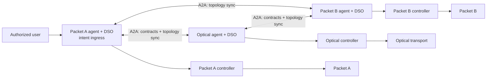

The data plane follows network adjacency: Packet A connects through Optical to
Packet B. The agent control plane is a full peer mesh, so every DSO can
handshake directly with every other DSO and converge on the same topology graph.
Service negotiation still follows the data-plane path; a direct Packet A–Packet
B control-plane session does not grant either agent authority to bypass the
optical domain.

The DSO that receives the user intent is the **initiating DSO**. It owns the
workflow correlation ID and tells the user the result. That is coordination of
one request, not authority over another domain: every remote decision is local
to the DSO that signed it.

The design has three connected planes. Keeping them separate makes it clear
which component can see, decide, and act on a given fact.

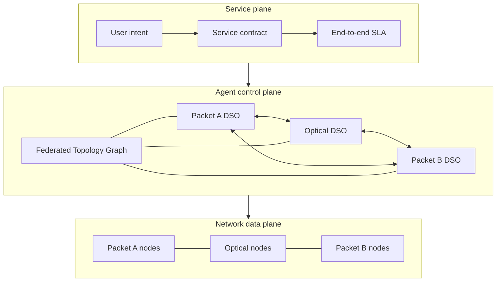

## Federated service orchestration

Every DSO implements the same bounded capabilities, scoped to its operator:

| Capability | Local behavior | Cross-domain behavior |
|---|---|---|
| Intent ingress | Authenticate a local user and translate intent to a local service request | Forward only a scoped contract to an adjacent DSO |
| Service lifecycle | Maintain the domain's service state, revision, reservation and receipt | Exchange signed lifecycle events for the same correlation ID |
| Service map | Maintain the local authoritative segment and merge every signed peer segment into the Federated Topology Graph | Publish owned nodes, interfaces, links, relationships, and approved configuration revisions |
| Policy and planning | Construct feasible local candidates and enforce local policy | Offer, counteroffer, accept, or reject a joint contract |
| Execution | Ask its own controller to reserve, commit, or roll back a named local operation | Never call a peer's controller |
| Assurance | Collect local and border evidence and evaluate its QoS contribution | Send signed status/evidence summaries to the initiating DSO |

This gives every agent the useful lifecycle and assurance capabilities of the
reference platform's Service Orchestrator without giving any one instance
another domain's controller credentials or unilateral execution authority. Each
DSO persists its own service record and a full **Federated Topology Graph**.
The common replicated view is the signed topology/configuration graph,
`ServiceContract`, and lifecycle events, so all three can agree whether the
contract is offered, reserved, committed, verified, failed, or rolled back.

## End-to-end operating model

The system operates as a federation of equal DSOs, not as a central orchestrator
that commands three subordinate domains.

1. **Peer bootstrap and topology convergence.** Packet A, Optical, and Packet B
   mutually authenticate, exchange Agent Cards, and synchronize signed topology
   and configuration snapshots. Every DSO then holds the full multi-domain graph:
   nodes, interfaces, packet and optical links, node relationships, capacities,
   operational state, and approved configuration revisions. Signed deltas keep
   all replicas current.
2. **Intent admission.** An authorized user submits a desired service outcome to
   any DSO. The receiving DSO becomes the initiating DSO for that correlation ID.
   It authenticates the user, checks local entitlement, records the intent, and
   creates the initial versioned `ServiceContract`.
3. **Path and QoS planning.** Every affected DSO uses the same federated graph
   to validate end-to-end continuity and configuration compatibility. The
   initiating DSO derives bandwidth, latency, loss, availability, deadline, and
   budget requirements; each domain derives the contribution it can make.
4. **Local candidate generation.** Each DSO creates only local,
   controller-feasible candidates. Packet DSOs may offer packet paths, QoS
   profiles, and border attachments. The Optical DSO may offer a transport path,
   wavelength/spectrum allocation, and transponder settings. Bounded swarm
   scouts explore the shared graph to discover and rank diverse alternatives.
   AI may explain or rank these candidates, but deterministic code checks their
   evidence, freshness, topology/configuration compatibility, and policy.
5. **Game-theoretic negotiation.** Each domain calculates its private local
   utility from SLA value, settlement, capacity consumption, opportunity cost,
   operations, energy, and risk. The DSOs exchange signed offers,
   counteroffers, and acceptance messages. They choose a contract only if it
   meets the SLA and budget and is individually beneficial to every domain over
   its fallback. Weighted Nash bargaining selects among such contracts.
6. **Reservation and commit.** Each DSO reserves its own named resources through
   its own controller. When every reservation receipt is valid, each DSO rechecks
   policy and current graph/configuration state, then commits its local action.
   This is a distributed saga: a failure, timeout, stale plan, or failed
   verification causes reservation expiry or compensating rollback, never a
   cross-domain controller write.
7. **Service verification.** The DSOs collect fresh endpoint, border, packet,
   and optical measurements. They exchange signed verification summaries and
   mark the service active only when the applicable end-to-end SLA is proven.
8. **Continuous assurance.** Every DSO independently runs a closed loop that
   monitors, analyzes, plans, acts locally, verifies, and records the result.
   A local action affecting a shared service returns to bargaining before commit.
   A short-lived coordination lease prevents three simultaneous loops from
   issuing conflicting negotiations for the same incident.
9. **Continual learning.** Terminal outcomes feed each DSO's asynchronous
   learning graph. It learns calibrated QoS, risk, cost, and ranking estimates
   from evidence and signed peer outcomes. Learning is observational, advisory,
   or review-gated; it cannot create a controller action or bypass the service
   lifecycle gates.

The resulting path is therefore:

```text
user intent → federated topology-aware planning → bargaining → reservation
→ local commits → end-to-end verification → closed-loop assurance → learning
```

Each domain can see the complete topology and approved configuration state, but
ownership remains local: only the owning DSO can reserve, commit, roll back, or
change its controller-managed resources.

```mermaid
flowchart LR
    I[Intent] --> V[Validate identity and policy]
    V --> G[Read synchronized topology and configuration graph]
    G --> W[Swarm explores feasible alternatives]
    W --> C[Create local candidates and cost quotes]
    C --> B[Nash bargaining among DSOs]
    B --> R[Time-bound local reservations]
    R -->|All valid| X[Each DSO commits through its controller]
    R -->|Any reject or expiry| F[Release or compensate]
    X --> Q[Endpoint and border verification]
    Q -->|SLA proven| A[Active service and assurance loop]
    Q -->|SLA not proven| F
    A --> L[Outcome trace and continual learning]
```

## Federated topology and configuration exchange

Use OSPF's link-state database as the mental model: every peer learns a
consistent graph rather than requesting an end-to-end path from one central
controller. The mechanism is agent-to-agent topology federation, not OSPF
itself. It works across the three operator domains and carries both topology
and the configuration state required for service reasoning.

Every DSO maintains a local `FederatedTopologyGraph` with these object types:

| Object | Required fields | Relationship represented |
|---|---|---|
| Domain | `domain_id`, owner identity, topology revision | Owns nodes and local configuration advertisements |
| Node | globally unique `node_id`, owner domain, role, device type, operational state | Contains interfaces; may be a packet router, gateway, ROADM, transponder, or server |
| Interface/port | `interface_id`, parent node, layer, admin/operational state, capacity | Terminates a link or domain handoff |
| Link | `link_id`, two interface IDs, layer, capacity, latency, state, metric | Edge between two nodes; preserves packet, optical, and inter-domain adjacency |
| Configuration | owner revision, desired state, observed state, policy profile, QoS/transport parameters | Binds approved configuration state to one node, interface, or link |
| Service attachment | service/tenant reference, ingress/egress interface, reservation state | Connects a negotiated service to graph resources |

Each configuration object is structured data—for example YANG/OpenConfig paths,
SR/MPLS policy attributes, VLAN/EVPN attachment attributes, optical channel or
spectrum parameters, and QoS profiles. It must exclude controller credentials,
private keys, and shared secrets. Its owner is the only writer; all peer DSOs
replicate it as read-only reasoning state.

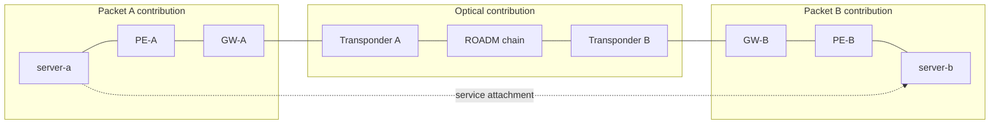

### Handshake and synchronization

When a peer relationship starts or recovers, the two DSOs perform this sequence:

1. Mutually authenticate with mTLS, exchange Agent Cards, and agree on the
   topology schema and configuration-model versions.
2. Exchange `TOPOLOGY_DIGEST` messages listing the latest signed revision for
   each originating domain.
3. Request and verify missing `TOPOLOGY_SNAPSHOT` or `TOPOLOGY_DELTA` records.
   Every record is signed by its owning DSO and includes an origin-domain ID,
   monotonic sequence number, timestamp, expiry, and content digest.
4. Atomically apply verified records to the local graph, preserving their
   source-domain ownership and recording deletion tombstones.
5. Exchange `TOPOLOGY_SYNC_ACK` with the resulting complete-graph digest.
6. Keep a subscription open for `NODE_CHANGED`, `LINK_CHANGED`,
   `CONFIG_CHANGED`, `RESERVATION_CHANGED`, and `TOPOLOGY_WITHDRAWN` deltas.

```mermaid
sequenceDiagram
    participant PA as Packet A DSO
    participant O as Optical DSO
    participant PB as Packet B DSO

    PA->>O: mTLS + Agent Card
    O-->>PA: mTLS + Agent Card
    PA->>O: TOPOLOGY_DIGEST
    O-->>PA: TOPOLOGY_DIGEST
    PA->>O: Request missing snapshot/deltas
    O-->>PA: Signed topology/configuration records
    PA->>PA: Verify origin, signature, sequence, expiry
    PA->>PA: Apply atomically; calculate graph digest
    PA-->>O: TOPOLOGY_SYNC_ACK
    O->>PB: Repeat topology synchronization
    PA->>PB: Direct mesh synchronization
    Note over PA,PB: All DSOs converge on the same graph digest
```

The initial full mesh lets Packet A, Optical, and Packet B receive every
domain's snapshot directly. Deltas can also be relayed through a currently
reachable peer when a direct control-plane link is unavailable; the original
owner signature and sequence number remain unchanged. A DSO rejects an update
from a non-owner, a stale sequence, an invalid signature, or an incompatible
schema. It marks affected graph data stale when its advertised validity period
expires and cannot use stale data to commit a service change.

An example link/configuration advertisement is:

```json
{
  "message_type": "TOPOLOGY_DELTA",
  "origin_domain": "optical",
  "origin_sequence": 418,
  "topology_revision": "optical-418",
  "changes": [{
    "kind": "LINK_CHANGED",
    "link": {
      "link_id": "optical:r2--r3:channel-17",
      "a_interface": "optical:r2:line-2",
      "z_interface": "optical:r3:line-3",
      "layer": "optical",
      "capacity_gbps": 400,
      "latency_ms": 1.8,
      "operational_state": "up"
    },
    "configuration": {
      "revision": "cfg-98",
      "desired": {"channel": 17, "modulation": "16QAM"},
      "observed": {"channel": 17, "qot_state": "acceptable"}
    }
  }],
  "expires_at": "2026-09-16T15:00:00Z",
  "signature": "owner-domain-signature"
}
```

This graph replaces the earlier abstract-only topology boundary. It gives every
agent the relationships needed to reason about end-to-end paths, impacted
services, alternative routes, shared-risk links, and configuration compatibility
before it negotiates. The graph is read-only outside the originating domain;
topology visibility never changes controller-write authority.

## DSO LangGraph design

Each DSO runs three LangGraphs over one durable local state store. Separating
them keeps topology replication, service provisioning, and assurance/recovery
as different event paths. They share the same `FederatedTopologyGraph`, but a
topology update cannot cause a controller change by itself.

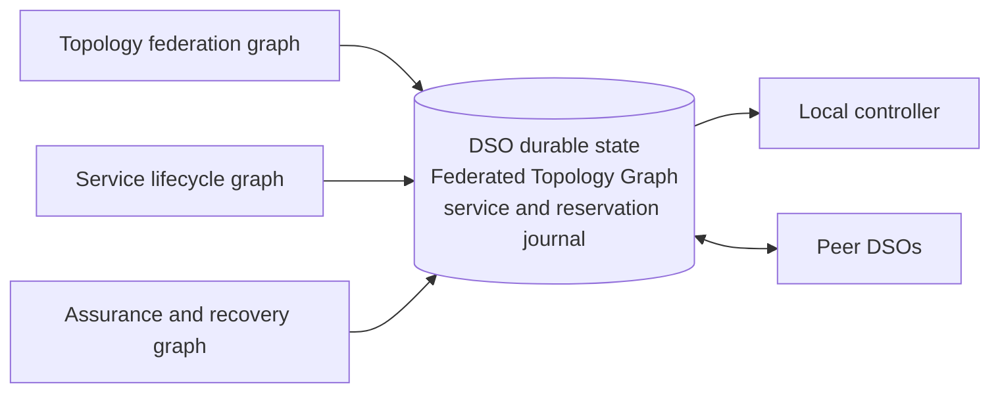

### 1. Topology federation graph

This graph runs on a peer handshake, snapshot request, or topology/configuration
delta. It is the agent equivalent of maintaining an OSPF link-state database.

| Node | Responsibility |
|---|---|
| `topology_event_ingest` | Classify a handshake, snapshot, delta, withdrawal, or resynchronization request and bind its peer/correlation IDs. |
| `peer_identity_gate` | Verify mTLS identity, Agent Card capability, peer authorization, and supported schema versions. |
| `topology_message_verifier` | Validate message schema, origin-domain ownership, signature, sequence number, expiry, and content digest. |
| `topology_reconciler` | Compare advertised revisions with the local revision vector and request the required snapshot or missing delta range. |
| `graph_apply` | Atomically apply an owner-signed node, interface, link, relationship, configuration, or tombstone change. |
| `graph_integrity_gate` | Validate endpoint existence, layer compatibility, graph connectivity, configuration references, and the resulting graph digest. |
| `topology_impact_analysis` | Identify services, reserved resources, paths, and pending negotiations affected by the change. |
| `topology_ack_and_journal` | Persist the replica revision, emit a signed synchronization acknowledgement, and enqueue impacted services for assurance. |

### 2. Service lifecycle graph

This graph runs when a local user submits intent or when a peer sends a service
contract event. It replaces the single central Service Orchestrator with the
same bounded lifecycle in every domain.

| Node | Responsibility |
|---|---|
| `service_event_ingest` | Accept a local intent or peer contract event and create/load the correlation-specific service record. |
| `identity_and_entitlement_gate` | Authenticate the user or peer and verify tenant, endpoint, and service authority. |
| `service_context_load` | Load the local service state, prior receipts, reservation state, peer lifecycle state, and current graph digest. |
| `topology_freshness_gate` | Require the topology/configuration revisions referenced by the request to be present, valid, and not stale. |
| `qos_budget_derivation` | Turn the end-to-end intent into local bandwidth, latency, loss, availability, and deadline contributions. |
| `path_and_dependency_analysis` | Traverse the federated graph to identify the selected path, domain handoffs, shared-risk resources, and configuration dependencies. |
| `swarm_state_refresh` | Read current signed swarm-quality signals for the graph entities and service class under consideration. |
| `swarm_candidate_exploration` | Run bounded virtual scouts over feasible packet-optical paths and resource/configuration combinations; this is planning only. |
| `swarm_candidate_aggregation` | Aggregate scouts into a small, diverse, deduplicated candidate set with reproducible score components. |
| `local_candidate_generation` | Generate only controller-feasible local actions and predicted QoS effects for this DSO's domain. |
| `advisory_reasoning` | Optionally use the AI model to explain evidence, rank alternatives, or propose a counteroffer; it cannot add an action outside the deterministic candidate set. |
| `candidate_verification` | Ground every candidate in current graph/telemetry/configuration evidence and reject unsupported claims. |
| `local_policy_selection` | Apply local policy, cost, risk, disruption, and rollback rules to select an offer or counteroffer. |
| `local_utility_evaluation` | Calculate this domain's utility and disagreement value for each policy-approved candidate. |
| `peer_contract_negotiation` | Exchange signed bargaining offer, counteroffer, acceptance, and rejection messages with the DSOs on the selected path. |
| `bargaining_solution_gate` | Require a mutually beneficial agreement plus matching contract revision, graph digest, path, QoS budget, and peer acknowledgements. |
| `local_reservation` | Ask the local controller to create an idempotent, time-bound reservation for its named operation. |
| `reservation_barrier` | Wait for valid reservation receipts from every affected DSO; route to expiry or compensation on rejection/timeout. |
| `commit_authorization_gate` | Recheck local policy, graph freshness, contract revision, reservation validity, and controller state immediately before commit. |
| `controller_transaction` | Request the local controller's named commit or compensating rollback; persist the local receipt. |
| `service_verification` | Evaluate local and border measurements, then exchange signed verification summaries with the peers. |
| `service_outcome_journal` | Record `VERIFIED`, `FAILED`, `EXPIRED`, or `ROLLED_BACK`, notify the initiating DSO, and create an immutable decision trace. |

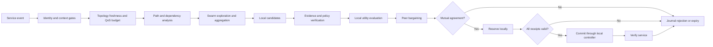

### 3. Assurance and recovery graph

This graph runs on local telemetry, a peer status event, a topology impact event,
or a verification failure. It uses the same candidate, negotiation, reservation,
commit, and outcome nodes as the service lifecycle graph rather than creating a
second controller path.

| Node | Responsibility |
|---|---|
| `assurance_event_ingest` | Receive telemetry, peer evidence, topology-impact, or service-verification events. |
| `evidence_normalization` | Convert source measurements to typed, timestamped evidence bound to graph entities and configuration revisions. |
| `service_health_evaluation` | Determine whether the domain's contribution and the received end-to-end evidence meet the contract. |
| `incident_creation_or_update` | Create, deduplicate, or update the domain-local incident and bind it to the affected graph revision. |
| `fault_and_impact_reasoning` | Identify probable local and cross-domain dependencies using the graph and evidence; optional AI output remains advisory. |
| `remediation_dispatch` | Re-enter `local_candidate_generation` and the shared negotiation/transaction path, or escalate when no safe candidate exists. |
| `assurance_trace_and_journal` | Persist the evidence, diagnosis, peer exchanges, action receipts, and final health outcome. |

The durable DSO state shared by these graphs includes the topology revision
vector and graph digest, service contract revision, correlation ID, local and
peer lifecycle states, candidate-set digest, reservation receipts, controller
receipts, evidence references, and immutable audit trace. Packet A, Optical,
and Packet B use the same node names; their local candidate, controller,
telemetry, and configuration adapters differ by domain.

## Per-domain closed loop

Every DSO runs its own continuous MAPE-K loop—Monitor, Analyze, Plan, Execute,
with shared Knowledge. It is scheduled at a domain-defined interval and also
wakes immediately on local telemetry, a topology/configuration delta, a peer
status event, a reservation expiry, or a failed verification.

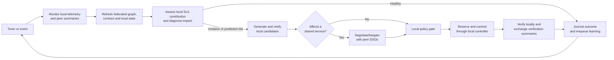

| Loop stage | DSO behavior |
|---|---|
| Monitor | Read domain-scoped telemetry, controller state, service probes, configuration state, and signed peer summaries. Packet DSOs observe loss, latency, queues, utilization, and route state; the Optical DSO observes spectrum, QoT/gOSNR, transponder, and ROADM state. |
| Analyze | Normalize evidence, refresh the federated graph, assess the local contribution to every active service, correlate local changes with peer evidence, and classify health, degradation, or risk. |
| Plan | Traverse the full topology graph, generate controller-feasible local candidates, calculate local QoS/cost/risk utility, and determine whether the action can affect another domain's service. |
| Execute | For an isolated local action, use the local policy gate. For an action affecting a shared service, complete bargaining and reservation with every affected DSO first. The owning DSO alone invokes its controller's named prepare/commit/rollback operation. |
| Verify | Collect fresh local and border measurements, exchange signed verification summaries, and mark the contract healthy only when its applicable end-to-end evidence satisfies the agreed SLA. |
| Knowledge | Persist topology/configuration revisions, service contracts, evidence, incidents, offers, reservations, controller receipts, outcomes, and approved learning releases. |

The normal closed-loop path can finish with no action: a healthy assessment
records fresh evidence and returns to monitoring. An AI recommendation cannot
skip from Analyze to Execute; it must pass candidate verification, local policy,
cross-domain bargaining when applicable, reservation, commit authorization, and
verification.

### Coordinating three concurrent loops

All three loops may detect the same service problem. To avoid contradictory
actions or negotiation storms, each service incident has a short-lived,
signed **coordination lease**. The first DSO to create the incident proposes a
lease bound to the contract revision and graph digest. Peer DSOs acknowledge it
only if they see the same current service state. The lease holder coordinates
the bargaining conversation; it does not gain authority over peer controllers.

Every DSO retains the right to reject an offer, withdraw a reservation, or
start a new incident after the lease expires. Controller idempotency keys,
candidate digests, cooldown timers, hysteresis/deadbands, and a maximum action
rate per service prevent repeated oscillating changes. A topology change,
contract revision, stale graph, failed peer acknowledgement, or verification
failure invalidates the active plan and returns the loops to Analyze.

### 4. Continual-learning graph

Each DSO also runs an asynchronous **Domain Learning Graph**. The
`service_outcome_journal` and `assurance_trace_and_journal` nodes enqueue a
learning job after a terminal service outcome; they never wait for learning
before completing a service request or recovery action.

```text
decision_trace_ingest → peer_outcome_correlation → comparable_trace_retrieval
→ novelty_gate → hypothesis_generation → provenance_validator
→ experiment_planner → safe_experiment_runner → evaluation_gate
→ promotion_gate → publish_learning_release or reject_or_revoke
```

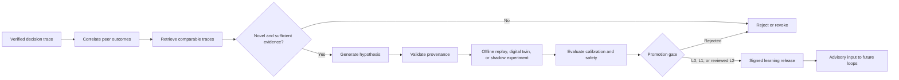

| Node | Responsibility |
|---|---|
| `decision_trace_ingest` | Read the immutable local service, negotiation, topology/configuration, controller-receipt, and verification trace. |
| `peer_outcome_correlation` | Match signed peer outcome summaries to the same service contract, graph digest, and time window. |
| `comparable_trace_retrieval` | Retrieve prior outcomes with comparable topology, configuration, traffic, and service conditions. |
| `novelty_gate` | Stop duplicate, too-small, stale, or contradicted learning jobs. |
| `hypothesis_generation` | Propose a bounded explanation or prediction improvement, such as a QoS forecast, risk calibration, cost calibration, or negotiation-ranking feature. |
| `provenance_validator` | Require attributable evidence, valid graph/configuration revisions, and a reproducible training/evaluation dataset. |
| `experiment_planner` | Define an offline replay, digital-twin simulation, or shadow evaluation. It cannot schedule an uncontrolled live experiment. |
| `safe_experiment_runner` | Run only the approved offline or shadow experiment and preserve the inputs and result. |
| `evaluation_gate` | Measure calibration, prediction error, safety regressions, bargaining outcome quality, and sample sufficiency against a held-out baseline. |
| `promotion_gate` | Decide whether the result can remain observational, enter shadow ranking, require operator review, or be rejected/revoked. |
| `publish_learning_release` | Sign and version the approved finding/model release with its scope, expiry, evidence digest, and applicability conditions. |
| `reject_or_revoke` | Preserve the failed result and withdraw a prior release that is no longer valid. |

The three DSOs learn locally from the same end-to-end outcome but contribute
different evidence: Packet A and Packet B learn packet path, queue, and
endpoint behavior; Optical learns spectrum, QoT, transponder, and transport
behavior. They exchange signed **learning releases**, not unrestricted model
writes. A release binds its model/finding to topology and configuration
revisions, service type, evidence digest, measured result, confidence, and
expiry. A receiving DSO independently verifies and either accepts the release
for its own advisory use or ignores it.

Learning has three promotion levels:

| Level | Permitted use |
|---|---|
| L0 — observational | Publish measured correlations and calibration facts; no service decision changes. |
| L1 — shadow/advisory | Rank already feasible candidates in `advisory_reasoning` or estimate cost/risk; deterministic policy still makes the decision. |
| L2 — reviewed policy input | Supply a bounded parameter update to an approved policy/risk model after operator review and replay evidence. |

No learning release may create a controller action, modify a topology/configuration record owned by another DSO, lower a hard safety constraint, or commit a service. The service lifecycle graph still performs candidate verification, bargaining consensus, reservation, commit authorization, and controller transaction independently.

## Game-theoretic coordination

The three DSOs are separate owners, so path feasibility alone does not imply
agreement. Model Packet A, Optical, and Packet B as players in a cooperative
bargaining game. The Federated Topology Graph gives all players the same view of
what can be connected; each player still evaluates the impact on its own
capacity, risk, operational policy, and commercial terms.

For a joint action `a = (a_packet_a, a_optical, a_packet_b)`, let `F(G)` be the
set of actions feasible in the replicated topology graph `G`. An action enters
`F(G)` only when it has continuous end-to-end connectivity, configuration
compatibility, sufficient capacity, valid resource reservations, and no hard
policy violation. Each domain calculates a local utility:

```text
U_i(a, x_i) = SLA/revenue benefit_i(a) + settlement_i(x_i)
              - resource cost_i(a) - disruption_i(a)
              - risk_i(a) - policy penalty_i(a)
```

`x_i` is an optional settlement, price, or internal credit associated with the
contract. In a research prototype it can be a virtual credit rather than a
payment. Each DSO also has a disagreement value `d_i`: normally retain the
current service state or reject a new-service request. A contract is admissible
only if it meets the user intent and is individually rational for every domain:

```text
U_i(a, x_i) >= d_i   for Packet A, Optical, and Packet B
```

For equal peers, select the feasible contract using a weighted Nash bargaining
solution:

```text
maximize  sum_i weight_i * log(U_i(a, x_i) - d_i)
subject to a in F(G), U_i(a, x_i) > d_i, and end-to-end SLA satisfied
```

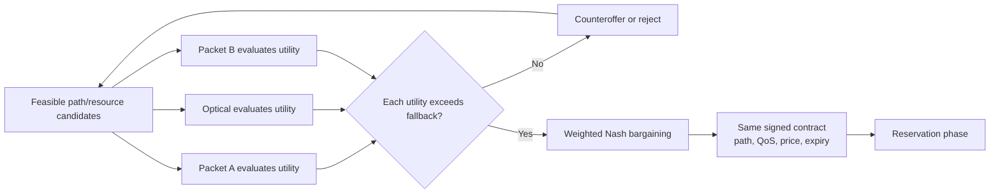

The weights are a published service policy, such as equal weight for three
operators or higher weight for a premium tenant's ingress operator. They must
be contract fields, never model-generated values. This method favors a service
option that improves every participating domain over its fallback, rather than
choosing the option with the highest benefit to only one domain.

### Cost quantification

Every DSO calculates cost in one agreed unit: a real currency for a commercial
deployment or a `service-credit` for a research prototype. Do not use an
unscaled score as cost, because the bargaining function must compare cost,
risk, and settlement in consistent units.

For domain `i` and a local candidate `a`, calculate the local resource cost as:

```text
C_i(a) = C_capacity + C_opportunity + C_operation + C_energy + C_risk
```

| Component | Quantification |
|---|---|
| `C_capacity` | Reserved resource quantity × reservation duration × domain unit rate. Packet domains use committed bandwidth/port/queue units; the optical domain uses spectrum slots, wavelength/transponder use, and optionally fiber distance. |
| `C_opportunity` | The cost of reducing future sellable capacity. Use a convex utilization function, for example `reference_cost × (utilization_after^p - utilization_before^p)` where `p > 1`; scarce links therefore cost more than idle links. |
| `C_operation` | Fixed cost for each approved controller transaction plus expected rollback/validation effort. It is zero for retain-current. |
| `C_energy` | Expected incremental watts × reservation hours × local energy rate. |
| `C_risk` | Probability that the change or resource fails × the locally defined service/rollback impact cost. Historical failure data can calibrate the probability. |

The DSO keeps its unit rates, utilization curve, and risk model private. It
publishes a signed **quote** containing the total cost, optional margin, total
requested settlement, cost-model revision, currency, expiry, and resource
commitment. Price and cost are distinct:

```text
quoted settlement_i = C_i(a) + approved margin_i
utility_i = settlement_i - C_i(a) + local SLA/value benefit_i
```

The user intent should therefore contain `maximum_total_cost` and `currency`.
The bargaining solution must satisfy that budget as well as the SLA and the
individual-rationality condition. In a research demo, set the currency to
`service-credit`, configure fixed rates in each domain, and record the quote in
the service contract; no payment system is required.

For example, a two-hour 1 Gbps request might produce these service-credit
quotes: Packet A costs 14 credits and quotes 16, Optical costs 52 and quotes
58 because it reserves scarce spectrum/transponder capacity, and Packet B costs
13 and quotes 16. The end-to-end quoted price is 90 credits. A user budget below
90 forces the DSOs to negotiate a cheaper feasible path or reject the request.

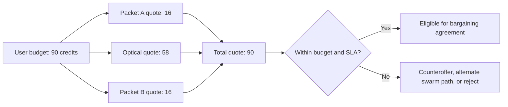

The reference platform's Max-Sum DCOP remains useful for searching candidate
combinations and checking pairwise compatibility. It assumes a common global
utility, so it should be used before bargaining as the feasibility/option
enumeration mechanism. Nash bargaining is the agreement mechanism for separate
owners with different utilities.

## Swarm optimization layer

The three DSOs can act as a policy-bounded AI swarm. Swarm optimization is used
to discover and rank feasible end-to-end alternatives in the Federated Topology
Graph; it does not select a commercial agreement or control a network device.

Ant Colony Optimization (ACO) is the primary swarm method because path and
spectrum selection are discrete graph problems. Each DSO launches bounded
virtual **scouts** during `swarm_candidate_exploration`. A scout traverses only
currently feasible nodes, links, interfaces, spectrum resources, and
configuration combinations. It returns a candidate path and a score rather than
touching the data plane.

For an eligible edge `i → j`, a scout chooses its next hop using a combination
of historical path quality (pheromone) and current measured quality (heuristic):

```text
P(i → j) = [pheromone(i,j)^alpha × heuristic(i,j)^beta]
           / sum over all eligible next hops
```

The heuristic uses normalized capacity headroom, latency, packet loss, jitter,
availability, optical QoT/gOSNR, risk, and quoted cost. Every signal is bound to
an entity ID, graph/configuration revision, service class, timestamp, expiry,
origin DSO, and signature. Packet A and Packet B publish packet-path and queue
signals; Optical publishes transport, spectrum, and QoT signals.

After a verified service outcome, the owning DSO updates the quality of the
resources used by that candidate. Pheromone decays over time so old success does
not override current congestion or optical degradation:

```text
pheromone(edge) = (1 - evaporation_rate) × previous_pheromone
                  + verified_outcome_reward
```

Only verified measurement outcomes update pheromone. Unverified AI assertions,
failed reservations, stale topology, and rejected candidates add no positive
reinforcement. The continual-learning graph can calibrate the heuristic weights
and outcome reward function, but those updates use the same L0/L1/L2 promotion
rules as other learned releases.

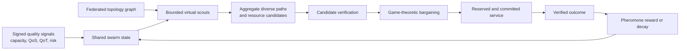

The swarm protocol has three signed message types:

| Message | Contents | Use |
|---|---|---|
| `SWARM_QUALITY_SIGNAL` | Entity/link ID, QoS/QoT measurements, capacity, risk, cost class, graph digest, expiry | Replicate current local quality into every DSO's swarm state. |
| `SWARM_CANDIDATE` | Candidate path/resource tuple, graph/configuration revisions, score vector, evidence references, TTL | Share a planning result for independent verification and local candidate construction. |
| `SWARM_FEEDBACK` | Verified outcome, reward/penalty, affected resources, evidence and service-contract digests | Update short-lived pheromone/quality state after service verification. |

Scouts are bounded by a maximum hop count, maximum candidates, time budget,
allowed resource classes, and minimum diversity threshold. The aggregation node
keeps a small set of materially different candidates rather than repeatedly
returning variations of the same congested path. For continuous choices, such as
bandwidth splitting, modulation/power parameters, or queue-share allocation,
the same layer may use Particle Swarm Optimization after ACO has selected the
discrete path.

The swarm result enters `local_candidate_generation`, then follows the normal
candidate verification, local policy, Nash bargaining, reservation, commit, and
verification path. It therefore answers **which options merit negotiation**;
game theory answers **which option independent owners accept**; each DSO's
controller gate answers **whether the local operation may run**.

### Bargaining message and decision rules

Each `BARGAINING_OFFER` binds the graph digest and contract revision and carries
the selected per-domain action IDs, predicted end-to-end QoS, reservation TTL,
rollback capability, settlement/credit proposal, and signed accept-by deadline.
It does not need to disclose a domain's private utility coefficients. A peer
independently evaluates the offer using its own utility function and responds
with `ACCEPT`, `COUNTEROFFER`, or `REJECT`.

The `bargaining_solution_gate` accepts a contract only when all three DSOs have
signed the exact same action tuple, graph digest, configuration revisions, QoS
budget, settlement, and expiry. It routes a rejection, expired offer, topology
change, or reservation failure to `service_outcome_journal` or compensating
rollback. No controller reservation or commit follows an incomplete agreement.

## Intent and service contract

An intent should state the desired outcome, never a path or a device command.
For example:

```json
{
  "intent_id": "intent-01J...",
  "tenant_id": "customer-42",
  "source": {"domain": "packet-a", "endpoint": "server-a"},
  "destination": {"domain": "packet-b", "endpoint": "server-b"},
  "service_type": "l3vpn",
  "qos": {
    "minimum_bandwidth_mbps": 1000,
    "maximum_latency_ms": 20,
    "maximum_packet_loss_ratio": 0.0001,
    "availability_target": 0.9999
  },
  "deadline": "2026-09-16T14:30:00Z"
}
```

The initiating DSO authenticates the user, checks entitlement for its own
domain, then converts the intent into a versioned `ServiceContract`. A contract
contains only what peers need to decide:

- opaque service, tenant, correlation and contract identifiers;
- ingress and egress border attachment identifiers;
- requested QoS envelope and each domain's budget/contribution;
- a candidate's capacity, cost class, predicted QoS contribution, risk,
  reservation lifetime, and rollback support;
- contract revision, issue/expiry time, nonce, sender identity, and signature.

It references the current signed topology and configuration revisions rather
than embedding a second copy. Controller credentials, private keys, and
LLM-generated configurations are never transferred.

End-to-end estimates compose conservatively: throughput is bounded by the
smallest domain contribution, latency is additive, and loss combines as
`1 - product(1 - domain_loss)`. An offered contract must meet the full intent
before it can be committed.

## Negotiation protocol

Use A2A HTTP+JSON (or an equivalent typed HTTPS protocol) for peer discovery
and message delivery. Each agent publishes an Agent Card describing its
identity, supported contract version, border capabilities, and endpoint. Use
mTLS workload identities and signed messages in a multi-operator deployment.

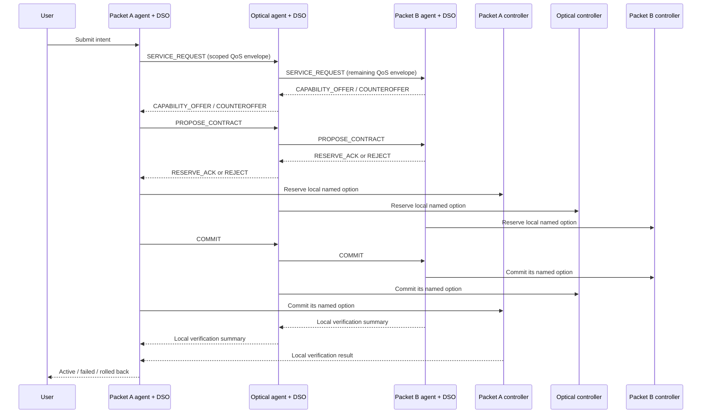

The protocol states are `DISCOVERED`, `OFFERED`, `COUNTERED`, `AGREED`,
`RESERVED`, `COMMITTED`, `VERIFIED`, `REJECTED`, `EXPIRED`, and `ROLLED_BACK`.
Every message is idempotent under its correlation ID and includes an expiry.
Expired, replayed, unsigned, or revision-mismatched messages are rejected.

Reservation is intentionally separate from commit. Each domain first creates a
short-lived, recoverable reservation for a locally named candidate. Commit can
proceed only when every required reservation is valid. A failure before
verification releases reservations or runs each controller's compensating
rollback operation. A controller reports its local receipt; no peer receives
write access to it.

## What each agent reasons about

An agent can use an LLM to interpret a natural-language intent, summarize local
telemetry, or explain a counteroffer. The LLM is advisory. Deterministic code
must enforce identity, policy, schema validation, QoS arithmetic, freshness,
candidate feasibility, reservation, and controller authorization.

Each agent's DSO produces a small candidate set such as `retain`, `provision path X`,
or `upgrade bandwidth tier Y`. Every candidate has evidence, feasibility,
predicted QoS effect, uncertainty, cost, disruption, risk, reservation TTL,
and rollback capability. The DSOs reason over the same replicated graph and
negotiate the selected end-to-end path, configuration compatibility, and terms;
each DSO still translates the selected path into only its own local operation.

For the first release, choose the best mutually feasible contract with
deterministic ranking:

`utility = SLA benefit - cost - disruption - risk - uncertainty`

Only introduce distributed optimization such as Max-Sum after the contract and
reservation protocol works. In this three-node chain it maps naturally to
Packet A -- Optical -- Packet B, with pairwise compatibility factors. It should
never replace the independent local-policy and controller checks.

## Required safety and trust controls

1. Authenticate users locally; authenticate peer agents with mTLS and allowlisted
   operator identities.
2. Sign every contract and bind it to its issuer, recipient, service, revision,
   nonce, timestamp, and expiry; retain replay records.
3. Give DSOs read-only, scoped inventory and telemetry tools. Give controllers
   only named, allowlisted reserve/commit/rollback operations.
4. Replicate the agreed multi-domain topology and approved configuration state
   through signed owner advertisements. Protect peer exchange with mTLS and
   exclude credentials, keys, and secrets from every topology/configuration
   object.
5. Require local policy approval before reservation and again before commit.
6. Verify the service using measurements at both endpoints and the relevant
   domain-border handoffs. A successful local commit does not prove end-to-end
   service success.
7. Journal every message, offer, reservation, controller receipt, and outcome
   with a tamper-evident correlation chain.

## Implementation order

1. Define Pydantic/JSON Schema contracts for topology objects, configuration
   objects, snapshots, deltas, signatures, and graph digests.
2. Implement three small agent services, each with a DSO state store, a graph
   replica, Agent Card, topology handshake, local policy adapter, and an
   in-memory fake controller for tests.
3. Test full snapshot convergence, incremental link/configuration updates,
   withdrawals, stale data, wrong-owner updates, replay, and graph-digest
   mismatch before implementing service requests.
4. Build the request → offer/counteroffer → reject flow against the replicated
   graph, with no controller writes.
5. Add reserve/commit/rollback adapters for one named local operation in each
   simulated domain, with durable receipts and idempotency.
6. Add endpoint and border verification, then support renegotiation and
   assurance events.
7. Add optional LLM explanation and later bounded distributed optimization;
   neither may widen the action allowlist.

The first working demo should prove one service request from Packet A to Packet
B, a successful three-domain reservation and commit, a remote policy rejection,
and a failed commit that rolls back/reconciles safely.
