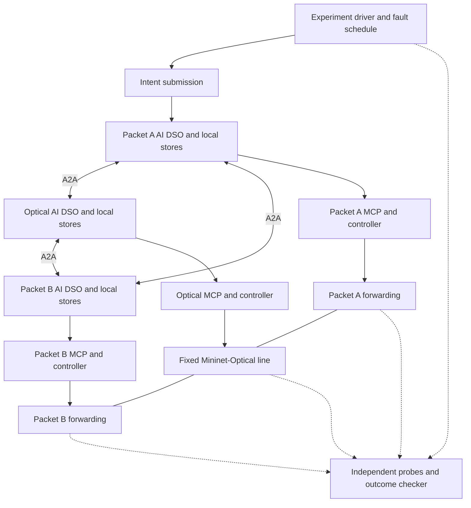
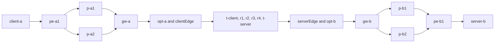
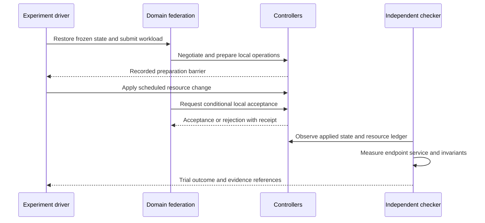

# Experimental validation plan

**Project:** Sovereign AI domain agents establishing an end-to-end service across independently controlled packet–optical networks.
**Target:** Elsevier *Computer Networks* journal paper.
**Plan date:** 17 September 2026.
**Status:** Proposed validation protocol. No experiment, measured result, or proven guarantee is asserted by this document.

This plan specifies the testbed, experimental controls, procedures, measurements,
analysis, and artifacts needed to evaluate the
[system architecture](domain-agent-architecture.md). The
[literature review](related-work-and-novelty.md) supplies the prior-work
comparison; experimental success alone does not establish novelty.

**What this study sets out to demonstrate.** There is one AI DSO per networking
domain and exactly one, each the sole authority inside its own borders
([sovereign domain authority](domain-agent-architecture.md#sovereign-domain-authority)).
The three agents reason with one another and autonomously establish a service
that runs through all three domains, starting from a structured intent submitted
to **any one** of them. The study evaluates that behavior and the conditions
under which it correctly does not happen.

The architecture has 57 named workflow nodes, including three conditional
generative-LLM nodes. Experiments exercise observable service behavior, rather
than treating node count or successful graph execution as an outcome. This
document does not request implementation of the testbed during the
architecture-design session.

**Selected data plane:** reuse the `packet-network/` and `optical-network/`
reference data plane. The [reference specification](reference-data-plane.md)
pins the inspected source, exact topology, action support, and control adaptations.
P1 uses that data plane; richer P0 fixtures and optional extensions must be
reported separately. This plan does not claim that the federation adapters or
the experiments are already implemented.

## 1. Research questions and claims

| ID | Research question | Evidence required | Claim boundary |
| --- | --- | --- | --- |
| RQ1 | Can three sovereign domain agents establish and sustain an end-to-end service across packet, optical, and packet domains from one structured intent, with no central orchestrator? | Executable provisioning, sustained traffic, verification, and teardown trials on the reference data plane. | A successful tool call or a simulated graph path alone is insufficient. |
| RQ2 | Is the federation genuinely initiator-agnostic — can the intent arrive at any one of the three agents and produce the same service? | The same intent submitted to Packet A, Optical, and Packet B in turn, with the realized path and contract compared across runs. | Equivalent outcomes across initiators do not establish equivalent latency or overhead; report both. |
| RQ3 | Do the agents reason and negotiate — composing QoS across heterogeneous domains, and refusing — rather than executing a fixed sequence? | Feasible and infeasible intents, offers and counteroffers, and owner veto including the optical refusal case. | A refusal is a valid outcome. Reproducing a negotiation does not establish truthful or strategy-proof reporting. |
| RQ4 | Is the generative reasoning load-bearing, or is the deterministic path sufficient? | The same federation with all three LLM nodes disabled, plus retrieval ablations, under matched evidence and candidates. | Improvements caused by deterministic gates must not be attributed to the model. |
| RQ5 | Do the agents sustain the service autonomously through a failure, and report truthfully when no repair exists? | Packet primary-path failure with the named backup action, and an optical cut with no alternate route. | Correct refusal and a truthful degraded state are successful protocol behavior, not service delivery. |

State the primary hypothesis and practically meaningful effect size before
confirmatory runs. Do not predetermine that all metrics improve, and do not
treat an agent's refusal as an experimental failure.

### 1.1 Scope of this study

**In scope (E01–E09):** sovereign domain authority and controller boundaries,
topology federation, intent semantics and physical feasibility, negotiation and
owner veto, provisioning and lifecycle, initiator-agnostic origination,
closed-loop recovery, retrieval and decision-context quality, and the
incremental value of generative reasoning.

**Deliberately deferred.** The following are real properties of the architecture
and are *not* evaluated here. They belong to a separate protocol-correctness
study and must be declared as untested rather than implied:

| Deferred area | Why it is out of scope for this paper |
| --- | --- |
| Concurrent intents and atomic reservation under contention | Requires a multi-service resource model the fixed-channel baseline does not provide. |
| State changes injected between agent reasoning and controller acceptance | A race-injection study in its own right; needs conditional-acceptance adapters that the baseline controller lacks. |
| Message loss, duplication, expiry, and replay | Fault-protocol scope; the cooperative profile here assumes ordinary delivery. |
| Partial commit, failed compensation, and uncertain application | Depends on transaction primitives that require separate adapter work. |
| Process, database, and projection failure; partitions and coordinator replacement | Availability and consensus scope; one DSO per domain has no standby in this design. |
| Load, scale beyond three domains, and hardware transfer | Three domains are the use case under study, not a scalability claim. |
| Economic allocation quality, swarm search, and continual learning | Optional architectural extensions; each needs its own controlled comparison. |

A run may correctly defer an operation or return `UNRESOLVED` when a fault
prevents safe completion. Report that as reduced availability or incomplete
recovery; do not count it as successful service delivery.

### 1.2 Publication scope profiles

| Profile | Required capability | Permitted interpretation |
| --- | --- | --- |
| P0: protocol simulator | Fake controllers, explicit state machines, resource and fault models. | Validate protocol logic within the model. No measured physical packet/optical service claim. |
| P1: reused SR Linux / Mininet-Optical PoC | The pinned `packet-qos` topology, eight SR Linux routers, a fixed four-ROADM optical line on channel 1, the shared UDP flow, and scoped controller adapters. | Measured emulated packet behavior through the reference optical data plane, with modeled optical quality. No alternate optical route or per-service bandwidth isolation. Recommended first paper profile. |
| P2: controller or optical hardware extension | Selected actual controller/device operations and calibrated observations. | Hardware/controller-specific findings only for the exercised capabilities. |

Report results by profile. Do not pool synthetic controller timing with hardware
timing. If only P0 is implemented, describe a simulation study and narrow claims
accordingly. P2 is an extension, not an invented journal requirement.

## 2. Freeze the experimental contract

Before collecting the final dataset, freeze and version:

1. Hypotheses, primary endpoints, comparison methods, effect sizes, and stopping rules.
2. Topologies, resource models, packet/optical mapping, controller capabilities, and workload generators.
3. Intent schema, QoS measurement definitions, utility units, admission policy, and participant-selection rules.
4. State-transition rules, dependency checks, reservation semantics, epoch rules, clock assumptions, retries, and timeouts.
5. Model identifiers, prompts, tool schemas, retrieval corpus/index versions, context budgets, and fallback policy.
6. Fault schedules, pseudorandom seeds, independent checker definitions, and exclusion criteria.
7. Software/container versions, machine resources, orchestration placement, and instrumentation overhead.

Pilot runs may change these choices. Changes after the freeze create a new
experiment version and require rerunning affected comparisons; retain previous
results and the reason for the change. Do not tune on the held-out test traces.

The initial trust profile is fixed, authenticated, cooperating operators with
independent credentials and policies. Messages can be delayed, reordered,
duplicated, or lost; processes can restart. Signatures do not prove truthful
telemetry or economic reporting. Byzantine agreement, topology confidentiality
from authorized peers, and strategy-proof bargaining are outside this profile.

## 3. Testbed and independent measurement

### 3.1 Domain deployment

Deploy three separate domain stacks: Packet A, Optical O, and Packet B. Each has
its own DSO process, PostgreSQL/pgvector database, Neo4j projection, A2A identity,
MCP credentials, controller adapter, and telemetry scope. Separate containers,
VMs, or hosts are acceptable if the isolation and shared-host limitations are
reported. Administrative separation in the lab does not imply three real operators.

The reference currently has a single packet controller for both packet networks.
Before testing independent control, reuse its code behind two inventory-scoped
instances with separate credentials, journals, and MCP endpoints. Retain one
Optical controller. Exercise wrong-domain requests at both MCP and backend API
boundaries. A run with the original shared privileged packet controller must be
labeled as a weaker control-isolation profile. Lab bootstrap may create shared
namespaces and bridges; runtime DSOs must not receive lab-wide lifecycle powers.

The experimental driver can submit intents, schedule faults, collect evidence,
and reset fixtures. It must not select service paths, supply hidden network
truth to an agent, decide bargaining outcomes, or repair the service during a
measured trial. Its global visibility is measurement instrumentation, not a
runtime central orchestrator.



Keep control-plane transport independent of data-plane service traffic unless
an experiment explicitly tests their shared failure. Otherwise a simulated
optical cut could accidentally disconnect every controller and confound recovery.

### 3.2 Reference topology

Use the pinned source files in the [reference data-plane specification](reference-data-plane.md)
as the source for experiment construction. Preserve their names, links,
interfaces, addresses, and configuration in the baseline manifest:

| Domain | Resources | Alternatives and dependencies |
| --- | --- | --- |
| Packet A | `client-a`; routers `pe-a1`, `p-a1`, `p-a2`, `gw-a`; attachment bridge `opt-a`. | Primary `pe-a1–p-a1–gw-a`, backup `pe-a1–p-a2–gw-a`. |
| Optical O | `clientEdge`, `t-client`, `r1`, `r2`, `r3`, `r4`, `t-server`, `serverEdge`. | One fixed terminal/ROADM line, channel 1; no alternate optical route. |
| Packet B | Attachment bridge `opt-b`; routers `gw-b`, `p-b1`, `p-b2`, `pe-b1`; `server-b`. | Primary `gw-b–p-b1–pe-b1`, backup `gw-b–p-b2–pe-b1`. |
| Handoffs | `opt-a–clientEdge` and `serverEdge–opt-b`, joined by the reference bridge integration. | Preserve the L2 attachments and transparent transit between `gw-a` and `gw-b`; there is no direct packet bypass. |

This is eight packet routers, four ROADMs, two terminals, two optical Ethernet
edges, two packet bridges, and two traffic endpoints: **20 named entities**.
Count typed interfaces/channels separately. The service is `client-a`
(`10.10.0.2`) → `server-b` (`10.20.0.2`), with gateway transit addresses
`10.10.4.1/30` and `10.10.4.2/30`. A different packet branch still uses the same
optical line and cannot protect against its failure.



For the larger-domain extension, use chains and meshes with variable participating
path lengths. Include unrelated domains so approval scope and topology-replication
overhead can be measured independently. Do not change topology family and domain
count simultaneously without recording the confounding change.

### 3.3 Packet and optical fidelity

P1 forwarding trials must use endpoint traffic and apply the actual named
packet-route changes through the scoped controllers. Read back routes and
independently verify the traversed branch and optical transit. An acknowledgement
without observed forwarding behavior is insufficient evidence of service recovery.

Mininet-Optical is the baseline optical backend. Preserve its 50-metre span
segments, amplifier settings, terminal launch power, zero modeled ROADM insertion
loss, and fixed channel-1 configuration. Pin the separately installed library
version as well as the repository commit. These are simplified lab parameters,
not a calibrated long-haul model or evidence of line-rate optical performance.

Separate three observations: graph/port/channel continuity, modeled OSNR/gOSNR
and monitor coverage, and packet outcomes at the receiver. Demonstrate any claimed
coupling between a modeled quality change and packet delivery. A low-gOSNR fixture
alone cannot be called measured packet loss. An optical connectivity fault must
actually interrupt the mapped transit path before it counts as a data-plane cut.

Spectrum fragmentation, multiple wavelengths, regeneration/modulation selection,
and alternate optical paths are not baseline capabilities. Model them in P0 or
add a versioned extension before evaluating them as executable actions. An
optional [GNPy model](https://gnpy.readthedocs.io/en/master/) may provide an additional
comparison in such a profile; it does not replace the selected Mininet-Optical
data plane or independently validate it just by repeating its assumptions.

The initial flow has no per-service queue, policer, or isolated optical allocation.
Its configured offered rate is not reserved bandwidth. Publish host calibration
and any rate scaling; do not infer circuit line rate from the UDP traffic rate.

### 3.4 Capability coverage before experiment execution

The catalogue below is a research suite, not a statement that all its resource
types already exist in the reference. Record each experiment's profile and
capability coverage before running it:

| Subject | Same-data-plane P1 coverage | Additional work or limitation |
| --- | --- | --- |
| Packet recovery | Existing PN1 and PN2 named backup-route procedures. | Add domain-scoped control and typed MCP mutation wrappers; independently validate both and joint recovery. |
| Optical participation | Observe and validate the fixed line; retain or refuse its use. | No alternate lightpath; failure may correctly require escalation. |
| A2A, DSO stores, signed agreements, freshness, epochs | New federation control layer around the existing data plane. | Implement and validate these mechanisms; do not attribute them to reference code. |
| Local transaction guarantees | Packet journal, preparation, rechecks, readback, supported compensation. | Multi-device writes are not atomic; external writers can bypass controller locks. Stronger acceptance/fencing must be implemented or declared unsupported. Optical transactions need their own capability profile. |
| Provisioning and resource contention | Adopt/admit the existing transport, control the shared flow through its owners, and serialize conflicting route/contract updates. | Does not establish dynamic VPN/circuit provisioning or independent per-service bandwidth isolation. |
| Fragmentation, tunable line resources, isolated services | Unsupported in the unchanged baseline. | P0 model tests, explicit capability-refusal cases, or a separately implemented extension; never count them as live P1 coverage. |
| Search-space size | At most four packet path combinations over one optical line. | Use exact enumeration here; larger search spaces require separately labeled fixtures. |

All core E01–E09 families remain relevant, but execute only supported P1 variants
and explicitly report P0-only and unsupported cases. If a paper claim requires
an unavailable primitive, implement it or narrow the claim before publication.

### 3.5 Independent checkers

| Checker | Evidence it uses | Independence requirement |
| --- | --- | --- |
| Authorization checker | Signed contract, participant identities, local policy version, operation audit. | Evaluate expected authorization separately from the DSO decision result. |
| Resource checker | Authoritative controller snapshots, reservation ledger, applied operations. | Detect double allocations and leaks without trusting the agent's service label. |
| Feasibility reference | Exhaustive enumeration or exact constrained solver on small instances; validated reference optical cases. | Use a separately reviewed formulation, not the same planner function twice. State remaining model dependence. |
| Service checker | Source/destination probes and traffic captures. | Independent of local `verify_change` responses and model explanations. |
| Protocol checker | Event trace, revisions, epochs, receipts, fault schedule. | Check invariants against a published state machine. |
| Retrieval/diagnosis checker | Curated evidence IDs, dependency sets, fault ground truth, and blinded expert labels where needed. | Do not use majority LLM agreement as ground truth. |

For large workloads without an exact feasibility oracle, use known constructed
cases or report admission outcomes without calling every rejection incorrect.
Oracle disagreement must be investigated and reported rather than silently
resolved in favor of the proposed method.

## 4. Workloads and parameter sweeps

The values below are **initial pilot settings**, not requirements imposed by the
journal or claims about deployed networks. Adjust to verified testbed capacity,
then freeze them consistently across methods.

### 4.1 Service requests

Use structured canonical intent; natural-language translation is outside the
current three LLM nodes. Each intent specifies endpoints, participant/path
eligibility, bandwidth, delay metric and limit, loss metric and limit, service
lifetime, provisioning deadline, tenant policy, price ceiling, and currency.
Record whether QoS targets apply per direction or bidirectionally.

Start with the reference `client-a` → `server-b` UDP stream: **1 Mbit/s offered
load**, port `5201`, 1400-byte UDP payload. Optional pilot rates such as 5 or
10 Mbit/s require host/receiver calibration; no 1 Gbit/s link capacity is assumed
from an interface name. Use relaxed, tight-but-feasible, and impossible targets
derived from measured unloaded delay and independently checked limits. Fresh
receiver intervals establish delivered rate/loss; sender output alone does not.
Report unsupported guaranteed-bandwidth intents as unsupported rather than
equating the iperf3 rate setting with a network reservation.

Use three workload sets:

| Set | Construction | Purpose |
| --- | --- | --- |
| W1: controlled cases | One service or a known small set; exact feasibility and expected outcome. | Correctness and fault attribution. |
| W2: synthetic demand | Seeded request classes, arrivals, and revisions/competing requests for the baseline flow. Multiple endpoints and independent services only in declared P0/extension profiles. | Control throughput, conflict handling, blocking, and cost; service-capacity claims need actual isolation support. |
| W3: held-out stress | Held-out demand bursts, fault placements, and evidence combinations on the baseline; different topology seeds only in separate profiles. | Generalization and robustness within the declared topology family. |

Include feasible requests, infeasible resource requests, policy refusals, exhausted
budgets, and conflicting simultaneous intents. A proposed diagnostic mix is
60/20/10/10 percent feasible/resource-infeasible/policy-refused/budget-infeasible
cases, with each label independently constructed. Evaluate a separate predominantly
feasible workload for throughput; a synthetic mix is not a claim about real demand.

For W2, begin with Poisson arrivals and exponential holding times as a controlled
model, then add bursty arrivals and longer-lived services to test sensitivity.
Report requested bandwidth-time and an explicitly defined offered-load measure
against the same reference capacity. Distinguish scheduled exogenous load from
achieved utilization: methods that reject requests will realize different load.

### 4.2 Proposed sweep grid

| Factor | Pilot values or construction | Use |
| --- | --- | --- |
| Nodes per packet domain | 4 in the reference; 8, 12, or 24 only in generated P0/extension variants. | Graph/query/candidate cost; preserve the fixed P1 baseline as its own dataset. |
| Concurrent in-flight intents | 1, 5, 10, 25, 50, subject to measured host limits. | Contention and saturation; distinguish live services from pending requests. |
| Offered load | Begin at 1 Mbit/s; after calibration use approximately 25%, 50%, 75%, 90%, and overload of measured sustainable forwarding rate. | Packet throughput/assurance; resource-admission capacity requires a separately validated resource model. |
| Added A2A one-way delay | 0, 10, 50, 100 ms plus a separately defined jitter distribution. | Negotiation and replica lag; report actual observed delay. |
| Message loss/duplication | 0%, 1%, 5% seeded random faults plus exact targeted drops. | Transport robustness; separate packet loss from application-message faults. |
| Projection/advertisement delay | 0, 0.5, 2, 5 s or equivalent multiples of the telemetry interval. | Stale evidence and unnecessary retries. |
| State-change timing | Before offer, after acceptance, after preparation, immediately before local acceptance, after application. | Dependency validity and recovery. |
| Failure duration | Shorter than, near, and longer than reservation/coordination expiry. | Boundary behavior rather than arbitrary timing only. |
| Optical margin | Modeled reference cases above, near, and below the configured threshold, with deliberate perturbations logged. | QoT validation/refusal; report model units, coverage, uncertainty, and whether packet behavior changes. No baseline optical reroute. |
| Context budget | For example 2k, 4k, 8k input tokens if supported by all compared methods. | Grounding efficiency; reserve identical output allowance. |

Do not run the full Cartesian product. First validate W1 cases, then run matched
single-factor sweeps, then preselect important interactions: initiator ×
recovery, optical margin × refusal, and context freshness × LLM use.
Document which cells were run and why. Any reduced/fractional design must retain
the contrasts needed for its claim.

### 4.3 Timing and traffic calibration

Measure a controller-only reference path before agent comparisons. Establish
host throughput limits, unloaded delay, probe overhead, controller application
latency, telemetry sampling delay, and clock error. Pin CPU/memory allocations
and record co-tenancy, database cache state, and network shaping.

Pilot values can use one-second telemetry sampling and ten-second verification
windows. The final window, probe rate, packet size, and stable-window count must
support the requested precision. A loss target of 0.0001 cannot be convincingly
certified from a handful of packets or a short zero-loss observation.

Select reservation and request deadlines from calibration and service requirements,
not to favor one method. Compare methods first under identical deadlines, then
report any separately tuned variants. A late result remains a deadline miss.

## 5. Systems and baselines

| ID | Definition | What it isolates |
| --- | --- | --- |
| B0 | Proposed federated protocol with selective LLM reasoning and grounded RAG/GraphRAG; fixed learning and conventional path search initially. | Reference system under study. |
| B1 | B0 with all three generative LLM nodes disabled and documented deterministic fallbacks. Same topology, retrieval access, protocol, candidates, tools, and policy. | Incremental value and cost of LLM assistance. |
| B2 | Central ACTN-style orchestration with the same resources, adapters, feasibility rules, controller guards, and service constraints. | Coordination placement. The central coordinator requests local actions; domain controllers retain their authorization checks. |

B0 versus B1 is required: it is the only evidence that the generative reasoning
is load-bearing (RQ4). B2 is recommended as the architecture comparison, showing
what sovereign federation changes relative to central orchestration. Document the
actual feature matrix so a baseline is not credited with functionality it lacks.

### 5.1 Controlled ablations

| ID | Change from the appropriate matched reference |
| --- | --- |
| A1 | Document RAG only; graph facts still available to non-LLM feasibility checks. |
| A2 | Graph context without additional revision/freshness filtering; retain local controller guards. |
| A3 | Fixed structured context versus dynamically retrieved context under the same token limit. |
| A4 | Enable each of the three LLM nodes separately; learning stays off. |

Do not remove domain authorization to make an ablation fail. Run intentionally
weakened mechanisms only on disposable lab resources, and restore the reference
configuration between trials.

Use matched evidence arrival traces when isolating decision logic. In natural
deployment comparisons, allow architecture-induced propagation differences but
measure them explicitly. A centralized baseline must not receive hidden perfect
state while the federation receives delayed advertisements, unless that difference
is the declared experimental variable.

## 6. Instrumentation, outcomes, and metrics

### 6.1 Required event record

Every trace event records run/scenario/variant IDs, domain, service/correlation
ID, intent and contract revisions, candidate digest, dependency revisions,
operation ID and idempotency key, coordination epoch, actor identity, event type,
result, and evidence references. Include controller acceptance/application times,
reservation expiry, retry count, queue duration, and fault-injection marker.

Use monotonic clocks for durations within one process or host; record clock
calibration and uncertainty for cross-host ordering. Prefer an experiment-driver
clock for submission-to-observed-completion time. Sequence/cause IDs supplement
timestamps; wall-clock sorting alone must not decide whether an operation was
authorized before a fault.

Record LLM node, model/version, prompt/template hash, context IDs and token count,
decoding settings, output, validation result, latency, retries, and usage charges.
Record embedding/index versions and retrieval timings separately. Store artifacts
locally without credentials; secret removal must not discard relevant outcomes.

### 6.2 Outcome vocabulary

| Outcome | Meaning |
| --- | --- |
| `VERIFIED` | All required service checks pass within the contract deadline and defined observation window. |
| `REJECTED_VALIDLY` | An independently supported policy, feasibility, or budget reason prevents admission. |
| `REJECTED_FEASIBLE` | A reference-supported feasible admissible case was rejected; investigate algorithm limits. |
| `DEFERRED` | Required evidence/approval is unavailable; no successful establishment is claimed. |
| `DEADLINE_MISS` | Requested service or recovery did not meet the specified deadline, including late eventual success. |
| `PARTIAL` | Only part of the intended multi-domain change is applied. |
| `COMPENSATED` | The specified compensating outcome is independently confirmed. This is recovery from failed establishment, not successful delivery of the requested service. |
| `UNRESOLVED` | Application or compensation state remains uncertain at the observation horizon. |
| `INVARIANT_VIOLATION` | An independently checked protocol/property violation occurred, even if the service later works. |
| `HARNESS_INVALID` | Predefined experiment-driver/probe failure makes the trial uninterpretable; preserve and disclose it. System/model failures are not harness failures. |

Separate event-level states from trial outcomes. A trial can have a partial
state followed by compensation and still count as failed establishment. Preserve
the full trajectory and report the terminal classification and deadline status.

### 6.3 Metric definitions

| Metric | Operational definition |
| --- | --- |
| Offered-request success | Requests verified within deadline divided by all offered requests; stratify infeasible/policy-negative cases. |
| Feasible-request success | Verified requests divided by independently labeled feasible, authorized, budget-admissible requests. For unlabeled contention traces, omit this denominator or publish the oracle definition. |
| Admission correctness | Valid accepts, valid rejects, false accepts, and false rejects against reference labels; report the confusion matrix. |
| Provisioning time | From intent reception at the nominated ingress to independent end-to-end verification completion. Separate queue, planning, negotiation, reservation, application, and observation time. |
| Detection time | From the known fault taking effect to the first correct incident detection. |
| Recovery time | From fault effect to the first completed sustained healthy observation interval, using a preregistered number of windows. Also report detection-to-recovery. |
| SLA violation duration | Integral of the observed noncompliance indicator over the service interval. Report unobserved time separately and a conservative bound; missing probes are not healthy samples. |
| Goodput | Delivered application payload bits per measurement interval at the receiver; distinguish requested rate, offered traffic, wire rate, and payload overhead. |
| Delay/loss | Explicit direction, packet type/size, sampling method, loss timeout, observation window, and delay statistic. Report one-way delay only with bounded clock error; do not substitute RTT/2 silently. |
| Invalid-operation rate | Operations accepted despite violated declared preconditions divided by fault-targeted eligible operations; also publish absolute counts and violation type. |
| Duplicate effects | Additional actual side effects for an already processed operation key. Repeated messages with one effect are not duplicates of execution. |
| Reservation leak | Resource remaining held beyond its defined release/expiry/reconciliation deadline, accounting for legitimate committed allocations. |
| Coordination conflict | Incompatible operations accepted under overlapping unauthorized coordination authority; count proposals rejected by fencing separately. |
| Convergence | After the last relevant source update, time until all required reachable replicas materialize that source revision; measure per-origin lag under continuous updates. |
| Cost/utility | Recorded resource/energy/risk model units, quoted settlement, disclosed gains above disagreement, and budget adherence. Report costs for failed attempts too. |
| Overhead | A2A messages/bytes including retries, MCP calls, graph queries, storage, CPU/memory, queueing, model calls/tokens, and per-attempt/per-success cost. |
| Unaffected-service regression | Previously healthy control services that degrade beyond the defined tolerance during another service's provisioning or repair. |

Use [RFC 7679](https://www.rfc-editor.org/rfc/rfc7679.html) for one-way delay
measurement considerations and [RFC 7680](https://www.rfc-editor.org/rfc/rfc7680.html)
for one-way loss definitions. Publish clock and observation uncertainty. If the
testbed only measures RTT, define an RTT objective rather than claiming one-way
latency compliance. Per-domain latency budgets can be added as bounds; measured
percentiles cannot generally be added to obtain an end-to-end percentile.

For loss samples, state the denominator and late-packet classification. Report
delay of received packets together with loss; a method that drops slow packets
must not appear better merely through a lower delivered-packet delay percentile.
Finite measurement windows do not establish long-term availability guarantees.

For optional Nash comparisons, define `g_i = U_i - d_i` and report each domain's
gain plus `sum_i w_i log(g_i)` only when every gain is positive. Utility scales,
weights, and disagreement values are fixed across compared methods. A fairness
index, if used, must name its input and normalization; it does not prove strategic
fairness or truthful reporting. Exact optimality gaps must state the objective,
candidate universe, solver status, and bound; report score differences rather
than misleading percentage gaps for negative log objectives.

### 6.4 Acceptance properties

The following are target invariants, each evaluated against its explicit scope:

| ID | Property |
| --- | --- |
| I1 | A local configuration mutation requires that owner's authorization for the exact operation. |
| I2 | A new shared-service activation requires matching acceptance and valid preparation/reservation evidence from every affected owner. |
| I3 | Replaying an operation key does not repeat its effect; a different payload cannot reuse the key. |
| I4 | Reservations and applied allocations respect the declared capacity/conflict policy. |
| I5 | A service is not reported verified without its required independent observations; unknown or partial outcomes remain visible. |
| I6 | Replica ingestion preserves owner authority, version order, deletion, and access restrictions. |
| I7 | Model/retrieval output cannot bypass a deterministic gate or invoke an unauthorized controller mutation. |
| I8 | Recovery retains durable unresolved work and follows the specified compensation rules. |

Conditional controller acceptance under an injected state-change race was an
invariant of the deferred protocol study and is not evaluated here; see the
deferred-scope table in Section 1.1.

An observed invariant violation blocks the corresponding claim until corrected
and the affected suite rerun. Zero observed violations is necessary experimental
evidence, not a proof. Performance improvements are judged separately and must
include their costs and failed cases.

## 7. Common execution procedure

Apply this procedure to every experiment in Section 8 unless a stated variant overrides it:

1. Select the frozen manifest, variant, topology, workload trace, and seed tuple.
2. Reset durable service/reservation state and model memory to the prescribed
   snapshot. Restore forwarding and optical inventory. Verify no resource leaks.
3. Start probes, trace collection, and independent checkers before the workload.
4. Warm up only for the preregistered interval. Establish control services where
   required. Verify the setup predicates; a failed setup is logged, not hidden.
5. Submit the same exogenous intent/traffic trace to each matched method. Inject
   faults using event barriers for protocol races or a common time schedule for
   realistic dynamics. Identify which method each comparison uses.
6. Let the system act without manual repair. Capture both proposed and accepted
   controller changes, including all retries and LLM fallbacks.
7. Observe through the service deadline and fixed post-fault recovery horizon.
   Continue a separately marked cleanup phase if necessary; it does not erase
   measured failure or extend a method's deadline retroactively.
8. Run independent checks, assign outcome labels, calculate metrics, and preserve
   raw records. Check unaffected services and resource conservation.
9. Reset, verify cleanup, and run the paired variant in randomized order. Report
   any cache carryover or provider-side effects that cannot be reset.

For a protocol-triggered fault, publish the trigger, such as “after the optical
preparation receipt is durable and before local commit acceptance,” rather than
relying on sleep duration. If a method never reaches the trigger, report trigger
coverage and its terminal outcome; do not silently remove it from the comparison.



## 8. Experiment catalogue

Nine experiment families cover the claims in Section 1. They run in the order
below, which follows the paper's narrative: establish that the domains are
genuinely sovereign, that they share a graph, that they understand the intent,
that they negotiate it, that they deliver the service, that any one of them can
originate it, that they keep it alive, and finally what the generative reasoning
contributes.

| ID | Family | Answers |
| --- | --- | --- |
| E01 | Domain authority, identities, and controller boundaries | RQ1, RQ3 |
| E02 | Topology handshake, replication, and graph integrity | RQ1 |
| E03 | Intent semantics, QoS composition, and physical feasibility | RQ1, RQ3 |
| E04 | Negotiation, agreement, and owner veto | RQ3 |
| E05 | Provisioning, sustained service, modification, and teardown | RQ1 |
| E06 | Initiator-agnostic origination | RQ2 |
| E07 | Closed-loop packet and optical recovery | RQ5 |
| E08 | RAG, GraphRAG, and decision-context quality | RQ4 |
| E09 | Incremental LLM value, fallback, and cost | RQ4 |

Apply the common execution procedure in Section 7 to every family unless a
stated variant overrides it.

### E01 — Domain authority, identities, and controller boundaries

**Scope:** Core; RQ1, RQ3; I1, I2, I7.

**Setup:** Three domain stacks with distinct identities and policies. Construct
one valid local request, one user outside its endpoint scope, one peer request
for another domain's MCP mutation, and requests with invalid/expired signatures
or mismatched contract/candidate identifiers. Use lab credentials and canary
resources only.

**Procedure:** Submit each case through the documented ingress. Repeat after
policy revocation and after controller restart. Attempt an otherwise valid
mutation whose owner has not accepted the contract. Inspect controller state and
audit records, not only HTTP/MCP response codes.

**Expected:** Valid cases proceed through the intended gates; unauthorized cases
produce no unauthorized side effect. The owner can reject a request even if all
other DSOs approve. The LLM cannot grant missing authority.

**Measure/report:** Authorization confusion matrix, rejected request counts,
unexpected controller effects, decision latency, and the exact identity/policy
combination. Any unauthorized accepted mutation violates the core property.

### E02 — Topology handshake, replication, and graph integrity

**Scope:** Core; RQ1; I6.

**Setup:** A known graph manifest with per-owner revision streams. Start one
DSO with an empty replica and another with an older snapshot.

**Procedure:** Synchronize snapshots, then add/update/delete nodes, links,
attachments, and configurations. Deliver duplicates and out-of-order deltas;
drop an update; delay Neo4j materialization; restart an owner without permitting
revision rollback. Introduce a wrong-owner update and conflicting advertisements
for the two ends of a domain handoff. Restore communication and request missing
state. Replay an old record after its tombstone.

**Expected:** Only authorized ordered records are materialized; deleted resources
do not silently reappear. Inconsistent handoffs are unavailable for planning until
resolved. A required stale projection is rejected or refreshed. After the final
update and restored delivery, replicas converge to the independently known state.

**Measure/report:** Correctness of entity/relationship sets, per-origin lag,
convergence time, resynchronization bytes, projection lag, stale-read handling,
and affected-service invalidations. Full-graph equality at one time is not proof
of future freshness.

### E03 — Intent semantics, QoS composition, and physical feasibility

**Scope:** Core; RQ1, RQ3; I1, I4, I5.

**Setup:** A labeled library of feasible and infeasible structured intents. Include
unit mismatches, invalid endpoints, asymmetric paths, insufficient bandwidth,
unsupported encapsulation/MTU, optical spectrum fragmentation, unavailable
transponders, and above/below-threshold QoT reference cases.

In baseline P1, enumerate the supported packet branches over the one optical
line and test fresh evidence, endpoint reachability, route readiness, and
capability refusal. Fragmentation and configurable-transponder cases require
P0 resource models or a declared extension; an unsupported action must be rejected
without inventing a successful allocation. Changing packet branches cannot bypass
the failed shared optical line.

**Procedure:** Validate and normalize each intent, enumerate small-instance
reference allocations, and compare agent candidates and controller checks with
the reference. Exercise values just below, at, and above each configured limit,
with explicitly documented numeric tolerance. Test that an apparently disjoint
route sharing the failed resource is rejected as a protection alternative.

**Expected:** No graph-only candidate bypasses required physical/resource checks.
Delay definitions and bandwidth units remain consistent across domains. The
prototype does not silently relax an impossible user objective or count arbitrary
text as a validated structured intent.

**Measure/report:** False feasible/infeasible classifications by constraint,
candidate-set coverage, solver status, numeric tolerances, and unsupported model
features. Report correlated failure assumptions; do not multiply availability
probabilities without justification.

### E04 — Negotiation, agreement, and owner veto

**Scope:** Core; RQ3; I1, I2, I4.

**Setup:** Known candidate set with fixed costs, disclosed gains, budgets,
disagreement utilities, and weights. Include positive gains for all, a zero or
negative gain for one domain, no budget-feasible contract, and tied scores.

**Procedure:** Submit offers/counteroffers, reject from each domain in turn, and
deliver expired or mismatched acceptances. Recreate the two-packet-domains-approve,
optical-domain-refuses example. Repeat with a different participating subset in
a fixture with an unrelated domain or a domain-local request. Alter an offered
allocation after signatures have been collected.

**Expected:** Every affected owner accepts the exact allocation before activation.
Unrelated owners have no veto. A two-out-of-three approval cannot authorize the
optical resources. The agreed numerical objective and tie-break are reproducible;
no positive-gain candidate means no Nash agreement under the stated rule.

**Measure/report:** Correct agreements/rejections, participant-set correctness,
budget adherence, rounds, expiry rate, and information disclosed. Prices/gains
are attributed reports; this test does not establish honest strategic behavior.

### E05 — Provisioning, sustained service, modification, and teardown

**Scope:** Core; RQ1; I1–I5, I8.

**Setup:** Healthy reference topology. Use W1 first, then W2 revisions for the
shared flow. Ingress is from Packet A here; varying the originating domain is
E06.

**Procedure:** Establish the service, verify the realized path and QoS, and run
traffic for its declared observation interval. Modify a supported route/contract
condition or the declared traffic offered rate using a new revision; release the
service or let its lifetime expire. Offered-rate changes test endpoint control,
not network bandwidth reservation. Repeat
the same request ID to test request deduplication, and submit a genuinely new
request with similar content to verify it is not accidentally deduplicated.

**Expected:** Each accepted lifecycle change has attributable local operations,
matching receipts, and independent verification. Initial P1 admission adopts
the preconfigured transport; it is not dynamic VPN or optical-circuit creation.
An unchanged optical or packet segment needs evidence and acceptance, not a
fabricated write. Release clears owned service state/holds and stops only owned
traffic as appropriate; it must not destroy the shared lab or fixed optical line.
Collateral-service isolation is evaluated only in a declared multi-service extension.

**Measure/report:** Lifecycle success, provisioning/modification/release time,
goodput, delay, loss, resource use before/after, and CPU/signaling/model cost.
Show at least one complete trace and aggregate repeated results. A single trace
is an illustration, not the statistical sample.

### E06 — Initiator-agnostic origination

**Scope:** Core; RQ2; I1, I2, I5.

This is the experiment for the paper's central claim: the intent may arrive at
any one of the three sovereign agents, and the federation establishes the same
service regardless of which one received it.

**Setup:** One structured intent for the baseline `client-a` → `server-b`
service, byte-identical except for its submission endpoint and request ID. The
baseline endpoints do not change: an optical-domain user can request that service
without adding a new optical-domain endpoint. Prepare an authorized user in each
of the three domains, and one user whose entitlement does not cover the request.

**Procedure:** Submit the intent to Packet A, then to the Optical DSO, then to
Packet B, as separate trials on a reset fixture. For each trial record which DSO
became the initiating DSO, the correlation ID owner, the message sequence, the
per-owner acceptances, the realized path, and the verified outcome. Repeat each
initiator with the same seeds. Then submit through the unentitled user at each
domain, and submit an intent whose endpoints lie entirely within one domain.

**Expected:** All three initiators reach the same realized path and an
equivalent service contract; only the coordinating identity, message ordering,
and signaling path differ. The initiating DSO owns the correlation ID and
answers the user, but issues no instruction to a peer and holds no additional
authority: every remote decision is still signed by its own owner. Relaying a
peer's acceptance does not let the relay alter, withhold, or substitute for it.
An unentitled user is rejected at its own domain without consulting peers. A
single-domain request does not convene the other two owners.

**Measure/report:** Realized-path and contract equivalence across the three
initiators; per-initiator provisioning latency, A2A message count and bytes, and
number of negotiation rounds; participant-set correctness; and rejection
correctness for the unentitled and single-domain cases. Report initiator-dependent
differences in latency and overhead explicitly — equivalent outcomes do not imply
equivalent cost, and the transit domain is expected to differ from the edge
domains in signaling role.

### E07 — Closed-loop packet and optical recovery

**Scope:** Core; RQ5; I1–I5, I7, I8.

**Setup:** The active shared UDP service on the reference data plane. Prepare
the supported `p-a2` and `p-b2` backup actions and a separate case with no feasible
recovery. Record existing protection/static-route behavior so its effect can be
separated from DSO action. Independent unaffected-service controls require an
explicit extension; unchanged resources can still be checked in the baseline.

**Procedure:** Inject a primary packet link failure in A, B, and both domains,
then an optical transit cut as separate trials. Cross B0/B1 and the main
architecture baseline with matched fault/telemetry traces. Packet repairs must
re-enter agreement and use the named backup actions; verify fresh receiver
samples and path readback before finalizing. Congestion or modeled QoT changes
are separate perturbations whose actual packet effects must be measured. A
congestion alarm alone may not satisfy the reference action's primary-degraded
precondition. Repeat near health thresholds to exercise hysteresis and cooldown.

There is no alternate optical route: for the optical cut, expect diagnosis,
refusal/escalation, and truthful degraded state. The driver may restore the
injected fault at a predeclared time; label subsequent recovery as reconciliation
after fault removal, not autonomous optical restoration. Wider optical recovery
procedures belong to P0 or a separately implemented extension.

**Expected:** The loop diagnoses or falls back, finds only feasible repairs, and
verifies recovery. It reports a degraded/no-feasible-repair outcome when required.
Local protection acts only within its preauthorization. A repair must not silently
weaken the user's hard constraints or sacrifice an unrelated service.

**Measure/report:** Detection time, sustained recovery time, SLA violation duration,
oscillation/action counts, recovery quality, collateral effects, and model cost.
Show protocol recovery separately from any immediate fast reroute in the data plane.

### E08 — RAG, GraphRAG, and decision-context quality

**Scope:** Core; RQ4; I6, I7.

**Setup:** Versioned runbooks, policies, incident traces, and graph fixtures with
ground-truth evidence IDs and required dependency sets. Include relevant, irrelevant,
outdated, contradictory, missing, and unauthorized items. Hold out whole topology/
incident families, not just paraphrases of the same case.

**Procedure:** Evaluate A1–A3 and B0 under equal input/output budgets and the same
model. Ask bounded questions matching current nodes: affected services, evidence-
supported cause, candidate explanation, and ranking among supplied feasible
actions. First score retrieval independently of generation, then advisory output,
then end-to-end impact. Introduce graph-projection lag without changing the corpus.

**Expected:** Required facts are either retrieved with valid provenance or marked
unavailable; unauthorized/stale facts do not authorize action. Multi-hop graph
answers preserve direction, ownership, and service dependencies. The model cannot
invent a path outside the verified candidate set.

**Measure/report:** Evidence precision/recall at a stated retrieval budget,
required-dependency coverage, unauthorized/stale retrieval rate, citation validity,
unsupported claims, diagnosis/ranking quality, tokens, and latency. Have blinded
reviewers adjudicate ambiguous semantic answers with a published rubric; retain
disagreements. Better retrieval scores alone do not establish better service outcomes.

### E09 — Incremental LLM value, fallback, and cost

**Scope:** Core; RQ4; I1, I7.

**Setup:** Identical B0/B1 protocol, evidence, candidates, and controller limits.
Use ordinary cases and evidence-rich ambiguous cases specified before observing
model outputs. Keep learning frozen. Separate diagnosis from candidate-ranking
effects using A4.

**Procedure:** Run paired workloads with LLM enabled/disabled, then each permitted
reasoning node independently. Inject response timeout, provider error, malformed
schema, invented evidence/candidate IDs, and plausible but wrong advice. Record
whether downstream policy actually consumes the advice. Repeat stochastic model
calls within selected fixed scenarios to estimate output variability.

**Expected:** Invalid/unavailable advice follows the documented fallback and
cannot bypass gates. The loop may defer for missing required evidence; fallback
does not imply every service succeeds. If policy ignores all model rankings, no
allocation benefit may be attributed to ranking.

**Measure/report:** Paired differences in service completion, recovery time,
diagnostic correctness, rejected advice, calls/tokens/cost, and compute/queue
overhead. Report no benefit or a disadvantage if observed. Hosted pricing is
captured with date and billing units at run time; local inference reports hardware,
runtime, and energy assumptions separately. Include failed/retried calls in cost.

## 9. Coverage and staged execution

| Stage | Experiments | Gate before proceeding |
| --- | --- | --- |
| S0: specification and calibration | Freeze Section 2; validate topology, metrics, controllers, and checkers. | Timing/resource observations are trustworthy; limitations are explicit. |
| S1: sovereignty and shared state | E01, E02. | Each domain authorizes only its own operations, no peer can mutate another's controller, and replicas converge to the independently known graph. |
| S2: intent, negotiation, and service | E03, E04, E05 with B0. | Feasible intents become verified services; infeasible ones are refused with an attributable reason; the optical veto holds against a two-domain majority. |
| S3: the central claim | E06 with B0. | The same intent submitted to each of the three agents yields the same realized path and an equivalent contract. |
| S4: autonomy under failure | E07 with B0. | Packet recovery uses the named backup action and verifies fresh receiver evidence; the optical cut produces a truthful degraded outcome, not a fabricated reroute. |
| S5: what the reasoning contributes | E08, E09, then paired B0/B1 reruns of E05 and E07. | Model influence and fallback are measurable without bypassing any gate. |
| S6: architecture comparison | B2 against the S2–S4 cells, if claimed. | Matched information, resources, and failure scenarios. |

Publish a coverage matrix linking each executed case to its invariants, nodes
exercised, controller capability, baseline, and failure location. Unexecuted
cells remain marked `NOT RUN` or `OUT OF SCOPE`; a planned experiment is not a
passed experiment. The deferred areas in Section 1.1 are reported as
`OUT OF SCOPE`, not as passing.

Run S5 early enough to act on it. If the B0/B1 comparison shows the generative
nodes change nothing, report that result and remove the agentic emphasis from
the title and conclusions rather than reframing the evidence.

## 10. Statistical design and interpretation

### 10.1 Experimental unit and pairing

The primary independent unit is a reset trial/episode with its own exogenous
topology/workload/fault seed, or an independently initialized workload replicate.
Requests, packets, graph queries, and repeated model outputs within that episode
are nested observations. Do not report millions of packets as millions of
independent replications of an orchestration experiment.

Pair methods on the same topology, request arrivals, traffic, external failures,
and observation horizon. Use separate recorded seeds for topology generation,
traffic, injected link failures, and model sampling where the provider
supports it. A shared numeric seed does not ensure common conditions if methods
consume random values in different orders; pre-generate exogenous traces.

Randomize execution order and block by hardware, day, topology family, and model
version where relevant. Run fewer variants simultaneously if shared CPU/GPU or
provider rate limits would contaminate timing. Separate these effects from the
coordination overhead being studied.

For learning, the independent replicate includes a complete learning history;
several requests served by the same trained artifact are not independent training
replicates. Preserve the temporal order when assessing online adaptation.

### 10.2 Sample size and stopping

Use a separate pilot, for example ten paired episodes per representative cell,
to estimate variability, event frequency, and machine/runtime cost. An initial
budget of thirty paired final episodes per operating point can support planning,
but is not a universal adequate sample size or permission to claim rare-event
reliability. Exclude pilot tuning episodes from the held-out confirmatory dataset.

Choose the final sample size from the primary effect size and desired confidence-
interval precision or power. Account for within-episode correlation and pairing;
use pilot-informed simulation when analytical assumptions are unsuitable. Freeze
the final count or a statistically justified sequential rule before examining
comparative outcomes. Do not keep sampling only until a favorable p-value appears.

For zero observed failures in `n` independent, comparable Bernoulli trials, a
one-sided 95% exact upper bound on the failure probability is:

```text
p_upper = 1 - 0.05^(1/n)
approximately 3/n for sufficiently large n
```

This is not zero risk. The formula does not apply to correlated operation events
as if they were independent trials, nor to an adversarial exhaustive correctness
claim. For nonzero counts use an appropriate binomial interval at the justified
sampling level. See the
[NIST guidance on proportion confidence intervals](https://www.itl.nist.gov/div898/handbook/prc/section2/prc241.htm).

If a precision target requires more runs than the available budget, report the
wider interval and narrow the claim. Do not replace missing precision with a
larger number of packets from the same few service episodes.

### 10.3 Analysis by endpoint

| Endpoint type | Analysis plan |
| --- | --- |
| Paired service/recovery durations | Report paired absolute and relative effects with confidence intervals; resample independent paired episodes or use a justified hierarchical model. Inspect skew rather than assuming normality. |
| Service success and valid rejection | Report denominators and interval estimates; compare paired outcomes at the correct episode/cluster level. |
| Repeated requests per run | Use run/cluster summaries or a multilevel analysis. Preserve service class, load, and failure strata. |
| Timeouts and unrecovered services | Report completion probability by deadline. Treat time-to-event observations as censored when appropriate; rejection/irrecoverable failure can be competing outcomes rather than ordinary noninformative censoring. |
| Tail latency | Report quantile estimator, sample count, and uncertainty. Avoid p99 claims when there are too few independent tail observations. |
| Retrieval/diagnosis labels | Report per-task performance and ambiguity adjudication, including inter-reviewer agreement and failure categories. |
| Utility, resource use, and overhead | Show distributions and paired differences, including failed attempts; avoid selecting only favorable service classes. |

Never assign a timeout the average successful latency or silently drop it. If
reporting latency conditional on success, label that population and place success/
deadline rates beside it. Recovery plots should show the fraction still degraded
at the end of the observation horizon.

Choose one primary endpoint per main hypothesis and identify secondary endpoints.
For multiple confirmatory comparisons, declare a correction/family definition
such as Holm-adjusted testing, or emphasize simultaneous/appropriately adjusted
intervals. Label exploratory interaction searches as exploratory. Report effect
sizes and engineering relevance alongside uncertainty; statistical significance
alone is not a networking contribution.

### 10.4 Functional acceptance versus comparative performance

For deterministic fixture cases, enumerate the exact admissible outcomes before
the run. Wrong-owner mutation, invalid conditional acceptance, double allocation,
duplicate effect, or false verified state is a failure even if the final service
later recovers. Valid rejection, safe deferral, and successful compensation have
their own expected outcomes, not a blanket success label.

For performance, freeze a claim-specific decision rule. For example, an intended
recovery improvement must exceed a chosen minimum useful difference while keeping
admission and invalid-operation behavior within predeclared limits. Populate those
limits from application needs and calibration; there is no journal-wide universal
threshold. A reduction in delay accompanied by more rejected services may be a
trade-off rather than superiority.

Record each hypothesis as `SUPPORTED WITHIN SCOPE`, `NOT SUPPORTED`, or
`INCONCLUSIVE`, with its effect estimate, interval, population, and limitations.
Do not convert a negative result into a new post-hoc primary hypothesis without
marking the analysis and validating it on new held-out data.

## 11. Reproducibility package and result schemas

### 11.1 Proposed artifact layout

The following is a planned layout, not a claim that these files already exist:

```text
experiments/
  manifests/             frozen experiment and variant definitions
  topologies/            owner records, handoffs, packet and optical inputs
  policies/              authorization, admission, utility and timeout policies
  workloads/             intent, traffic and fault traces with seeds
  models/                prompt hashes, schemas and provider/local model metadata
  retrieval/             permitted corpus snapshots, annotations and index metadata
  checkers/              independent invariants, feasibility and probe analysis
  analysis/              scripts, environment lock and figure definitions
  runs/<run-id>/
    manifest.json
    events.jsonl
    controller-receipts.jsonl
    probes.csv
    model-calls.jsonl
    checker-results.json
    summary.json
    artifact-checksums.txt
```

Retain source data used to regenerate each figure. Publish runnable instructions
and configuration generation once implemented, including required hardware,
expected duration, model access requirements, and a reduced smoke-test profile.
Do not provide invented commands as if a runner already exists.

### 11.2 Illustrative run manifest

This example is a design template for an E07 recovery run, not an executed result. Replace
unresolved version fields before final runs; the validation tool should reject
unresolved fields in a frozen manifest.

```json
{
  "schema_version": "experimental-run/v1",
  "status": "PLANNED",
  "run_id": "e07-b0-p1-seed0042",
  "experiment_id": "E07",
  "variant_id": "B0",
  "profile": "P1",
  "topology_id": "packet-qos-four-roadm-channel1-v1",
  "data_plane_revision": "<recorded testbed revision>",
  "participants": ["packet-a", "optical-o", "packet-b"],
  "workload_id": "single-feasible-service-v1",
  "seeds": {"topology": 11, "traffic": 42, "faults": 73, "search": 104},
  "initiating_dso": "packet-a",
  "controller_semantics": "scoped packet adapter over the named backup-route procedure",
  "llm_nodes_enabled": ["advisory_reasoning", "fault_and_impact_reasoning"],
  "learning_enabled": false,
  "fault": {
    "target_domain": "packet-a",
    "trigger": "primary_link_down",
    "change": "p-a1 primary path failure; p-a2 backup available",
    "advertisement_delay_ms": 2000
  },
  "observation_horizon_s": 300,
  "expected_invariants": ["I1", "I2", "I3", "I4", "I5", "I7", "I8"],
  "versions": {"source_commit": null, "container_digest": null},
  "results": null
}
```

The example's 300-second horizon and delay are candidate fixture values; calibrate
and freeze them with the rest of the protocol. The fault hook must model a
permitted physical failure on disposable lab resources rather than silently
breaking the stated reservation semantics.

### 11.3 Required summary fields

Each result summary records trial status, offered/eligible/verified request counts,
independent outcome labels, invariant violations, trigger coverage, duration and
censoring fields, SLA observations and unknown intervals, resource leaks,
negotiation rounds, model usage, messaging/compute overhead, and artifact hashes.
Use null plus an explicit reason for an unavailable metric; zero means measured
zero. Attach versioned checker outputs and any adjudication decision.

Record the exact tested LLM model identifier and date; a moving provider alias
may not identify fixed weights. Archive prompts and outputs subject to access
restrictions, and provide a replayable recorded-response mode for protocol
reproduction. Recorded responses can reproduce execution logic but do not replace
live-model evaluation of accuracy, variance, latency, or price.

### 11.4 Run exclusions and changes

Predeclare harness-invalid reasons, such as corrupted probe capture or an
experiment-driver crash before the workload was submitted. Preserve excluded
artifacts, counts, and reasons. Controller failure, provider quota errors,
unexpected protocol deadlock, and poor model answers are system outcomes under
the relevant scenario, not automatic exclusions.

Retain failed runs and corrections. When a bug is fixed, assign a new code version
and rerun the affected matched comparison; do not mix favorable runs from different
implementations. Preserve all operator interventions as events and classify an
intervened trial separately from autonomous recovery.

## 12. Figures, tables, and paper presentation

The final paper should select figures supporting its actual findings. The full
artifact can retain the remaining diagnostics.

| Output | Required content and interpretation |
| --- | --- |
| Architecture/testbed diagram | Three ownership boundaries, A2A links, local MCP/controller paths, stores, and independent measurement. |
| Protocol timeline | One successful and one stale/partial execution, with revisions, receipts, epochs, and observed forwarding. |
| Experimental configuration table | Hardware/software/model versions, topology/resource sizes, controller capabilities, rates, windows, deadlines, and seeds. |
| Baseline feature table | What is held equal, what differs, and whether a prior method is reproduced or adapted. |
| Outcome table | All offered requests, valid/false rejection, verified delivery, deadlines, partial/compensated/unresolved states, and invariant violations. |
| Provisioning/recovery curves | Distribution or completion-by-time curves with sample counts and uncertainty; show censored/unrecovered fractions. |
| Fault robustness matrix | Fault location/type versus outcome and invariant status, including negative and unexecuted cells. |
| Mechanism ablation plot | Protocol guard × LLM effects, retrieval variants, and component costs with matched populations. |
| Load/scale plots | Success/blocking together with latency, signaling, replica lag, CPU/memory, and saturation limits. |
| Limitations table | Modeled versus measured behavior, unsupported adapters, trust assumptions, and untested failure classes. |

Use empirical uncertainty rather than decorative error bars. Label axis units,
measurement windows, population sizes, and normalization. Identify every plot's
source run IDs and analysis-script version. Do not hide invariant violations
inside an average success rate or present hypothetical figures as experimental
results.

## 13. Threats to validity and mitigation

| Threat | Mitigation and remaining limit |
| --- | --- |
| Shared host bottlenecks masquerade as federation overhead | Pin resources, calibrate forwarding/model throughput, record contention, and repeat selected cells with distributed placement where feasible. |
| Shared reference controller mistaken for independent ownership | Implement and test scoped inventories, credentials, journals, MCP/API authorization, and runtime tool restrictions; label any retained shared backend. |
| One flow and fixed line generalized to arbitrary service provisioning | Separate admission/route recovery from VPN, bandwidth isolation, and wavelength allocation; report unsupported cases and extension datasets explicitly. |
| Optical simulation presented as physical validation | Separate P0/P1/P2 results, publish impairment/resource models, and quantify available calibration error. |
| Planner and checker share the same bug | Independent formulations, reference fixtures, source-state inspection, and endpoint observations; state any remaining common dependencies. |
| Unfair baseline information or tuning | Match authorized evidence, tools, policies, compute/model budgets, and development effort; disclose intentional differences. |
| Test leakage into RAG or learning | Split by incident/topology family and time, freeze corpora, and preserve training/release lineage. |
| LLM output variability or provider changes | Record model/date/settings, repeat across independent episodes, block changes, and keep replay artifacts. |
| Only easy or feasible cases are selected | Pre-generate both valid and negative cases, preserve deadlines/failures, and use held-out stress traces. |
| Small samples support exaggerated reliability/tail claims | Plan sample size, report intervals and denominators, and narrow unsupported precision claims. |
| Protocol-triggered faults favor one method | Report trigger coverage and add common-time fault schedules; distinguish conditional protocol experiments from population-level workload experiments. |
| Measurements alter control behavior | Calibrate probe/log overhead, use equal instrumentation, and quantify overhead in a separate run. |
| Full graph sharing mistaken for privacy | State the deliberate disclosure assumption and distinguish authorized sharing from accidental leakage. |
| Fixed trusted owners generalized to malicious federation | Bound the trust model; controlled negative fixtures do not establish Byzantine tolerance or incentive compatibility. |
| Researcher repairs or selective reruns inflate success | Log interventions, freeze exclusions, retain failed versions, and rerun matched sets after fixes. |
| Deferred failure behavior read as demonstrated robustness | The areas in Section 1.1 are untested here. State them in the paper's limitations; a study that does not inject races, message faults, or partitions says nothing about them. |
| One sovereign agent per domain read as a highly available design | A domain whose single DSO is down has no decision-maker and no standby. Declare this assumption rather than implying continuous availability. |

## 14. Claim-to-evidence release criteria

These are internal research criteria for defensible statements, not a promise
of journal acceptance.

| Proposed statement | Minimum evidence before making it |
| --- | --- |
| Each domain agent is sovereign over its own network | E01 shows no peer-initiated mutation succeeds, no shared privileged backend remains, and an owner can refuse while all other agents approve. |
| The three agents share a consistent multi-domain view | E02 shows authorized ordered ingestion, convergence to the independently known graph, and rejection of stale projections. |
| The agents reason about and negotiate the service | E03 and E04 show correct feasible/infeasible classification, offers and counteroffers, and an owner veto that a two-domain majority cannot override. |
| The federation autonomously establishes an end-to-end packet–optical service | E05 passes in the stated profile with independent end-to-end measurements and explicit optical fidelity. |
| Any one of the agents can originate the intent | E06 shows equivalent realized paths and contracts across all three initiators, with initiator-dependent latency and overhead reported. |
| The service is sustained autonomously through failure | E07 shows verified packet recovery through the named backup action and a truthful degraded outcome for the optical cut. |
| Generative reasoning improves the system | E08/E09 and paired B0/B1 service runs show an attributable, practically meaningful effect with uncertainty and cost. |
| Sovereign federation compares favorably with central orchestration | A fair B2 comparison supports the named outcome and trade-offs under specified information assumptions. |
| A property is guaranteed | A precise property, assumptions, implementation capability mapping, and adequate proof/analysis support the guarantee; finite experiments alone are insufficient. |

Do not claim any deferred property from Section 1.1. In particular, this study
does not establish behavior under concurrent intents, injected reasoning/execution
races, message faults, partial commit, partitions, coordinator replacement, or
scale beyond three domains.

Before submission, confirm that the experimental results establish a substantive
difference from the closest prior work, not merely the presence of A2A, MCP,
GraphRAG, or one agent per domain. Include the precise contribution, matched
comparison, reproducibility artifacts, limitations, and negative outcomes in the
paper. Refresh publication metadata and the literature comparison at submission.

## 15. Method and comparison references

Use the [annotated related-work catalogue](related-work-and-novelty.md) for full
context and access limitations. The following sources anchor comparisons and
measurement choices without substituting for our experimental evidence:

- [NSI Connection Service v2.1](https://ogf.org/documents/GFD.237.pdf): established multi-domain reservation and lifecycle semantics.
- [ACTN, RFC 8453](https://www.rfc-editor.org/rfc/rfc8453.html): transport-orchestration architecture context for B2.
- [EDAIR](https://doi.org/10.1109/NOMS57970.2025.11073742): domain-agent intent resolution; obtain full implementation details before claiming reproduction.
- [Abstractions for Network Update](https://www.cs.princeton.edu/~dpw/papers/network-update-sigcomm12.pdf): forwarding correctness during updates; service compensation is a different property.
- [NetConfEval](https://doi.org/10.1145/3656296), [Cornetto](https://arxiv.org/abs/2604.22513), and [NetConfArena](https://arxiv.org/abs/2608.23179): component/task evaluation precedents; they do not replace cross-domain lifecycle experiments.

RFC metric definitions, GNPy documentation, and NIST statistical guidance are
linked at the sections where they apply. All particular experiment counts,
topologies, parameter values, and acceptance choices above are this project's
proposed research design rather than requirements attributed to those sources.
