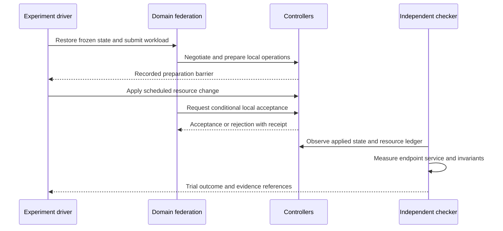

# Experimental validation plan

**Project:** Federated AI DSO orchestration across independently controlled packet–optical networks.
**Target:** Elsevier *Computer Networks* journal paper.
**Plan date:** 17 September 2026.
**Status:** Proposed validation protocol. No experiment, measured result, or proven guarantee is asserted by this document.

This plan specifies the testbed, experimental controls, procedures, measurements,
analysis, and artifacts needed to evaluate the
[system architecture](domain-agent-architecture.md). It implements the research
priorities in the [roadmap](implementation-roadmap.md#journal-evaluation-plan)
and addresses the [coordination vulnerabilities](system-overview.md#vulnerabilities-and-coordination-limitations).
The [literature review](related-work-and-novelty.md) supplies the prior-work
comparison; experimental success alone does not establish novelty.

The architecture has 57 named workflow nodes, including three conditional
generative-LLM nodes. Experiments exercise observable service behavior and
protocol properties, rather than treating node count or successful graph
execution as an outcome. This document does not request implementation of the
testbed during the architecture-design session.

## 1. Research questions and claims

| ID | Research question | Evidence required | Claim boundary |
| --- | --- | --- | --- |
| RQ1 | Can independent packet and optical owners establish and maintain an end-to-end service through the proposed agreement/execution protocol? | Executable service provisioning, admission, recovery, and resource-release trials. | A successful tool call or simulated graph path alone is insufficient. |
| RQ2 | Does binding agreements to evidence and controller conditions improve behavior under changing state and partial failure? | Matched protocol ablations, controlled state-change races, independent transaction checks, and service outcomes. | Existing reservations and consistency mechanisms are prior art; identify the additional mechanism precisely. |
| RQ3 | What value do grounded, selectively invoked LLM nodes add? | The same federation without LLM calls; retrieval and reasoning ablations; quality, latency, and cost. | Improvements caused by controller checks must not be attributed to the model. |
| RQ4 | Can concurrent domain assurance loops coordinate without conflicting service changes? | Simultaneous incidents, stale coordinator requests, partitions, and restart experiments. | A lease alone is not proof of exclusion; progress is conditional on the failure model. |
| RQ5 | What are the performance and scaling costs of federation? | Load/domain-size sweeps, matched centralized or established distributed baseline, signaling/storage/compute measurements. | Three domains establish the core use case, not Internet-scale behavior. |
| RQ6 | Do bargaining, swarm search, or learning provide additional value? | Separate comparisons with simpler methods under matched inputs and budgets. | These are conditional extensions; omit unsupported algorithmic superiority claims. |

State the primary hypothesis and practically meaningful effect size before
confirmatory runs. For example: the proposed protocol reduces invalid resource
activations under the specified race workload, with a measured provisioning-time
trade-off. Do not predetermine that all performance metrics improve.

### 1.1 Required versus conditional scope

**Core:** E01–E18 cover domain isolation, topology, feasibility, provisioning,
agreement, concurrency, stale state, transport faults, partial execution,
persistence, assurance, conservative coordination, partitions, retrieval, LLM
effects, operating load, adapter semantics, and invalid evidence.

**Conditional:** E19–E24 are required only when the corresponding claim is made:
economic superiority, swarm benefit, continual learning, dependency-scoped
invalidation, automatic coordinator failover, or transfer to larger/hardware
deployments. Basic bargaining validity is still core, even if comparative
economic optimization is deferred.

A core run may correctly defer an operation or return `UNRESOLVED` when the
fault prevents safe completion. Report that result as reduced availability or
incomplete recovery; do not count it as successful service delivery.

### 1.2 Publication scope profiles

| Profile | Required capability | Permitted interpretation |
| --- | --- | --- |
| P0: protocol simulator | Fake controllers, explicit state machines, resource and fault models. | Validate protocol logic within the model. No measured physical packet/optical service claim. |
| P1: executable packet PoC with modeled optical transport | Packet forwarding/probes, controller-backed mutations, optical resource/QoT model, mapped optical changes affecting the forwarding path. | Measured emulated packet behavior with explicitly modeled optical feasibility. Recommended first paper profile. |
| P2: controller or optical hardware extension | Selected actual controller/device operations and calibrated observations. | Hardware/controller-specific findings only for the exercised capabilities. |

Report results by profile. Do not pool synthetic controller timing with hardware
timing. If only P0 is implemented, describe a simulation study and narrow claims
accordingly. P2 is an extension, not an invented journal requirement.

## 2. Freeze the experimental contract

Before collecting the final dataset, freeze and version:

1. Hypotheses, primary endpoints, comparison methods, effect sizes, and stopping rules.
2. Topologies, resource models, packet/optical mapping, controller capabilities, and workload generators.
3. Intent schema, QoS measurement definitions, utility units, admission policy, and participant-selection rules.
4. State-transition rules, dependency checks, reservation semantics, epoch rules, clock assumptions, retries, and timeouts.
5. Model identifiers, prompts, tool schemas, retrieval corpus/index versions, context budgets, and fallback policy.
6. Fault schedules, pseudorandom seeds, independent checker definitions, and exclusion criteria.
7. Software/container versions, machine resources, orchestration placement, and instrumentation overhead.

Pilot runs may change these choices. Changes after the freeze create a new
experiment version and require rerunning affected comparisons; retain previous
results and the reason for the change. Do not tune on the held-out test traces.

The initial trust profile is fixed, authenticated, cooperating operators with
independent credentials and policies. Messages can be delayed, reordered,
duplicated, or lost; processes can restart. Signatures do not prove truthful
telemetry or economic reporting. Byzantine agreement, topology confidentiality
from authorized peers, and strategy-proof bargaining are outside this profile.

## 3. Testbed and independent measurement

### 3.1 Domain deployment

Deploy three separate domain stacks: Packet A, Optical O, and Packet B. Each has
its own DSO process, PostgreSQL/pgvector database, Neo4j projection, A2A identity,
MCP credentials, controller adapter, and telemetry scope. Separate containers,
VMs, or hosts are acceptable if the isolation and shared-host limitations are
reported. Administrative separation in the lab does not imply three real operators.

The experimental driver can submit intents, schedule faults, collect evidence,
and reset fixtures. It must not select service paths, supply hidden network
truth to an agent, decide bargaining outcomes, or repair the service during a
measured trial. Its global visibility is measurement instrumentation, not a
runtime central orchestrator.


Keep control-plane transport independent of data-plane service traffic unless
an experiment explicitly tests their shared failure. Otherwise a simulated
optical cut could accidentally disconnect every controller and confound recovery.

### 3.2 Reference topology

Use an explicit manifest rather than a hand-drawn diagram as the source for
experiment construction. A proposed small reference topology is:

| Domain | Resources | Alternatives and dependencies |
| --- | --- | --- |
| Packet A | Six forwarding nodes A1–A6; at least two attached traffic endpoints. | Paths A1–A2–A4–A6 and A1–A3–A5–A6; A6 is an optical attachment. Add shared-link variants separately. |
| Optical O | Six optical switching nodes O1–O6, endpoint transponder resources, spectrum slots, and impairment parameters. | Routes O1–O2–O3–O6 and O1–O4–O5–O6. Explicitly identify shared fibers, transponders, and shared-risk groups. |
| Packet B | Six forwarding nodes B1–B6; at least two attached endpoints. | Paths B1–B2–B4–B6 and B1–B3–B5–B6; B1 is an optical attachment. |
| Handoffs | A6–O1 and O6–B1 with typed endpoint ownership. | Model encapsulation, MTU, port capacity, direction, and client/line adaptation. |

This example has 18 forwarding/optical switching nodes, excluding servers and
separately modeled transponders. Preserve exact counts in the manifest. A
topological alternate sharing the failed transponder is not a valid protected
path; include this negative case.

For the larger-domain extension, use chains and meshes with variable participating
path lengths. Include unrelated domains so approval scope and topology-replication
overhead can be measured independently. Do not change topology family and domain
count simultaneously without recording the confounding change.

### 3.3 Packet and optical fidelity

Packet experiments must apply actual forwarding/QoS changes in the emulated or
physical data plane and use endpoint traffic. A controller returning a success
object without altering traffic behavior only qualifies as P0.

For optical experiments, distinguish:

- **Resource feasibility:** path continuity, spectrum contiguity/continuity,
  guard bands, supported conversion/regeneration points, compatible endpoints,
  transponders, and directional capacity.
- **Physical feasibility:** the impairments and QoT thresholds actually modeled
  or measured. Record span parameters, amplifiers, launch-power assumptions,
  channel loading, modulation/reach constraints, and margin conventions.
- **Enforcement:** how a selected lightpath changes the transport carrying packet
  traffic. Record circuit-to-packet-link mappings and update delays.

A possible physical-model backend is the
[GNPy optical route planning library](https://gnpy.readthedocs.io/en/master/).
Pin the release and equipment/topology inputs. Calibrate against reference cases
or measurements where available; agreement between two calls to the same model
is not independent physical validation. A synthetic QoT threshold fixture is
useful for a boundary test but must not be labeled measured optical performance.

Choose optical line rates from the modeled equipment profile. Lower-rate packet
clients may share a higher-rate optical circuit: account for both client bandwidth
and line/spectrum occupancy. If packet traffic is rate-scaled for host capacity,
publish the scale factor and mapping. Do not scale optical physics or claim
line-rate throughput from a lower-rate emulator.

### 3.4 Independent checkers

| Checker | Evidence it uses | Independence requirement |
| --- | --- | --- |
| Authorization checker | Signed contract, participant identities, local policy version, operation audit. | Evaluate expected authorization separately from the DSO decision result. |
| Resource checker | Authoritative controller snapshots, reservation ledger, applied operations. | Detect double allocations and leaks without trusting the agent's service label. |
| Feasibility reference | Exhaustive enumeration or exact constrained solver on small instances; validated reference optical cases. | Use a separately reviewed formulation, not the same planner function twice. State remaining model dependence. |
| Service checker | Source/destination probes and traffic captures. | Independent of local `verify_change` responses and model explanations. |
| Protocol checker | Event trace, revisions, epochs, receipts, fault schedule. | Check invariants against a published state machine. |
| Retrieval/diagnosis checker | Curated evidence IDs, dependency sets, fault ground truth, and blinded expert labels where needed. | Do not use majority LLM agreement as ground truth. |

For large workloads without an exact feasibility oracle, use known constructed
cases or report admission outcomes without calling every rejection incorrect.
Oracle disagreement must be investigated and reported rather than silently
resolved in favor of the proposed method.

## 4. Workloads and parameter sweeps

The values below are **initial pilot settings**, not requirements imposed by the
journal or claims about deployed networks. Adjust to verified testbed capacity,
then freeze them consistently across methods.

### 4.1 Service requests

Use structured canonical intent; natural-language translation is outside the
current three LLM nodes. Each intent specifies endpoints, participant/path
eligibility, bandwidth, delay metric and limit, loss metric and limit, service
lifetime, provisioning deadline, tenant policy, price ceiling, and currency.
Record whether QoS targets apply per direction or bidirectionally.

Suggested executable packet clients request 100, 250, or 500 Mbit/s on a lab
profile with 1 Gbit/s packet links, subject to calibration. Use relaxed, tight-but-
feasible, and impossible latency/budget cases derived from the independently
computed topology floor. For example, define delay limits relative to the
unloaded path delay rather than inventing a universally feasible 10 ms limit.

Use three workload sets:

| Set | Construction | Purpose |
| --- | --- | --- |
| W1: controlled cases | One service or a known small set; exact feasibility and expected outcome. | Correctness and fault attribution. |
| W2: synthetic demand | Seeded endpoint selection, request classes, interarrival/holding times, and external traffic. | Throughput, blocking, concurrent intent, and cost comparisons. |
| W3: held-out stress | Different topology seeds, demand bursts, fault placements, and evidence combinations from development. | Generalization and robustness. |

Include feasible requests, infeasible resource requests, policy refusals, exhausted
budgets, and conflicting simultaneous intents. A proposed diagnostic mix is
60/20/10/10 percent feasible/resource-infeasible/policy-refused/budget-infeasible
cases, with each label independently constructed. Evaluate a separate predominantly
feasible workload for throughput; a synthetic mix is not a claim about real demand.

For W2, begin with Poisson arrivals and exponential holding times as a controlled
model, then add bursty arrivals and longer-lived services to test sensitivity.
Report requested bandwidth-time and an explicitly defined offered-load measure
against the same reference capacity. Distinguish scheduled exogenous load from
achieved utilization: methods that reject requests will realize different load.

### 4.2 Proposed sweep grid

| Factor | Pilot values or construction | Use |
| --- | --- | --- |
| Domains | 3 core; 5, 10, 20 only for E24 scale extension. | Federation overhead and participating-path length. |
| Nodes per packet domain | 6 reference; 12 and 24 generated variants. | Graph/query/candidate cost without changing owner count. |
| Concurrent in-flight intents | 1, 5, 10, 25, 50, subject to measured host limits. | Contention and saturation; distinguish live services from pending requests. |
| Offered load | Approximately 25%, 50%, 75%, 90%, and overload of the defined reference capacity. | Admission/assurance trade-offs. |
| Added A2A one-way delay | 0, 10, 50, 100 ms plus a separately defined jitter distribution. | Negotiation and replica lag; report actual observed delay. |
| Message loss/duplication | 0%, 1%, 5% seeded random faults plus exact targeted drops. | Transport robustness; separate packet loss from application-message faults. |
| Projection/advertisement delay | 0, 0.5, 2, 5 s or equivalent multiples of the telemetry interval. | Stale evidence and unnecessary retries. |
| State-change timing | Before offer, after acceptance, after preparation, immediately before local acceptance, after application. | Dependency validity and recovery. |
| Failure duration | Shorter than, near, and longer than reservation/coordination expiry. | Boundary behavior rather than arbitrary timing only. |
| Optical margin | Valid reference cases well above, near, and below the configured threshold. | QoT admission and repair; report actual model units and uncertainty. |
| Context budget | For example 2k, 4k, 8k input tokens if supported by all compared methods. | Grounding efficiency; reserve identical output allowance. |

Do not run the full Cartesian product. First validate W1 cases, then run matched
single-factor sweeps, then preselect important interactions: load × stale state,
partition × expiry, concurrency × recovery, and context freshness × LLM use.
Document which cells were run and why. Any reduced/fractional design must retain
the contrasts needed for its claim.

### 4.3 Timing and traffic calibration

Measure a controller-only reference path before agent comparisons. Establish
host throughput limits, unloaded delay, probe overhead, controller application
latency, telemetry sampling delay, and clock error. Pin CPU/memory allocations
and record co-tenancy, database cache state, and network shaping.

Pilot values can use one-second telemetry sampling and ten-second verification
windows. The final window, probe rate, packet size, and stable-window count must
support the requested precision. A loss target of 0.0001 cannot be convincingly
certified from a handful of packets or a short zero-loss observation.

Select reservation and request deadlines from calibration and service requirements,
not to favor one method. Compare methods first under identical deadlines, then
report any separately tuned variants. A late result remains a deadline miss.

## 5. Systems and baselines

| ID | Definition | What it isolates |
| --- | --- | --- |
| B0 | Proposed federated protocol with selective LLM reasoning and grounded RAG/GraphRAG; fixed learning and conventional path search initially. | Reference system under study. |
| B1 | B0 with all three generative LLM nodes disabled and documented deterministic fallbacks. Same topology, retrieval access, protocol, candidates, tools, and policy. | Incremental value and cost of LLM assistance. |
| B2 | Central ACTN-style orchestration with the same resources, adapters, feasibility rules, controller guards, and service constraints. | Coordination placement. The central coordinator requests local actions; domain controllers retain their authorization checks. |
| B3 | A specified existing distributed orchestration implementation or clearly labeled adaptation from the related-work review. | Comparison with prior distributed approaches. Publish any changed assumptions or omitted features. |
| B4 | Conventional multi-agent LLM workflow using the same models, tools, authorized evidence, and action gates, with a matched budget. | Selective reasoning/workflow structure. Do not create a deliberately unsafe straw baseline. |
| O1 | Exact or exhaustive offline solution on tractable static instances. | Feasibility/selection reference, not a deployable online competitor or timing baseline. |

B0 versus B1 is required for an AI-contribution claim. Include B2 or a suitable
B3 as the main architecture comparison; use both where feasible. B4 is needed
if claiming superiority to more general agentic orchestration. Document the
actual feature matrix so a baseline is not credited with functionality it lacks.

### 5.1 Controlled ablations

| ID | Change from the appropriate matched reference |
| --- | --- |
| A1 | Document RAG only; graph facts still available to non-LLM feasibility checks. |
| A2 | Graph context without additional revision/freshness filtering; retain local controller guards. |
| A3 | Fixed structured context versus dynamically retrieved context under the same token limit. |
| A4 | Conventional read-then-write controller adapter versus conditional acceptance, only in an isolated fault-injection testbed. Label this a mechanism ablation, not a safe deployment baseline. |
| A5 | Whole-graph invalidation versus verified dependency-scoped invalidation; E22 only. |
| A6 | Enable each of the three LLM nodes separately; learning stays off unless E21 is being studied. |
| A7 | Greedy/fixed-price selection versus weighted Nash on the same feasible candidate set. |
| A8 | K-shortest/constraint search versus ACO with the same feasibility checker and compute budget. |
| A9 | Frozen knowledge/parameters versus evaluated memory or learning releases. |

For the main stale-state analysis, cross LLM enabled/disabled with controller
preconditions enabled/disabled in P0 or isolated P1. This separates model effects,
protocol effects, and their interaction. Do not remove domain authorization to
make an ablation fail. Run intentionally weakened mechanisms only on disposable
lab resources, and restore the reference configuration between trials.

Use matched evidence arrival traces when isolating decision logic. In natural
deployment comparisons, allow architecture-induced propagation differences but
measure them explicitly. A centralized baseline must not receive hidden perfect
state while the federation receives delayed advertisements, unless that difference
is the declared experimental variable.

## 6. Instrumentation, outcomes, and metrics

### 6.1 Required event record

Every trace event records run/scenario/variant IDs, domain, service/correlation
ID, intent and contract revisions, candidate digest, dependency revisions,
operation ID and idempotency key, coordination epoch, actor identity, event type,
result, and evidence references. Include controller acceptance/application times,
reservation expiry, retry count, queue duration, and fault-injection marker.

Use monotonic clocks for durations within one process or host; record clock
calibration and uncertainty for cross-host ordering. Prefer an experiment-driver
clock for submission-to-observed-completion time. Sequence/cause IDs supplement
timestamps; wall-clock sorting alone must not decide whether an operation was
authorized before a fault.

Record LLM node, model/version, prompt/template hash, context IDs and token count,
decoding settings, output, validation result, latency, retries, and usage charges.
Record embedding/index versions and retrieval timings separately. Store artifacts
locally without credentials; secret removal must not discard relevant outcomes.

### 6.2 Outcome vocabulary

| Outcome | Meaning |
| --- | --- |
| `VERIFIED` | All required service checks pass within the contract deadline and defined observation window. |
| `REJECTED_VALIDLY` | An independently supported policy, feasibility, or budget reason prevents admission. |
| `REJECTED_FEASIBLE` | A reference-supported feasible admissible case was rejected; investigate algorithm limits. |
| `DEFERRED` | Required evidence/approval is unavailable; no successful establishment is claimed. |
| `DEADLINE_MISS` | Requested service or recovery did not meet the specified deadline, including late eventual success. |
| `PARTIAL` | Only part of the intended multi-domain change is applied. |
| `COMPENSATED` | The specified compensating outcome is independently confirmed. This is recovery from failed establishment, not successful delivery of the requested service. |
| `UNRESOLVED` | Application or compensation state remains uncertain at the observation horizon. |
| `INVARIANT_VIOLATION` | An independently checked protocol/property violation occurred, even if the service later works. |
| `HARNESS_INVALID` | Predefined experiment-driver/probe failure makes the trial uninterpretable; preserve and disclose it. System/model failures are not harness failures. |

Separate event-level states from trial outcomes. A trial can have a partial
state followed by compensation and still count as failed establishment. Preserve
the full trajectory and report the terminal classification and deadline status.

### 6.3 Metric definitions

| Metric | Operational definition |
| --- | --- |
| Offered-request success | Requests verified within deadline divided by all offered requests; stratify infeasible/policy-negative cases. |
| Feasible-request success | Verified requests divided by independently labeled feasible, authorized, budget-admissible requests. For unlabeled contention traces, omit this denominator or publish the oracle definition. |
| Admission correctness | Valid accepts, valid rejects, false accepts, and false rejects against reference labels; report the confusion matrix. |
| Provisioning time | From intent reception at the nominated ingress to independent end-to-end verification completion. Separate queue, planning, negotiation, reservation, application, and observation time. |
| Detection time | From the known fault taking effect to the first correct incident detection. |
| Recovery time | From fault effect to the first completed sustained healthy observation interval, using a preregistered number of windows. Also report detection-to-recovery. |
| SLA violation duration | Integral of the observed noncompliance indicator over the service interval. Report unobserved time separately and a conservative bound; missing probes are not healthy samples. |
| Goodput | Delivered application payload bits per measurement interval at the receiver; distinguish requested rate, offered traffic, wire rate, and payload overhead. |
| Delay/loss | Explicit direction, packet type/size, sampling method, loss timeout, observation window, and delay statistic. Report one-way delay only with bounded clock error; do not substitute RTT/2 silently. |
| Invalid-operation rate | Operations accepted despite violated declared preconditions divided by fault-targeted eligible operations; also publish absolute counts and violation type. |
| Duplicate effects | Additional actual side effects for an already processed operation key. Repeated messages with one effect are not duplicates of execution. |
| Reservation leak | Resource remaining held beyond its defined release/expiry/reconciliation deadline, accounting for legitimate committed allocations. |
| Coordination conflict | Incompatible operations accepted under overlapping unauthorized coordination authority; count proposals rejected by fencing separately. |
| Convergence | After the last relevant source update, time until all required reachable replicas materialize that source revision; measure per-origin lag under continuous updates. |
| Cost/utility | Recorded resource/energy/risk model units, quoted settlement, disclosed gains above disagreement, and budget adherence. Report costs for failed attempts too. |
| Overhead | A2A messages/bytes including retries, MCP calls, graph queries, storage, CPU/memory, queueing, model calls/tokens, and per-attempt/per-success cost. |
| Unaffected-service regression | Previously healthy control services that degrade beyond the defined tolerance during another service's provisioning or repair. |

Use [RFC 7679](https://www.rfc-editor.org/rfc/rfc7679.html) for one-way delay
measurement considerations and [RFC 7680](https://www.rfc-editor.org/rfc/rfc7680.html)
for one-way loss definitions. Publish clock and observation uncertainty. If the
testbed only measures RTT, define an RTT objective rather than claiming one-way
latency compliance. Per-domain latency budgets can be added as bounds; measured
percentiles cannot generally be added to obtain an end-to-end percentile.

For loss samples, state the denominator and late-packet classification. Report
delay of received packets together with loss; a method that drops slow packets
must not appear better merely through a lower delivered-packet delay percentile.
Finite measurement windows do not establish long-term availability guarantees.

For optional Nash comparisons, define `g_i = U_i - d_i` and report each domain's
gain plus `sum_i w_i log(g_i)` only when every gain is positive. Utility scales,
weights, and disagreement values are fixed across compared methods. A fairness
index, if used, must name its input and normalization; it does not prove strategic
fairness or truthful reporting. Exact optimality gaps must state the objective,
candidate universe, solver status, and bound; report score differences rather
than misleading percentage gaps for negative log objectives.

### 6.4 Acceptance properties

The following are target invariants, each evaluated against its explicit scope:

| ID | Property |
| --- | --- |
| I1 | A local configuration mutation requires that owner's authorization for the exact operation. |
| I2 | A new shared-service activation requires matching acceptance and valid preparation/reservation evidence from every affected owner. |
| I3 | Conditional local acceptance rejects violated resource/configuration preconditions and superseded authority installed at that controller. |
| I4 | Replaying an operation key does not repeat its effect; a different payload cannot reuse the key. |
| I5 | Reservations and applied allocations respect the declared capacity/conflict policy, including concurrent requests. |
| I6 | A service is not reported verified without its required independent observations; unknown or partial outcomes remain visible. |
| I7 | Replica ingestion preserves owner authority, version order, deletion, and access restrictions. |
| I8 | Model/retrieval output cannot bypass a deterministic gate or invoke an unauthorized controller mutation. |
| I9 | Recovery retains durable unresolved work and follows the specified compensation/coordination rules. |

An observed invariant violation blocks the corresponding claim until corrected
and the affected suite rerun. Zero observed violations is necessary experimental
evidence, not a proof. Performance improvements are judged separately and must
include their costs and failed cases.

## 7. Common execution procedure

Apply this procedure to every experiment below unless a stated variant overrides it:

1. Select the frozen manifest, variant, topology, workload trace, and seed tuple.
2. Reset durable service/reservation state and model memory to the prescribed
   snapshot. Restore forwarding and optical inventory. Verify no resource leaks.
3. Start probes, trace collection, and independent checkers before the workload.
4. Warm up only for the preregistered interval. Establish control services where
   required. Verify the setup predicates; a failed setup is logged, not hidden.
5. Submit the same exogenous intent/traffic trace to each matched method. Inject
   faults using event barriers for protocol races or a common time schedule for
   realistic dynamics. Identify which method each comparison uses.
6. Let the system act without manual repair. Capture both proposed and accepted
   controller changes, including all retries and LLM fallbacks.
7. Observe through the service deadline and fixed post-fault recovery horizon.
   Continue a separately marked cleanup phase if necessary; it does not erase
   measured failure or extend a method's deadline retroactively.
8. Run independent checks, assign outcome labels, calculate metrics, and preserve
   raw records. Check unaffected services and resource conservation.
9. Reset, verify cleanup, and run the paired variant in randomized order. Report
   any cache carryover or provider-side effects that cannot be reset.

For a protocol-triggered fault, publish the trigger, such as “after the optical
preparation receipt is durable and before local commit acceptance,” rather than
relying on sleep duration. If a method never reaches the trigger, report trigger
coverage and its terminal outcome; do not silently remove it from the comparison.



## 8. Detailed experiment catalogue

Every experiment records the common manifest and trace fields above. Each
procedure below specifies additional setup, stimuli, independent expectations,
and analysis. A negative result is a research outcome; it must not be replaced
by an easier scenario after examining the final test results.

### E01 — Domain authority, identities, and controller boundaries

**Scope:** Core; RQ1; I1, I2, I8.

**Setup:** Three domain stacks with distinct identities and policies. Construct
one valid local request, one user outside its endpoint scope, one peer request
for another domain's MCP mutation, and requests with invalid/expired signatures
or mismatched contract/candidate identifiers. Use lab credentials and canary
resources only.

**Procedure:** Submit each case through the documented ingress. Repeat after
policy revocation and after controller restart. Attempt an otherwise valid
mutation whose owner has not accepted the contract. Inspect controller state and
audit records, not only HTTP/MCP response codes.

**Expected:** Valid cases proceed through the intended gates; unauthorized cases
produce no unauthorized side effect. The owner can reject a request even if all
other DSOs approve. The LLM cannot grant missing authority.

**Measure/report:** Authorization confusion matrix, rejected request counts,
unexpected controller effects, decision latency, and the exact identity/policy
combination. Any unauthorized accepted mutation violates the core property.

### E02 — Topology handshake, replication, and graph integrity

**Scope:** Core; RQ1, RQ2; I7.

**Setup:** A known graph manifest with per-owner revision streams. Start one
DSO with an empty replica and another with an older snapshot.

**Procedure:** Synchronize snapshots, then add/update/delete nodes, links,
attachments, and configurations. Deliver duplicates and out-of-order deltas;
drop an update; delay Neo4j materialization; restart an owner without permitting
revision rollback. Introduce a wrong-owner update and conflicting advertisements
for the two ends of a domain handoff. Restore communication and request missing
state. Replay an old record after its tombstone.

**Expected:** Only authorized ordered records are materialized; deleted resources
do not silently reappear. Inconsistent handoffs are unavailable for planning until
resolved. A required stale projection is rejected or refreshed. After the final
update and restored delivery, replicas converge to the independently known state.

**Measure/report:** Correctness of entity/relationship sets, per-origin lag,
convergence time, resynchronization bytes, projection lag, stale-read handling,
and affected-service invalidations. Full-graph equality at one time is not proof
of future freshness.

### E03 — Intent semantics, QoS composition, and physical feasibility

**Scope:** Core; RQ1; I1, I5, I6.

**Setup:** A labeled library of feasible and infeasible structured intents. Include
unit mismatches, invalid endpoints, asymmetric paths, insufficient bandwidth,
unsupported encapsulation/MTU, optical spectrum fragmentation, unavailable
transponders, and above/below-threshold QoT reference cases.

**Procedure:** Validate and normalize each intent, enumerate small-instance
reference allocations, and compare agent candidates and controller checks with
the reference. Exercise values just below, at, and above each configured limit,
with explicitly documented numeric tolerance. Test that an apparently disjoint
route sharing the failed resource is rejected as a protection alternative.

**Expected:** No graph-only candidate bypasses required physical/resource checks.
Delay definitions and bandwidth units remain consistent across domains. The
prototype does not silently relax an impossible user objective or count arbitrary
text as a validated structured intent.

**Measure/report:** False feasible/infeasible classifications by constraint,
candidate-set coverage, solver status, numeric tolerances, and unsupported model
features. Report correlated failure assumptions; do not multiply availability
probabilities without justification.

### E04 — Provisioning, sustained service, modification, and teardown

**Scope:** Core; RQ1, RQ5; I1–I6, I9.

**Setup:** Healthy reference topology and enough resources. Use W1 first, then
multiple service classes in W2. Test intent ingress from each permitted domain,
including endpoint attachment on an optical-domain client only if modeled.

**Procedure:** Establish the service, verify the realized path and QoS, and run
traffic for its declared observation interval. Modify bandwidth or policy using
a new contract revision; release the service or let its lifetime expire. Repeat
the same request ID to test request deduplication, and submit a genuinely new
request with similar content to verify it is not accidentally deduplicated.

**Expected:** Each accepted lifecycle change has attributable local operations,
matching receipts, and independent verification. Teardown removes only the
service's resources; shared transport allocations remain while other services
legitimately use them. Untouched services remain within their contract.

**Measure/report:** Lifecycle success, provisioning/modification/release time,
goodput, delay, loss, resource use before/after, and CPU/signaling/model cost.
Show at least one complete trace and aggregate repeated results. A single trace
is an illustration, not the statistical sample.

### E05 — Bargaining validity, owner veto, and participant scope

**Scope:** Core; RQ1; I1, I2, I5.

**Setup:** Known candidate set with fixed costs, disclosed gains, budgets,
disagreement utilities, and weights. Include positive gains for all, a zero or
negative gain for one domain, no budget-feasible contract, and tied scores.

**Procedure:** Submit offers/counteroffers, reject from each domain in turn, and
deliver expired or mismatched acceptances. Recreate the two-packet-domains-approve,
optical-domain-refuses example. Repeat with a different participating subset in
a fixture with an unrelated domain or a domain-local request. Alter an offered
allocation after signatures have been collected.

**Expected:** Every affected owner accepts the exact allocation before activation.
Unrelated owners have no veto. A two-out-of-three approval cannot authorize the
optical resources. The agreed numerical objective and tie-break are reproducible;
no positive-gain candidate means no Nash agreement under the stated rule.

**Measure/report:** Correct agreements/rejections, participant-set correctness,
budget adherence, rounds, expiry rate, and information disclosed. Prices/gains
are attributed reports; this test does not establish honest strategic behavior.

### E06 — Concurrent intents and atomic resource reservation

**Scope:** Core; RQ1, RQ2; I2–I5, I9.

**Setup:** A bottleneck with enough capacity for one of two conflicting requests,
plus compatible requests using distinct resources. Repeat for packet queues,
optical spectrum/transponders, and a shared physical-risk resource where relevant.

**Procedure:** Release requests at a common barrier from different ingress DSOs.
Pause them after reading the same free-capacity snapshot, then allow both to
reserve. Sweep concurrency and ordering. Retry a timed-out reservation with its
original key; attempt reuse of that key with a different allocation. Release the
winner and test progress of a later request.

**Expected:** Local reservation acceptance serializes conflicting allocations
according to the specified resource policy. Both requests cannot consume the same
exclusive resource. Compatible requests need not block each other unnecessarily.
Losers release provisional holds and terminate or retry within their contract.

**Measure/report:** Over-allocation, leaked holds, admission fairness by ingress,
starvation, queue time, completion rate, and controller contention. This is a
resource-concurrency test, not evidence of fairness for every workload.

### E07 — State changes between reasoning and execution

**Scope:** Core; RQ2, RQ3; I2–I6, I8.

**Setup:** A feasible agreed service depending on an optical resource at revision
418. Enable deterministic hooks after retrieval, offer acceptance, preparation,
DSO authorization, and immediately before controller acceptance.

**Procedure:** At each hook, change a required resource/configuration condition
to revision 419 while delaying the advertisement to another DSO. Attempt the old
operation. Repeat for an unrelated graph change and for the contract's own expected
reservation/application transitions. Cross B0/B1 with conditional acceptance
enabled/disabled; label the disabled variant A4. Repeat with both fresh and delayed
GraphRAG projections.

**Expected:** Required invalid conditions are rejected at local acceptance even
when the LLM or initiating DSO has obsolete information. Valid protected conditions
and explicitly authorized self-transitions are handled according to the contract,
without endless self-invalidation. Whole-graph checks may conservatively restart
after unrelated changes; report this cost.

**Measure/report:** Invalid acceptances, rejected stale attempts, unnecessary
renegotiation, time to a new valid agreement, service disruption, and model calls.
Attribute protection to the guard if it also works without the LLM. Preserve
cases where late physical failure occurs after valid acceptance; they are a
different problem from accepting already-invalid conditions.

### E08 — Message faults, expiry, and replay

**Scope:** Core; RQ2; I2–I4, I9.

**Setup:** A2A/MCP transport proxies or equivalent controlled failure hooks. Define
faults at application-message and underlying transport layers separately.

**Procedure:** Drop or duplicate offers, acceptances, reservation summaries,
commit requests, and acknowledgements individually; then use seeded random delay,
loss, and reordering. Deliver stale messages after a newer contract or an expiry.
Test boundary times on either side of reservation validity and the allowed clock
error. Keep a targeted “accepted request, lost reply” case distinct from “request
never arrived.”

**Expected:** Deduplication and operation keys preserve one intended effect.
Expired or mismatched approvals cannot be assembled into a current barrier.
Unknown mutations are queried/reconciled, and missing acknowledgements never
become implicit consent. Deadlines bound retries and resource holding.

**Measure/report:** Event-delivery attempts, duplicate actual effects, expiry
handling, unresolved outcomes, retry overhead, and eventual progress after
communication restoration. Do not assume exactly-once message delivery.

### E09 — Partial commit, failed compensation, and uncertain application

**Scope:** Core; RQ2; I1–I6, I9.

**Setup:** All participants have agreed and prepared. Use each domain as the
failing participant in separate trials; rotate the order of local application.

**Procedure:** Apply one segment, fail another before application, and observe
the aggregate state. Repeat with a controller that applies the change but loses
its receipt response, a delayed application after timeout, and compensation
that fails or becomes invalid after a subsequent resource change. Restart the
DSO while recovery is pending. Protect a pre-existing control service throughout.

**Expected:** Partial application is never reported as verified end-to-end service.
The recovery path queries actual state and attempts only permitted compensation.
An operation already accepted under an old epoch is reconciled; installing a
new epoch does not magically undo it. Unrecoverable cases remain visible and
retain durable reconciliation tasks.

**Measure/report:** Time in partial state, packet disruption, resource leaks,
compensation attempts/success, unresolved counts, and unaffected-service damage.
Successful compensation is a recovery result, not proof of atomic activation.

### E10 — Process, database, and projection failure

**Scope:** Core; RQ1, RQ2; I3–I7, I9.

**Setup:** Persistent stores and explicit write/send boundaries. Establish known
service, reservation, inbox/outbox, and projection states.

**Procedure:** Stop and restart a DSO after durable state write but before A2A
send, after receipt persistence but before acknowledgement, and during recovery.
Interrupt database access or the projection worker. Rebuild Neo4j from source
records. Test database restoration to a known snapshot only as a separately
labeled stale-recovery scenario; normal restart must not discard durable epochs.

**Expected:** Outbox/inbox replay does not duplicate controller effects; recovery
tasks and authority state survive supported restart. Store unavailability defers
dependent mutations rather than producing fabricated success. A reconstructed
graph must pass version/integrity checks before use.

**Measure/report:** Restart-to-ready time, lost or duplicate durable events,
reconciliation workload, projection catch-up, degraded service interval, and
control-plane availability. Separate storage-loss disasters from recoverable
process crashes; do not claim both from one restart test.

### E11 — Closed-loop packet and optical recovery

**Scope:** Core; RQ1, RQ3, RQ4; I1–I6, I8, I9.

**Setup:** Active measured services plus unaffected controls. Prepare a valid
alternative path and a separate case with no feasible recovery. Freeze existing
data-plane protection behavior so its effect can be separated from DSO action.

**Procedure:** Inject packet congestion, a packet link failure, optical capacity
withdrawal, or modeled/measured QoT degradation independently. Cross B0/B1 and the
main architecture baseline with the same fault and telemetry traces. Require
shared-service repairs to re-enter agreement/execution. Repeat near health
thresholds to exercise hysteresis and cooldown.

**Expected:** The loop diagnoses or falls back, finds only feasible repairs, and
verifies recovery. It reports a degraded/no-feasible-repair outcome when required.
Local protection acts only within its preauthorization. A repair must not silently
weaken the user's hard constraints or sacrifice an unrelated service.

**Measure/report:** Detection time, sustained recovery time, SLA violation duration,
oscillation/action counts, recovery quality, collateral effects, and model cost.
Show protocol recovery separately from any immediate fast reroute in the data plane.

### E12 — Concurrent incidents and conservative coordinator handling

**Scope:** Core; RQ4; I1–I4, I9. Automatic failover is E23.

**Setup:** Two or three DSOs receive evidence of the same shared-service failure.
Also create distinct incidents that share a constrained resource. Use the frozen
incident-correlation and coordination-grant rules.

**Procedure:** Vary alarm ordering and delay. Submit incompatible proposed repairs,
duplicate incident IDs, and delayed requests from a superseded epoch. Stop the
coordinator and deliver timeouts to peers. Test restart with the current durable
epoch and an explicitly rejected stale epoch.

**Expected:** Incident deduplication does not suppress distinct real faults.
Required approvals precede a shared mutation. Controllers reject superseded
authority they have installed. In the conservative profile, coordinator loss
defers a new shared change until authority and outstanding operations are resolved;
timeout alone does not elect an authorized replacement.

**Measure/report:** Conflicting accepted actions, duplicate repairs, incident
merge/split errors, waiting time, and deferred services. This core experiment
validates bounded behavior under coordinator loss, not automatic availability
through every partition.

### E13 — Partitions, delayed approval, and reconnection

**Scope:** Core; RQ2, RQ4; I1–I4, I7, I9.

**Setup:** Distinguish an A2A-only partition, an isolated controller, and a
data-plane cut. Keep the experiment driver and measurement path reachable.

**Procedure:** Partition before agreement, during reservation collection, after
one local application, and during an active service. Test asymmetric reachability
as well as complete peer isolation. Use durations below and above reservation/
coordination expiry. Restore communication while replaying delayed messages and
new topology revisions.

**Expected:** Peers do not convert missing consent into approval or remove an
unreachable resource owner from an existing contract to bypass it. Reconnection
causes reconciliation before new dependent changes. Existing traffic may continue
if the data plane is intact; monitoring and scoped protection remain distinct
from new shared-service authorization.

**Measure/report:** Deferred/rejected requests, service continuity, unresolved
transactions, stale-message rejection, resource cleanup, and convergence after
reconnection. Report the availability cost of waiting for required owners. A
safe deferral is not counted as successful provisioning or recovery.

### E14 — RAG, GraphRAG, and decision-context quality

**Scope:** Core for the retrieval contribution; RQ2, RQ3; I7, I8.

**Setup:** Versioned runbooks, policies, incident traces, and graph fixtures with
ground-truth evidence IDs and required dependency sets. Include relevant, irrelevant,
outdated, contradictory, missing, and unauthorized items. Hold out whole topology/
incident families, not just paraphrases of the same case.

**Procedure:** Evaluate A1–A3 and B0 under equal input/output budgets and the same
model. Ask bounded questions matching current nodes: affected services, evidence-
supported cause, candidate explanation, and ranking among supplied feasible
actions. First score retrieval independently of generation, then advisory output,
then end-to-end impact. Introduce graph-projection lag without changing the corpus.

**Expected:** Required facts are either retrieved with valid provenance or marked
unavailable; unauthorized/stale facts do not authorize action. Multi-hop graph
answers preserve direction, ownership, and service dependencies. The model cannot
invent a path outside the verified candidate set.

**Measure/report:** Evidence precision/recall at a stated retrieval budget,
required-dependency coverage, unauthorized/stale retrieval rate, citation validity,
unsupported claims, diagnosis/ranking quality, tokens, and latency. Have blinded
reviewers adjudicate ambiguous semantic answers with a published rubric; retain
disagreements. Better retrieval scores alone do not establish better service outcomes.

### E15 — Incremental LLM value, fallback, and cost

**Scope:** Core for the agentic contribution; RQ3; I1, I8.

**Setup:** Identical B0/B1 protocol, evidence, candidates, and controller limits.
Use ordinary cases and evidence-rich ambiguous cases specified before observing
model outputs. Keep learning frozen. Separate diagnosis from candidate-ranking
effects using A6.

**Procedure:** Run paired workloads with LLM enabled/disabled, then each permitted
reasoning node independently. Inject response timeout, provider error, malformed
schema, invented evidence/candidate IDs, and plausible but wrong advice. Record
whether downstream policy actually consumes the advice. Repeat stochastic model
calls within selected fixed scenarios to estimate output variability.

**Expected:** Invalid/unavailable advice follows the documented fallback and
cannot bypass gates. The loop may defer for missing required evidence; fallback
does not imply every service succeeds. If policy ignores all model rankings, no
allocation benefit may be attributed to ranking.

**Measure/report:** Paired differences in service completion, recovery time,
diagnostic correctness, rejected advice, calls/tokens/cost, and compute/queue
overhead. Report no benefit or a disadvantage if observed. Hosted pricing is
captured with date and billing units at run time; local inference reports hardware,
runtime, and energy assumptions separately. Include failed/retried calls in cost.

### E16 — Load, performance limits, and three-domain scalability

**Scope:** Core; RQ5; I3–I6.

**Setup:** Fixed three-owner topology with controlled packet-node-size variants.
Use a pinned machine allocation and W2 traces; hold retrieval/model parameters
constant. Include services retained long enough to create resource pressure.

**Procedure:** Sweep offered load and in-flight requests, first without faults,
then with a fixed rate of state changes. Run B0/B1 and B2 or B3. Increase load
until the declared limit or saturation; use a fixed-duration or fixed-arrival
open-loop workload so a slow method cannot hide load by generating fewer requests.
Separately measure cold start, warm steady state, and database/index growth.

**Expected:** Capacity conflicts remain correctly controlled under load, and
overload produces attributable rejection/backpressure rather than fabricated
success. No performance pass is presumed; identify the first saturated component.

**Measure/report:** Offered versus completed rate, deadline misses, success/blocking,
median/tail latency with sample counts, queue lengths, replica lag, CPU/memory,
storage, MCP/A2A overhead, and model quota effects. Latency among successes must
be accompanied by failure/deadline rates. E24 is required for larger federation claims.

### E17 — Controller semantics and heterogeneous adapters

**Scope:** Core for every adapter used; RQ1, RQ2; I1–I6, I9.

**Setup:** Capability profiles for the packet and optical controllers, including
conditional acceptance, protected reservation, apply/readback delay, transaction
query, compensation, and fencing support. Use deterministic fixtures to expose
each supported and unsupported behavior.

**Procedure:** Exercise the same service contract against adapters with immediate
versus asynchronous application, delayed readback, explicit rejection, unsupported
rollback, and conditional-update support. Separate the result for an atomic
check-and-accept primitive from an adapter that only performs read-then-write.
Inject a change at the primitive boundary as in E07.

**Expected:** The DSO distinguishes acknowledged, accepted, applied, and verified
states. Unsupported features lead to documented capability refusal or a declared
weaker profile, never an implied guarantee. Cross-domain handoff mismatches must
be caught before declaring end-to-end success.

**Measure/report:** Per-adapter semantic coverage, invalid transitions, application
and observation latency, unresolved operations, and supported recovery paths.
An MCP wrapper alone does not establish interoperability or transaction semantics.

### E18 — Invalid evidence and model-output containment

**Scope:** Core bounded negative tests; RQ2, RQ3; I1, I7, I8.

**Setup:** Authorized retrieval fixtures containing a misleading instruction,
incorrect graph reference, expired policy text, or wrong-unit telemetry. Add
tenant-scoped canary records that the requesting context must not receive. These
are controlled robustness cases, not an exhaustive adversarial security evaluation.

**Procedure:** Present the misleading material through its ordinary retrieval or
telemetry path. Feed invalid model outputs at the schema boundary. Attempt to
use a quoted runbook instruction as controller authority and to cite evidence
outside the assembled context. Inspect prompts, artifacts, policy decisions,
and actual controller effects.

**Expected:** Retrieved content is treated as evidence, not permission to change
the workflow or invoke tools. Access filters exclude unauthorized records, and
deterministic gates reject invalid actions even if an LLM recommends them.

**Measure/report:** Canary exposure, invalid action proposals, rejected proposals,
unauthorized effects, fallback results, and the exact tested surfaces. Passing
these fixtures does not establish general prompt-injection resistance, Byzantine
tolerance, or privacy of the deliberately shared topology.

### E19 — Economic allocation and bargaining quality

**Scope:** Conditional on an economic-improvement claim; RQ6. E05 remains mandatory.

**Setup:** Fixed feasible candidate sets with documented resource/cost units,
settlements, gains, positive weights, and disagreement values. Include symmetric
owners, scarce optical resources, unequal costs, budget pressure, and no mutually
beneficial contract.

**Procedure:** Compare fixed/greedy acceptance and weighted Nash selection on
identical candidates. Enumerate the objective optimum for small cases; use a
bounded solver for larger cases with reported status. Sweep bargaining weights,
scarcity, and utility normalization without allowing LLM-generated coefficients.
Repeat with noisy cost estimates as a sensitivity study, distinct from malicious
misreporting or mechanism-design analysis.

**Expected:** Every selected agreement remains feasible, authorized, within budget,
and individually rational under the declared rule. Weights and tie-breaks are
reproducible. No-agreement outcomes are retained rather than forcing a score for
zero/negative gains.

**Measure/report:** Per-domain utility gains, surplus distribution, price/resource
cost, blocking, score gap to the reference, negotiation rounds, and computation.
Do not claim Nash equilibrium, strategy-proofness, or fair commercial settlement
solely from the selected objective.

### E20 — Swarm search and path/resource candidate quality

**Scope:** Conditional on a swarm-benefit claim; RQ6.

**Setup:** Freeze utility selection and controller checks. Specify whether ACO
only ranks a fixed candidate pool or constructs new path/resource combinations.
If it only ranks a fixed pool, compare with direct scoring of that pool; do not
claim wider search coverage. Include sparse/dense and fragmented-spectrum fixtures.

**Procedure:** Compare constrained K-shortest search, a simple randomized search,
and ACO. Match wall-clock budget and also report candidate-evaluation counts;
hardware-dependent time and search effort are not interchangeable. Repeat ACO
seeds, colony sizes, iteration budgets, and quality-decay settings. After a topology
change, test stale pheromone invalidation. Use an exact small-instance reference.

**Expected:** Every returned candidate passes the same independent feasibility
checks. Stochastic exploration cannot widen the action allowlist or reuse an
invalid resource. Termination respects the service deadline.

**Measure/report:** Best feasible objective versus time, coverage/diversity,
optimality gap, time to first feasible option, variability, state/messaging cost,
and final service outcomes. PSO is a separate conditional sub-study only if a
clearly specified continuous decision variable is implemented.

### E21 — Continual learning and transfer of bounded releases

**Scope:** Conditional on a learning-benefit claim; RQ6; I1, I8, I9.

**Setup:** Separate training/development/held-out episodes by time, topology, and
incident family. Freeze a no-learning control. Distinguish retrieval of incident
memory, calibration updates, candidate-ranking changes, and model training as
different treatments. Use independent seeded learning histories across replicas.

**Procedure:** Replay terminal traces, propose/evaluate a release, and run it first
in shadow mode. Promote only through the documented L0/L1/L2 rule. Test stale,
revoked, out-of-scope, and insufficient-evidence releases; then introduce a held-out
distribution shift. Exchange signed peer releases and verify recipient-local
acceptance. Test that unresolved transactions do not become mislabeled successes
in the training data.

**Expected:** Promotion cannot weaken hard constraints, grant execution authority,
or write peer-owned state. Revocation restores the declared fallback. Test data
do not enter memory or tuning before their scheduled evaluation.

**Measure/report:** Prediction/calibration error, downstream service outcomes,
sample efficiency, regressions, adaptation time, release acceptance/revocation,
and training/retrieval cost. A distributed agent federation is not evidence of
federated model training.

### E22 — Whole-graph versus dependency-scoped invalidation

**Scope:** Conditional on a new dependency-validation mechanism; RQ2.

**Setup:** Identical controllers and agreement rules, differing only in the
decision validity scope. Independently label the full set of relevant resource,
configuration, shared-risk, policy, and handoff dependencies for each small case.

**Procedure:** Change a used resource, a shared dependency, an unrelated resource,
and an apparently unrelated node that changes a hidden shared constraint. Include
the contract's own expected reservation/application transitions. Sweep background
graph churn while holding affected dependencies fixed, then reverse the condition.

**Expected:** Dependency-scoped acceptance ignores only proven irrelevant changes.
Omitted dependencies must not permit invalid execution. Whole-graph invalidation
may reject more often but is evaluated fairly under the same workload. If dependency
closure cannot be established, retain conservative invalidation.

**Measure/report:** Necessary and unnecessary renegotiations, unsafe omissions,
completeness/size of dependency sets, query/validation cost, provisioning/recovery
time, and relative availability. The contribution requires both reduced unnecessary
work and validated dependency coverage, not just fewer rejected operations.

### E23 — Automatic coordinator replacement and replicated authority

**Scope:** Conditional on automatic failover or stronger coordination availability;
RQ4. E12/E13 cover the conservative core behavior.

**Setup:** Fully specify the grant/election protocol, membership, epoch ordering,
persistence, clock assumptions, controller fencing, and treatment of in-flight
accepted operations. If using a consensus library, pin it and state its actual
failure assumptions. Do not implement unspecified majority voting by analogy.

**Procedure:** Crash the coordinator before/after grant persistence and before/
after local acceptance. Partition it from a prospective replacement, delay old
requests until after the new epoch, restart it with persisted state, and test
simultaneous replacement proposals. Inject storage/clock faults only within the
claimed model, labeling out-of-model stress separately.

**Expected:** An authorized replacement acts only after the protocol's required
grants and controller conditions. Old accepted operations are reconciled before
incompatible new ones. Quorum agreement on coordinator metadata never overrides
an affected domain's service veto or creates atomic physical activation.

**Measure/report:** Conflicting accepted actions, failover/deferral time, durable
grant consistency, discarded stale requests, unresolved prior operations, and
availability after restoration. A timeout without demonstrated fencing and
replacement semantics does not support this claim.

### E24 — Larger federations and hardware/model transfer

**Scope:** Conditional on broader scale or real-controller/hardware claims;
RQ1, RQ5. Report its two branches separately.

**Scale branch:** Repeat representative E04, E06, E07, E11, and E13 cases at 5,
10, and 20 domains, or a declared achievable subset. Vary total domain count
independently from service path length and number of unrelated members. Measure
full-mesh topology replication overhead, per-service participants, storage/lag,
agreement time, and recovery. Model independent authorities even if hosts are shared;
record host saturation and avoid attributing it solely to the protocol.

**Transfer branch:** Re-run a frozen subset on a real packet/optical controller or
hardware profile. Calibrate timing, resource/QoT models, and readback semantics.
Compare predicted feasibility and service behavior with observations; quantify
model error and unsupported operations. Use the same intent class where physically
possible and report any changed conditions rather than claiming identical tests.

**Expected:** Prior core invariants remain applicable within supported capabilities.
Passing scaled simulation does not demonstrate real operator deployment; a single
hardware link does not validate the whole simulated federation.

**Measure/report:** Scale curves, saturation limits, messages/bytes per owner,
prediction error, controller semantic differences, and outcomes by profile.

## 9. Coverage and staged execution

| Stage | Experiments | Gate before proceeding |
| --- | --- | --- |
| S0: specification and calibration | Freeze Section 2; validate topology, metrics, controllers, and checkers. | Timing/resource observations are trustworthy; limitations are explicit. |
| S1: deterministic functional validation | E01–E06 and E17 with B1. | Correct service/negative-case outcomes and no unresolved invariant violations in the exercised scope. |
| S2: failure and recovery validation | E07–E13 with B1; bounded evidence negatives in E18. | Traces distinguish valid acceptance, unknown/partial states, compensation, and safe deferral. |
| S3: grounded reasoning evaluation | E14, E15, E18, then paired B0/B1 runs from E04/E07/E11. | Model influence and fallback are measurable without bypassing gates. |
| S4: comparative journal dataset | E16 and selected crossed fault/load cells with B0/B1 and B2 or B3. | Frozen parameters, adequate independent samples, complete failures/cost reporting. |
| S5: claim-dependent extensions | E19–E24 as applicable. | Each additional claim has its own controlled comparison and scope statement. |

The core suite tests all nine target invariants. Publish a coverage matrix linking
each executed case to its invariants, nodes exercised, controller capability,
baseline, and failure location. Unexecuted cells remain marked `NOT RUN` or
`OUT OF SCOPE`; a planned experiment is not a passed experiment.

For a bounded first paper, prioritize a strong E07/E09 protocol result and an
honest E15 LLM comparison, supported by the core functional and assurance cases.
If LLM assistance adds no measurable benefit, report that result and reconsider
the emphasis on agentic intelligence in the title and conclusions.

## 10. Statistical design and interpretation

### 10.1 Experimental unit and pairing

The primary independent unit is a reset trial/episode with its own exogenous
topology/workload/fault seed, or an independently initialized workload replicate.
Requests, packets, graph queries, and repeated model outputs within that episode
are nested observations. Do not report millions of packets as millions of
independent replications of an orchestration experiment.

Pair methods on the same topology, request arrivals, traffic, external failures,
and observation horizon. Use separate recorded seeds for topology generation,
traffic, message faults, swarm search, and model sampling where the provider
supports it. A shared numeric seed does not ensure common conditions if methods
consume random values in different orders; pre-generate exogenous traces.

Randomize execution order and block by hardware, day, topology family, and model
version where relevant. Run fewer variants simultaneously if shared CPU/GPU or
provider rate limits would contaminate timing. Separate these effects from the
coordination overhead being studied.

For learning, the independent replicate includes a complete learning history;
several requests served by the same trained artifact are not independent training
replicates. Preserve the temporal order when assessing online adaptation.

### 10.2 Sample size and stopping

Use a separate pilot, for example ten paired episodes per representative cell,
to estimate variability, event frequency, and machine/runtime cost. An initial
budget of thirty paired final episodes per operating point can support planning,
but is not a universal adequate sample size or permission to claim rare-event
reliability. Exclude pilot tuning episodes from the held-out confirmatory dataset.

Choose the final sample size from the primary effect size and desired confidence-
interval precision or power. Account for within-episode correlation and pairing;
use pilot-informed simulation when analytical assumptions are unsuitable. Freeze
the final count or a statistically justified sequential rule before examining
comparative outcomes. Do not keep sampling only until a favorable p-value appears.

For zero observed failures in `n` independent, comparable Bernoulli trials, a
one-sided 95% exact upper bound on the failure probability is:

```text
p_upper = 1 - 0.05^(1/n)
approximately 3/n for sufficiently large n
```

This is not zero risk. The formula does not apply to correlated operation events
as if they were independent trials, nor to an adversarial exhaustive correctness
claim. For nonzero counts use an appropriate binomial interval at the justified
sampling level. See the
[NIST guidance on proportion confidence intervals](https://www.itl.nist.gov/div898/handbook/prc/section2/prc241.htm).

If a precision target requires more runs than the available budget, report the
wider interval and narrow the claim. Do not replace missing precision with a
larger number of packets from the same few service episodes.

### 10.3 Analysis by endpoint

| Endpoint type | Analysis plan |
| --- | --- |
| Paired service/recovery durations | Report paired absolute and relative effects with confidence intervals; resample independent paired episodes or use a justified hierarchical model. Inspect skew rather than assuming normality. |
| Service success and valid rejection | Report denominators and interval estimates; compare paired outcomes at the correct episode/cluster level. |
| Repeated requests per run | Use run/cluster summaries or a multilevel analysis. Preserve service class, load, and failure strata. |
| Timeouts and unrecovered services | Report completion probability by deadline. Treat time-to-event observations as censored when appropriate; rejection/irrecoverable failure can be competing outcomes rather than ordinary noninformative censoring. |
| Tail latency | Report quantile estimator, sample count, and uncertainty. Avoid p99 claims when there are too few independent tail observations. |
| Retrieval/diagnosis labels | Report per-task performance and ambiguity adjudication, including inter-reviewer agreement and failure categories. |
| Utility, resource use, and overhead | Show distributions and paired differences, including failed attempts; avoid selecting only favorable service classes. |

Never assign a timeout the average successful latency or silently drop it. If
reporting latency conditional on success, label that population and place success/
deadline rates beside it. Recovery plots should show the fraction still degraded
at the end of the observation horizon.

Choose one primary endpoint per main hypothesis and identify secondary endpoints.
For multiple confirmatory comparisons, declare a correction/family definition
such as Holm-adjusted testing, or emphasize simultaneous/appropriately adjusted
intervals. Label exploratory interaction searches as exploratory. Report effect
sizes and engineering relevance alongside uncertainty; statistical significance
alone is not a networking contribution.

### 10.4 Functional acceptance versus comparative performance

For deterministic fixture cases, enumerate the exact admissible outcomes before
the run. Wrong-owner mutation, invalid conditional acceptance, double allocation,
duplicate effect, or false verified state is a failure even if the final service
later recovers. Valid rejection, safe deferral, and successful compensation have
their own expected outcomes, not a blanket success label.

For performance, freeze a claim-specific decision rule. For example, an intended
recovery improvement must exceed a chosen minimum useful difference while keeping
admission and invalid-operation behavior within predeclared limits. Populate those
limits from application needs and calibration; there is no journal-wide universal
threshold. A reduction in delay accompanied by more rejected services may be a
trade-off rather than superiority.

Record each hypothesis as `SUPPORTED WITHIN SCOPE`, `NOT SUPPORTED`, or
`INCONCLUSIVE`, with its effect estimate, interval, population, and limitations.
Do not convert a negative result into a new post-hoc primary hypothesis without
marking the analysis and validating it on new held-out data.

## 11. Optional protocol analysis and model checking

Experiments establish behavior on tested executions. If claiming a safety property
over all executions of a specified model, supply a state-machine argument or
formal analysis in addition to measurements. This is especially relevant to
conditional acceptance, idempotency, and automatic coordinator replacement.

A tractable initial model can include three owners, two competing services,
bounded resource capacities, two contract revisions, duplicate/reordered messages,
durable versus volatile state, and a small number of epochs. Model reservation
expiry, accepted-but-unapplied operations, uncertain receipts, and failed
compensation explicitly. Specify whether time is logical or real and what clock
bounds the model assumes.

Check I1–I9 where represented, and conditional progress under eventual delivery,
fair scheduling, available resources, and recoverable participants. Do not encode
successful compensation as an assumption and then claim to have proved it under
arbitrary failure. Publish bounds, invariants, counterexamples, and model/code
mapping. Replay discovered counterexamples as concrete fault schedules in E06–E13
or E23. A bounded search is not an unbounded proof, and a model property does not
automatically hold for an adapter with weaker semantics.

## 12. Reproducibility package and result schemas

### 12.1 Proposed artifact layout

The following is a planned layout, not a claim that these files already exist:

```text
experiments/
  manifests/             frozen experiment and variant definitions
  topologies/            owner records, handoffs, packet and optical inputs
  policies/              authorization, admission, utility and timeout policies
  workloads/             intent, traffic and fault traces with seeds
  models/                prompt hashes, schemas and provider/local model metadata
  retrieval/             permitted corpus snapshots, annotations and index metadata
  checkers/              independent invariants, feasibility and probe analysis
  analysis/              scripts, environment lock and figure definitions
  runs/<run-id>/
    manifest.json
    events.jsonl
    controller-receipts.jsonl
    probes.csv
    model-calls.jsonl
    checker-results.json
    summary.json
    artifact-checksums.txt
```

Retain source data used to regenerate each figure. Publish runnable instructions
and configuration generation once implemented, including required hardware,
expected duration, model access requirements, and a reduced smoke-test profile.
Do not provide invented commands as if a runner already exists.

### 12.2 Illustrative run manifest

This example is a design template for a P0 fixture, not an executed result. Replace
unresolved version fields before final runs; the validation tool should reject
unresolved fields in a frozen manifest.

```json
{
  "schema_version": "experimental-run/v1",
  "status": "PLANNED",
  "run_id": "e07-b1-p0-seed0042",
  "experiment_id": "E07",
  "variant_id": "B1",
  "profile": "P0",
  "topology_id": "three-domain-two-route-v1",
  "participants": ["packet-a", "optical-o", "packet-b"],
  "workload_id": "single-feasible-service-v1",
  "seeds": {"topology": 11, "traffic": 42, "faults": 73, "search": 104},
  "conditional_acceptance": true,
  "llm_nodes_enabled": [],
  "learning_enabled": false,
  "fault": {
    "target_domain": "optical-o",
    "trigger": "after_dso_authorization_before_controller_acceptance",
    "change": "invalidate_reserved_candidate_condition",
    "advertisement_delay_ms": 2000
  },
  "observation_horizon_s": 300,
  "expected_invariants": ["I1", "I2", "I3", "I4", "I5", "I6", "I8"],
  "versions": {"source_commit": null, "container_digest": null},
  "results": null
}
```

The example's 300-second horizon and delay are candidate fixture values; calibrate
and freeze them with the rest of the protocol. If the resource is protected
against external invalidation, the fault hook must model a permitted physical
failure or use the corresponding unprotected fixture, rather than silently
breaking the stated reservation semantics.

### 12.3 Required summary fields

Each result summary records trial status, offered/eligible/verified request counts,
independent outcome labels, invariant violations, trigger coverage, duration and
censoring fields, SLA observations and unknown intervals, resource leaks,
negotiation rounds, model usage, messaging/compute overhead, and artifact hashes.
Use null plus an explicit reason for an unavailable metric; zero means measured
zero. Attach versioned checker outputs and any adjudication decision.

Record the exact tested LLM model identifier and date; a moving provider alias
may not identify fixed weights. Archive prompts and outputs subject to access
restrictions, and provide a replayable recorded-response mode for protocol
reproduction. Recorded responses can reproduce execution logic but do not replace
live-model evaluation of accuracy, variance, latency, or price.

### 12.4 Run exclusions and changes

Predeclare harness-invalid reasons, such as corrupted probe capture or an
experiment-driver crash before the workload was submitted. Preserve excluded
artifacts, counts, and reasons. Controller failure, provider quota errors,
unexpected protocol deadlock, and poor model answers are system outcomes under
the relevant scenario, not automatic exclusions.

Retain failed runs and corrections. When a bug is fixed, assign a new code version
and rerun the affected matched comparison; do not mix favorable runs from different
implementations. Preserve all operator interventions as events and classify an
intervened trial separately from autonomous recovery.

## 13. Figures, tables, and paper presentation

The final paper should select figures supporting its actual findings. The full
artifact can retain the remaining diagnostics.

| Output | Required content and interpretation |
| --- | --- |
| Architecture/testbed diagram | Three ownership boundaries, A2A links, local MCP/controller paths, stores, and independent measurement. |
| Protocol timeline | One successful and one stale/partial execution, with revisions, receipts, epochs, and observed forwarding. |
| Experimental configuration table | Hardware/software/model versions, topology/resource sizes, controller capabilities, rates, windows, deadlines, and seeds. |
| Baseline feature table | What is held equal, what differs, and whether a prior method is reproduced or adapted. |
| Outcome table | All offered requests, valid/false rejection, verified delivery, deadlines, partial/compensated/unresolved states, and invariant violations. |
| Provisioning/recovery curves | Distribution or completion-by-time curves with sample counts and uncertainty; show censored/unrecovered fractions. |
| Fault robustness matrix | Fault location/type versus outcome and invariant status, including negative and unexecuted cells. |
| Mechanism ablation plot | Protocol guard × LLM effects, retrieval variants, and component costs with matched populations. |
| Load/scale plots | Success/blocking together with latency, signaling, replica lag, CPU/memory, and saturation limits. |
| Economic/search/learning plots | Only for E19–E21 claims; include domain outcomes, search effort, held-out learning results, and overhead. |
| Limitations table | Modeled versus measured behavior, unsupported adapters, trust assumptions, and untested failure classes. |

Use empirical uncertainty rather than decorative error bars. Label axis units,
measurement windows, population sizes, and normalization. Identify every plot's
source run IDs and analysis-script version. Do not hide invariant violations
inside an average success rate or present hypothetical figures as experimental
results.

## 14. Threats to validity and mitigation

| Threat | Mitigation and remaining limit |
| --- | --- |
| Shared host bottlenecks masquerade as federation overhead | Pin resources, calibrate forwarding/model throughput, record contention, and repeat selected cells with distributed placement where feasible. |
| Optical simulation presented as physical validation | Separate P0/P1/P2 results, publish impairment/resource models, and quantify available calibration error. |
| Planner and checker share the same bug | Independent formulations, reference fixtures, source-state inspection, and endpoint observations; state any remaining common dependencies. |
| Unfair baseline information or tuning | Match authorized evidence, tools, policies, compute/model budgets, and development effort; disclose intentional differences. |
| Test leakage into RAG or learning | Split by incident/topology family and time, freeze corpora, and preserve training/release lineage. |
| LLM output variability or provider changes | Record model/date/settings, repeat across independent episodes, block changes, and keep replay artifacts. |
| Only easy or feasible cases are selected | Pre-generate both valid and negative cases, preserve deadlines/failures, and use held-out stress traces. |
| Small samples support exaggerated reliability/tail claims | Plan sample size, report intervals and denominators, and narrow unsupported precision claims. |
| Protocol-triggered faults favor one method | Report trigger coverage and add common-time fault schedules; distinguish conditional protocol experiments from population-level workload experiments. |
| Measurements alter control behavior | Calibrate probe/log overhead, use equal instrumentation, and quantify overhead in a separate run. |
| Full graph sharing mistaken for privacy | State the deliberate disclosure assumption and distinguish authorized sharing from accidental leakage. |
| Fixed trusted owners generalized to malicious federation | Bound the trust model; controlled negative fixtures do not establish Byzantine tolerance or incentive compatibility. |
| Researcher repairs or selective reruns inflate success | Log interventions, freeze exclusions, retain failed versions, and rerun matched sets after fixes. |

## 15. Claim-to-evidence release criteria

These are internal research criteria for defensible statements, not a promise
of journal acceptance.

| Proposed statement | Minimum evidence before making it |
| --- | --- |
| The PoC establishes cross-domain packet–optical services | E01–E06/E17 passed in the stated profile, with independent end-to-end measurements and explicit optical fidelity. |
| The protocol handles changing state and partial failure | E07–E10/E13 show correct invalidation, reconciliation, and truthful unresolved outcomes; state the tested fault model. |
| Local assurance is coordinated | E11/E12 show bounded concurrent behavior. Include E23 before claiming automatic coordinator replacement. |
| LLM assistance improves the system | E14/E15 and paired B0/B1 service experiments show an attributable, practically meaningful effect with uncertainty and cost. |
| The federation improves on established orchestration | A fair B2/B3 comparison supports the named outcome and trade-offs under specified information/failure assumptions. |
| The mechanism is scalable | E16 and, for larger owner counts, E24 identify a measured operating range and saturation limits. |
| Bargaining, swarm search, or learning improves outcomes | The matching E19, E20, or E21 comparison supports the claim separately. |
| Dependency-scoped execution is a contribution | E22 supports complete dependency validation and a measured advantage over conservative invalidation. |
| A property is guaranteed | A precise property, assumptions, implementation capability mapping, and adequate proof/analysis support the guarantee; finite experiments alone are insufficient. |

Before submission, confirm that the experimental results establish a substantive
difference from the closest prior work, not merely the presence of A2A, MCP,
GraphRAG, Nash bargaining, or a saga. Include the precise contribution, matched
comparison, reproducibility artifacts, limitations, and negative outcomes in the
paper. Refresh publication metadata and the literature comparison at submission.

## 16. Method and comparison references

Use the [annotated related-work catalogue](related-work-and-novelty.md) for full
context and access limitations. The following sources anchor comparisons and
measurement choices without substituting for our experimental evidence:

- [NSI Connection Service v2.1](https://ogf.org/documents/GFD.237.pdf): established multi-domain reservation and lifecycle semantics.
- [ACTN, RFC 8453](https://www.rfc-editor.org/rfc/rfc8453.html): transport-orchestration architecture context for B2.
- [Distributed federated service chaining](https://doi.org/10.1016/j.comnet.2022.109044): a relevant distributed orchestration comparison family for B3.
- [EDAIR](https://doi.org/10.1109/NOMS57970.2025.11073742): domain-agent intent resolution; obtain full implementation details before claiming reproduction.
- [Confucius](https://doi.org/10.1145/3718958.3750537): structured multi-agent networking workflows relevant to B4.
- [Abstractions for Network Update](https://www.cs.princeton.edu/~dpw/papers/network-update-sigcomm12.pdf): forwarding correctness during updates; service compensation is a different property.
- [NetConfEval](https://doi.org/10.1145/3656296), [Cornetto](https://arxiv.org/abs/2604.22513), and [NetConfArena](https://arxiv.org/abs/2608.23179): component/task evaluation precedents; they do not replace cross-domain lifecycle experiments.

RFC metric definitions, GNPy documentation, and NIST statistical guidance are
linked at the sections where they apply. All particular experiment counts,
topologies, parameter values, and acceptance choices above are this project's
proposed research design rather than requirements attributed to those sources.
