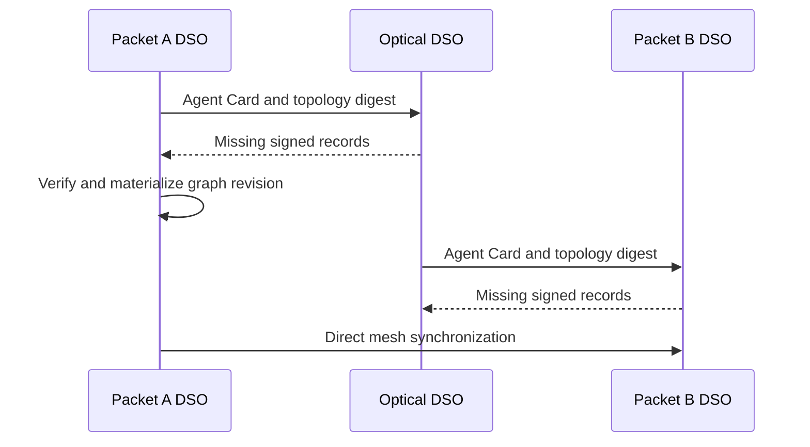

# Implementation roadmap

Build this as a sequence of AI DSO federation capabilities. Deterministic policy,
graph, protocol, and controller-transaction nodes establish the first
cross-domain service. Conditional LLM reasoning, swarm optimization, bargaining,
and continual learning consume this validated state and never replace its safety
gates.

This document is an implementation and evaluation plan, not implementation
evidence. For the Elsevier *Computer Networks* paper, prioritize the
[research protocol requirements](domain-agent-architecture.md#research-protocol-requirements):
agreements tied to network dependencies, evidence-grounded reasoning, and
coordinated recovery across independent packet and optical owners. The
[literature assessment](related-work-and-novelty.md) treats these as candidate
contributions that still require comparison and validation. Swarm optimization
and learning remain optional extensions rather than prerequisites for the core
paper experiment.

```mermaid
flowchart LR
    P0[0. Contracts and lab] --> P1[1. Domain foundation]
    P1 --> P2[2. Local Controller MCP]
    P2 --> P3[3. A2A federation]
    P3 --> P4[4. Deterministic service saga]
    P4 --> P5[5. Closed-loop assurance]
    P5 --> P6[6. RAG, GraphRAG, and safe LLM context]
    P6 --> E[Core protocol and LLM comparison]
    E -.-> P7[7. Optional optimization experiments]
    P7 -.-> P8[8. Optional continual learning]
```



## Technology baseline

Use one deployable AI DSO service per domain. Python is a practical initial
language because it supports the current reference platform's approach,
Pydantic contracts, FastAPI APIs, LangGraph, data-science tooling, and the
official Neo4j GraphRAG package.

Each domain has this local stack:

```text
Domain Agent Runtime: FastAPI + LangGraph + A2A server/client + MCP client
PostgreSQL + pgvector: source of truth, service state, audit, RAG
Neo4j: GraphRAG projection
TimescaleDB or partitioned PostgreSQL: telemetry
Controller MCP Server: adapter over that domain's SDN controller
```

Run three copies of the stack locally with Docker Compose or a small Kubernetes
deployment. Give each copy separate database credentials, controller identity,
and network namespace. A shared development CA can issue the three local mTLS
identities; production uses each operator's own identity provider and trust
policy.

Reuse the [reference packet–optical data plane](reference-data-plane.md) and
its `packet-network` and `optical-network` components.
Keep its Containerlab topology, SR Linux configurations, Mininet-Optical line,
bridge attachments, endpoint addresses, and initial UDP profile. Pin the source
commit and installed optical dependencies. The reference shared packet controller
must become two inventory-scoped controller instances; creating three DSO
containers alone does not provide controller isolation.

## Phase 0 — contracts and laboratory model

Define versioned Pydantic/JSON Schema models before building services:

- Domain, node, interface, link, configuration, service attachment, and graph
  digest records.
- A2A artifact payloads for topology, service contracts, reservations,
  verification, swarm signals, and learning releases.
- MCP tool input/output models and durable controller receipt models.
- Intent, QoS budget, cost quote, utility, candidate, and rollback models.

Bind the agreement to the intent/contract revision, participant set, candidate
digest, topology/configuration dependencies, evidence windows, policy versions,
reservation conditions, coordination epoch, and operation idempotency keys.
Define local versus aggregate service states, including unknown, partially
applied, compensating, degraded, and unresolved outcomes. Record which controller
primitives can enforce execution preconditions and which only approximate them.

State the failure model and disclosure assumptions: cooperating authenticated
owners, eventual topology replication, complete approved-topology sharing, and
delayed, duplicated, reordered, or lost messages. Specify restart persistence,
clock/lease assumptions, and peer rules for replacing a coordinator. Select the
properties to check before designing fault experiments.

Derive the deterministic fixture from the selected reference manifests: four
routers per packet domain, two packet paths per domain, two optical terminals,
four ROADMs, and one fixed channel. Preserve the bridge/edge attachments and
`client-a`/`server-b` addresses. Supply fixtures for healthy operation, Packet A
failure, optical unavailability or modeled QoT degradation, Packet B failure,
and a stale topology revision. An optical failure has no alternate optical route
in this fixture. Additional resource options require a separately labeled extension.

**Exit criterion:** Message structure and canonical digests are validated by
schema checks; authorization, feasibility, and state-transition rules have
separate specifications. Schema validation alone does not establish correctness.

## Phase 1 — independent domain foundations

Create three DSO services: `packet-a-dso`, `optical-dso`, and `packet-b-dso`.
Each gets its own PostgreSQL database, database migrations, immutable audit
journal, outbox/inbox tables, and configuration for its own domain identity.

Implement local topology/configuration ingestion from the pinned reference
topology and configuration fixtures first.
Materialize the records into PostgreSQL and Neo4j, preserving source domain,
revision, digest, expiry, and ownership. Do not use an LLM in this phase.

**Exit criterion:** Each DSO restarts without losing its own state and can
rebuild its local GraphRAG projection from PostgreSQL records.

## Phase 2 — local Controller MCP Server and transaction safety

Build one Controller MCP Server for each domain. Begin with fake controllers
for protocol tests, using the same inventory and capability limits. Then reuse
the reference packet controller and optical API behind scoped adapters. Give
the two packet instances separate router credentials, inventory allowlists,
journals, and endpoint bindings; enforce ownership below the MCP tool layer.
Exclude global deploy/destroy/configure-all and bridge lifecycle operations from
runtime domain tools. Keep these operations in trusted lab bootstrap.

Wrap the existing packet recovery HTTP procedures as local typed MCP tools.
Replace the reference central-SO mutation authorization with domain-specific
authorization. Separate sender control in Packet A from receiver control in
Packet B, or explicitly keep a fixed measurement flow in the experiment driver.
The controller's SQLite journal can remain a separate receipt store per packet
instance; DSO PostgreSQL remains the domain's orchestration source of truth.
The optical API provides observation and fixed configuration, not the complete
reservation/transaction sequence below; advertise that limitation and implement
durable adapter receipts before relying on them.

Implement this transaction sequence:

```text
get_topology / get_telemetry
→ validate_change
→ reserve_resources
→ prepare_change
→ commit_change
→ verify_change
→ rollback_change or release_reservation
```

Every mutating MCP request must include domain ID, correlation ID, candidate
digest, graph/contract revision, expected resource/configuration conditions,
reservation reference, coordination epoch, idempotency key, expiry, and caller
identity. Persist distinct acceptance and application receipts. Add
`get_transaction` to reconcile a lost response without blindly repeating a write.

Enforce preconditions at controller acceptance or through an equivalent protected
reservation, not only through an earlier DSO read. If the real adapter lacks this
primitive, retain that limitation in the capability profile and experiments.

**Exit criterion:** Retries do not duplicate effects; altered payloads cannot
reuse a key; superseded epochs and invalid resource conditions are rejected.
Inject a change between validation and acceptance. Demonstrate receipt
reconciliation and both successful and failed compensation; unresolved outcomes
survive restart instead of being reported as a restored before-state.

## Phase 3 — A2A topology federation

Implement Agent Cards, mTLS authentication, A2A task/context correlation, and
the `topology-federation/v1` extension. Build snapshot, digest, delta, ACK,
tombstone, stale-record, and resynchronization flows. Use an inbox table for
deduplication and an outbox worker for retryable sending.



**Exit criterion:** All three DSOs converge on the same graph digest after a
snapshot and after a node, link, or configuration delta. Wrong-owner, replayed,
expired, and malformed records are rejected.

Also test delayed/out-of-order advertisements, tombstones, owner restart, a
cross-domain link with inconsistent endpoint advertisements, and Neo4j projection
lag. Equal digests identify equal replicas at an observed point; they do not
establish that no newer remote state exists. No service mutation may rely solely
on an expired or unverified remote dependency.

## Phase 4 — deterministic cross-domain service saga

Implement the service lifecycle LangGraph without model-driven reasoning. It
receives a structured intent, loads the synchronized graph, derives QoS budgets,
enumerates known candidates, validates feasibility, exchanges A2A service
contract artifacts, reserves through local MCP servers, commits, and verifies.

Use a distributed saga, not a cross-database transaction. Each DSO owns its
reservation and compensating rollback. The initiating DSO coordinates one
correlation ID but cannot issue a peer controller call.

**Exit criterion:** Demonstrate all of these cases in the simulator:

- Successful three-domain provisioning and endpoint verification.
- A remote policy rejection with no controller change.
- Reservation expiry and clean release.
- Partial application followed by supported compensation or an explicit unresolved state.
- Rejection of a plan based on a stale graph or contract revision.
- Lost commit acknowledgements followed by receipt reconciliation and no duplicate effects.
- A failed compensation and a DSO restart while a recovery task is pending.

## Phase 5 — closed-loop assurance

Add periodic and event-driven assurance workflows. Normalize packet, optical,
controller, and endpoint observations into typed evidence bound to graph and
configuration revisions. Implement health evaluation, incident deduplication,
impact analysis, a short-lived coordination lease, cooldowns, hysteresis, and
action-rate limits. Bind incident coordination to durable epochs and require
controller-side rejection of superseded requests. Specify how participants grant
and replace a coordinator; a timeout lease alone is not evidence of exclusion.

The initial recovery catalog contains the reference
`pn1_activate_p_a2_backup_path` and `pn2_activate_p_b2_backup_path` actions with
their supported compensation. Packet QoS-profile mutation and optical rerouting
are not baseline actions. Route shared-service repairs through the Phase 4 saga;
unchanged participants validate and retain their segments. An optical cut must
exercise detection, refusal/escalation, and reconciliation after fault repair.

**Exit criterion:** Inject Packet A, Optical, Packet B, joint, stale-state, and
agent-outage scenarios. Record SLA violation duration, recovery success,
rollback success, and conflicting-action prevention.

Include simultaneous alarms, a partitioned old coordinator, and reconnection
after expiry. Define which independent local protection actions remain permitted
while a new shared-service change waits for required peer acknowledgements.
Treat exclusion and progress as separate properties with explicit assumptions.

## Phase 6 — RAG and GraphRAG

Populate `pgvector` with authorized runbooks, policies, controller-tool
documentation, approved change records, incident reports, and learning releases.
Materialize the topology/service/evidence knowledge graph in Neo4j. Add the
`rag_context_retrieval`, `graphrag_subgraph_retrieval`, and
`retrieval_grounding_gate` LangGraph nodes. Add the shared
`reasoning_context_assembly` node before any conditional LLM call.

Require every retrieved context item to carry provenance, authorization scope,
source digest, and relevant graph/configuration revision. Evaluate retrieval on
a fixed set of operational questions before it affects explanations or candidate
ranking. The assembled LLM context must include the canonical intent or event,
fresh evidence, feasible candidate set, peer state, hard constraints, and
node-specific response schema. The LLM cannot call MCP or introduce a candidate.

Record absent/conflicting evidence rather than assuming perfect context.
Connect retrieved revisions and evidence IDs to the candidate and execution
preconditions. Compare the same protocol with LLM nodes disabled; a benefit caused
only by controller checks must be attributed to those checks rather than to AI.

**Exit criterion:** The agent can answer bounded topology-impact and procedure
questions with traceable sources, and the grounding gate rejects stale or
unsupported context. An LLM timeout or invalid response follows a deterministic
fallback without blocking the closed loop.

Required protocol dependencies may still block the dependent change. An LLM
fallback does not bypass missing evidence or permit an unapproved operation.

## Phase 7 — optional swarm and bargaining comparisons

Add bounded ACO scouts over the federated graph. Start with a fixed number of
paths and fixed quality weights. Feed verified path outcomes into time-decaying
quality/pheromone signals. Add PSO only for clearly continuous choices such as
bandwidth allocation or queue-share tuning.

Next, calculate each domain's local utility, disagreement value, and cost quote.
Extend the existing offer, counteroffer, acceptance, and rejection protocol using the
`service-contract/v1` A2A extension. Select an agreement only after feasibility,
budget, individual-rationality, and matching-signature checks; weighted Nash
bargaining ranks the admissible contracts.

For the cooperative prototype, disclose signed candidate-specific utility gains,
model versions, and agreed normalization/weights; retain underlying coefficients
locally. Record the information disclosed and assume neither truthful strategic
behavior nor zero economic leakage. Define no-agreement and score tie-break
outcomes. Keep the numerical game-theory calculation independent of LLM calls.

**Exit criterion:** Compare constrained K-shortest candidate search with ACO
under matched compute budgets and repeated seeds. Compare greedy acceptance with
Nash selection over the same feasible candidates. Use a tractable exact solver
on small instances to measure search gaps. Report service outcomes, cost,
negotiation rounds, utility gains, and overhead without conflating search and
bargaining effects.

## Phase 8 — optional continual learning

Make terminal decision traces the only input to the asynchronous learning graph.
Implement comparable-trace retrieval, novelty/provenance gates, offline replay
or digital-twin evaluation, promotion, release, and revocation. Start with L0
observational findings, then L1 shadow ranking. Introduce L2 only after review
and reproducible replay evidence.

**Exit criterion:** A learning release is versioned, scoped to topology and
configuration revisions, reproducible from retained traces, and automatically
ignored when stale or revoked.

Compare fixed policies with each permitted learning level on held-out scenarios.
Separate incident-memory retrieval from parameter updates and model training.
The deployment is a federation of domains; federated model training is a
different mechanism and is not implied.

## Recommended first demonstration

First exercise the protocol in P0 using fixtures derived from the reference
topology. Then demonstrate P1 on the same Containerlab SR Linux and
Mininet-Optical data plane, without physical network hardware or a paid model
requirement. Use one `client-a` → `server-b` intent, A2A graph convergence, owner
acceptances, supported local transactions, fresh receiver verification, and a
primary packet-path fault followed by its named backup action. Record a complete
trace. Include an optical failure that correctly reports unavailable restoration.
Capability gaps discovered in P0 must remain explicit until verified in P1.

## Journal evaluation plan

The [detailed experimental validation plan](experimental-validation.md) expands
this summary into testbed specifications, nine experiment families, procedures,
independent outcome checks, statistical analysis, and reproducibility requirements.
Use that plan to define and freeze the final study configuration before runs.

Use this plan to test the candidate contributions. It does not promise favorable
results. The initial demonstration establishes feasibility; the journal study
must explain what the proposed mechanisms add beyond existing orchestration.

### Baselines and ablations

| Comparison | Controlled variables and research question |
| --- | --- |
| Same federation with all three LLM nodes disabled | Keep graph, evidence, protocol, candidates, tools, and policies matched. Which tasks benefit from generative reasoning? |
| Central ACTN-style orchestrator | Match information, resources, algorithms, and failure scenarios. What does federation change in service outcomes, delay, availability, and overhead? |
| Established distributed orchestration | Compare a reproducible implementation or clearly labeled adaptation of relevant prior work. Do not label an inspired baseline as an exact reproduction. |
| Conventional multi-agent LLM workflow | Match tools, evidence, and model budget. Does selective reasoning improve cost or task completion? |
| Document RAG, graph retrieval, and graph retrieval with freshness/dependency checks | Separate diagnosis/recommendation quality from rejection of invalid actions by the controller. |
| Whole-graph versus dependency-scoped invalidation | Later protocol refinement: measure unnecessary renegotiations and verify that the dependency set is complete before accepting unrelated changes. |
| K-shortest versus ACO; greedy versus Nash | Separate search quality from agreement quality; use matched candidate sets or computational budgets as appropriate. |
| Fixed policies versus learning | Optional held-out evaluation with explicit regression and promotion criteria. |

For the first paper, prioritize the same-protocol/no-LLM comparison, a meaningful
orchestration baseline, and fault experiments for the proposed execution protocol.
Add optimization and learning claims only when their separate comparisons justify
them. New controller protection is itself a protocol variable; evaluate it with
and without LLM advice to avoid attributing its effects to the model.

### Experiment matrix and measurements

Begin with the exact three-domain reference data plane and its one shared UDP
flow. Multiple pending intents exercise control contention, not independent
service isolation. Additional nodes, optical paths, or simultaneous isolated
services belong to separately identified simulator or data-plane extensions.
Within those declared profiles, vary domains, nodes per domain,
concurrent intents, load, advertisement delay, controller delay, and change rate.
Counts such as 5, 10, and 20 domains are proposed experiment points, not claimed
supported scale. Record whether packet forwarding is emulated, optical behavior
is simulated, or actual equipment is measured. State optical feasibility limits.

| Scenario family | Measurements |
| --- | --- |
| Admission and healthy operation | Verified service success, rejection causes, provisioning latency, resource cost, and per-domain utility gains. |
| Optical impairment, packet congestion, and simultaneous incidents | SLA violation duration, recovery success and latency, action conflicts, and regressions in unaffected services. |
| Stale replicas, projection lag, and changes between validation and acceptance | Invalidated decisions, rejected stale operations, unnecessary renegotiations, and unsupported recommendations. |
| Lost/duplicate messages, partial commits, failed compensation, and restart | Duplicate effects, leaked reservations, unresolved transactions, reconciliation time, and durable recovery continuity. |
| Partitions and coordinator replacement | Conflicting writers, epoch rejections, actions deferred for missing approval, and progress after reconnection. |
| Incorrect or unavailable LLM output | Fallback outcome, diagnosis quality, model calls/tokens/cost, and end-to-end completion. |
| Scaling and repeated state changes | A2A messages/bytes, replica lag/storage, graph queries, controller calls, CPU/memory, and tail latency. |

Use paired traffic/failure traces, repeated runs, reported random seeds, confidence
intervals, and recorded model/prompt/tool versions. Publish measured median and
tail behavior; do not infer tail reliability from too few samples. Preserve raw
outcome classifications, including failed or unresolved trials.

### Claim readiness

| Candidate claim | Evidence required before using it in the paper |
| --- | --- |
| Execution respects local authorization and state dependencies | Specified invariants and controller capabilities, protocol analysis/model checking where appropriate, and injected race/failure tests. |
| Evidence-grounded reasoning improves decisions | Matched retrieval and no-LLM comparisons showing an attributable effect. |
| Recovery is coordinated across owners | Explicit epoch/replacement rules plus concurrent-incident, partition, partial-completion, and restart experiments. |
| Economic allocation improves | Defined units, disclosed inputs, disagreement outcomes, fairness measures, and comparison with simpler selection. |
| Swarm or learning is beneficial | Separate improvements under fair budgets and held-out cases, including overhead and regressions. |

State assumptions for every guarantee. Zero failures in a finite experiment is
not a proof; a model-checked property applies only within the modeled semantics.
Compare the final protocol in detail with NSI, SENSE, ACTN, and consistent network
updates, then refresh the closest papers before submission. Full topology privacy,
atomic physical activation, and automatic strategy-proofness are not claimed.
