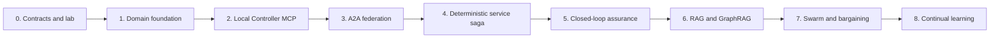
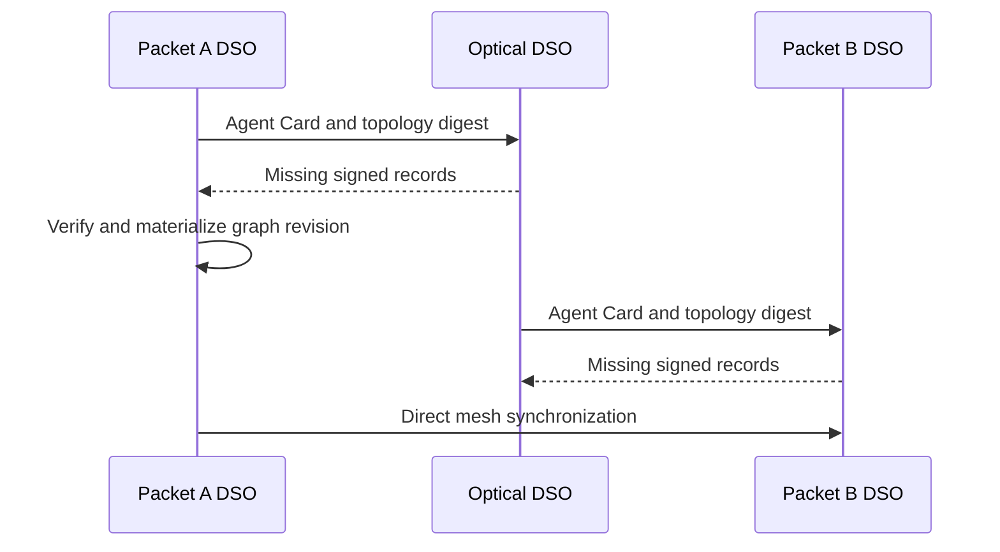

# Implementation roadmap

Build this as a sequence of deterministic federation capabilities. AI reasoning,
swarm optimization, bargaining, and continual learning should consume proven
state and transactions; they should not be prerequisites for the first
cross-domain service.



## Technology baseline

Use one deployable DSO service per domain. Python is a practical initial
language because it supports the current reference platform's approach,
Pydantic contracts, FastAPI APIs, LangGraph, data-science tooling, and the
official Neo4j GraphRAG package.

Each domain has this local stack:

```text
DSO service: FastAPI + LangGraph + A2A server/client + MCP client
PostgreSQL + pgvector: source of truth, service state, audit, RAG
Neo4j: GraphRAG projection
TimescaleDB or partitioned PostgreSQL: telemetry
Controller MCP Server: adapter over that domain's SDN controller
```

Run three copies of the stack locally with Docker Compose or a small Kubernetes
deployment. Give each copy separate database credentials, controller identity,
and network namespace. A shared development CA can issue the three local mTLS
identities; production uses each operator's own identity provider and trust
policy.

## Phase 0 — contracts and laboratory model

Define versioned Pydantic/JSON Schema models before building services:

- Domain, node, interface, link, configuration, service attachment, and graph
  digest records.
- A2A artifact payloads for topology, service contracts, reservations,
  verification, swarm signals, and learning releases.
- MCP tool input/output models and durable controller receipt models.
- Intent, QoS budget, cost quote, utility, candidate, and rollback models.

Create one small deterministic topology: Packet A → Optical → Packet B, two
candidate packet paths in each packet domain, and at least two optical resource
options. Supply fixed telemetry fixtures for healthy, Packet A failure, Optical
QoT degradation, Packet B failure, and a stale topology revision.

**Exit criterion:** Every message and controller action can be validated from
schema alone, with canonical digests and correlation IDs.

## Phase 1 — independent domain foundations

Create three DSO services: `packet-a-dso`, `optical-dso`, and `packet-b-dso`.
Each gets its own PostgreSQL database, database migrations, immutable audit
journal, outbox/inbox tables, and configuration for its own domain identity.

Implement local topology/configuration ingestion from static fixtures first.
Materialize the records into PostgreSQL and Neo4j, preserving source domain,
revision, digest, expiry, and ownership. Do not use an LLM in this phase.

**Exit criterion:** Each DSO restarts without losing its own state and can
rebuild its local GraphRAG projection from PostgreSQL records.

## Phase 2 — local Controller MCP Server and transaction safety

Build one Controller MCP Server for each simulated domain. Begin with a fake
SDN controller that implements only typed, named operations; later replace its
adapter with the real packet or optical controller API.

Implement this transaction sequence:

```text
get_topology / get_telemetry
→ validate_change
→ reserve_resources
→ prepare_change
→ commit_change
→ verify_change
→ rollback_change or release_reservation
```

Every mutating MCP request must include domain ID, correlation ID, candidate
digest, graph/contract revision, idempotency key, expiry, and caller identity.
Persist an immutable receipt before the tool returns success.

**Exit criterion:** Repeated commits are idempotent; an interrupted transaction
can be reconciled from its receipt; rollback restores the known before-state.

## Phase 3 — A2A topology federation

Implement Agent Cards, mTLS authentication, A2A task/context correlation, and
the `topology-federation/v1` extension. Build snapshot, digest, delta, ACK,
tombstone, stale-record, and resynchronization flows. Use an inbox table for
deduplication and an outbox worker for retryable sending.



**Exit criterion:** All three DSOs converge on the same graph digest after a
snapshot and after a node, link, or configuration delta. Wrong-owner, replayed,
expired, and malformed records are rejected.

## Phase 4 — deterministic cross-domain service saga

Implement the service lifecycle LangGraph without model-driven reasoning. It
receives a structured intent, loads the synchronized graph, derives QoS budgets,
enumerates known candidates, validates feasibility, exchanges A2A service
contract artifacts, reserves through local MCP servers, commits, and verifies.

Use a distributed saga, not a cross-database transaction. Each DSO owns its
reservation and compensating rollback. The initiating DSO coordinates one
correlation ID but cannot issue a peer controller call.

**Exit criterion:** Demonstrate all of these cases in the simulator:

- Successful three-domain provisioning and endpoint verification.
- A remote policy rejection with no controller change.
- Reservation expiry and clean release.
- A commit failure followed by safe rollback/reconciliation.
- Rejection of a plan based on a stale graph or contract revision.

## Phase 5 — closed-loop assurance

Add periodic and event-driven assurance workflows. Normalize packet, optical,
controller, and endpoint observations into typed evidence bound to graph and
configuration revisions. Implement health evaluation, incident deduplication,
impact analysis, a short-lived coordination lease, cooldowns, hysteresis, and
action-rate limits.

The initial recovery catalog should contain only named, reversible actions, such
as switching Packet A to a prevalidated alternate path or changing a packet QoS
profile. Route every shared-service remediation through the Phase 4 service
saga.

**Exit criterion:** Inject Packet A, Optical, Packet B, joint, stale-state, and
agent-outage scenarios. Record SLA violation duration, recovery success,
rollback success, and conflicting-action prevention.

## Phase 6 — RAG and GraphRAG

Populate `pgvector` with authorized runbooks, policies, controller-tool
documentation, approved change records, incident reports, and learning releases.
Materialize the topology/service/evidence knowledge graph in Neo4j. Add the
`rag_context_retrieval`, `graphrag_subgraph_retrieval`, and
`retrieval_grounding_gate` LangGraph nodes.

Require every retrieved context item to carry provenance, authorization scope,
source digest, and relevant graph/configuration revision. Evaluate retrieval on
a fixed set of operational questions before it affects explanations or candidate
ranking.

**Exit criterion:** The agent can answer bounded topology-impact and procedure
questions with traceable sources, and the grounding gate rejects stale or
unsupported context.

## Phase 7 — swarm optimization and game-theoretic bargaining

Add bounded ACO scouts over the federated graph. Start with a fixed number of
paths and fixed quality weights. Feed verified path outcomes into time-decaying
quality/pheromone signals. Add PSO only for clearly continuous choices such as
bandwidth allocation or queue-share tuning.

Next, calculate each domain's local utility, disagreement value, and cost quote.
Implement offer, counteroffer, acceptance, and rejection using the
`service-contract/v1` A2A extension. Select an agreement only after feasibility,
budget, individual-rationality, and matching-signature checks; weighted Nash
bargaining ranks the admissible contracts.

**Exit criterion:** Compare fixed routing, independently greedy selection, and
swarm-plus-bargaining across the same failure and load scenarios. Report SLA,
cost, convergence rounds, rejected offers, and selected utility.

## Phase 8 — continual learning

Make terminal decision traces the only input to the asynchronous learning graph.
Implement comparable-trace retrieval, novelty/provenance gates, offline replay
or digital-twin evaluation, promotion, release, and revocation. Start with L0
observational findings, then L1 shadow ranking. Introduce L2 only after review
and reproducible replay evidence.

**Exit criterion:** A learning release is versioned, scoped to topology and
configuration revisions, reproducible from retained traces, and automatically
ignored when stale or revoked.

## Recommended first demonstration

The first end-to-end demonstration should use no paid model provider and no live
network hardware. It should show one intent from Packet A to Packet B, A2A graph
convergence, an approved three-domain service contract, reservations and MCP
commits, endpoint verification, an injected failure, closed-loop recovery, and
a complete auditable trace. This validates the federation before optimization
or learning adds complexity.
