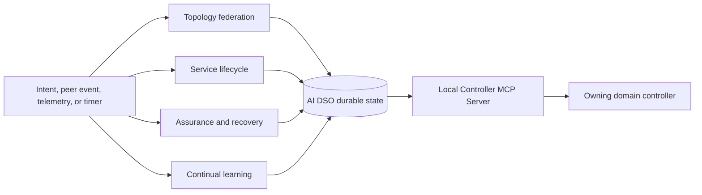
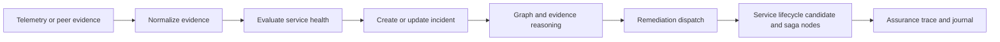
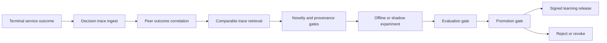
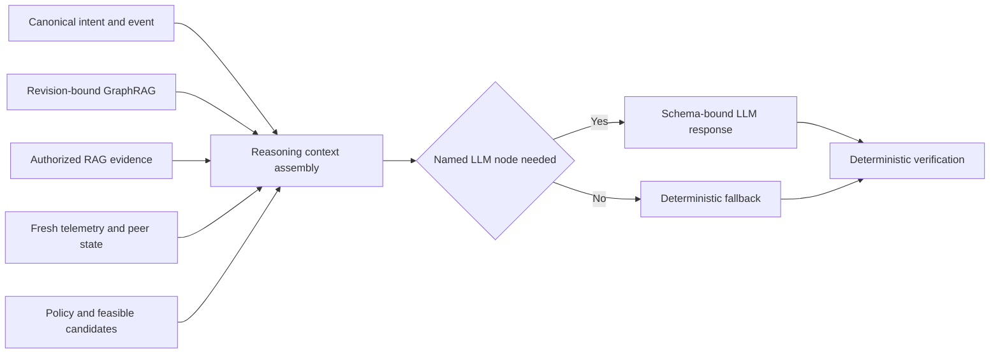

# AI DSO LangGraph node catalogue

Each domain runs one persistent AI Domain Service Orchestrator (AI DSO). Its
LangGraph contains four workflows and one shared deterministic utility. The
catalogue lists the execution method for every node. **LLM** means a conditional,
grounded generative-model call; every other method is deterministic.

| Workflow | Nodes | Purpose |
|---|---:|---|
| Topology federation | 8 | Maintain the signed multi-domain topology and configuration replica. |
| Service lifecycle | 29 | Convert intent into a verified cross-domain service. |
| Assurance and recovery | 7 | Detect degradation and re-enter the safe remediation path. |
| Continual learning | 12 | Evaluate completed outcomes asynchronously. |
| Shared reasoning utility | 1 | Assemble authorized context for conditional LLM nodes. |

## 1. Topology federation workflow

| Node | Execution method | Backend or algorithm |
|---|---|---|
| `topology_event_ingest` | Deterministic event routing | Parse event type, bind correlation ID, deduplicate with idempotency key. |
| `peer_identity_gate` | Deterministic security policy | mTLS identity, Agent Card authorization, schema-version and capability policy. |
| `topology_message_verifier` | Deterministic cryptographic and schema validation | Signature, owner, nonce, sequence number, expiry, digest, and JSON-schema checks. |
| `topology_reconciler` | Deterministic replication algorithm | Compare revision vectors and graph digests, then request a snapshot or missing delta range. |
| `graph_apply` | Deterministic transactional state update | PostgreSQL transaction and event-sourced upsert or tombstone application. |
| `graph_integrity_gate` | Deterministic graph and policy validation | Endpoint existence, layer compatibility, ownership, configuration-reference, and connectivity checks. |
| `topology_impact_analysis` | Deterministic graph algorithm | Reverse dependency traversal and BFS from changed entities to affected services, paths, reservations, and negotiations. |
| `topology_ack_and_journal` | Deterministic protocol and audit action | Persist replica revision, append audit event, sign and send A2A acknowledgement. |

## 2. Service lifecycle workflow

| Node | Execution method | Backend or algorithm |
|---|---|---|
| `intent_intake_and_normalization` | Deterministic intent processing | JSON-schema validation, canonical intent mapping, idempotency check, and correlation-ID creation. |
| `service_event_ingest` | Deterministic event routing | Verify event class and load the correlation-specific service record. |
| `identity_and_entitlement_gate` | Deterministic authorization policy | RBAC or ABAC entitlement checks for tenant, endpoint, service class, and request scope. |
| `service_context_load` | Deterministic state retrieval | PostgreSQL lookup of contract, receipts, reservations, peer state, and graph digest. |
| `topology_freshness_gate` | Deterministic consistency policy | Revision, digest, TTL, and required-record completeness checks. |
| `rag_context_retrieval` | Deterministic semantic retrieval | `pgvector` nearest-neighbor search with authorization, metadata, version, and expiry filters. |
| `graphrag_subgraph_retrieval` | Deterministic graph retrieval | Revision-bound Neo4j Cypher traversal over service, topology, resource, configuration, evidence, and incident relations. |
| `retrieval_grounding_gate` | Deterministic provenance policy | Verify source IDs, access scope, graph/configuration revisions, freshness, and evidence support. |
| `graph_reachability_and_impact` | Deterministic graph algorithm | BFS over the verified federated graph with policy filters. |
| `bounded_path_enumeration` | Deterministic graph algorithm | Policy-bounded DFS plus disjoint-path search to enumerate simple path alternatives and avoid cycles. |
| `constraint_path_ranking` | Deterministic constrained optimization | Remove infeasible paths, then rank remaining paths using SLA, capacity, latency, QoT, risk, and configuration constraints. |
| `qos_budget_derivation` | Deterministic arithmetic and policy | Split end-to-end bandwidth, latency, loss, availability, and deadline targets into domain contributions. |
| `path_and_dependency_analysis` | Deterministic graph algorithm | Graph traversal and shared-risk-resource analysis for path handoffs and configuration dependencies. |
| `swarm_state_refresh` | Deterministic state update | Read signed quality signals and apply time decay to short-lived pheromone or quality values. |
| `swarm_candidate_exploration` | Deterministic seeded metaheuristic | Bounded ant-colony-style virtual scouts over the already feasible path and resource set. |
| `swarm_candidate_aggregation` | Deterministic selection algorithm | Deduplicate, diversify, and retain Pareto-efficient or policy-ranked candidate combinations. |
| `local_candidate_generation` | Deterministic controller feasibility query | Call read or validate tools on the local Controller MCP Server and map results to allowed local operations. |
| `advisory_reasoning` | **Conditional LLM** | Use the assembled RAG and GraphRAG context to explain or rank only the verified candidate set. |
| `candidate_verification` | Deterministic evidence and constraint check | Re-evaluate candidate references against current graph, telemetry, configuration, and hard constraints. |
| `local_policy_selection` | Deterministic policy decision | Policy-as-code and fixed cost, risk, disruption, and rollback thresholds select an offer or counteroffer. |
| `local_utility_evaluation` | Deterministic game-theory calculation | Local utility and disagreement value from capacity, opportunity cost, energy, risk, operation cost, and settlement terms. |
| `peer_contract_negotiation` | Deterministic A2A protocol state machine | Send and receive signed offers, counteroffers, acceptances, and rejections. |
| `bargaining_solution_gate` | Deterministic game-theory calculation | Weighted Nash bargaining and exact agreement checks on contract, revisions, QoS, path, and expiry. |
| `local_reservation` | Deterministic MCP transaction step | Call `reserve_resources` through the local Controller MCP Server and store a time-bound receipt. |
| `reservation_barrier` | Deterministic distributed-saga coordination | Wait for matching peer receipts, apply timeout, compensation, and expiry rules. |
| `commit_authorization_gate` | Deterministic policy recheck | Revalidate policy, graph, contract, reservation, and local controller state immediately before commit. |
| `controller_transaction` | Deterministic MCP side effect | Call allowlisted `commit_change` or `rollback_change` through the local Controller MCP Server. |
| `service_verification` | Deterministic measurement and protocol check | Compare local and border measurements with SLA thresholds and exchange signed A2A verification summaries. |
| `service_outcome_journal` | Deterministic state transition and audit action | Persist terminal outcome, immutable trace, notification, and learning-job trigger. |

```mermaid
flowchart LR
    I[Intent intake] --> G[Identity, state, and freshness gates]
    G --> R[RAG and GraphRAG retrieval]
    R --> P[BFS, DFS, constraints, and QoS budget]
    P --> W[Swarm candidate exploration]
    W --> C[Controller-feasible local candidates]
    C --> V[Evidence verification and local policy]
    V --> U[Utility calculation]
    U --> N[Signed A2A negotiation]
    N --> B[Weighted Nash bargaining gate]
    B --> H[Reservation barrier]
    H --> M[Controller MCP transaction]
    M --> X[Service verification and journal]
```

## 3. Assurance and recovery workflow

| Node | Execution method | Backend or algorithm |
|---|---|---|
| `assurance_event_ingest` | Deterministic event routing | Classify telemetry, peer evidence, topology impact, timer, or verification-failure event. |
| `evidence_normalization` | Deterministic telemetry processing | Validate timestamps and units, window measurements, and bind evidence to graph/configuration revisions. |
| `service_health_evaluation` | Deterministic SLO evaluation | Threshold, trend, hysteresis, and contract-compliance rules over normalized evidence. |
| `incident_creation_or_update` | Deterministic incident correlation | Deduplicate using service, resource, symptom, revision, and time-window keys. |
| `fault_and_impact_reasoning` | **Conditional LLM** | Summarize GraphRAG and evidence-grounded probable cause and impact. The fallback uses dependency traversal and evidence thresholds. |
| `remediation_dispatch` | Deterministic workflow transition | Route a safe remediation to existing service candidate, negotiation, reservation, and transaction nodes. |
| `assurance_trace_and_journal` | Deterministic audit action | Persist evidence, diagnosis, peer messages, receipts, and health outcome. |

## 4. Continual-learning workflow

| Node | Execution method | Backend or algorithm |
|---|---|---|
| `decision_trace_ingest` | Deterministic trace materialization | Read immutable local service, topology, negotiation, controller, and verification records. |
| `peer_outcome_correlation` | Deterministic record linkage | Join signed peer outcomes by contract, correlation ID, graph digest, and time window. |
| `comparable_trace_retrieval` | Deterministic hybrid retrieval | Metadata filters plus pgvector similarity and GraphRAG condition matching. |
| `novelty_gate` | Deterministic statistical and policy gate | Detect duplicate traces, insufficient samples, stale data, or contradictions. |
| `hypothesis_generation` | **Conditional LLM** | Propose a bounded, testable hypothesis from comparable, provenance-validated traces. |
| `provenance_validator` | Deterministic lineage validation | Validate source hashes, ownership, revisions, permissions, and reproducible data set. |
| `experiment_planner` | Deterministic constrained planning | Define an offline replay, digital-twin, or shadow experiment with fixed safety limits. |
| `safe_experiment_runner` | Deterministic evaluation execution | Run only the approved offline, digital-twin, or shadow workload and preserve inputs/results. |
| `evaluation_gate` | Deterministic statistical evaluation | Compare calibration, prediction error, safety, and sample sufficiency against a held-out baseline. |
| `promotion_gate` | Deterministic governance policy | Promote only L0 observation, L1 advisory, or reviewed L2 policy input according to thresholds and approval. |
| `publish_learning_release` | Deterministic release and protocol action | Version, sign, journal, and distribute an approved bounded learning release through A2A. |
| `reject_or_revoke` | Deterministic lifecycle action | Reject, expire, or revoke a failed hypothesis or previously released learning artifact. |

## 5. Shared reasoning utility

| Node | Execution method | Backend or algorithm |
|---|---|---|
| `reasoning_context_assembly` | Deterministic secure prompt construction | Join canonical intent, event, state, graph/configuration revisions, GraphRAG/RAG evidence, telemetry, constraints, feasible candidates, peer state, provenance, and node-specific response schema. Apply authorization and secret-redaction filters before any LLM call. |

## LLM invocation rule

`reasoning_context_assembly` runs before `advisory_reasoning`,
`fault_and_impact_reasoning`, and `hypothesis_generation`. These are the only
LLM-assisted nodes. The LLM may interpret the supplied context and return a
schema-valid advisory result with cited source and candidate IDs. It cannot add
a candidate, negotiate an authoritative agreement, invoke MCP, reserve
resources, or change network configuration. Timeouts, failed output validation,
or unsupported answers use the deterministic fallback specified for the node.
