# Three-domain agent architecture

## Purpose and boundary

This repository focuses on collaboration among three agents owned by different
network operators. Each agent **is a Domain Service Orchestrator (DSO)**: one
persistent runtime with the capabilities needed to handle its part of a
cross-domain service.

This is a proposed agentic AI networking system for Elsevier *Computer Networks*.
Packet A, Optical, and Packet B belong to different people or organizations,
with distinct objectives and local authority. **ACO, PSO, Nash bargaining, and
continual learning are required core mechanisms.** The [paper plan](paper-positioning.md)
and [coupled method](agentic-system-method.md) define their interaction and
evaluation. This architecture is not evidence of implementation or novelty.

The data plane is implemented in this repository, in **`packet-network/`** and
**`optical-network/`**, with eight SR Linux routers, two traffic endpoints, and
the fixed four-ROADM Mininet-Optical line. The
[data-plane specification](../../data-plane.md) records the exact topology,
addressing, ownership boundary and capability limits. The capability
table below describes the broader architecture; the initial executable profile
is limited to the reference's named packet-route recovery and one optical route
with channels 1 and 2 selectable one at a time. Unsupported functions must not
be offered as executable actions.

| Domain | AI DSO owns | Local controller owns |
|---|---|---|
| Packet A | Local ingress/egress view, packet-path candidates, QoS contribution, policy and local approval | Router, VPN/SR/MPLS/EVPN, queue and shaping changes |
| Optical | Border attachments, transport/spectrum candidates, QoT contribution, policy and local approval | Transponder, OTN, ROADM and spectrum changes |
| Packet B | Local ingress/egress view, packet-path candidates, QoS contribution, policy and local approval | Router, VPN/SR/MPLS/EVPN, queue and shaping changes |

The design does **not** assume a central entity authorizes every controller.
Instead, each DSO maintains an eventually convergent replica of the complete federated topology:
every node, interface, link, relationship, and approved configuration state
advertised by the three domains. Each DSO remains the only authority that can
ask its own controller to reserve or activate a resource.

Full topology disclosure is an explicit federation assumption. Separate databases
and credentials preserve local authority; they do not make shared topology or
approved configuration confidential from peers.

The design keeps the mechanisms that make automated control safe—scoped
agents, typed candidate messages, direct agent-to-agent negotiation, freshness
checks, and controller safety gates—while placing service-orchestration
authority inside each domain rather than above all three.
The data plane already scopes each operation to its owning domain and splits
sender and receiver ownership between the two packet domains. Independent
credentials, journals and identities per domain are separate work, and none of
it is supplied simply by running three DSO processes.

## Collective-intelligence research framing

The federation investigates collective intelligence: whether peer evidence,
counteroffers, and learned performance estimates improve joint service decisions
under independent ownership. This is a group-level research hypothesis, not a
fifth mechanism, new agent, shared LLM, or central authority. The four required
mechanisms remain ACO, PSO, Nash bargaining, and continual learning.

Implement bounded peer-informed revisions and evidence-to-decision traces through
the existing workflow nodes, as specified in the
[coupled method](agentic-system-method.md#collective-intelligence-through-peer-feedback).
The [evaluation plan](experimental-validation.md#e10--peer-informed-collective-decisions)
tests adaptive feedback against fixed exchange (E10), learning interactions
(E11), and centralized planning (E09). Sharing topology or exchanging messages
alone is not evidence of improved collective decisions. Every owner still approves
its own actions; no majority can overrule a refusal.

## Sovereign domain authority

**One AI DSO per networking domain, and exactly one.** Each DSO is the sole
decision-making authority inside its own domain: one king per kingdom. There is
no emperor over the three, and no council that can outvote a king inside his own
borders.

Four rules define that sovereignty:

| Rule | Consequence |
| --- | --- |
| Only the owning DSO may ask its own controller to reserve, commit, or roll back | No DSO ever calls a peer's controller or holds a peer's credentials. |
| A shared service activates only with explicit signed consent from every affected owner | A two-of-three majority cannot authorize the third domain's resources. Silence is not consent. |
| The initiating DSO convenes; it does not command | It owns the correlation ID and answers the user. Every remote decision remains local to the DSO that signed it. |
| Any owner may refuse | A refusal is a valid owner decision, not a fault to be worked around. |

Sovereignty is about **control**, not secrecy. Three boundaries of the metaphor
are deliberate design decisions, and each must be stated plainly in any paper
built on this architecture rather than left for a reader to discover.

**Full disclosure between kingdoms.** Every DSO holds a replica of the complete
approved topology of all three domains. Kings do not normally exchange complete
maps of their territory, and production inter-operator practice abstracts
topology rather than publishing it. This federation deliberately trades that
confidentiality for a shared graph that all three can reason over. Each operator
remains sovereign over what it will *do*; it is transparent about what it *has*.

**A relay is not a regent.** Service negotiation follows data-plane adjacency,
so Packet A reaches Packet B through the Optical DSO. Carrying correspondence
must never confer authority over its contents: relayed acceptances are verified
against the signing owner's identity end to end, never trusted on the relay's
word, and the Optical DSO cannot alter, withhold consent on behalf of, or
substitute its own decision for a peer's. The direct Packet A–Packet B control
session exists for topology synchronization and liveness, not for contract
exchange that bypasses the transit owner.

**One king, no regent.** A single DSO per domain means that domain has no
standby decision-maker. Restart is handled — durable state, unresolved work
preserved across restarts — but a DSO that stays down leaves its domain with no
authority to grant new agreements, and no peer may act in its place. Shared-service
changes that need its consent defer until it returns. Domain-level DSO
high availability is outside the current design and must be declared as an
assumption, separately from the recovery-coordinator replacement rules.

## Architecture

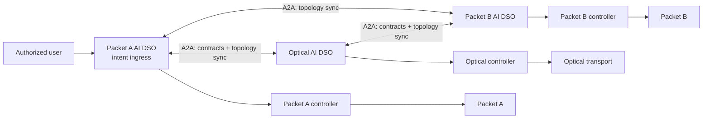

The data plane follows network adjacency: Packet A connects through Optical to
Packet B. The agent control plane is a full peer mesh, so every DSO can
handshake directly with every other DSO and converge on the same topology graph.
Service negotiation still follows the data-plane path; a direct Packet A–Packet
B control-plane session does not grant either agent authority to bypass the
optical domain.

The DSO that receives the user intent is the **initiating DSO**. It owns the
workflow correlation ID and tells the user the result. That is coordination of
one request, not authority over another domain: every remote decision is local
to the DSO that signed it.

The design has three connected planes. Keeping them separate makes it clear
which component can see, decide, and act on a given fact.

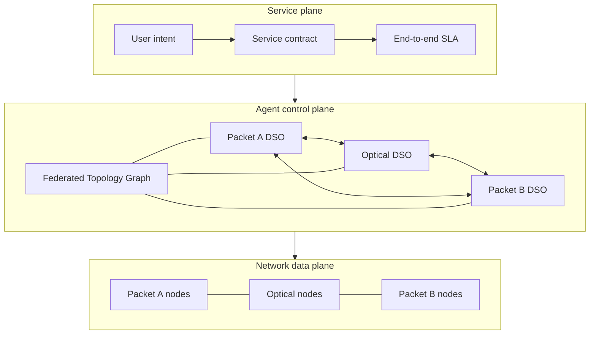

## Federated service orchestration

Every DSO implements the same bounded capabilities, scoped to its operator:

| Capability | Local behavior | Cross-domain behavior |
|---|---|---|
| Intent ingress | Authenticate a local user and translate intent to a local service request | Forward only a scoped contract to an adjacent DSO |
| Service lifecycle | Maintain the domain's service state, revision, reservation and receipt | Exchange signed lifecycle events for the same correlation ID |
| Service map | Maintain the local authoritative segment and merge every signed peer segment into the Federated Topology Graph | Publish owned nodes, interfaces, links, relationships, and approved configuration revisions |
| Policy and planning | Construct feasible local candidates and enforce local policy | Offer, counteroffer, accept, or reject a joint contract |
| Execution | Ask its own controller to reserve, commit, or roll back a named local operation | Never call a peer's controller |
| Assurance | Collect local and border evidence and evaluate its QoS contribution | Send signed status/evidence summaries to the initiating DSO |

This gives every agent a complete service lifecycle and assurance capability
for its own domain, without giving any one of them another domain's controller
credentials or unilateral execution authority. Each
DSO persists its own service record and a full **Federated Topology Graph**.
The common replicated view is the signed topology/configuration graph,
`ServiceContract`, and lifecycle events, so all three can agree whether the
contract is offered, reserved, committed, verified, failed, or rolled back.

## End-to-end operating model

The system operates as a federation of equal DSOs, not as a central orchestrator
that commands three subordinate domains.

1. **Peer bootstrap and topology convergence.** Packet A, Optical, and Packet B
   mutually authenticate, exchange Agent Cards, and synchronize signed topology
   and configuration snapshots. Every DSO then holds the full multi-domain graph:
   nodes, interfaces, packet and optical links, node relationships, capacities,
   operational state, and approved configuration revisions. Signed deltas keep
   replicas convergent when communication resumes; temporary revision differences
   are expected and must be checked during service decisions.
2. **Intent admission.** An authorized user submits a desired service outcome to
   any DSO. The receiving DSO becomes the initiating DSO for that correlation ID.
   It authenticates the user, checks local entitlement, records the intent, and
   creates the initial versioned `ServiceContract`.
3. **Path and QoS planning.** Every affected DSO uses an agreed graph snapshot
   to validate end-to-end continuity and configuration compatibility. The
   initiating DSO derives bandwidth, latency, loss, availability, deadline, and
   budget requirements; each domain derives the contribution it can make.
4. **Local candidate generation.** Each DSO creates only local,
   controller-feasible candidates. Packet DSOs may offer packet paths, QoS
   profiles, and border attachments. The Optical DSO may offer a transport path,
   wavelength/spectrum allocation, and transponder settings. Required bounded ACO
   scouts explore the shared graph to discover and rank diverse alternatives.
   AI may select a permitted observation or supported proposal from the supplied
   catalogue; deterministic code validates and dispatches it, checking evidence,
   freshness, topology/configuration compatibility, and policy. Missing evidence
   can trigger further reads or deferral, not an unsupported write.
5. **Game-theoretic negotiation.** Each domain calculates its private local
   utility from SLA value, settlement, capacity consumption, opportunity cost,
   operations, energy, and risk. The DSOs exchange signed offers,
   counteroffers, and acceptance messages. They choose a contract only if it
   meets the SLA and budget and is individually beneficial to every domain over
   its fallback. Weighted Nash bargaining selects among such contracts.
6. **Reservation and commit.** Each DSO reserves its own named resources through
   its own controller. When every reservation receipt is valid, each DSO rechecks
   policy and decision state; its controller conditionally accepts the local
   action. Failures trigger receipt reconciliation, resource release, or
   supported compensation. Partial and unresolved outcomes remain explicit.
7. **Service verification.** The DSOs collect fresh endpoint, border, packet,
   and optical measurements. They exchange signed verification summaries and
   mark the service active only when applicable checks pass for the defined
   observation window; assurance continues for the service lifetime.
8. **Continuous assurance.** Every DSO independently runs a closed loop that
   monitors, analyzes, plans, acts locally, verifies, and records the result.
   A local action affecting a shared service returns to bargaining before commit.
   A lease organizes the conversation; durable epochs and controller enforcement
   are required to reject superseded recovery actions.
9. **Continual learning.** Terminal outcomes feed each DSO's asynchronous
   learning graph. It learns calibrated QoS, risk, cost, and ranking estimates
   from evidence and signed peer outcomes. Learning is observational, advisory,
   or review-gated; it cannot create a controller action or bypass the service
   lifecycle gates.

The resulting path is therefore:

```text
user intent → federated topology-aware planning → bargaining → reservation
→ local commits → end-to-end verification → closed-loop assurance → learning
```

Each domain can see the complete topology and approved configuration state, but
ownership remains local: only the owning DSO can reserve, commit, roll back, or
change its controller-managed resources.

```mermaid
flowchart LR
    I[Intent] --> V[Validate identity and policy]
    V --> G[Read synchronized topology and configuration graph]
    G --> W[ACO paths and PSO resource allocations]
    W --> C[Create local candidates and cost quotes]
    C --> B[Nash bargaining among DSOs]
    B --> R[Time-bound local reservations]
    R -->|All valid| X[Each DSO commits through its controller]
    R -->|Any reject or expiry| F[Release or compensate]
    X --> Q[Endpoint and border verification]
    Q -->|Observation checks pass| A[Active service and assurance loop]
    Q -->|Checks fail or evidence missing| F
    A --> L[Outcome trace and continual learning]
```

## A2A federation substrate

Use established A2A facilities for peer discovery, approved topology, evidence,
candidate proposals, owner utility gains, decisions, and verified outcomes.
Use local MCP for the owning controller. These are communication/tool interfaces,
not additional authorities or the research contribution.

The topology-sharing graph is a full mesh. A service conversation follows the
affected packet–optical path; relaying a peer response does not transfer that
peer's authority. Keep attribution, resource scope, and bounded request deadlines
in the implementation. Raw device commands and unrestricted peer tool access
are not allowed.

## Local SDN controller MCP servers

Each DSO uses only its own Controller MCP Server. Two implementations serve three
instances: Packet MCP for Packet A and Packet B, Optical MCP for the optical owner.
See the [server design](../../mcp-server-design.md).

| Interface group | Role |
| --- | --- |
| Capabilities and inventory | Advertise actual owned resources and supported operations. |
| Configuration, telemetry, service evidence | Return attributable observations, freshness, and missing-data reasons. |
| Validate a candidate | Check local feasibility without modifying resources. |
| Apply an approved local change | Execute only a supported action accepted by the owner. |
| Readback, verify, recover | Confirm actual state, report failure/uncertainty, and perform only supported cleanup/recovery. |

The existing fixture supports named packet path operations and one carried
optical channel at a time. Per-service bandwidth allocation needs the
[required allocation extension](agentic-system-method.md#pso-continuous-allocation-conditional-on-discrete-candidates)
before it can be advertised as an emulated capability. Separate model capacity
accounting from actual device enforcement.

## Domain ownership and service execution

Only an owning DSO authorizes its resources. A negotiated option must satisfy
each owner's policy and current capability checks; a model or numerical optimizer
cannot supply missing consent. Use attributable observations, supported actions,
bounded attempts, and clear service identities.

Check local applied state and fresh receiver delivery before reporting success.
An unchanged healthy segment should be retained without a disruptive rewrite.
If a local change fails or its outcome is unknown, report it, inspect actual
state, and perform only supported recovery. Do not hide partial service behind
a successful tool response.

These are minimum systems-engineering requirements. The journal experiments
focus on agent decisions, ACO/PSO allocation, owner bargaining, continual
adaptation, and verified service outcomes. Production failover and universal
consistency guarantees are not established here.

## Federated topology and configuration exchange

Use OSPF's link-state database as the mental model: every peer learns a
consistent graph rather than requesting an end-to-end path from one central
controller. The mechanism is agent-to-agent topology federation, not OSPF
itself. It works across the three operator domains and carries both topology
and the configuration state required for service reasoning.

Every DSO maintains a local `FederatedTopologyGraph` with these object types:

| Object | Required fields | Relationship represented |
|---|---|---|
| Domain | `domain_id`, owner identity, topology revision | Owns nodes and local configuration advertisements |
| Node | globally unique `node_id`, owner domain, role, device type, operational state | Contains interfaces; may be a packet router, gateway, ROADM, transponder, or server |
| Interface/port | `interface_id`, parent node, layer, admin/operational state, capacity | Terminates a link or domain handoff |
| Link | `link_id`, two interface IDs, layer, capacity, latency, state, metric | Edge between two nodes; preserves packet, optical, and inter-domain adjacency |
| Configuration | owner revision, desired state, observed state, policy profile, QoS/transport parameters | Binds approved configuration state to one node, interface, or link |
| Service attachment | service/tenant reference, ingress/egress interface, reservation state | Connects a negotiated service to graph resources |

Each configuration object is structured data—for example YANG/OpenConfig paths,
SR/MPLS policy attributes, VLAN/EVPN attachment attributes, optical channel or
spectrum parameters, and QoS profiles. It must exclude controller credentials,
private keys, and shared secrets. Its owner is the only writer; all peer DSOs
replicate it as read-only reasoning state.

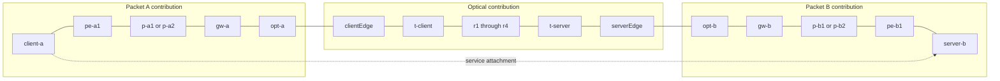

This overview groups alternatives and the ROADM chain for readability. The
[exact baseline diagram](../../data-plane.md#topology-and-ownership) expands
all 20 entities and packet links. Replicate the individual nodes and typed
relationships, not a single synthetic node named “p-a1 or p-a2.”

### Shared-state use

Each owner contributes approved topology/configuration records; peers keep a
local replica for path and dependency analysis. Validate origin, scope, and
freshness when consuming records. A complete graph is not complete live telemetry:
agents may still need fresh local/peer observations before deciding.

The implementation needs snapshots, incremental updates, deletion handling, and
resynchronization, using established exchange facilities. Persist source versions
and clearly mark unavailable evidence. Optimizers and learners must not invent
a missing link, optical alternative, capacity, or observation.

## Database ownership and replication

Each networking domain operates its own DSO database. There is no single shared
database connection and no central writer. The DSOs synchronize selected state
through signed A2A messages, so every database contains a complete logical view
of the multi-domain topology while the originating domain remains authoritative
for its own records.

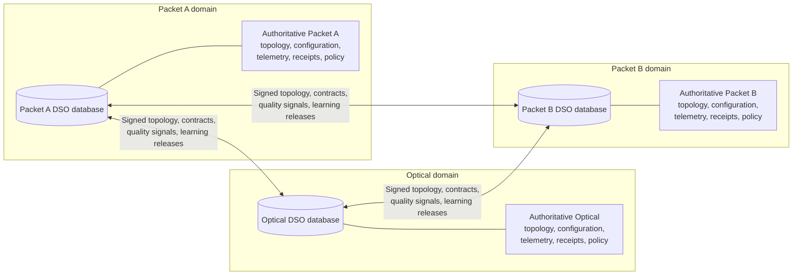

Every DSO database has these logical partitions:

| Partition | Contents | Writer |
|---|---|---|
| Local authoritative state | The domain's source topology/configuration records, raw telemetry, local policy, private cost model, controller credentials, and local controller receipts | Its owning DSO only |
| Federated topology replica | Signed nodes, interfaces, links, relationships, and approved configuration records from all three domains, including the owner's own records | Owner writes; peer DSOs apply verified replicas only |
| Shared contract replica | Signed service-contract revisions, offers, acceptances, incident coordination leases, reservation summaries, and verification summaries | The originating signer writes each record; every DSO verifies and stores it |
| Swarm and learning replica | Signed quality signals, candidate summaries, verified feedback, and approved learning releases | The origin DSO writes; peers accept or reject after verification |
| Vector RAG index | Locally embedded runbooks, policies, MCP tool documentation, change/incident records, approved learning releases, and accepted peer knowledge releases | Each DSO indexes its own authorized corpus locally |
| GraphRAG projection | Federated topology/configuration graph enriched with service, path, reservation, evidence, incident, candidate, controller-receipt, and outcome relationships | Source records retain their owner; each DSO materializes its own queryable graph view |
| Local audit journal | Full local evidence, policy decisions, controller request/response details, and immutable trace links | Its owning DSO only |

The result is **logical sharing with physical separation**. For example, the
Optical DSO publishes a signed configuration record for a channel and every DSO
stores the same read-only replica. Only the Optical DSO can revise that channel,
ask its optical controller to reserve it, or commit a change.

### Recommended concrete database profile

Use this stack in every domain:

| Store | Technology | Authoritative data |
|---|---|---|
| DSO system of record and vector RAG | PostgreSQL with `pgvector` | Service contracts, A2A journal/outbox, topology/configuration source records and replicas, reservations, controller receipts, policies, audit records, RAG chunks, embeddings, and provenance. |
| Telemetry | PostgreSQL time-partitioned tables; TimescaleDB where sustained telemetry volume warrants it | Packet, optical, controller, and endpoint measurements. |
| GraphRAG projection | Neo4j | Revision-bound topology plus service/path/resource/configuration/evidence/incident/candidate/reservation/outcome relationships. |
| Evidence archive | Optional domain-local object storage | Large raw evidence such as PCAPs, snapshots, traces, and source documents; PostgreSQL stores digests and references. |

PostgreSQL is the DSO's transactional system of record. `pgvector` keeps vector
embeddings with the source/provenance fields that govern RAG retrieval; an HNSW
index is the appropriate initial approximate-nearest-neighbor index. Neo4j is a
separate read-optimized graph projection for GraphRAG traversal. A committed
PostgreSQL outbox event materializes source changes into Neo4j. The materializer
preserves source revision and digest, and `graphrag_subgraph_retrieval` rejects a
projection that does not match the current graph/service decision.

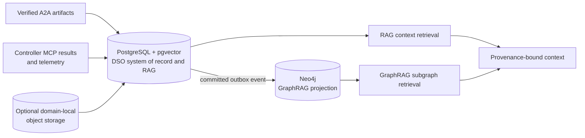

Topology replicas converge eventually through origin sequence numbers, signed
snapshots, deltas, and graph digests. Service-changing operations demand a
stronger boundary: participants agree on a contract and graph snapshot, while
each controller checks its current protected resource conditions before local
acceptance. Matching digests do not establish that no newer state exists. The
distributed saga and signed receipts provide cross-domain coordination; they do
not provide atomic physical activation or require a shared database.

## RAG and GraphRAG knowledge layer

Each domain AI agent has a local **vector database** and a local **GraphRAG
projection**. These are retrieval systems owned by the DSO's domain database
boundary; they do not introduce a central knowledge service.

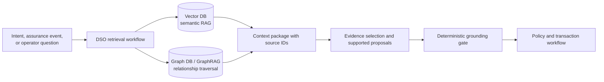

The vector database indexes unstructured or semi-structured material that is
useful for semantic retrieval: operating procedures, network and service design
documents, policy text, YANG/OpenConfig/T-API model documentation, Controller
MCP tool descriptions, change records, incident reports, evidence summaries,
and approved learning releases. Each chunk carries source ID, owner, schema or
document version, authorization classification, issue/expiry time, and digest.

The GraphRAG projection is a queryable knowledge graph rooted in the
FederatedTopologyGraph. It adds service-to-path, path-to-resource,
resource-to-configuration, observation-to-entity, incident-to-suspicion,
candidate-to-action, reservation-to-resource, and controller-receipt-to-action
relationships. It answers questions that require traversal rather than semantic
similarity, for example:

- Which active services cross this failed optical channel or packet link?
- Which alternative paths satisfy the current QoS budget and avoid the incident?
- Which configuration revisions, reservations, and controller changes produced
  this measured degradation?

RAG and GraphRAG work together in a retrieval workflow: resolve relevant graph
entities from the current contract or incident; traverse a revision-bound,
bounded subgraph; retrieve semantically relevant documents and evidence chunks;
then give the AI agent a context package that cites every source. A deterministic
grounding gate rejects unsupported citations, stale records, out-of-scope
documents, and output that proposes an action outside the verified candidate
set.

Topology/configuration and service facts arrive through their existing signed
A2A extensions and are materialized locally into the graph projection. A domain
may share an approved knowledge release through `knowledge-federation/v1`; each
receiving DSO verifies authorization, provenance, digest, and expiry before
indexing it. Vector embeddings and private raw documents are not implicitly
replicated merely because a topology record is shared.

### Deterministic graph algorithms

GraphRAG retrieves the relevant graph context; deterministic algorithms then
answer the exact path and impact questions needed by the DSO. Run them against
an in-memory or queryable graph snapshot bound to one verified graph revision,
never against an unbounded live controller query.

| Algorithm | Use in the DSO workflow |
|---|---|
| Breadth-first search (BFS) | Check whether source and destination remain reachable, calculate hop-based neighborhoods, and find services/resources immediately affected by a node, link, channel, or configuration incident. |
| Depth-first search (DFS) | Enumerate bounded simple paths, detect cycles, and identify alternate topology branches. The DFS depth, candidate count, and visited-node budget are explicit policy limits. |
| Dijkstra or constraint-based shortest path | Rank reachable paths by latency, cost, capacity, loss, risk, QoT, and configuration compatibility after BFS/DFS has established the feasible scope. |
| K-shortest disjoint path search | Produce diverse primary/backup candidates that avoid a failed resource or shared-risk group. |

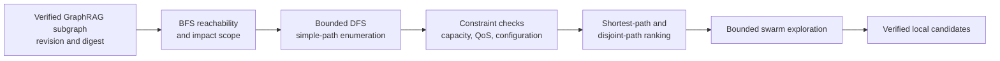

For example, an optical-channel impairment first triggers BFS from the affected
channel to identify active dependent services and adjacent packet attachments.
Bounded DFS enumerates alternate end-to-end paths that avoid the impacted
resource. Constraint-based ranking discards paths that cannot meet the SLA or
configuration rules. Only then do swarm scouts and game-theoretic bargaining
consider the remaining candidates.

## Adaptive agent decision loop

This proposed refinement gives the two online LLM nodes an observable influence
on behavior while retaining deterministic authorization. It reuses the existing
57 documented nodes; it does not add a second agent or a raw-command interface.
The learning graph is required. `hypothesis_generation` is invoked when a bounded
learning hypothesis is needed; the numerical learner also has a deterministic
hypothesis/template path for the no-LLM comparison.

An intent or fresh receiver symptom starts a bounded cycle: assemble available
evidence and missing facts, select a permitted observation or supported proposal,
validate and dispatch, incorporate the result or peer feedback, then negotiate
and execute only when justified. Verify the outcome using fresh receiver data.
Full approved-topology replication supplies dependencies, not omniscient live
telemetry. A throughput drop can require evidence from any of the three owners.

| Existing node/path | Proposed decision-loop responsibility |
| --- | --- |
| `reasoning_context_assembly` | Supply attributable evidence, missing/contradictory facts, the permitted observation catalogue, verified candidates, peer constraints, and remaining budgets. |
| `advisory_reasoning` | Propose the next observation, select/rank a verified offer or counteroffer, or propose deferral/refusal with cited evidence. |
| `fault_and_impact_reasoning` | Maintain an evidence-grounded diagnosis and propose a discriminating observation or a supported remediation candidate. |
| `candidate_verification` / `local_policy_selection` | Validate proposal type, catalogue/candidate IDs, arguments, scope, evidence, and budget. Consume an accepted choice according to a declared policy; otherwise use a recorded fallback. |
| `local_candidate_generation` | Dispatch validated, catalogued local observe/validate requests through local MCP; rebuild feasible candidates from new evidence. |
| `peer_contract_negotiation` | Dispatch authorized peer evidence requests and exchange proposals. Return peer evidence, constraints, or refusal to the decision loop. |
| `remediation_dispatch` | Validate assurance proposals and select the read-only evidence path, the shared lifecycle path, or explicit escalation/deferral. |
| Verification and journal nodes | Record fresh service outcomes and the full evidence-to-decision trace, including rejected advice and unresolved results. |

Specify a typed proposal containing `decision_kind` (`observe`, `propose`,
`counteroffer`, `defer`, or `refuse`), observation/candidate IDs as applicable,
bounded arguments, evidence references, missing facts, confidence, and rationale.
An inferred diagnosis must be marked as such, not inserted as an observed fact.
Every proposed read is checked for identity, local/peer scope, parameters, and
budget before dispatch. No model directly invokes MCP, signs a contract,
reserves resources, invents an action, or changes another domain's resources.

Set per-incident deadlines and maximum observation calls, model calls, and
negotiation rounds. Revisiting the loop requires new evidence/feedback or a
bounded retry; budget exhaustion triggers the documented fallback or deferral.
Missing evidence may justify a permitted read but cannot authorize a dependent
write. Stale context must be marked and refreshed before any dependent action.

Log the proposal, input evidence IDs, gate decision, actual selected action,
new observation, and subsequent decision. If local policy always ignores the
model's choices, no decision benefit may be attributed to the model. Likewise,
when deterministic enumeration already finds the optimum over all eight known
configurations, do not claim a better optimum from an LLM. Test its incremental
value in diagnosis, evidence acquisition, and responses to peer feedback.
Freeze base LLM weights, prompts, hard policy, utility definitions, and update
rules. Predictor parameters evolve across episodes under the declared learning
schedule; record which version each decision consumes.

The [matched baselines](experimental-validation.md#5-systems-and-baselines)
separate generative reasoning, adaptive acquisition, and decision placement.
The initial demonstration is an established UDP flow, a receiver degradation
symptom, local/peer observations, a supported repair or truthful unresolved
outcome, and independent verification—not an explanation-only trace.

## DSO LangGraph design

Each DSO runs four LangGraphs over one durable local state store: topology
federation, service lifecycle, assurance/recovery, and asynchronous continual
learning. Together they contain 57 documented nodes: 8 topology-federation
nodes, 29 service-lifecycle nodes, 7 assurance/recovery nodes, 12
continual-learning nodes, and one shared reasoning-context node. They share the
same `FederatedTopologyGraph`, but a topology update or learning result cannot
cause a controller change by itself.

The [LangGraph node catalogue](langgraph-node-catalog.md) gives the execution
method, algorithm, backend, and LLM status for every documented node.

### Unified Domain Agent Runtime

The **AI agent is the DSO**: one deployable, persistent **Domain Agent Runtime**
per domain. Its LangGraph runs deterministic lifecycle, policy, and execution
nodes continuously. It conditionally invokes an LLM only from named reasoning
nodes after deterministic grounding and policy gates. The LLM is a tool of the
DSO, not a second agent or a separate control plane.

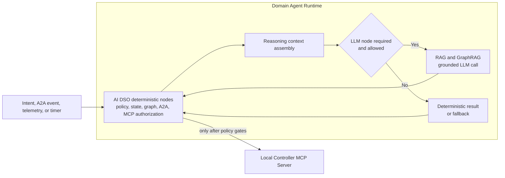

Only three nodes optionally require a generative LLM. All other 54 nodes use
non-generative policy, retrieval, graph algorithms, optimization, peer
handling, or controller/database integration. ACO is stochastic even when its
seed is recorded; embedding-based retrieval can use learned models. These are
distinct from generative LLM reasoning.

The shared deterministic `reasoning_context_assembly` node builds the complete
**decision-relevant** situation package before every LLM call. It includes the
canonical user or component intent, service-contract and correlation state,
authorized identity and scope, triggering event or incident, current topology
and configuration revisions, GraphRAG subgraph, time-bound telemetry evidence,
applicable policy and hard constraints, feasible candidate set with computed
scores, permitted observation catalogue, remaining decision budgets, peer offers
and reservation state, uncertainty, provenance references, and the required
structured response schema. Required dependencies and missing
or contradictory evidence are identified explicitly, while secrets, unrelated
tenant data, and unauthorized topology detail are filtered. This is a defined
decision-context contract, not an assumption of perfect network knowledge.

The AI DSO never waits indefinitely for an LLM. Before any LLM call, its
deterministic nodes require an authorized request and an assembled provenance-bound
context with explicit revision/freshness status. Missing or stale observations
may lead to authorized evidence acquisition; dependent writes still require
current, validated evidence. A timeout,
failure, unsupported answer, or policy refusal follows the documented
deterministic fallback and keeps the closed loop running. No LLM response can
invoke MCP, change a reservation, accept a peer contract, or commit a
configuration without the subsequent deterministic nodes approving it.

| Optional LLM node | LLM role | Deterministic fallback |
|---|---|---|
| `advisory_reasoning` | Propose a catalogued observation, select/rank a verified offer or counteroffer, or propose deferral/refusal. | Use the declared evidence-driven rules and fixed candidate score; defer when required evidence is absent. |
| `fault_and_impact_reasoning` | Diagnose probable cause/impact, select a discriminating observation, or propose a supported remediation candidate. | Use evidence thresholds, dependency traversal, and documented diagnostic rules. |
| `hypothesis_generation` | Propose a bounded learning hypothesis from comparable traces in the required learning workflow. | Use a predefined hypothesis/template while retaining the numerical learner; skip updates when evidence is insufficient. |

The LLM response must cite the supplied evidence and candidate IDs, state its
confidence and assumptions, and use the node-specific structured schema. It
cannot introduce a new controller action, topology fact, peer commitment, or
candidate outside the assembled package.

The following nodes do not contact a generative LLM:

| Graph | Non-generative nodes |
|---|---|
| Topology federation | `topology_event_ingest`, `peer_identity_gate`, `topology_message_verifier`, `topology_reconciler`, `graph_apply`, `graph_integrity_gate`, `topology_impact_analysis`, `topology_ack_and_journal` |
| Service lifecycle | `intent_intake_and_normalization`, `service_event_ingest`, `identity_and_entitlement_gate`, `service_context_load`, `topology_freshness_gate`, `rag_context_retrieval`, `graphrag_subgraph_retrieval`, `retrieval_grounding_gate`, `graph_reachability_and_impact`, `bounded_path_enumeration`, `constraint_path_ranking`, `qos_budget_derivation`, `path_and_dependency_analysis`, `swarm_state_refresh`, `swarm_candidate_exploration`, `swarm_candidate_aggregation`, `local_candidate_generation`, `candidate_verification`, `local_policy_selection`, `local_utility_evaluation`, `peer_contract_negotiation`, `bargaining_solution_gate`, `local_reservation`, `reservation_barrier`, `commit_authorization_gate`, `controller_transaction`, `service_verification`, `service_outcome_journal` |
| Assurance and recovery | `assurance_event_ingest`, `evidence_normalization`, `service_health_evaluation`, `incident_creation_or_update`, `remediation_dispatch`, `assurance_trace_and_journal` |
| Continual learning | `decision_trace_ingest`, `peer_outcome_correlation`, `comparable_trace_retrieval`, `novelty_gate`, `provenance_validator`, `experiment_planner`, `safe_experiment_runner`, `evaluation_gate`, `promotion_gate`, `publish_learning_release`, `reject_or_revoke` |
| Shared reasoning utility | `reasoning_context_assembly` |

Retrieval and integration nodes use explicit backends; their execution methods
are distinguished in the node catalogue:

| Backend | Nodes that use it | Role |
|---|---|---|
| PostgreSQL | All nodes | Durable LangGraph state, A2A inbox/outbox, topology/configuration records, service contracts, reservations, receipts, audit trace, and learning jobs. |
| `pgvector` | `rag_context_retrieval` | Semantic RAG over authorized documents and evidence chunks. Embedding generation may use a local or hosted embedding model; it is not generative reasoning. |
| Neo4j GraphRAG projection | `graphrag_subgraph_retrieval`, `graph_reachability_and_impact`, `bounded_path_enumeration`, `constraint_path_ranking`, `path_and_dependency_analysis`, `topology_impact_analysis`, `fault_and_impact_reasoning` | Revision-bound topology, service, resource, configuration, evidence, incident, and outcome traversal. BFS, DFS, and path algorithms use the verified graph snapshot. |
| A2A | All topology-federation nodes, `peer_contract_negotiation`, `reservation_barrier`, `service_verification`, `peer_outcome_correlation` | Agent Cards, signed peer artifacts, task/context correlation, topology synchronization, contracts, reservations, verification, and learning exchange. |
| Controller MCP Server | `local_candidate_generation`, `local_reservation`, `commit_authorization_gate`, `controller_transaction`, `service_verification` | Read controller capabilities/state and perform approved validate, reserve, prepare, commit, rollback, and verify transactions. |
| Telemetry store | `evidence_normalization`, `service_health_evaluation`, `fault_and_impact_reasoning`, `assurance_trace_and_journal` | Packet, optical, controller, border, and endpoint evidence for the closed loop. |

### Node inventory

**Topology federation (8)**

- `topology_event_ingest`
- `peer_identity_gate`
- `topology_message_verifier`
- `topology_reconciler`
- `graph_apply`
- `graph_integrity_gate`
- `topology_impact_analysis`
- `topology_ack_and_journal`

**Service lifecycle (29)**

- `intent_intake_and_normalization`
- `service_event_ingest`
- `identity_and_entitlement_gate`
- `service_context_load`
- `topology_freshness_gate`
- `rag_context_retrieval`
- `graphrag_subgraph_retrieval`
- `retrieval_grounding_gate`
- `graph_reachability_and_impact`
- `bounded_path_enumeration`
- `constraint_path_ranking`
- `qos_budget_derivation`
- `path_and_dependency_analysis`
- `swarm_state_refresh`
- `swarm_candidate_exploration`
- `swarm_candidate_aggregation`
- `local_candidate_generation`
- `advisory_reasoning`
- `candidate_verification`
- `local_policy_selection`
- `local_utility_evaluation`
- `peer_contract_negotiation`
- `bargaining_solution_gate`
- `local_reservation`
- `reservation_barrier`
- `commit_authorization_gate`
- `controller_transaction`
- `service_verification`
- `service_outcome_journal`

**Assurance and recovery (7)**

- `assurance_event_ingest`
- `evidence_normalization`
- `service_health_evaluation`
- `incident_creation_or_update`
- `fault_and_impact_reasoning`
- `remediation_dispatch`
- `assurance_trace_and_journal`

**Continual learning (12)**

- `decision_trace_ingest`
- `peer_outcome_correlation`
- `comparable_trace_retrieval`
- `novelty_gate`
- `hypothesis_generation`
- `provenance_validator`
- `experiment_planner`
- `safe_experiment_runner`
- `evaluation_gate`
- `promotion_gate`
- `publish_learning_release`
- `reject_or_revoke`

**Shared reasoning utility (1)**

- `reasoning_context_assembly`

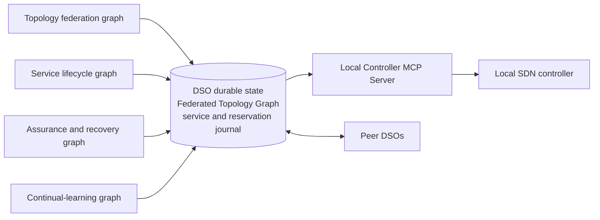

### 1. Topology federation graph

This graph runs on a peer handshake, snapshot request, or topology/configuration
delta. It is the agent equivalent of maintaining an OSPF link-state database.

| Node | Responsibility |
|---|---|
| `topology_event_ingest` | Classify a handshake, snapshot, delta, withdrawal, or resynchronization request and bind its peer/correlation IDs. |
| `peer_identity_gate` | Verify mTLS identity, Agent Card capability, peer authorization, and supported schema versions. |
| `topology_message_verifier` | Validate message schema, origin-domain ownership, signature, sequence number, expiry, and content digest. |
| `topology_reconciler` | Compare advertised revisions with the local revision vector and request the required snapshot or missing delta range. |
| `graph_apply` | Atomically apply an owner-signed node, interface, link, relationship, configuration, or tombstone change. |
| `graph_integrity_gate` | Validate endpoint existence, layer compatibility, graph connectivity, configuration references, and the resulting graph digest. |
| `topology_impact_analysis` | Identify services, reserved resources, paths, and pending negotiations affected by the change. |
| `topology_ack_and_journal` | Persist the replica revision, emit a signed synchronization acknowledgement, and enqueue impacted services for assurance. |

### 2. Service lifecycle graph

This graph runs when a local user or trusted component submits intent, or when
a peer sends a service contract event. It replaces the single central Service Orchestrator with the
same bounded lifecycle in every domain.

| Node | Responsibility |
|---|---|
| `intent_intake_and_normalization` | Receive an intent from a user-facing northbound API or trusted local component, validate its schema and idempotency key, preserve the original request, translate it into the canonical intent model, and create a correlation-specific service record. It does not authorize the request, select a path, contact peers, or call a controller. |
| `service_event_ingest` | Accept a signed peer contract, reservation, verification, or lifecycle event and load the correlation-specific service record. |
| `identity_and_entitlement_gate` | Authenticate the user or peer and verify tenant, endpoint, and service authority. |
| `service_context_load` | Load the local service state, prior receipts, reservation state, peer lifecycle state, and current graph digest. |
| `topology_freshness_gate` | Require the topology/configuration revisions referenced by the request to be present, valid, and not stale. |
| `rag_context_retrieval` | Retrieve authorized, semantically relevant runbooks, policies, controller-tool documentation, incidents, and learning releases from the local vector database. |
| `graphrag_subgraph_retrieval` | Traverse the revision-bound graph projection for relevant service, path, resource, configuration, evidence, and incident relationships. |
| `retrieval_grounding_gate` | Bind context to its sources and reject stale, unauthorized, out-of-scope, or unsupported retrieval before AI reasoning. |
| `reasoning_context_assembly` | Build the authorized, revision-bound package for a named LLM node, including available/missing evidence, permitted observations, constraints, feasible candidates, peer state, remaining budgets, provenance, and response schema. |
| `graph_reachability_and_impact` | Run BFS over the verified graph snapshot to establish reachability and affected-resource/service scope. |
| `bounded_path_enumeration` | Run policy-bounded DFS and disjoint-path search to produce diverse simple path alternatives. |
| `constraint_path_ranking` | Apply deterministic capacity, SLA, risk, QoT, and configuration constraints before swarm exploration. |
| `qos_budget_derivation` | Turn the end-to-end intent into local bandwidth, latency, loss, availability, and deadline contributions. |
| `path_and_dependency_analysis` | Traverse the federated graph to identify the selected path, domain handoffs, shared-risk resources, and configuration dependencies. |
| `swarm_state_refresh` | Read current signed swarm-quality signals for the graph entities and service class under consideration. |
| `swarm_candidate_exploration` | Run required ACO discrete exploration and PSO continuous allocation with separate seeds, budgets, feasibility checks, and traces; no device changes. |
| `swarm_candidate_aggregation` | Aggregate scouts into a small, diverse, deduplicated candidate set with reproducible score components. |
| `local_candidate_generation` | Generate only controller-feasible local actions and predicted effects; dispatch validated catalogued local observations and refresh candidates from their results. |
| `advisory_reasoning` | Propose the next permitted observation, select/rank a verified offer or counteroffer, or propose deferral/refusal; no invented actions or authoritative peer commitments. |
| `candidate_verification` | Validate typed proposals, catalogue IDs, arguments, scope, budgets, and evidence; ground every candidate and reject unsupported claims. |
| `local_policy_selection` | Apply policy, cost, risk, disruption, and rollback rules. Consume an accepted observation/proposal choice under the declared selection policy, or record the deterministic fallback. |
| `local_utility_evaluation` | Calculate this domain's utility and disagreement value for each policy-approved candidate. |
| `peer_contract_negotiation` | Exchange authorized evidence requests/responses and signed offers, counteroffers, acceptances, and rejections with path DSOs; return feedback to the bounded decision loop. |
| `bargaining_solution_gate` | Require a mutually beneficial agreement plus matching contract revision, graph digest, path, QoS budget, and peer acknowledgements. |
| `local_reservation` | Reserve and prepare the named operation through local MCP; persist expiry, protected conditions, expected transitions, and compensation references. |
| `reservation_barrier` | Wait for valid reservation receipts from every affected DSO; route to expiry or compensation on rejection/timeout. |
| `commit_authorization_gate` | Recheck agreement, dependencies, policy, reservation, and coordination epoch; supply expected conditions for controller enforcement. |
| `controller_transaction` | Request conditional acceptance through local MCP, reconcile uncertain outcomes with `get_transaction`, or attempt compensation; persist each observed result. |
| `service_verification` | Evaluate local and border measurements, then exchange signed verification summaries with the peers. |
| `service_outcome_journal` | Record verified, failed, partial, or unresolved outcomes, notify the initiating DSO, and retain recovery-task references; only eligible terminal traces enter learning. |

```mermaid
flowchart LR
    IN[User or trusted component intent] --> INTAKE[Intent intake and normalization]
    P[Signed peer service event] --> E[Service event ingest]
    INTAKE --> I[Identity and context gates]
    E --> I
    I --> F[Topology freshness and QoS budget]
    F --> K[RAG and GraphRAG\nprovenance-bound context]
    K --> GA[BFS, bounded DFS,\nand constraint path ranking]
    GA --> D[Path and dependency analysis]
    D --> S[Required ACO and PSO search]
    S --> C[Local candidates]
    C --> RC[Assemble available evidence and permitted choices]
    RC --> AD[Typed reasoning proposal or deterministic choice]
    AD --> V[Evidence, scope, budget, and policy verification]
    V -->|Approved observation| OBS[Local read or authorized A2A evidence request]
    OBS --> C
    V -->|Defer or refuse| J[Journal outcome and stopping reason]
    V -->|Supported proposal| U[Local utility evaluation]
    U --> N[Peer bargaining]
    N -->|New constraints or evidence within budget| C
    N --> B{Mutual agreement?}
    B -->|No further permitted attempt| J
    B -->|Yes| R[Reserve locally]
    R --> G{All receipts valid?}
    G -->|No| J
    G -->|Yes| X[Commit through local controller]
    X --> Q[Verify service]
    Q --> J
```

### 3. Assurance and recovery graph

This graph runs on local telemetry, a peer status event, a topology impact event,
or a verification failure. It uses the same candidate, negotiation, reservation,
commit, and outcome nodes as the service lifecycle graph rather than creating a
second controller path.

| Node | Responsibility |
|---|---|
| `assurance_event_ingest` | Receive telemetry, peer evidence, topology-impact, or service-verification events. |
| `evidence_normalization` | Convert source measurements to typed, timestamped evidence bound to graph entities and configuration revisions. |
| `service_health_evaluation` | Determine whether the domain's contribution and the received end-to-end evidence meet the contract. |
| `incident_creation_or_update` | Create, deduplicate, or update the domain-local incident and bind it to the affected graph revision. |
| `fault_and_impact_reasoning` | Diagnose probable cause and dependencies; propose a discriminating catalogued observation or supported remediation candidate, subject to deterministic validation. |
| `remediation_dispatch` | Validate assurance proposals and budgets; dispatch permitted local/peer evidence requests, re-enter the shared lifecycle for a supported repair, or defer/escalate with a reason. |
| `assurance_trace_and_journal` | Persist evidence IDs, diagnosis, proposals, gate results, actual choices, peer feedback, action receipts, and final health outcome. |

The durable DSO state shared by these graphs includes the topology revision
vector and graph digest, service contract revision, correlation ID, local and
peer lifecycle states, candidate-set digest, reservation receipts, controller
receipts, evidence references, and immutable audit trace. Packet A, Optical,
and Packet B use the same node names; their local candidate, controller,
telemetry, and configuration adapters differ by domain.

## Per-domain closed loop

Every DSO runs its own continuous MAPE-K loop—Monitor, Analyze, Plan, Execute,
with shared Knowledge. It is scheduled at a domain-defined interval and also
wakes immediately on local telemetry, a topology/configuration delta, a peer
status event, a reservation expiry, or a failed verification.

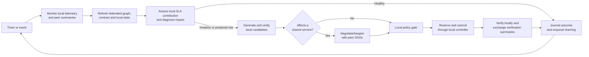

| Loop stage | DSO behavior |
|---|---|
| Monitor | Read domain-scoped telemetry, controller state, service probes, configuration state, and signed peer summaries. Packet DSOs observe loss, latency, queues, utilization, and route state; the Optical DSO observes spectrum, QoT/gOSNR, transponder, and ROADM state. |
| Analyze | Normalize evidence, refresh the federated graph, assess the local contribution to every active service, correlate local changes with peer evidence, and classify health, degradation, or risk. |
| Plan | Traverse the full topology graph, generate controller-feasible local candidates, calculate local QoS/cost/risk utility, and determine whether the action can affect another domain's service. |
| Execute | For an isolated local action, use the local policy gate. For an action affecting a shared service, complete bargaining and reservation with every affected DSO first. The owning DSO alone invokes its Controller MCP Server's named prepare/commit/rollback operation. |
| Verify | Collect fresh local and border measurements, exchange signed verification summaries, and mark the contract healthy only when its applicable end-to-end evidence satisfies the agreed SLA. |
| Knowledge | Persist topology/configuration revisions, service contracts, evidence, incidents, offers, reservations, controller receipts, outcomes, and approved learning releases. |

The normal closed-loop path can finish with no action: a healthy assessment
records fresh evidence and returns to monitoring. An AI recommendation cannot
skip from Analyze to Execute; it must pass candidate verification, local policy,
cross-domain bargaining when applicable, reservation, commit authorization, and
verification.

### Coordinating three domain loops

Correlate observations by service and incident so owners can share evidence and
avoid repeated repairs. Use bounded replanning, hysteresis, and action-rate limits.
Each affected owner still approves its contribution and verifies its own outcome.
If required peer evidence or acceptance is unavailable, defer the shared change.

Measure oscillation and unnecessary changes during assurance experiments.
Do not infer high availability from a three-agent cooperative demonstration.

### 4. Continual-learning graph

Each DSO also runs an asynchronous **Domain Learning Graph**.
This is required, with actual incremental QoS/disruption predictor updates,
bounded replay, past-only validation, and use in subsequent optimizer/utility
estimates; see the [learning specification](agentic-system-method.md#continual-learning-actual-updates-across-service-episodes).
Memory retrieval alone does not satisfy this requirement. Freeze a predictor
within an active episode and promote updates only for subsequent decisions. The
`service_outcome_journal` and `assurance_trace_and_journal` nodes enqueue a
learning job after a terminal service outcome; they never wait for learning
before completing a service request or recovery action.

```text
decision_trace_ingest → peer_outcome_correlation → comparable_trace_retrieval
→ novelty_gate → hypothesis_generation → provenance_validator
→ experiment_planner → safe_experiment_runner → evaluation_gate
→ promotion_gate → publish_learning_release or reject_or_revoke
```

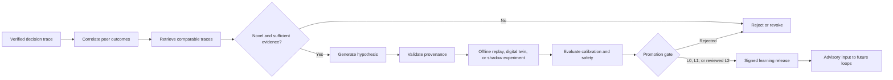

| Node | Responsibility |
|---|---|
| `decision_trace_ingest` | Read the immutable local service, negotiation, topology/configuration, controller-receipt, and verification trace. |
| `peer_outcome_correlation` | Match signed peer outcome summaries to the same service contract, graph digest, and time window. |
| `comparable_trace_retrieval` | Retrieve prior outcomes with comparable topology, configuration, traffic, and service conditions. |
| `novelty_gate` | Stop duplicate, too-small, stale, or contradicted learning jobs. |
| `hypothesis_generation` | Propose a bounded explanation or prediction improvement, such as a QoS forecast, risk calibration, cost calibration, or negotiation-ranking feature. |
| `provenance_validator` | Require attributable evidence, valid graph/configuration revisions, and a reproducible training/evaluation dataset. |
| `experiment_planner` | Define an offline replay, digital-twin simulation, or shadow evaluation. It cannot schedule an uncontrolled live experiment. |
| `safe_experiment_runner` | Fit the incremental predictor on new/past replay data, run approved past-only validation, and retain inputs, parameter versions, and results. |
| `evaluation_gate` | Measure calibration, prediction error, safety regressions, bargaining outcome quality, and sample sufficiency against a held-out baseline. |
| `promotion_gate` | Decide whether the result can remain observational, enter shadow ranking, require operator review, or be rejected/revoked. |
| `publish_learning_release` | Sign and version the approved finding/model release with its scope, expiry, evidence digest, and applicability conditions. |
| `reject_or_revoke` | Preserve the failed result and withdraw a prior release that is no longer valid. |

The three DSOs learn locally from the same end-to-end outcome but contribute
different evidence: Packet A and Packet B learn packet path, queue, and
endpoint behavior; Optical learns spectrum, QoT, transponder, and transport
behavior. They exchange signed **learning releases**, not unrestricted model
writes. A release binds its model/finding to topology and configuration
revisions, service type, evidence digest, measured result, confidence, and
expiry. A receiving DSO independently verifies and either accepts the release
for its own advisory use or ignores it.

Learning has three promotion levels:

| Level | Permitted use |
|---|---|
| L0 — observational | Publish measured correlations and calibration facts; no service decision changes. |
| L1 — bounded predictor use | Promote an owner-approved predictor release into ACO/PSO and utility estimates after past-only regression checks; hard policy and local approval remain unchanged. |
| L2 — reviewed policy input | Supply a bounded parameter update to an approved policy/risk model after operator review and replay evidence. |

No learning release may create a controller action, modify a topology/configuration record owned by another DSO, lower a hard safety constraint, or commit a service. The service lifecycle graph still performs candidate verification, bargaining consensus, reservation, commit authorization, and controller transaction independently.

## Game-theoretic coordination

The three DSOs are separate owners, so path feasibility alone does not imply
agreement. Model Packet A, Optical, and Packet B as players in a cooperative
bargaining game. The Federated Topology Graph gives all players the same view of
what can be connected; each player still evaluates the impact on its own
capacity, risk, operational policy, and commercial terms.

For a joint candidate `a = (z,b)` containing discrete paths/channels and continuous
allocations, with an owner-approved local contribution per domain, let `F(G)` be the
set of candidate actions feasible under the agreed graph `G` and locally checked
resource conditions. Admission requires end-to-end connectivity, configuration
compatibility, sufficient capacity, applicable optical spectrum/transponder/QoT
constraints, and no hard policy violation. Reservations are obtained after
agreement and rechecked before activation; graph reachability is not optical
feasibility. Each domain calculates a local utility:

```text
U_i(a, x_i) = SLA/revenue benefit_i(a) + settlement_i(x_i)
              - resource cost_i(a) - disruption_i(a)
              - risk_i(a) - policy penalty_i(a)
```

`x_i` is an optional settlement, price, or internal credit associated with the
contract. In a research prototype it can be a virtual credit rather than a
payment. Each DSO also has a disagreement value `d_i`: normally retain the
current service state or reject a new-service request. A contract is admissible
only if it meets the user intent and is individually rational for every domain:

```text
U_i(a, x_i) >= d_i   for Packet A, Optical, and Packet B
```

For equal peers, select the feasible contract using a weighted Nash bargaining
solution:

```text
maximize  sum_i weight_i * log(U_i(a, x_i) - d_i)
subject to a in F(G), U_i(a, x_i) > d_i, and end-to-end SLA satisfied
```

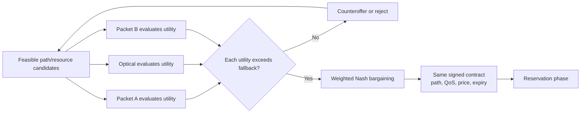

The weights are a published service policy, such as equal weight for three
operators or higher weight for a premium tenant's ingress operator. They must
be contract fields, never model-generated values. This method favors a service
option that improves every participating domain over its fallback, rather than
choosing the option with the highest benefit to only one domain.

For the recommended cooperative prototype, each domain publishes a signed
candidate-specific gain `g_i(a) = U_i(a) - d_i`, its utility-model version, and
the agreed scale/normalization. Every participant computes the same objective
over the same candidate set and declared weights. Cost coefficients can remain
local, but disclosed gains are not private and may reveal commercial information.
Refusal to share the required gains prevents use of this calculation; specify a
different agreement mechanism rather than assuming invisible access to utilities.

The log objective requires strictly positive gains. If none of the feasible
candidates satisfies that condition for every domain, return no agreement or
use a separately documented weak-acceptance policy; do not evaluate `log(0)`.
Use a fixed tie-break rule for equal finite-candidate scores. This is a Nash
bargaining objective, not a claim of Nash equilibrium, truthful reporting,
strategy-proofness, uniqueness, or global optimality over unexplored paths.

### Cost quantification

Every DSO calculates cost in one agreed unit: a real currency for a commercial
deployment or a `service-credit` for a research prototype. Do not use an
unscaled score as cost, because the bargaining function must compare cost,
risk, and settlement in consistent units.

For domain `i` and a local candidate `a`, calculate the local resource cost as:

```text
C_i(a) = C_capacity + C_opportunity + C_operation + C_energy + C_risk
```

| Component | Quantification |
|---|---|
| `C_capacity` | Reserved resource quantity × reservation duration × domain unit rate. Packet domains use committed bandwidth/port/queue units; the optical domain uses spectrum slots, wavelength/transponder use, and optionally fiber distance. |
| `C_opportunity` | The cost of reducing future sellable capacity. Use a convex utilization function, for example `reference_cost × (utilization_after^p - utilization_before^p)` where `p > 1`; scarce links therefore cost more than idle links. |
| `C_operation` | Fixed cost for each approved controller transaction plus expected rollback/validation effort. It is zero for retain-current. |
| `C_energy` | Incremental watts × reservation hours / 1000 × the local price per kWh; preserve compatible units. |
| `C_risk` | Probability that the change or resource fails × the locally defined service/rollback impact cost. Historical failure data can calibrate the probability. |

The DSO keeps its unit rates, utilization curve, and risk model private. It
publishes a signed **quote** containing the total cost, optional margin, total
requested settlement, cost-model revision, currency, expiry, and resource
commitment. Price and cost are distinct:

```text
quoted settlement_i = C_i(a) + approved margin_i
utility_i = settlement_i - C_i(a) + local SLA/value benefit_i
```

The user intent should therefore contain `maximum_total_cost` and `currency`.
The bargaining solution must satisfy that budget as well as the SLA and the
individual-rationality condition. In a research demo, set the currency to
`service-credit`, configure fixed rates in each domain, and record the quote in
the service contract; no payment system is required.

As an illustrative economic model for a future capacity-allocation profile,
a two-hour 1 Gbps request might produce these service-credit
quotes: Packet A costs 14 credits and quotes 16, Optical costs 52 and quotes
58 because it reserves scarce spectrum/transponder capacity, and Packet B costs
13 and quotes 16. The end-to-end quoted price is 90 credits. A user budget below
90 forces the DSOs to negotiate a cheaper feasible path or reject the request.
These values are not measurements or supported spectrum reservations in the
fixed-channel UDP baseline; its quotes must be tied to the actual actions and
explicit experimental cost assumptions.

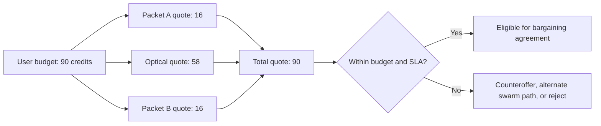

ACO supplies discrete candidates, PSO supplies continuous allocations, and Nash
bargaining selects a mutually acceptable result. Their roles and budgets are
specified in the [coupled method](agentic-system-method.md). Exact enumeration
on the eight-configuration fixture is a sanity check; richer allocation and
learning workloads are required to evaluate the complete contribution.

## Swarm optimization layer

**ACO and PSO are both required.** They are bounded numerical search routines
inside the DSO, not additional owners or LLM prompts. ACO explores discrete
packet paths and optical route/channel choices; PSO searches continuous
per-service bandwidth allocations conditional on those choices.

For an eligible edge, ACO samples in proportion to
`pheromone(edge)^alpha * heuristic(edge)^beta`. The heuristic combines current
observations, declared costs, and the current predictor's QoS/disruption estimates.
Record evaporation, seeding, update schedule, candidate diversity, and compute
limits. Verified outcomes may reinforce a path; unsupported model assertions
cannot. Learned estimates never replace hard feasibility checks.

PSO particles encode the bandwidth vector over competing services, not numeric
encodings of path names. Resource capacity and requested rate bounds constrain
the search. Use a declared repair/projection rule, independent feasibility checks,
and a fixed owner-aware fitness. Preserve a diverse feasible candidate set for
Nash selection; return no feasible allocation when appropriate.

The full formulation, update equations to specify, numerical references, and
learning interaction are in [agentic-system-method.md](agentic-system-method.md).
Keep path search, allocation search, and owner agreement separately measurable.

Current adapters do not enforce per-service bandwidth. Implement the richer
allocation simulator as required research work and add per-service enforcement
before claiming measured continuous allocation on the emulator. Do not assume
optical power/modulation controls or simultaneous wavelengths that do not exist.

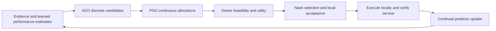

Peer exchanges carry quality observations, feasible candidate pairs, utility
gains, and verified feedback. Agents can request a new allocation on the same
path or new ACO alternatives in response to an owner's constraints, within the
same total decision budget. Run component and interaction ablations, retaining
all other mechanisms and local approvals.

### Bargaining message and decision rules

Each `BARGAINING_OFFER` binds the graph digest and contract revision and carries
the selected per-domain action IDs, predicted end-to-end QoS, reservation TTL,
rollback capability, settlement/credit proposal, and signed accept-by deadline.
It does not need to disclose a domain's private utility coefficients. A peer
independently evaluates the offer using its own utility function and responds
with `ACCEPT`, `COUNTEROFFER`, or `REJECT`.

The `bargaining_solution_gate` accepts a contract only when all three DSOs have
signed the exact same action tuple, graph digest, configuration revisions, QoS
budget, settlement, and expiry. It routes a rejection, expired offer, topology
change, or reservation failure to `service_outcome_journal` or compensating
rollback. No controller reservation or commit follows an incomplete agreement.

## Intent and service contract

An intent should state the desired outcome, never a path or a device command.
For the reused data plane, an illustrative structured intent is:

```json
{
  "intent_id": "intent-01J...",
  "tenant_id": "customer-42",
  "source": {"domain": "packet-a", "endpoint": "client-a"},
  "destination": {"domain": "packet-b", "endpoint": "server-b"},
  "service_type": "udp_connectivity",
  "traffic_profile": {"offered_load_mbps": 1, "udp_payload_bytes": 1400},
  "qos": {
    "minimum_bandwidth_mbps": 0.9,
    "maximum_latency_ms": 20,
    "maximum_packet_loss_ratio": 0.01
  },
  "deadline": "2026-09-18T14:30:00Z"
}
```

These are proposed schema fields and illustrative pilot targets, not measured
results. Define the delay metric/direction, measurement window, and future
deadline in the frozen experiment profile. The minimum bandwidth here is a
receiver-throughput objective, not a dedicated bandwidth reservation; offered
load is controlled at the sender. L3VPN creation, guaranteed bandwidth isolation,
and availability guarantees require additional capabilities and evidence before
the baseline can accept such intents.

The initiating DSO authenticates the user, checks entitlement for its own
domain, then converts the intent into a versioned `ServiceContract`. A contract
contains only what peers need to decide:

- opaque service, tenant, correlation and contract identifiers;
- ingress and egress border attachment identifiers;
- requested QoS envelope and each domain's budget/contribution;
- a candidate's capacity, cost class, predicted QoS contribution, risk,
  reservation lifetime, and rollback support;
- contract revision, issue/expiry time, nonce, sender identity, and signature.

It references the current signed topology and configuration revisions rather
than embedding a second copy. Controller credentials, private keys, and
LLM-generated configurations are never transferred.

End-to-end estimates compose conservatively: throughput is bounded by the
smallest domain contribution, latency is additive, and loss combines as
`1 - product(1 - domain_loss)`. An offered contract must meet the full intent
before it can be committed.

## Negotiated service decision

Record the accepted service objective, path/channel, bandwidth allocation where
supported, per-owner contributions and gains, cost units, predictor versions,
supporting evidence, and each owner's acceptance. A peer can counteroffer or
refuse; keep the reason and whether replanning changes the result.

Local execution uses the established controller adapters. Verify applied state
and end-to-end delivery; report unknown or failed outcomes explicitly. This
record makes the ACO–PSO–Nash–learning decision reproducible without making
wire-message design a separate research deliverable.

## What each agent reasons about

The current intent intake accepts a structured schema. A natural-language
translator would be a separately specified component with validated output;
it is not one of the three conditional LLM nodes. The two online nodes can select
permitted observations, diagnose, propose verified offers/counteroffers, or defer.
The third proposes bounded hypotheses in the required continual-learning workflow. Outputs are typed
proposals, not commands; accepted choices can influence behavior. Deterministic code
must enforce identity, policy, schema validation, QoS arithmetic, freshness,
candidate feasibility, reservation, and controller authorization.

Each agent's DSO produces a small candidate set such as `retain`, `provision path X`,
or `upgrade bandwidth tier Y`. Every candidate has evidence, feasibility,
predicted QoS effect, uncertainty, cost, disruption, risk, reservation TTL,
and rollback capability. The DSOs reason over the same replicated graph and
negotiate the selected end-to-end path, configuration compatibility, and terms;
each DSO still translates the selected path into only its own local operation.

The full system uses ACO discrete candidates, PSO continuous allocations,
owner-specific utility evaluation, Nash selection, and continually updated
performance predictors. A simpler deterministic choice is a development aid or
an evaluation baseline, not the complete proposed system.

## Required safety and trust controls

1. Authenticate users locally; authenticate peer agents with mTLS and allowlisted
   operator identities.
2. Sign every contract and bind it to its issuer, recipient, service, revision,
   nonce, timestamp, and expiry; retain replay records.
3. Give DSOs read-only, scoped inventory and telemetry tools. Give controllers
   only named, allowlisted reserve/commit/rollback operations.
4. Replicate the agreed multi-domain topology and approved configuration state
   through signed owner advertisements. Protect peer exchange with mTLS and
   exclude credentials, keys, and secrets from every topology/configuration
   object.
5. Require local policy approval before reservation and again before commit.
6. Verify the service using measurements at both endpoints and the relevant
   domain-border handoffs. A successful local commit does not prove end-to-end
   service success.
7. Journal every message, offer, reservation, controller receipt, and outcome
   with a tamper-evident correlation chain.

## Implementation order

Follow the [roadmap](implementation-roadmap.md): define the coupled problem and
richer resource simulator; build owner-scoped agents/adapters; implement ACO and
PSO; integrate Nash selection and verified service execution; add grounded
assurance; implement continual predictor updates; run full-system and component
evaluations. All four mechanisms are required for the complete paper.

The current UDP fixture is the integration checkpoint. The required allocation
and learning studies use declared richer workloads and distinguish simulation
from measured forwarding. See the [evaluation plan](experimental-validation.md)
for baselines, chronological learning tests, and claim boundaries.
