# Implementation roadmap

Build a complete **agentic AI networking system for independently owned
packet–optical domains**. ACO, PSO, Nash bargaining, and continual learning are
required in the final system and journal study. Implementation can proceed in
stages; an intermediate stage is not a substitute for the agreed full scope.

The [paper plan](paper-positioning.md) defines the contribution and the
[coupled method](agentic-system-method.md) specifies the algorithmic roles.
This roadmap is a plan, not evidence that the agents or optimizers exist.

## Planning and design priorities

The current VM remains a planning/design workspace. Deployment, emulation, and
measured runs belong in a separate environment prepared with the
[installation guide](../../installation.md). Missing lab dependencies here are expected.

**Next deliverable: coupled ACO–PSO–Nash–learning design and evaluation fixtures.**

**Recommended scope boundary:** the current design has enough potential research
scope. Prioritize precise method rules, implementation, and evidence rather than
additional algorithms or terminology. Keep the four mechanisms mandatory and
collective intelligence as the organizing hypothesis; pilot-driven corrections
and implementation refinements remain necessary. Use the
[COMNET readiness assessment](paper-positioning.md#comnet-readiness-assessment)
to track reviewer risks and the evidence still missing, without assuming that
every method must outperform its comparator.

1. Fix the network-service problem, objective units, owner policies, admission
   rule, discrete choices, and continuous bandwidth variables.
2. Define how ACO passes candidates to PSO, how owners evaluate the resulting
   proposals, and when peer feedback triggers replanning. Specify consumed-input
   traces, round caps, and the A8 fixed-proposal boundary.
3. Specify the predictor, features, observed targets, incremental update,
   bounded replay, promotion checks, and chronological evaluation.
4. Define a richer allocation simulator, independently checked small instances,
   and the bridge to the current packet–optical emulation.
5. Freeze B0–B4, required component ablations, compute/query budgets, drift
   sequences, metrics, and reproducibility artifacts, including E10/E11's
   collective-intelligence comparisons. This framing adds no fifth algorithm.

Preserve one DSO per owner, separate local controller access, approved-topology
replication, and verified service outcomes. Do not expand the current adapter's
capabilities by naming an unsupported action. Policies, parameters, and stopping
rules must be sufficiently precise that implementation does not invent the method.

## Implementation and validation follow-through

The [known-issues register](known-issues.md) remains the engineering acceptance
checklist. Address F1–F5 before relying on fixture output; resolve relevant
adapter/assurance issues F6–F10 and owner isolation C1 before live autonomous
operations. Retain C2's reproducible run evidence and C3's scope checks. No
documentation change closes a runtime finding.

```mermaid
flowchart LR
    P0[0. Problem and resource simulator] --> P1[1. Owner agents and observations]
    P1 --> P2[2. Local controller access]
    P2 --> P3[3. Shared topology and peer evidence]
    P3 --> P4[4. ACO and PSO candidates]
    P4 --> P5[5. Nash agreement and service execution]
    P5 --> P6[6. Grounded diagnosis and assurance]
    P6 --> P7[7. Continual predictor learning]
    P7 --> P8[8. Full-system and ablation evaluation]
```

All phases are required for the full research result. Test doubles and temporary
deterministic choices enable incremental development but must be labeled as such.

## Technology baseline

Use one persistent domain runtime per owner with durable local state, scoped
controller adapters, and peer evidence exchange. LangGraph is the proposed
workflow engine; PostgreSQL is the authoritative local store. Neo4j and pgvector
support graph/document retrieval when their use is justified by the task.
These implementation choices are not novelty claims.

Use the existing SR Linux packet and Mininet-Optical data plane for emulated
service integration. ACO/PSO and learner libraries, versions, seeds, and numerical
precision must be pinned. Start with explicit reproducible implementations or
well-specified library configurations, not opaque optimization prompts.

## Phase 0 — problem definition and resource simulator

Define distinct packet/optical owners, service classes, cost/risk models,
bandwidth units, capacity constraints, discrete paths/channels, and disagreement
values. Build a required richer simulator with multiple demands sharing resource
bottlenecks, more alternatives than the eight-configuration fixture, and
chronological demand/quality changes.

Implement independent feasibility and utility checkers. On tiny cases enumerate
discrete alternatives and solve the continuous subproblem exactly or to a
reported bound where tractable. Expose only permitted observations to agents;
keep ground-truth fault labels and future demand private to the evaluator.

**Exit:** simulator cases distinguish path selection, allocation, owner conflict,
and prediction error. They include infeasible requests and no-repair outcomes.
Simulator measurements are not presented as physical-network performance.

## Phase 1 — owner agents and observations

Run three copies of the domain runtime with separate identities, policies,
inventories, stores, and credentials. Define structured intent intake from any
owner, catalogued local/peer evidence requests, bounded reasoning proposals,
and per-episode budgets.

**Exit:** each agent makes and journals its own decisions; another owner cannot
authorize its resources. A fixed diagnostic workflow and deterministic rules
are available as comparators, not merely weaker error-prone scripts.

## Phase 2 — local Controller MCP Server and transaction safety

Implement the two [MCP server types](../../mcp-server-design.md) as three independently
scoped instances: Packet A, Optical, Packet B. Wrap existing gNMI/optical adapters.
Expose only supported observations and named local actions. Readback and fresh
receiver evidence determine success; an API acknowledgement does not.

Keep handling of failed/partial actions, retries, and cleanup explicit in the
implementation. Do not advertise guarantees the adapter cannot enforce.

**Allocation work required for emulated PSO claims:** add per-service packet
shaping/scheduling and identifiers, optical-capacity accounting, readback, and
independent simultaneous-flow measurements. Validate capacity contention and
isolation. If this work is not completed, report continuous-allocation results
only in the simulator; sender offered-rate changes do not demonstrate allocation.

**Exit:** owner-scoped observations/actions work in the declared profile, healthy
optical retention avoids resets, and unsupported features are reported honestly.

## Phase 3 — shared topology and peer evidence

Implement approved-topology replication and owner-attributed evidence exchange
using established A2A facilities. Peers exchange resource availability, feasible
candidates, constraints, utility gains, and verified outcomes; each retains local
controller authority. Define stale/missing-observation behavior without assuming
instantaneous global knowledge.

**Exit:** each agent constructs the same required cross-domain dependencies and
can request observations from the owning peer. Full topology sharing is explicit.
Peer observations retain owner/time attribution and can be linked to the
receiving decision; message delivery alone is not a successful reasoning step.

## Phase 4 — required ACO and PSO

Implement bounded ACO discrete exploration and PSO continuous allocations as
separate subroutines within the existing swarm workflow. Use the
[coupled method](agentic-system-method.md) for variables and constraints.
Preserve diverse feasible path/allocation candidates; numerical search must not
invent new adapter capabilities.

Log seeds, particle/scout counts, iterations, objective evaluations, feasibility
rejections, wall time, and candidate quality. Add constrained K-shortest search,
a non-swarm continuous allocator, and small-instance reference solutions now.

**Exit:** both methods affect candidate construction on suitable workloads.
Matched-budget ACO and PSO ablations execute, even if their eventual result is
negative. Running PSO on a meaningless discrete index does not satisfy this phase.

## Phase 5 — required Nash bargaining and service execution

Each owner evaluates the candidate's benefit, resource/opportunity cost, and
predicted disruption against its own disagreement value. Exchange the agreed
candidate-specific gains and select a feasible positive-gain agreement using the
fixed weighted Nash objective. Preserve refusal when no agreement exists.

Execute only owner-approved local actions, retain unchanged healthy segments,
and independently verify the end-to-end service. Provide an owner-respecting
greedy selector for the no-Nash ablation.

**Exit:** heterogeneous preferences lead to meaningful agreement trade-offs.
Every accepted service meets the declared feasibility and consent conditions.
Nash objective values, per-owner gains, and actual delivery are reported separately.
Implement A8's fixed proposal exchange alongside adaptive counteroffer-driven
revision. Preserve numerical utility queries, current validation, consent, and
learning between episodes in A8; use one total search budget in both conditions.

## Phase 6 — grounded agent reasoning and assurance

Implement the adaptive observation/diagnosis loop using the two online LLM nodes
and deterministic dispatch. Ground requests in available evidence, missing facts,
supported actions, current optimizer/learner state, and peer feedback. Model
output can request evidence or propose replanning but does not compute an
authoritative allocation or override an owner.

Demonstrate receiver-triggered packet diagnosis and repair, plus honest optical
failure when no route exists. Resolve stale receiver evidence and optical
no-op reset issues before treating a demonstration as experimental evidence.

**Exit:** traces connect observations and peer constraints to changed queries,
ACO/PSO replanning, supported offers, or deferral. Timeouts and invalid model
outputs have bounded fallbacks. Explanation-only output is insufficient.

## Phase 7 — required continual learning

Implement incremental domain-local QoS/disruption predictors with bounded replay,
past-only validation, release versions, and bounded promotion. Use completed
service outcomes, not unverified model narratives. Updated predictions must
reach future ACO heuristics, PSO scoring, and utility estimates.

Keep base LLM weights and prompts fixed unless a separate declared experiment
changes them. Freeze update rules, not the evolving predictor state. A learning
release cannot weaken a hard constraint or automatically rewrite owner values.

**Exit:** parameters genuinely change across episodes, prediction changes are
traceable to service decisions, and both frozen-predictor and memory-only
comparators run. Measure adaptation and forgetting on demand/quality shifts
and recurrence of earlier conditions. Logging incidents alone is insufficient.
Connect verified joint outcomes to local updates and later proposals. Model
parameters need not be shared to test learning-assisted collective decisions.

## Phase 8 — integrated experiments and reproducible results

Execute the full system, B1–B4 comparators, component ablations, and prespecified
interaction studies. Freeze code, initial states, model versions, numerical
settings, scenario streams, and analysis before confirmatory runs.
Use whole independent streams for learning uncertainty estimates.
Run E10's equal-information replay and closed-loop trials, then E11's adaptive/
fixed feedback × continual/frozen predictor comparison, reusing E06/E09 controls.
Include cases where feedback is redundant, unnecessary, or cannot find agreement.

**Exit:** results separate simulation from emulation, quantify overhead and
negative outcomes, and explain whether each method earns its complexity.
No positive result or journal acceptance is assumed.

## Recommended first demonstration

First run all four mechanisms on a small but nontrivial allocation/learning
sequence in the simulator. Then integrate the three DSOs with the existing UDP
fixture: establish service, detect degradation, select evidence, choose a
supported packet response, agree, execute locally, and verify receiver delivery.

The current fixture is an integration checkpoint; it cannot replace required
allocation and learning experiments. Introduce the richer emulated allocation
profile only after its actual enforcement and measurement have been validated.
See the [paper demonstration sequence](paper-positioning.md#5-implement-one-complete-agentic-demonstration-first).

## Journal evaluation plan

Use the [detailed plan](experimental-validation.md) as the single experiment
definition. The required contrasts are:

| Contrast | Required evidence |
| --- | --- |
| Full B0 vs B1 | Generative reasoning's incremental effect with ACO/PSO/Nash/learning held present. |
| B0 vs B2/B3/B4 | Decision placement, adaptive observation selection, and complexity versus a simpler competent system. |
| ACO vs conventional search | Candidate quality and overhead under matched objective evaluations. |
| PSO vs constrained non-swarm allocation | Allocation quality and cost over identical discrete candidates. |
| Nash vs owner-respecting greedy selection | Per-owner gains, agreement outcomes, and service trade-offs over identical candidates. |
| Continual vs frozen and memory-only predictors | Prequential prediction/service performance, adaptation, forgetting, and update cost. |
| ACO × PSO; learning × bargaining | Whether coupling matters beyond isolated component effects. |
| B0 vs A8, with B2 context (E10/E09) | Value of post-proposal peer feedback under equal-information replay and matched-budget service trials; all owner checks remain. |
| Adaptive/fixed feedback × continual/frozen predictors (E11) | Whether learning changes later collective decisions and whether the feedback × learning interaction is useful; reuse memory-only A5. |

Basic owner access checks and observed failure reporting remain necessary
engineering. Byzantine tolerance, coordinator failover, wire-message proofs,
and transaction-race campaigns are not this paper's research programme.
