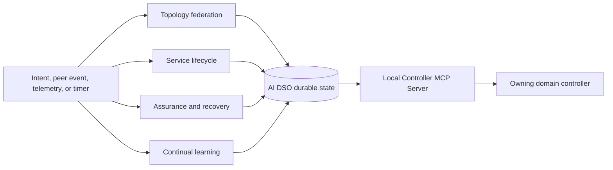
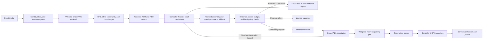
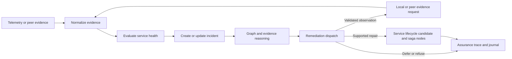
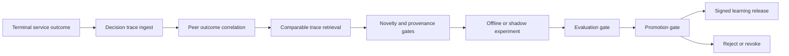
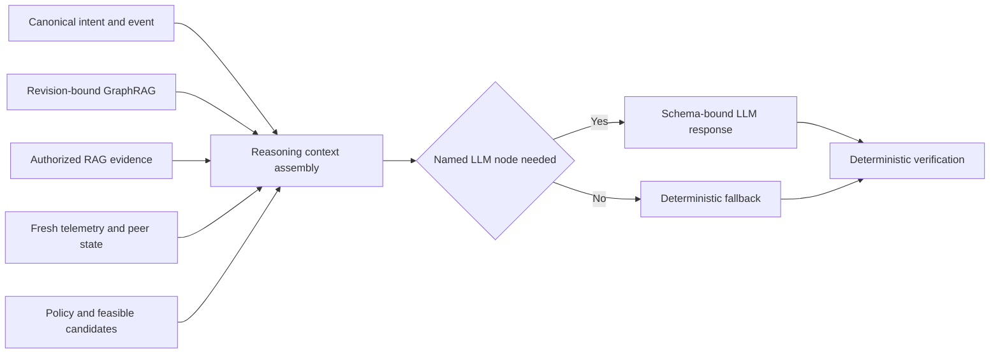

# AI DSO LangGraph node catalogue

Each domain runs one persistent AI Domain Service Orchestrator (AI DSO). Its
LangGraph contains four workflows and one shared deterministic utility. The
catalogue lists the execution method for every node. **LLM** means a conditional,
grounded generative-model call. The other 54 nodes use non-generative methods:
policy, peer coordination, graph algorithms, numerical optimization, retrieval, or tool
integration. These methods are not all deterministic: ACO is stochastic, retrieval
may use learned embeddings, and external calls observe changing state. Three
conditional LLM nodes plus 54 other nodes retain the total of **57**.

These are documented responsibilities, not implemented workflows. The
[agentic systems paper](paper-positioning.md) uses two online LLM nodes for
adaptive evidence collection, diagnosis, and negotiation, plus a conditional
learning-hypothesis node. ACO, PSO, Nash bargaining, and continual predictor
learning are required. Numerical learning remains active in the no-LLM baseline. The [decision-loop specification](domain-agent-architecture.md#adaptive-agent-decision-loop)
refines existing nodes without changing their count.

The workflows target both the required allocation simulator and the
[packet–optical data plane](../../data-plane.md). Current emulation admits only
implemented operations; the richer allocation profile needs additional adapters.
This does not add nodes: capabilities determine permitted workflow branches.
`local_candidate_generation` and `candidate_verification` admit only the
reference's supported packet actions and retention or channel selection on the
single optical route. These use the planned [Containerlab Packet and
Mininet-Optical MCP servers](../../mcp-server-design.md), with one instance per domain.
`local_reservation` and `controller_transaction` need scoped MCP adapters around
the existing packet recovery and optical configuration procedures; the listed
generic transaction tools are a target contract, not existing reference tool
names. Optical observation
and acceptance of an unchanged segment must not be reported as an optical
configuration write. `service_verification` requires fresh receiver evidence.

| Workflow | Nodes | Purpose |
|---|---:|---|
| Topology federation | 8 | Maintain the signed multi-domain topology and configuration replica. |
| Service lifecycle | 29 | Convert intent into a verified cross-domain service. |
| Assurance and recovery | 7 | Detect degradation and re-enter the safe remediation path. |
| Continual learning | 12 | Incrementally train, validate, and promote predictors from completed outcomes for future decisions. |
| Shared reasoning utility | 1 | Assemble authorized context for conditional LLM nodes. |

## 1. Topology federation workflow

| Node | Execution method | Backend or algorithm |
|---|---|---|
| `topology_event_ingest` | Deterministic event routing | Parse event type, bind correlation ID, deduplicate with idempotency key. |
| `peer_identity_gate` | Deterministic security policy | mTLS identity, Agent Card authorization, schema-version and capability policy. |
| `topology_message_verifier` | Deterministic cryptographic and schema validation | Signature, owner, nonce, sequence number, expiry, digest, and JSON-schema checks. |
| `topology_reconciler` | Deterministic replication algorithm | Compare revision vectors and graph digests, then request a snapshot or missing delta range. |
| `graph_apply` | Deterministic transactional state update | PostgreSQL transaction and event-sourced upsert or tombstone application. |
| `graph_integrity_gate` | Deterministic graph and policy validation | Endpoint existence, layer compatibility, ownership, configuration-reference, and connectivity checks. |
| `topology_impact_analysis` | Deterministic graph algorithm | Reverse dependency traversal and BFS from changed entities to affected services, paths, reservations, and negotiations. |
| `topology_ack_and_journal` | Deterministic peer exchange and audit | Persist replica revision, append audit event, sign and send A2A acknowledgement. |

## 2. Service lifecycle workflow

| Node | Execution method | Backend or algorithm |
|---|---|---|
| `intent_intake_and_normalization` | Deterministic intent processing | Validate structured canonical intent, check idempotency, and create correlation ID. Arbitrary natural-language translation is outside this node. |
| `service_event_ingest` | Deterministic event routing | Verify event class and load the correlation-specific service record. |
| `identity_and_entitlement_gate` | Deterministic authorization policy | RBAC or ABAC entitlement checks for tenant, endpoint, service class, and request scope. |
| `service_context_load` | Deterministic state retrieval | PostgreSQL lookup of contract, receipts, reservations, peer state, and graph digest. |
| `topology_freshness_gate` | Deterministic consistency policy | Check revision, digest, TTL, required dependencies, and missing owner evidence. A digest alone cannot establish the latest remote state. |
| `rag_context_retrieval` | Non-generative semantic retrieval | `pgvector` search over model-generated embeddings with authorization, metadata, version, and expiry filters. Record model/index versions. |
| `graphrag_subgraph_retrieval` | Deterministic graph retrieval | Revision-bound Neo4j Cypher traversal over service, topology, resource, configuration, evidence, and incident relations. |
| `retrieval_grounding_gate` | Deterministic provenance policy | Verify source IDs, access scope, graph/configuration revisions, freshness, and evidence support. |
| `graph_reachability_and_impact` | Deterministic graph algorithm | BFS over the verified federated graph with policy filters. |
| `bounded_path_enumeration` | Deterministic graph algorithm | Policy-bounded DFS plus disjoint-path search to enumerate simple path alternatives and avoid cycles. |
| `constraint_path_ranking` | Deterministic constrained optimization | Remove infeasible paths, then rank remaining paths using SLA, capacity, latency, QoT, risk, and configuration constraints. |
| `qos_budget_derivation` | Deterministic arithmetic and policy | Split end-to-end bandwidth, latency, loss, availability, and deadline targets into domain contributions. |
| `path_and_dependency_analysis` | Deterministic graph algorithm | Record topology, configuration, policy, and shared-risk dependencies and their revisions for candidate validity checks. |
| `swarm_state_refresh` | Deterministic state update | Load attributed quality signals, pheromone state, and current performance-predictor releases. |
| `swarm_candidate_exploration` | Stochastic metaheuristic; no generative LLM | Required bounded ACO path exploration and PSO continuous allocation, with separate seeds, budgets, feasibility checks, and traces. Conventional search/allocation are ablations. |
| `swarm_candidate_aggregation` | Deterministic selection algorithm | Deduplicate and preserve diverse feasible path/allocation pairs with numerical scores and predictor versions. |
| `local_candidate_generation` | Deterministic controller feasibility query | Dispatch validated catalogued local read/validate requests through local MCP; map results to allowed local operations and refresh candidates. |
| `advisory_reasoning` | **Conditional LLM** | Propose a permitted observation, select/rank a verified offer or counteroffer using peer feedback, or propose deferral/refusal. |
| `candidate_verification` | Deterministic evidence and constraint check | Validate proposal type, catalogue IDs, arguments, scope, and budget; recheck candidate evidence and hard constraints. |
| `local_policy_selection` | Deterministic policy decision | Apply fixed policy/cost/risk limits; consume an accepted observation or proposal choice under the declared selection policy, or record a fallback. |
| `local_utility_evaluation` | Deterministic game-theory calculation | Owner-defined utility/disagreement from resource, opportunity, and operation costs plus current learned QoS/disruption estimates; never change owner values automatically. |
| `peer_contract_negotiation` | Deterministic peer coordination | Dispatch authorized peer evidence requests and signed offers, counteroffers, acceptances, and rejections; return feedback to the bounded decision loop. |
| `bargaining_solution_gate` | Deterministic game-theory calculation | Evaluate disclosed, signed utility gains and agreed weights over the same feasible candidate set; check the exact contract and return no agreement if no candidate passes. |
| `local_reservation` | Adapter-controlled local preparation | Call `reserve_resources` and `prepare_change` through the local Controller MCP Server; persist receipts, expiry, expected conditions, and compensation reference. |
| `reservation_barrier` | Deterministic owner coordination | Wait for matching peer receipts, apply timeout, compensation, and expiry rules. |
| `commit_authorization_gate` | Deterministic policy recheck | Check agreement, policy, dependency state, reservation, and coordination epoch; produce expected conditions for controller enforcement. |
| `controller_transaction` | Owner-approved adapter action | Request conditional `commit_change`, query `get_transaction` after uncertain outcomes, or request supported compensation; journal partial or unresolved outcomes. |
| `service_verification` | Deterministic measurement and owner check | Compare local and border measurements with SLA thresholds and exchange signed A2A verification summaries. |
| `service_outcome_journal` | Deterministic state transition and audit action | Persist verified or unresolved outcome and reconciliation reference. Trigger learning only from eligible terminal traces. |

## 3. Assurance and recovery workflow

| Node | Execution method | Backend or algorithm |
|---|---|---|
| `assurance_event_ingest` | Deterministic event routing | Classify telemetry, peer evidence, topology impact, timer, or verification-failure event. |
| `evidence_normalization` | Deterministic telemetry processing | Validate timestamps and units, window measurements, and bind evidence to graph/configuration revisions. |
| `service_health_evaluation` | Deterministic SLO evaluation | Threshold, trend, hysteresis, and contract-compliance rules over normalized evidence. |
| `incident_creation_or_update` | Deterministic incident correlation | Deduplicate using service, resource, symptom, revision, and time-window keys. |
| `fault_and_impact_reasoning` | **Conditional LLM** | Diagnose probable cause/impact and propose a discriminating observation or supported remediation candidate. Fall back to dependency traversal and declared diagnostic rules. |
| `remediation_dispatch` | Deterministic workflow transition | Validate assurance proposals, scope, and budgets; dispatch permitted reads, enter the shared lifecycle for repair, or defer/escalate. Mutations retain all coordination and authorization gates. |
| `assurance_trace_and_journal` | Deterministic audit action | Persist evidence IDs, diagnoses, proposals, gate results, actual choices, peer feedback, receipts, and health outcome. |

## 4. Continual-learning workflow

| Node | Execution method | Backend or algorithm |
|---|---|---|
| `decision_trace_ingest` | Deterministic trace materialization | Read immutable local service, topology, negotiation, controller, and verification records. |
| `peer_outcome_correlation` | Deterministic record linkage | Join signed peer outcomes by contract, correlation ID, graph digest, and time window. |
| `comparable_trace_retrieval` | Non-generative hybrid retrieval | Metadata filters plus pgvector similarity and GraphRAG condition matching, with retrieval/model versions recorded. |
| `novelty_gate` | Deterministic statistical and policy gate | Detect duplicate traces, insufficient samples, stale data, or contradictions. |
| `hypothesis_generation` | **Conditional LLM** | Propose a bounded, testable hypothesis from comparable, provenance-validated traces. |
| `provenance_validator` | Deterministic lineage validation | Validate source hashes, ownership, revisions, permissions, and reproducible data set. |
| `experiment_planner` | Deterministic constrained planning | Define an offline replay, digital-twin, or shadow experiment with fixed safety limits. |
| `safe_experiment_runner` | Controlled incremental training and evaluation | Update the predictor on new data plus bounded replay; evaluate on past-only validation/retention data and preserve parameter versions, cutoffs, seeds, and results. |
| `evaluation_gate` | Deterministic statistical evaluation | Compare calibration, prediction error, safety, and sample sufficiency against a held-out baseline. |
| `promotion_gate` | Deterministic governance policy | Promote bounded predictor releases for later ACO/PSO/utility decisions under owner-approved regression thresholds; hard-policy changes still need separate review. |
| `publish_learning_release` | Deterministic model release and exchange | Version, sign, journal, and distribute an approved bounded learning release through A2A. |
| `reject_or_revoke` | Deterministic lifecycle action | Reject, expire, or revoke a failed hypothesis or previously released learning artifact. |

## 5. Shared reasoning utility

| Node | Execution method | Backend or algorithm |
|---|---|---|
| `reasoning_context_assembly` | Deterministic secure prompt construction | Join intent, event, state, revision-bound evidence, missing/contradictory facts, permitted observations, constraints, feasible candidates, peer feedback, budgets, provenance, and response schema. Apply authorization and secret-redaction filters before any LLM call. |

## LLM invocation rule

`reasoning_context_assembly` runs before `advisory_reasoning`,
`fault_and_impact_reasoning`, and `hypothesis_generation`. These are the only
LLM-assisted nodes. The learning workflow is required; a bounded hypothesis can
use `hypothesis_generation` or a deterministic template while the numerical
learner remains present. The online nodes return typed observation/proposal/deferral choices with
cited evidence and catalogue/candidate IDs. The runtime validates and dispatches
accepted choices; the model cannot invent candidates, make authoritative peer
agreements, invoke MCP directly, reserve resources, or change configuration.
Timeouts, invalid output, unsupported advice, or exhausted budgets trigger a
recorded deterministic fallback or deferral. Missing evidence may justify a read,
never an unsupported write. Fix base LLM weights, prompts, hard policies, initial
predictors, and update rules. Continual predictor state evolves across episodes;
record which version every optimizer/utility decision consumes.

## Research requirements mapped to existing nodes

The [coupled method](agentic-system-method.md) refines the existing 57 nodes.
Node count is an implementation inventory, not a contribution.

Collective-intelligence evaluation adds no workflow node or fifth algorithm.
Link peer inputs consumed by observation/reasoning and `peer_contract_negotiation`
to revisions in `swarm_candidate_exploration`, selected candidates, and subsequent
learning releases. These existing nodes supply E10/E11's structured decision
traces. A8 changes feedback dispatch and freezes submitted candidates; it does
not remove numerical fitness queries, owner checks, or the learning workflow.

| Required mechanism | Existing nodes | Evidence |
| --- | --- | --- |
| ACO and PSO | `swarm_state_refresh`, `swarm_candidate_exploration`, `swarm_candidate_aggregation` | Separate and joint search/allocation ablations with matched budgets and independent constraints. |
| Nash bargaining | `local_utility_evaluation`, `peer_contract_negotiation`, `bargaining_solution_gate` | Different owner preferences, positive gains, refusal, and service/utility trade-offs. |
| Continual learning | Learning workflow, especially `safe_experiment_runner`, `evaluation_gate`, `promotion_gate` | Actual predictor updates, later decision effects, frozen/memory-only contrasts, adaptation and forgetting. |
| Grounded reasoning | Online reasoning and validated observation/decision dispatch | Changed queries/diagnoses/proposals and verified outcomes, not explanation quality alone. |
| Owner-scoped execution | Local policy, controller, and verification nodes | Only owning controllers apply actions; independent receiver evidence establishes service. |

The complete study keeps all four mechanisms present in B0 and removes them only
in declared ablations. Missing evidence and unsupported capabilities remain
explicit. See the [evaluation plan](experimental-validation.md).
