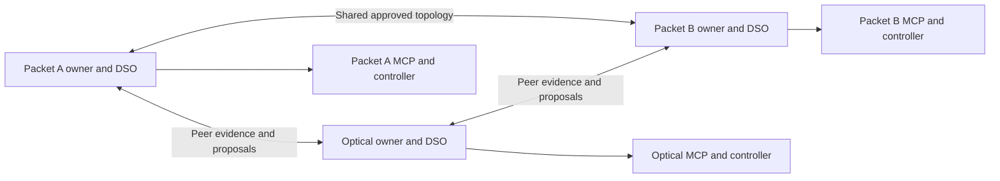

# Agentic AI for cross-owner packet–optical network services

This proposed system establishes and assures services crossing Packet A,
Optical, and Packet B. **Each network is owned by a different person or
organization**, with its own agent, resources, operating policy, costs, and
right to refuse. There is one Domain Service Orchestrator (DSO) per owner and
no central authority above them.

The COMNET paper's required mechanisms are **ACO, PSO, Nash bargaining, and
continual learning**, integrated with grounded agent reasoning and verified
network-service outcomes. See the [paper-positioning plan](paper-positioning.md)
and [coupled method](agentic-system-method.md). The data plane exists; the full
agentic system and the proposed allocation/learning capabilities remain to build.

## Owner agents and local tools



Each DSO is one persistent runtime, not a separate LLM agent commanding another
orchestrator. Numerical optimizers, the learner, policy checks, graph retrieval,
and conditional LLM calls are capabilities of that runtime.

A2A provides peer communication. MCP exposes local supported observations and
actions. There are two [MCP server types](mcp-server-design.md), instantiated
separately for Packet A, Optical, and Packet B. An owner can accept a candidate,
request evidence, counteroffer, or refuse. Relaying a message does not transfer
authority. No agent can directly change a peer's network.

## Required intelligence and optimization

| Component | Required job | What it is not |
| --- | --- | --- |
| ACO | Explore discrete packet paths and optical route/channel combinations. | Permission to change devices, or a novelty claim from using ants. |
| PSO | Search capacity-feasible continuous bandwidth allocations for competing services on candidate paths. | Choosing a discrete channel index or changing offered load and calling it a reservation. |
| Nash bargaining | Select a feasible agreement using independent owners' gains over disagreement. | Majority voting, truthful-reporting proof, or overriding a refusal. |
| Continual learning | Incrementally improve QoS/disruption predictors and use releases in later decisions. | Merely logging outcomes, retrieving memory, or necessarily retraining the LLM. |
| Grounded reasoning | Select evidence, diagnose ambiguity, and propose supported replanning/counteroffers. | Inventing resources, numerical scores, or owner consent. |

```text
intent / symptom → evidence → ACO paths → PSO allocations
→ owner utilities → Nash agreement → local execution → receiver verification
→ predictor update → better inputs for future decisions
```

The loop can revisit observations, paths, or allocations in response to peer
constraints. Its total observation, optimization, model, and time budgets are
bounded. A healthy service need not rerun every mechanism on every poll; the
full system must implement and exercise all four on appropriate workloads.

The [three-owner worked example](agentic-system-method.md#worked-example-three-owners-choosing-a-service-plan)
shows why Nash selection favors a plan with gains of `(4, 4, 3)` over one with
`(10, 1, 1)`, and how ACO, PSO, and continual learning support that decision.

The [node catalogue](langgraph-node-catalog.md) retains 57 documented nodes.
ACO/PSO share the bounded numerical exploration node, Nash uses the existing
utility/bargaining nodes, and predictor training/replay/promotion uses the
learning workflow. Three named nodes can invoke an LLM conditionally. The
no-LLM baseline retains numerical optimization and continual predictor learning.

## Collective intelligence without shared authority

Agentic operation describes each DSO; collective intelligence describes the
group-level capability being investigated. Peer evidence may change another
agent's diagnosis, a counteroffer may trigger new paths or allocations, and a
verified joint outcome may improve local predictions used in later proposals.
The four required mechanisms support this loop; collective intelligence is not
an extra algorithm, shared LLM, or additional decision-maker.

Every owner retains its own objectives and veto. Approved topology sharing is
already assumed, but fresh observations and owner evaluations still matter.
Record which peer inputs actually influenced which decisions, including when
no revision was useful. Message exchange alone does not establish benefit.

The [feedback specification](agentic-system-method.md#collective-intelligence-through-peer-feedback)
defines these links. E10 compares adaptive feedback with competent fixed
proposal exchange; E11 tests feedback × learning; E09 retains the matched
centralized comparison. The hypothesis may be supported, limited to particular
workloads, or rejected without changing owner authority.

## Shared understanding, local ownership

Every DSO keeps a replica of approved topology and configuration contributions.
The sharing graph is a full mesh, while service negotiation involves owners on
the service path. Replica availability does not imply fresh operational evidence;
agents request missing observations from the appropriate owner.

PostgreSQL holds local authoritative state and outcomes; graph/document
projections support dependency traversal and grounded retrieval. Store provenance,
observation time, missing-data reasons, and predictor versions. Exclude secrets.
Full approved-topology sharing is a disclosure assumption, not a privacy feature.

Each owner defines its utility, cost units, policy bounds, and disagreement value.
The research prototype shares candidate-specific gains and fixed bargaining
weights. These values can reveal preferences; signatures establish attribution,
not honesty. The experiments model cooperative independent owners.

## The packet–optical data plane

The implemented fixture contains eight SR Linux routers and a four-ROADM
Mininet-Optical line carrying one of two wavelengths at a time. Packet A and
Packet B each have a primary and backup path: eight joint configurations in all.
The baseline is the `client-a` → `server-b` UDP flow at 1 Mbit/s offered load.

That offered load is not a network bandwidth reservation. The current fixture
has no per-service bandwidth isolation, no alternate optical route, and no
simultaneous multi-channel allocation. Both wavelengths use the same fiber
chain, so retuning cannot repair a cut.

Use [data-plane.md](data-plane.md) for topology, addresses, ownership, actions,
and fidelity, and [installation.md](installation.md) for the separate testbed.
The [known issues](known-issues.md) include measurement freshness, unavailable
routers, disruptive optical no-op updates, and control-boundary enforcement.
Resolve them before treating agent outcomes as experimental evidence.

## Required richer allocation and learning workload

The full contribution needs more than the eight-choice single-flow fixture.
Implement a richer simulator with multiple demands sharing bottlenecks,
meaningful continuous bandwidth choices, diverse discrete alternatives, and
chronological demand/quality shifts. This is required mechanism evaluation.

For emulated allocation claims, additionally implement scoped per-service
shaping/scheduling, service identities, optical-capacity accounting, and independent
flow measurements. Validate enforcement and competition; otherwise report
continuous allocation results as simulation only. Do not assume unsupported
optical power/modulation controls.

The current emulator anchors real service-control behavior. The richer simulator
studies optimization and continual adaptation. Report these evidence profiles
separately rather than implying every result is measured on an emulated network.

## Learning and assurance

After a verified service episode, domain-local predictors update using new data
and bounded past replay. Past-only validation and regression checks determine
whether a release is promoted. The current episode's predictor version stays
fixed; later episodes can use the new version. A model release can change
predicted QoS/disruption and candidate ranking, not hard constraints or owner
preferences.

Score each episode before learning from its outcome. Test stationary, shifted,
and recurring conditions to measure adaptation and forgetting. Compare with
frozen predictors and memory-only retrieval. Keep base LLM weights, prompts,
and learning rules fixed unless a separate experiment explicitly changes them.

For degradation, gather fresh packet/optical/receiver evidence, choose supported
repairs, obtain affected owners' approval, and verify sustained delivery.
Retain healthy unchanged segments. An optical cut with no alternative must
produce honest degraded/unresolved reporting, not an invented restoration.

## Research validation

The [evaluation plan](experimental-validation.md) requires full B0, matched
reasoning/placement/workflow comparisons B1–B3, a simpler B4, and ablations of
ACO, PSO, Nash selection, and continual learning. Test ACO × PSO and learning ×
bargaining interactions under matched budgets. A8 retains all four mechanisms
but disables post-proposal peer-driven replanning. E10/E11 test its contrast
with B0 and the interaction with learning, using independent service outcomes
and total communication/compute costs rather than message counts as success.

Measure delivery, allocation quality, per-owner gains, learning adaptation and
forgetting, diagnosis/recovery, unnecessary writes, and total tool/model/search/
learning cost. Correct refusal is distinct from delivered service. Negative
findings are valid; the presence of all four methods does not prove their value.

The [roadmap](implementation-roadmap.md) turns these requirements into staged
work. The [literature assessment](related-work-and-novelty.md) identifies prior
work and the comparison needed before making a novelty claim.
