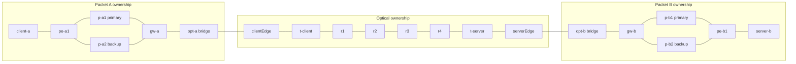
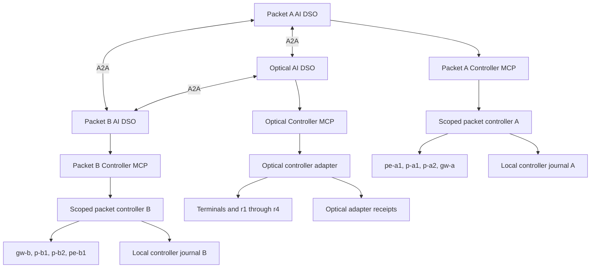
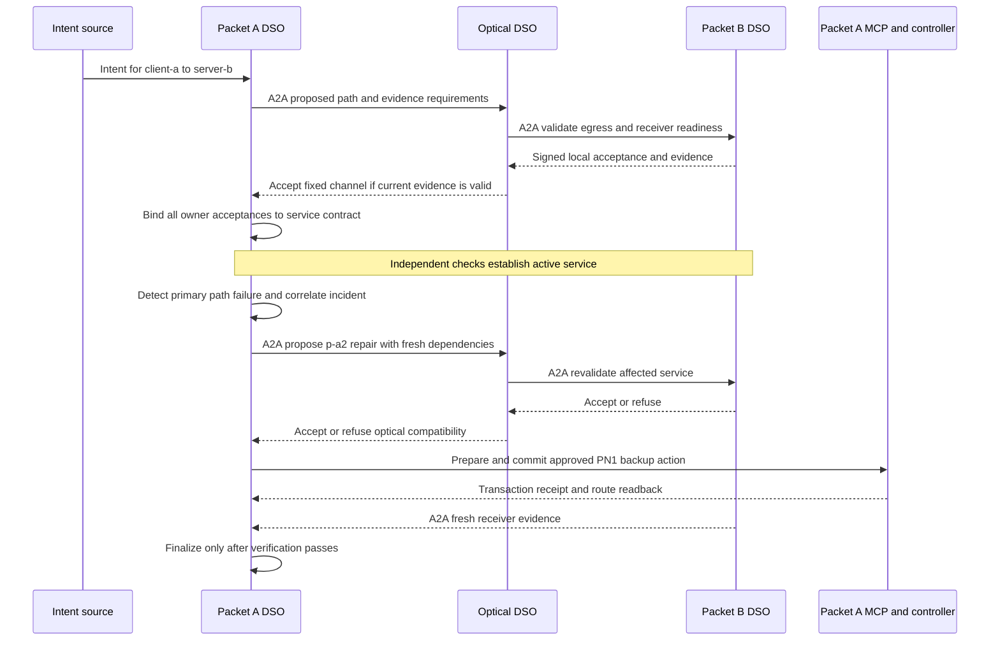

# Reference packet–optical data plane

This document specifies the packet–optical laboratory data plane reused by the
architecture, implementation roadmap, and executable journal experiments. The
new work distributes orchestration across three AI DSOs; it does not require
replacing the reference routers, optical line, or endpoints.

**Status:** testbed specification derived from inspection of the existing
laboratory platform's source. No lab was deployed or live behavior revalidated
for this document, and that platform's earlier test results are not results for
this federation.

## Source of truth and reuse boundary

| Reference component | What is reused |
| --- | --- |
| Packet topology manifest | Containerlab nodes, image, interfaces, addresses, and packet links. |
| Packet controller and recovery procedures | Existing router configuration and named route-switch procedures, behind new domain-scoped controller adapters. |
| Traffic generator | The shared `client-a` → `server-b` iperf3 UDP flow and receiver evidence. |
| Optical topology specification and builder | Two terminals, four ROADMs, Ethernet edge attachments, and the existing optical model. |
| Optical configuration client and packet bridge integration | Fixed channel-1 configuration and attachment of packet traffic to Mininet-Optical. |

Pin every reused component at a recorded revision when constructing the later
testbed. Record the separately installed Mininet-Optical version, container
image digests, controller adapter revision, and any local patches in each
experiment manifest. A deliberate topology extension gets a different manifest
and result label.

The baseline lab currently has **one packet controller managing both packet
networks**, one shared UDP service, and a central service orchestrator with
privileged recovery access. That control arrangement is not the federation's
ownership model. Reuse the data plane and controller procedures; replace central
authorization with independently scoped domain control as described below.

## Exact baseline topology



| Owner | Baseline inventory | Role |
| --- | --- | --- |
| Packet A | `client-a`, `pe-a1`, `p-a1`, `p-a2`, `gw-a`, `opt-a` | Source host, four SR Linux routers, packet-side L2 attachment. |
| Optical O | `clientEdge`, `t-client`, `r1`, `r2`, `r3`, `r4`, `t-server`, `serverEdge` | Two Ethernet edge nodes, two optical terminals, four ROADMs. |
| Packet B | `opt-b`, `gw-b`, `p-b1`, `p-b2`, `pe-b1`, `server-b` | Packet-side L2 attachment, four SR Linux routers, destination host. |

There are **20 named entities** in this diagram: eight packet routers, two
traffic endpoints, two packet attachment bridges, two optical Ethernet edges,
two terminals, and four ROADMs. Interfaces, fibers, amplifiers, and channels are
additional typed resources, not extra routers. The optical monitoring set has
six terminal/ROADM nodes; it is not the complete topology inventory.

The packet lab is `packet-qos`, with container names prefixed
`clab-packet-qos-`. Routers use `ghcr.io/nokia/srlinux:24.10.1`, type `ixr-d3l`;
the endpoint and attachment containers use Alpine 3.20. Preserve the reference
management subnet `172.31.255.0/24` separately from service traffic.

| Service address | Value |
| --- | --- |
| `client-a` | `10.10.0.2/24`, gateway `10.10.0.1` |
| `server-b` | `10.20.0.2/24`, gateway `10.20.0.1` |
| `gw-a` optical transit interface | `10.10.4.1/30` |
| `gw-b` optical transit interface | `10.10.4.2/30` |

The twelve Containerlab links are:

| Endpoint 1 | Endpoint 2 |
| --- | --- |
| `client-a:eth1` | `pe-a1:e1-1` |
| `pe-a1:e1-2` | `p-a1:e1-1` |
| `pe-a1:e1-3` | `p-a2:e1-1` |
| `p-a1:e1-2` | `gw-a:e1-1` |
| `p-a2:e1-2` | `gw-a:e1-2` |
| `gw-a:e1-3` | `opt-a:eth1` |
| `gw-b:e1-1` | `opt-b:eth1` |
| `gw-b:e1-2` | `p-b1:e1-1` |
| `gw-b:e1-3` | `p-b2:e1-1` |
| `p-b1:e1-2` | `pe-b1:e1-1` |
| `p-b2:e1-2` | `pe-b1:e1-2` |
| `pe-b1:e1-3` | `server-b:eth1` |

The optical bridge integration adds the two attachments from `opt-a` to
`clientEdge` and from `serverEdge` to `opt-b`, using veth pairs and L2 bridges.
There is no direct `opt-a`–`opt-b` bypass. Successful cross-domain packet transit
therefore depends on the Mininet-Optical path being attached and configured.

## Optical configuration and measurement limits

Retain the reference line:

```text
clientEdge -- t-client -- r1 -- r2 -- r3 -- r4 -- t-server -- serverEdge
```

Channel **1** connects terminal Ethernet port **1** to WDM port **11**. The
ROADM add/drop port is **1**, west line port **111**, and east line port **222**.
The configured channel path uses `r1:1→222`, `r2:111→222`, `r3:111→222`, and
`r4:111→1`; direction and installed rules must come from controller readback.

The builder uses **50-metre span segments**, span amplifiers, a 3 dB line boost,
0 dBm terminal launch power, and zero modeled ROADM insertion loss. Preserve
those parameters for reproducibility and identify their simplifying assumptions.
This is a short lab optical model, not a calibrated long-haul or hardware result.

There is **one configured optical channel and no alternate optical route**.
The initial Optical DSO can advertise, inspect, validate, retain, or refuse the
existing transport. An optical cut with no valid alternative must lead to a
degraded/unresolved service or escalation, followed by reconciliation when the
fault is repaired. It cannot produce an automatic optical reroute by negotiation.
New wavelengths, tunable modulation, spectrum allocation, and optical protection
are extension capabilities, not baseline controller actions.

Record optical monitor coverage and fresh OSNR/gOSNR evidence. A changed modeled
gOSNR value is not automatically a changed packet loss or delay measurement.
Demonstrate the coupling at the receiver before claiming an optical impairment
caused packet QoS degradation. For an optical-connectivity fault, independently
verify that packets actually stop traversing the optical attachment.

## Controller ownership around the reused data plane



Reuse the packet controller code in **two inventory-scoped controller instances**
with separate router credentials, API/MCP identities, journals, and authorization
checks. Domain A can target only its four routers; domain B only its four.
Refactor global inventory/lifecycle assumptions before using those instances.
Filtering the LLM's tool list while leaving a shared privileged backend accessible
does not establish owner isolation. If an interim shared backend is evaluated,
label its shared authority and failure boundary explicitly.

Retain one Optical controller and its own MCP server. Every DSO invokes only
its local MCP endpoint. The reference packet API/MCP defaults are `8000`/`3001`,
optical API/MCP defaults `8001`/`3002`, internal optical REST `8080`, and router
gNMI `57400`. Separate namespaces or explicit per-instance endpoint assignments
are needed for the two packet controller instances. These are reference defaults,
not a newly deployed endpoint map.

The reference MCP servers and HTTP APIs are reusable integration starting points;
they do not already implement the federation's complete transaction tool contract.
Packet recovery mutation currently uses controller HTTP recovery routes and a
central control token. Add typed local MCP wrappers with per-domain authorization;
do not distribute the central orchestrator's shared privileged token to all DSOs.
Optical fixed-channel configuration is a bootstrap operation in the initial
profile; runtime optical participation principally supplies validation and evidence.

A trusted **lab bootstrap** creates the shared Containerlab/Mininet environment,
installs initial configurations, and joins the attachment namespaces. Boundary
setup needs both packet and optical attachments; it does not grant the Optical
DSO arbitrary packet-container control. Exclude lab-wide deploy, destroy,
reconfigure-all, bridge setup, and broad cleanup from runtime DSO tools. Bootstrap
is testbed lifecycle management, not a central service decision-maker.

The reference traffic helper controls both endpoints. Adapt endpoint operations
so Packet A owns sender control and Packet B owns receiver control, coordinated
through the service contract, or clearly label a driver-owned measurement flow.
Do not run two independent copies of the global traffic helper against one flow.
The driver may supply a fixed traffic schedule; it must not decide service repairs.

Each DSO still has its own PostgreSQL/pgvector store and Neo4j projection. The
reference packet controller's **SQLite recovery journal** is a separate controller
receipt store; retain one per scoped instance where appropriate. It does not
replace the DSO database or create a shared federation database. Optical durable
adapter receipts and any stronger reservation primitives are work to implement.

## Initial action and capability profile

| Capability | Baseline source support | Federation treatment |
| --- | --- | --- |
| Router configuration and telemetry | SR Linux controller and gNMI helpers. | Reuse with enforced domain inventory and identity. |
| Packet A recovery | `pn1_activate_p_a2_backup_path`. | Named local route switch, gated by agreement and current readiness. |
| Packet B recovery | `pn2_activate_p_b2_backup_path`. | Same pattern for Packet B; independently validate live behavior. |
| Packet prepare/commit/rollback/finalize | Journaled recovery procedures, state checks, route readback. | Wrap in typed MCP; map receipts and supported conditions explicitly. |
| Optical observation/configuration | Health, nodes, monitor, fixed channel-1 configuration. | Observe/validate during service operation; initial configuration at bootstrap. |
| Optical alternate path or spectrum reservation | Not provided by this baseline. | Reject unsupported requests; richer resource models belong to P0 or an explicit extension. |
| Per-service queues, VPNs, or bandwidth isolation | Not provided by the shared UDP demonstration. | Do not claim them from route switching or iperf3 offered load. |
| Federation epochs, signed contracts, dependency checks | Requirements of this repository. | Implement and test the adapters/protocol; source reuse alone does not supply them. |

The two recovery actions change existing static-route next-hop-group references:

| Action | Router and destination | Primary next hop | Backup next hop |
| --- | --- | --- | --- |
| Packet A | `pe-a1`, `10.20.0.0/24` | `10.10.1.2` | `10.10.1.6` |
| Packet A | `gw-a`, `10.10.0.0/24` | `10.10.2.1` | `10.10.3.1` |
| Packet B | `gw-b`, `10.20.0.0/24` | `10.20.2.2` | `10.20.3.2` |
| Packet B | `pe-b1`, `10.10.0.0/24` | `10.20.1.1` | `10.20.1.5` |

Preparation records original routes without changing forwarding; commit rechecks
and applies the named switch; rollback checks ownership/drift before restoring
routes. The action requires the domain to be on its primary path, a currently
degraded primary, and a usable backup; it is not a generic optimization switch
for a healthy path. Finalized transactions cannot be rolled back through the
same transaction. Reset the fixture between trials through declared lab lifecycle
operations, or separately implement an authorized return-to-primary procedure.
These are journaled multi-device operations, **not atomic hardware
transactions**. Controller locks and rechecks do not prevent every external CLI
or direct-device write. Advertise the actual acceptance/reservation guarantees;
stronger conditional acceptance and epoch fencing require their own implementation
and race tests. Finalization requires fresh endpoint verification in the new DSO
workflow, replacing the reference central SO's verification role.

## Topology federation and a complete service example

Each owner publishes its inventory, interfaces, links, permitted configuration,
and revisions through A2A. The three DSOs materialize the same approved graph,
including the bridge/terminal transitions and the two boundary attachments.
Both ends of a handoff must agree before it is eligible. Keep packet links,
optical links, channel allocations, adaptation relationships, and service paths
as distinct relationship types. Do not infer the entire graph from `/monitor`.

For the first service, a structured intent requests `client-a` (`10.10.0.2`) to
`server-b` (`10.20.0.2`). Begin with the reference **1 Mbit/s UDP offered load**, port
`5201`, and 1400-byte UDP payload. This is generic UDP, not an RTP implementation
or a guaranteed-bandwidth service. Calibrate delay/loss targets and observation
windows before claiming an SLA.



The diagram shows the successful branch; missing consent, stale evidence,
unusable backup, or failed readback enters deferral/reconciliation instead.
Packet A repairs its local routes through its own MCP server; Packet B and
Optical retain their existing forwarding when no local change is needed.
Participation does not require an artificial configuration write in every domain.
Each domain's closed loop continues observing its own resources. Receiver sample
identity and timestamps must advance; sender statistics or a stale receiver line
cannot establish restored service.

The topology offers at most **four packet path combinations** (two per packet
domain) over the one optical line. Current conditions and named-action semantics
can reduce the reachable set. Exact enumeration is the initial search baseline;
this tiny graph is suitable for demonstrating collaboration, not for claiming
swarm-search superiority. Larger search spaces and multi-service resource
isolation must be separately labeled experiments.

See the [implementation roadmap](implementation-roadmap.md) for adapter work and
the [experimental validation plan](experimental-validation.md) for baseline versus
simulator/extension coverage. The 57-node DSO design remains unchanged; capabilities
advertised by these controllers determine which workflow branches can execute.
