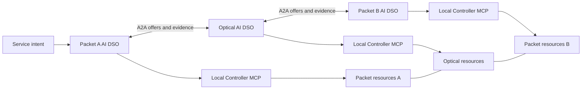
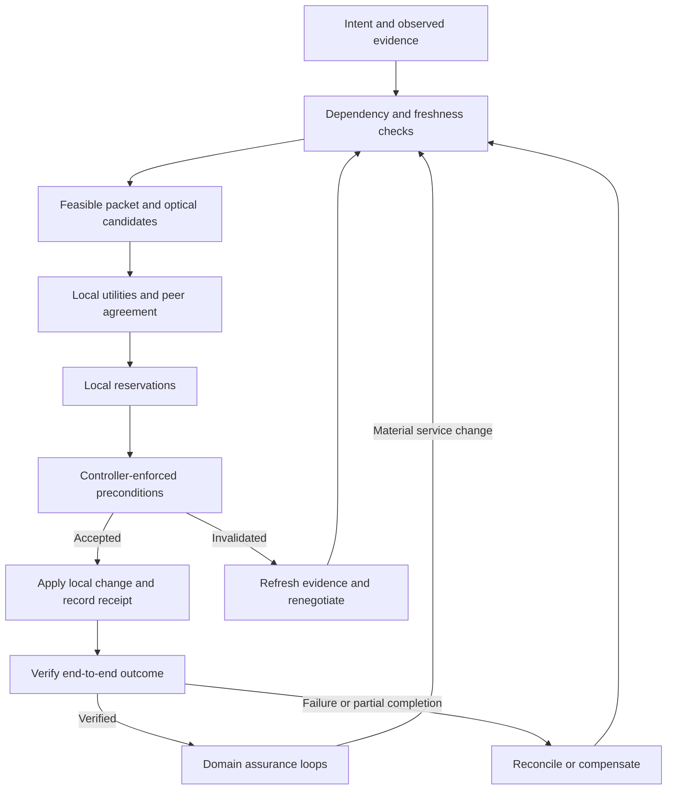

# Related work and novelty assessment

**Search date:** 16 September 2026. **Target venue:** Elsevier *Computer Networks*.
**Project status:** architecture and research design; this report does not establish
implemented capabilities, measured improvements, formal guarantees, or acceptance
by the journal.

This report maps 40 relevant paper records and eight networking specifications or
drafts to the [proposed architecture](domain-agent-architecture.md). Some records
belong to the same research family; they are not 40 independent implementations.
The most important finding is that the broad combination of domain agents,
distributed orchestration, negotiation, retrieval, controller tools, and closed
loops already has substantial precedent. The architecture needs a more precise
networking contribution to support a strong novelty claim.

The recommendations are carried into the
[architecture protocol requirements](domain-agent-architecture.md#research-protocol-requirements),
[existing-node responsibilities](langgraph-node-catalog.md#research-requirements-mapped-to-existing-nodes),
and [journal evaluation plan](implementation-roadmap.md#journal-evaluation-plan).
Those updates specify intended behavior and experiments; they do not turn the
candidate contributions into verified results.

## 1. Scope and evidence

The search covered publicly indexed international research through the search
date, including IEEE, ACM, Elsevier, Optica, ITU, arXiv, author and institutional
repositories, and IETF, ETSI, and OGF documents. Searches used English terms;
research published elsewhere or not indexed in English may be missing.

Search families included:

| Family | Representative searches |
| --- | --- |
| Domain autonomy | `multi-domain distributed intent resolution agents`; `federated service orchestration independent domains`; `distributed SDN controllers` |
| Packet and optical networks | `LLM multi-agent cross-domain optical orchestration`; `packet optical intent automation`; `MCP TeraFlowSDN optical network` |
| Negotiation and economics | `multi-domain optical Nash bargaining`; `LLM cross-domain resource negotiation`; `multi-broker service provisioning` |
| Retrieval and state | `GraphRAG optical network`; `network topology knowledge graph intent`; `telecommunications RAG` |
| Execution and assurance | `multi-domain reservation commit`; `network consistent updates`; `agentic closed-loop network verification`; `stale topology orchestration` |
| Learning and swarm methods | `multi-agent optical deep reinforcement learning`; `cross-domain agent collective memory`; `ant colony distributed network routing` |

Title searches, bibliographic checks, and references in retrieved papers extended
these searches. Primary publisher, author, institution, or specification sources
support the technical comparisons below. Search engines' relative publication
dates were not treated as bibliographic dates.

**This is a broad scoping review, not a certified exhaustive search of every paper
in the world.** It is not a systematic review based on exported Scopus/Web of
Science records, a registered protocol, or a complete citation graph. No invented
screening counts or completeness percentage are supplied. Full texts were not
accessible for every paper.

Evidence labels describe what was inspected, not paper quality:

- **Text:** relevant sections of an accessible manuscript or publisher text were inspected; this does not mean every equation or experiment was independently audited.
- **Abstract:** comparisons are limited to the primary abstract and bibliographic record.
- **Mixed:** publication metadata plus author slides or selected indexed text; the proceedings text was not fully accessible.

An abstract that does not mention a feature is **not evidence that the full paper
lacks it**. Consequently, the comparison identifies established overlaps and
questions to resolve, rather than assigning unsupported absence checkmarks.
Preprints and Internet-Drafts are explicitly distinguished from published papers
and established specifications. An arXiv citation identifies the version examined;
it does not prove that no later published version exists.

## 2. The system being assessed

The current design has independently owned packet A, optical, and packet B
domains. Each domain operates one persistent AI DSO: the agent and domain service
orchestrator are the same runtime. Its four workflows and shared context utility
contain 57 named nodes, with three conditional generative-LLM reasoning nodes.

Peers exchange service and topology information over A2A. Each DSO controls only
its own SDN controller through its Controller MCP server. Each maintains its own
PostgreSQL/pgvector store, graph projection in Neo4j, and operational evidence.
Approved topology and configuration advertisements are replicated among peers;
ownership of each record and authority to change devices remain local.

The design combines constrained path construction, optional ACO exploration,
local utility evaluation, weighted Nash bargaining, reservations, controller
execution, verification, and domain-local assurance. Retrieval grounds selected
LLM calls. Learning is an evaluated update process, not permission for models to
change controller policy directly. See the [node catalogue](langgraph-node-catalog.md)
for the current workflow inventory.



The diagram describes the proposed implementation boundary. A2A communication,
MCP access, and local controller ownership are not themselves claims of novelty.

## 3. Closest competing work

Read these works before writing the introduction or claiming a research gap.
The right-hand column is our assessment, not a finding stated by the cited authors.

| Prior work | Established overlap | Consequence for this paper |
| --- | --- | --- |
| [EDAIR, NOMS 2025](#p01) | An intelligent agent represents each domain and collaborates on multi-domain intent resolution. | One agent per domain and distributed intent resolution are already precedents. Obtain its full text before making a detailed distinction. |
| [Xu et al., 2024–2025](#p02) | Multi-agent workflows orchestrate optical and other technological domains. | Cross-domain LLM orchestration is established; distinguish technological domains from independently authorized operators. |
| [Brodimas et al., 2025](#p04) | Agentic orchestration combines peer handoffs, retrieval, tools, and persistent state. | Agent orchestration with RAG and MCP is insufficient as the main contribution. |
| [Confucius, SIGCOMM 2025](#p05) | Structured multi-agent network workflows, retrieval, tools, and validation. | Workflow structure and grounded tool use need a stronger inter-operator distinction. |
| [Chergui et al., 2025](#p06) | Cross-domain agent negotiation uses collective memory and digital-twin feedback. | Negotiating agents that improve from experience are already explored. |
| [Carballo González et al., September 2026](#p07) | Federated operators, A2A negotiation, MCP-accessible context, and closed-loop resource management. | The broad proposed combination is particularly close to this preprint. Focus comparison on protocol semantics and demonstrated packet–optical failure handling. |
| [Tranoris and Trantzas, 2026](#p08) | Agentic intent handling is separated from deterministic orchestration and test-based assurance. | Selective cognition with controlled actuation is already a design precedent. |
| [DFSC, Computer Networks 2022](#p22) | Distributed, cost-aware orchestration across autonomous domains. | Removing a global orchestrator is not sufficient novelty. |
| [Sun et al., 2016–2017](#p25) | Nash bargaining supports cooperation in multi-domain elastic optical service provisioning. | Applying Nash bargaining to optical coordination alone is not new. |
| [NSI Connection Service](#s05) | Cross-domain network service agents, held reservations, commit/abort, and asynchronous outcomes. | A reserve/commit protocol needs an explicit technical difference from established network service coordination. |

There is no verified basis here for claiming that this is the world's first
federated agentic networking architecture. Nor does this review prove that a
specific protocol extension proposed below is unprecedented. That requires a
deeper comparison against the closest full texts and their cited predecessors.

## 4. Annotated paper catalogue

### 4.1 Agentic and multi-domain orchestration

<a id="p01"></a>
**P01. Pedro Martinez-Julia, Ved P. Kafle, and Hitoshi Asaeda — EDAIR: An Efficient Distributed AI Agent Architecture for Multi-Domain Intent Resolution.**
IEEE/IFIP NOMS, 2025. **Evidence: Abstract.** Each networking domain has an
intelligent agent; agents participate in distributed intent resolution. This is
one of the most direct architectural predecessors. The reviewed abstract does
not establish its detailed transaction or LLM architecture.
[Publisher / DOI](https://doi.org/10.1109/NOMS57970.2025.11073742).

<a id="p02"></a>
**P02. Xiaonan Xu et al. — Large Language Model-Driven Cross-Domain Orchestration Using Multi-Agent Workflow.**
arXiv:2410.10831, 2024. **Evidence: Text.** Domain-specific agent groups connect
planning and execution across optical networking and robotics, including an
optical laboratory demonstration. Its use of multiple technological domains
must be distinguished from our independently owned administrative domains.
[Manuscript](https://arxiv.org/html/2410.10831v1).

<a id="p03"></a>
**P03. Xiaonan Xu et al. — Cross-Domain Orchestration with Multi-Agent LLM Framework for Enhanced Task Automation.**
OFC, 2025, M3Z.10. **Evidence: Abstract.** Demonstrates orchestration spanning IP,
optical, and robotics domains. Closely related to P02; do not count it as an
unrelated confirmation of the same architectural idea.
[Publisher / DOI](https://doi.org/10.1364/OFC.2025.M3Z.10).

<a id="p04"></a>
**P04. Dimitrios Brodimas, Alexios Birbas, Dimitrios Kapolos, and Spyros Denazis — Intent-Based Infrastructure and Service Orchestration Using Agentic-AI.**
IEEE Open Journal of the Communications Society, 6:7150–7168, 2025.
**Evidence: Text, selected publisher sections.** Includes initial intent
distribution, subsequent agent handoffs, RAG, MCP tools, and state management.
Its stated scope emphasizes intent fulfillment. Do not characterize the whole
architecture as centrally scheduled merely because it has an initial distributor.
[Publisher / DOI](https://doi.org/10.1109/OJCOMS.2025.3600706).

<a id="p05"></a>
**P05. Zhaodong Wang et al. — Intent-Driven Network Management with Multi-Agent LLMs: The Confucius Framework.**
ACM SIGCOMM, 2025, pp. 347–362. **Evidence: Text.** Network management uses
structured planning, operational workflows, retrieval/memory, data interfaces,
and validation, with production experience at Meta. A useful systems baseline
for controlled LLM assistance, but its deployment setting should not be equated
automatically with independent operators.
[Author manuscript](https://minlanyu.seas.harvard.edu/writeup/sigcomm25.pdf);
[DOI](https://doi.org/10.1145/3718958.3750537).

<a id="p06"></a>
**P06. Hatim Chergui et al. — Toward an Unbiased Collective Memory for Efficient LLM-Based Agentic 6G Cross-Domain Management.**
arXiv:2509.26200, 2025. **Evidence: Text.** RAN/edge agents negotiate resource
trade-offs with digital-twin feedback and memory of past outcomes. It directly
overlaps negotiation and continual improvement. Its A2A terminology should not,
without checking implementation details, be taken as proof of conformance to a
particular standardized A2A version.
[Manuscript](https://arxiv.org/html/2509.26200v1).

<a id="p07"></a>
**P07. Claudia Carballo González et al. — AI-Native Orchestration in the 6G Continuum: Evolving Operator Platforms with Agentic AI.**
arXiv:2609.08441, submitted 8 September 2026. **Evidence: Text.** Extends operator
platforms with federated agent coordination, A2A bargaining, MCP-accessible
telemetry/context, and closed-loop control. The evaluated resource scenario
concerns radio and edge capacity. This is a particularly close, recent
architectural overlap; a preprint is still relevant to novelty assessment.
[Record](https://arxiv.org/abs/2609.08441);
[Manuscript](https://arxiv.org/html/2609.08441v1).

<a id="p08"></a>
**P08. Christos Tranoris and Kostis Trantzas — Agentic, intent-driven end-to-end service orchestration with test-driven quality assurance for 6G networks.**
ITU Journal on Future and Evolving Technologies, 7(2):114–132, 30 June 2026.
**Evidence: Abstract.** Intent contracts and derived tests connect agentic
reasoning to deterministic OpenSlice orchestration and assurance. Relevant to
our separation of model advice, execution authority, and verification. A related
earlier preprint has a different title and author list; do not merge their metadata.
[Official article](https://www.itu.int/pub/S-JNL-VOL7.ISSUE2-2026-A09);
[DOI](https://doi.org/10.52953/FPSZ2168).

<a id="p09"></a>
**P09. Juan Parra-Ullauri et al. — Role-Based Agentic AI for Intent-Driven Network and Service Orchestration.**
arXiv:2606.20580, 2026. **Evidence: Abstract.** Organizes agent roles across
customer, strategy, service, and infrastructure layers, including separation of
domain knowledge. Relevant to role placement, but a hierarchy of roles is a
different axis from federation of independently controlled domains.
[Record](https://arxiv.org/abs/2606.20580).

<a id="p10"></a>
**P10. Genze Jiang, Kezhi Wang, Xiaomin Chen, and Yizhou Huang — Agentic AI Empowered Intent-Based Networking for 6G.**
arXiv:2601.06640, 2026. **Evidence: Abstract.** Uses an orchestrating agent and
specialized networking agents with structured reasoning and execution.
Relevant to comparing hierarchical agent arrangements with peer DSOs and to
evaluating against simpler rule-based methods.
[Record](https://arxiv.org/abs/2601.06640).

### 4.2 Packet–optical agents, controller tools, and retrieval

<a id="p11"></a>
**P11. Daniel Adanza et al. — Leveraging generative AI for intent-based networking operations in network slices.**
*Computer Networks*, 272:111647, 2025. **Evidence: Text, publisher sections and
author manuscript.** An LLM agent with RAG operates intent creation, queries,
and explanation through TeraFlowSDN. This is especially important because it is
both technically close and published in our target journal.
[Publisher / DOI](https://doi.org/10.1016/j.comnet.2025.111647);
[Author manuscript](https://research.chalmers.se/publication/550622/file/550622_Fulltext.pdf).

<a id="p12"></a>
**P12. Daniel Adanza et al. — IntentLLM: An AI Chatbot to Create, Find, and Explain Slice Intents in TeraFlowSDN.**
IEEE NetSoft, 2024, pp. 307–309. **Evidence: Abstract.** Demonstrates natural
language interaction with slice intents. An earlier work in the P11 research
family; neither natural-language intent access nor an LLM interface to an SDN
controller should be presented as newly introduced here.
[Publisher / DOI](https://doi.org/10.1109/NetSoft60951.2024.10588917).

<a id="p13"></a>
**P13. Ricard Vilalta et al. — Exposing Optical Network Control Capabilities to AI Agents Using Model Context Protocol and TeraFlowSDN.**
ONDM, 2026. **Evidence: Mixed.** Institutional publication metadata and an
official author tutorial document MCP exposure of optical controller functions
to agents. This is direct prior work for our Controller MCP interface; the
protocol wrapper cannot be our main novelty.
[DOI](https://doi.org/10.23919/ONDM68511.2026.11618834);
[Official tutorial](https://docbox.etsi.org/Workshop/2026/01_SNS4SNS/2_FEBRUARY/SNS4SNS26_SDG%20TFS%20Tutorial.pdf).

<a id="p14"></a>
**P14. Zehao Wang et al. — Agentic AI for Scalable and Robust Optical Systems Control.**
arXiv:2602.20144, 2026; AgentOptics. **Evidence: Abstract.** Optical laboratory
control uses agentic workflows and MCP tools across multiple devices and task
types. Relevant to tool design and optical actuation; multi-device control does
not by itself establish multi-operator federation.
[Record](https://arxiv.org/abs/2602.20144).

<a id="p15"></a>
**P15. Seyed Morteza Ahmadian, Paolo Monti, and Carlos Natalino — A T-API-Compliant ReAct Agentic Loop for Optical Networks: Generic vs. Domain-Specific Tool Abstractions.**
arXiv:2606.18000, 2026; record reports acceptance at ECOC 2026.
**Evidence: Abstract.** Compares generic and domain-specific optical tools.
Relevant to measuring the effect of typed controller operations, token usage,
and correctness instead of assuming that any MCP tool design is adequate.
[Record](https://arxiv.org/abs/2606.18000).

<a id="p16"></a>
**P16. Mohammad Behnam Shariati et al. — Data Sovereign LLM-Assisted Automation Platform for Open Optical and Packet Transport Networks.**
IEEE ICMLCN, 2025. **Evidence: Abstract.** Combines data-governed automation,
LLM assistance, and an open packet/optical transport testbed. A direct reference
for both transport automation and sovereignty claims; keeping separate databases
does not alone provide the same data-governance guarantees.
[Institutional record](https://publica.fraunhofer.de/entities/publication/92de9715-b0fc-4fb7-a009-c7598b18b486);
[DOI](https://doi.org/10.1109/ICMLCN64995.2025.11140539).

<a id="p17"></a>
**P17. Xingyu Liu et al. — First Field-Operational GraphRAG Agent for Information Query in Large-Scale Hierarchical Optical Networks.**
OFC, 2026, Th1I.3. **Evidence: Abstract.** Uses graph-grounded language interaction
for information queries over operational optical networks. Consequently,
GraphRAG in optical networking is already represented in the literature; a
possible distinction would concern decision and execution consistency, not
merely querying graph relationships.
[Publisher / DOI](https://doi.org/10.1364/OFC.2026.Th1I.3).

<a id="p18"></a>
**P18. Yang Xiong et al. — When Graph Meets Retrieval Augmented Generation for Wireless Networks: A Tutorial and Case Study.**
arXiv:2412.07189, 2024. **Evidence: Text.** Explains graph retrieval for networking
knowledge and intent-related use cases. Supports the design choice to combine
semantic retrieval with relational context, while showing that the combination
itself is established background.
[Manuscript](https://arxiv.org/html/2412.07189v1).

<a id="p19"></a>
**P19. Andrei-Laurentiu Bornea et al. — Telco-RAG: Navigating the Challenges of Retrieval-Augmented Language Models for Telecommunications.**
Version examined: arXiv:2404.15939, 2024. **Evidence: Abstract and official
author presentation.** Addresses retrieval over complex telecommunications
standards. Useful for document retrieval baselines; standards question answering
and live graph-conditioned configuration decisions are different evaluation tasks.
[Record](https://arxiv.org/abs/2404.15939);
[Author presentation](https://www.itu.int/en/ITU-T/Workshops-and-Seminars/2024/0716/Documents/Antonio%20De%20Domenico.pdf).

### 4.3 Distributed orchestration before the recent LLM wave

<a id="p20"></a>
**P20. Kévin Phemius, Mathieu Bouet, and Jérémie Leguay — DISCO: Distributed SDN controllers in a multi-domain environment.**
IEEE/IFIP NOMS, 2014. **Evidence: Abstract of author preprint.** Domain
controllers exchange network information and coordinate end-to-end services.
Relevant to controller federation, domain autonomy, and failure adaptation.
The preprint title uses “Distributed Multi-domain SDN Controllers.”
[DOI](https://doi.org/10.1109/NOMS.2014.6838273);
[Author preprint](https://arxiv.org/abs/1308.6138).

<a id="p21"></a>
**P21. Teemu Koponen et al. — Onix: A Distributed Control Platform for Large-scale Production Networks.**
USENIX OSDI, 2010. **Evidence: Text.** Establishes distributed network-state
management and the trade-offs between consistency and scale. Relevant to the
replicated topology database, although a distributed control platform is not
automatically a federation of independent operators.
[Official paper page](https://www.usenix.org/conference/osdi10/onix-distributed-control-platform-large-scale-production-networks).

<a id="p22"></a>
**P22. Chen Chen, Lars Nagel, Lin Cui, and Fung Po Tso — Distributed federated service chaining: A scalable and cost-aware approach for multi-domain networks.**
*Computer Networks*, 212:109044, 2022. **Evidence: Text, publisher sections.**
Distributed local orchestrators establish services using cost-aware decisions
and abstracted inter-domain information. A strong predecessor for federation
without a global orchestrator. The related 2021 conference version should be
grouped with this journal paper in a systematic review.
[Publisher / DOI](https://doi.org/10.1016/j.comnet.2022.109044).

<a id="p23"></a>
**P23. Navdeep Uniyal et al. — 5GUK Exchange: Towards Sustainable End-to-End Multi-Domain Orchestration of Softwarized 5G Networks.**
*Computer Networks*, 178:107297, 2020. **Evidence: Abstract.** End-to-end
orchestration connects heterogeneous domains while retaining domain management
systems. Relevant to the centralized/hierarchical comparison and to measuring
the practical consequences of local ownership.
[Institutional record](https://research-information.bris.ac.uk/en/publications/5guk-exchange-towards-sustainable-end-to-end-multi-domain-orchest/);
[DOI](https://doi.org/10.1016/j.comnet.2020.107297).

<a id="p24"></a>
**P24. Nassima Toumi, Olivier Bernier, Djamal-Eddine Meddour, and Adlen Ksentini — On cross-domain service function chain orchestration: An architectural framework.**
*Computer Networks*, 187:107806, 2021. **Evidence: Abstract and manuscript
sections.** Implements cross-domain orchestration over heterogeneous forwarding
technologies, drawing on ETSI MANO and SDN. Demonstrates that architectural
contributions require concrete cross-domain mechanisms and evaluation.
[Institutional record](https://www.eurecom.fr/en/publication/6433);
[DOI](https://doi.org/10.1016/j.comnet.2021.107806).

### 4.4 Negotiation, learning, and swarm optimization

<a id="p25"></a>
**P25. Lu Sun, Xiaoliang Chen, and Zuqing Zhu — Multi-Broker based Service Provisioning in Multi-Domain SD-EONs: Why and How Should the Brokers Cooperate with Each Other?**
Journal of Lightwave Technology, 35(17):3722–3733, 2017.
**Evidence: Text.** Studies cooperative brokers, bargaining over provisioning
business, and coordinated allocation in elastic optical networks. Closely
related game theory exists, although bargaining over brokers' market shares
differs from agreeing the segments of one service across resource owners.
[Author manuscript](https://zuqingzhu.info/pub_doc/2017/jlt2016_Final_Submission.pdf).

<a id="p26"></a>
**P26. Lu Sun et al. — Broker-based Cooperative Game in Multi-Domain SD-EONs: Nash Bargaining for Agreement on Market-Share Partition.**
ECOC, 2016. **Evidence: Text.** Earlier work in the P25 family explicitly
applies Nash bargaining in a multi-domain optical setting. This is sufficient
to reject a broad claim of first introducing Nash bargaining to optical-domain
cooperation.
[Author manuscript](https://zuqingzhu.info/pub_doc/2016/ECOC2016_nash_bargaining_submission.pdf).

<a id="p27"></a>
**P27. Xiaoliang Chen, Roberto Proietti, and S. J. Ben Yoo — Building Autonomic Elastic Optical Networks with Deep Reinforcement Learning.**
IEEE Communications Magazine, 57(10), 2019. **Evidence: Text.** Discusses
autonomic optical control and multi-agent learning in multi-broker settings.
Relevant to closed-loop adaptation and learning under limited information;
learning-enabled optical coordination predates recent generative agents.
[Public author manuscript](https://par.nsf.gov/servlets/purl/10177137).

<a id="p28"></a>
**P28. Pedro Martinez-Julia et al. — Enhancing Privacy in Multi-Domain Network Intent Negotiation.**
MobiSec, 2025, conference paper S4. **Evidence: Text.** Studies information
disclosure during distributed intent negotiation, with geographically separated
domains. A direct warning against presenting complete topology replication as
topology privacy preservation.
[Official conference manuscript](https://di0zxmb8pwajl.cloudfront.net/kiisc/conference/mobisec2025/programbook/S4.pdf).

<a id="p29"></a>
**P29. Gianni Di Caro and Marco Dorigo — AntNet: Distributed Stigmergetic Control for Communications Networks.**
Journal of Artificial Intelligence Research, 9:317–365, 1998.
**Evidence: Abstract and bibliographic record.** Ant-inspired exploratory agents
learn routing information through distributed interaction. Establishes long
precedent for swarm routing. The later arXiv deposit date is not the original
publication year.
[DOI](https://doi.org/10.1613/jair.530);
[Author deposit](https://arxiv.org/abs/1105.5449).

### 4.5 Transactions, verification, and evaluation

<a id="p30"></a>
**P30. Hector Garcia-Molina and Kenneth Salem — Sagas.**
ACM SIGMOD, 1987. **Evidence: Text.** Long-running transactions can be decomposed
into steps with compensating actions. This is foundational for the proposed
failure-recovery model. Compensation does not give simultaneous physical
activation or erase every externally visible intermediate effect.
[Institutional manuscript](https://www.cs.princeton.edu/techreports/1987/070.pdf);
[DOI](https://doi.org/10.1145/38713.38742).

<a id="p31"></a>
**P31. Mark Reitblatt et al. — Abstractions for Network Update.**
ACM SIGCOMM, 2012. **Evidence: Text.** Examines correctness during network
reconfiguration, including per-packet and per-flow consistency. A valid initial
and final configuration do not alone establish safe intermediate forwarding.
Our service-level transaction mechanism needs to state which update property
it actually provides.
[Author manuscript](https://www.cs.princeton.edu/~dpw/papers/network-update-sigcomm12.pdf);
[DOI](https://doi.org/10.1145/2342356.2342427).

<a id="p32"></a>
**P32. Changjie Wang et al. — NetConfEval: Can LLMs Facilitate Network Configuration?**
Proceedings of the ACM on Networking, CoNEXT, 2024.
**Evidence: Text, author materials.** Evaluates several network-configuration
tasks, including translation to formal representations and device configuration.
Useful for reproducible component benchmarks, but does not substitute for a
multi-domain service-lifecycle experiment.
[Author repository](https://github.com/RedHatResearch/conext24-NetConfEval);
[DOI](https://doi.org/10.1145/3656296).

<a id="p33"></a>
**P33. Ioannis Protogeros, Rufat Asadli, Benjamin Hoffman, and Laurent Vanbever — Benchmarking LLM-Driven Network Configuration Repair.**
arXiv:2604.22513, 2026; Cornetto. **Evidence: Abstract.** Evaluates repair across
network configurations and uses verification to expose regressions. Supports
testing preservation of unaffected services, rather than only checking whether
the requested repair appears successful.
[Record](https://arxiv.org/abs/2604.22513).

<a id="p34"></a>
**P34. Chang Liu, Xiaohui Xie, Xinyi Chen, and Yong Cui — NetConfArena: An Executable Benchmark for LLM Agents in Closed-Loop Network Configuration.**
arXiv:2608.23179, 2026. **Evidence: Abstract.** Uses executable, multi-device
network tasks and tests of actual outcomes. Relevant to trajectory-level
evaluation and the difference between a plausible tool response and a working
network service.
[Record](https://arxiv.org/abs/2608.23179).

<a id="p35"></a>
**P35. Ahmed Twabi, Yepeng Ding, and Tohru Kondo — Agentic Patterns for Decentralized Network Protocol Configuration.**
Electronics, 15(11):2270, 2026. **Evidence: Text, indexed publisher sections.**
Compares agent arrangements on executable routing-protocol tasks. Its findings
challenge the assumption that adding more agents reliably improves outcomes;
observation, verification, and coordination overhead need explicit measurement.
[Publisher / DOI](https://doi.org/10.3390/electronics15112270).

<a id="p36"></a>
**P36. Eduardo Baena et al. — Who Knows What? Semantic Negotiation for Human-Supervised RAN Agentic Coordination.**
ACM HotMobile, 2026. **Evidence: Text.** Applications and a RAN expose constraints
through MCP; an LLM considers trade-offs with operator supervision and feedback.
Relevant to assembling situational context across boundaries. Its enterprise
RAN setting should not be assumed equivalent to sovereign transport operators.
[Author manuscript](https://ece.northeastern.edu/fac-ece/dkoutsonikolas/publications/hotmobile26.pdf).

<a id="p37"></a>
**P37. Mariam Kiran et al. — Enabling intent to configure scientific networks for high performance demands.**
Future Generation Computer Systems, 79:205–214, 2018; iNDIRA.
**Evidence: Text, publisher sections.** Natural-language processing, semantic
RDF representations, state-aware interaction, and NSI/OpenNSA provisioning
support scientific cross-domain paths. Intent interpretation plus graph
knowledge and provisioning is not a new combination.
[Institutional record](https://escholarship.org/uc/item/2db7v922);
[DOI](https://doi.org/10.1016/j.future.2017.04.020).

<a id="p38"></a>
**P38. Kalpana D. Joshi and Kotaro Kataoka — pSMART: A lightweight, privacy-aware service function chain orchestration in multi-domain NFV/SDN.**
*Computer Networks*, 178:107295, 2020. **Evidence: Text, publisher sections.**
Studies learning-based orchestration with reduced disclosure of domain
information. Relevant to comparing the cost and privacy implications of full
topology replication against abstracted or query-based domain interfaces.
[Publisher / DOI](https://doi.org/10.1016/j.comnet.2020.107295).

<a id="p39"></a>
**P39. Inder Monga et al. — Software-Defined Network for End-to-end Networked Science at the Exascale.**
Future Generation Computer Systems, 110:181–201, 2020; SENSE.
**Evidence: Abstract and manuscript sections.** Model-based orchestration
coordinates network services across administrative domains, with deployed
testbeds and resource negotiation. Compare its orchestration and state models
before claiming new cross-domain service coordination semantics.
[Institutional manuscript](https://lss.fnal.gov/archive/2020/pub/fermilab-pub-20-684-ccd.pdf);
[DOI](https://doi.org/10.1016/j.future.2020.04.018).

<a id="p40"></a>
**P40. Yanbo Song et al. — Full-Life Cycle Intent-Driven Network Verification: Challenges and Approaches.**
Version examined: arXiv:2212.09944, 2022. **Evidence: Abstract.** Proposes
verification across the intent lifecycle, including policy refinement and
conflicts. Establishes that checking intent correctness beyond initial
translation is an existing research direction. Verify the final IEEE Network
publication metadata before inserting the journal version into a manuscript.
[Record](https://arxiv.org/abs/2212.09944).

### 4.6 Specifications and drafts: separate from research papers

These documents constrain claims of novelty and interoperability. They are not
additional peer-reviewed experimental papers. Internet-Drafts are work in
progress, not adopted IETF standards.

| ID | Document and version | Relevance |
| --- | --- | --- |
| <a id="s01"></a>S01 | [RFC 8453: Framework for Abstraction and Control of TE Networks (ACTN), 2018](https://www.rfc-editor.org/rfc/rfc8453.html) | Established multi-domain transport control, abstraction, and controller hierarchy. |
| <a id="s02"></a>S02 | [RFC 9315: Intent-Based Networking — Concepts and Definitions, 2022](https://www.rfc-editor.org/rfc/rfc9315.html) | Terminology and intent lifecycle; distinguish intent from a configuration request. |
| <a id="s03"></a>S03 | [ETSI GS ZSM 009-1 V1.1.1, June 2021: Closed-Loop Automation; Part 1: Enablers](https://www.etsi.org/deliver/etsi_gs/ZSM/001_099/00901/01.01.01_60/gs_ZSM00901v010101p.pdf) | Closed-loop coordination and governance have an established foundation. |
| <a id="s04"></a>S04 | [ETSI GR ZSM 020 V1.1.1, January 2026: Study on the Utilization of Agents in Autonomous Networks](https://www.etsi.org/deliver/etsi_gr/ZSM/001_099/020/01.01.01_60/gr_ZSM020v010101p.pdf) | Direct standards-community context for agents in autonomous networks. |
| <a id="s05"></a>S05 | [OGF GFD.237: NSI Connection Service v2.1, December 2019](https://ogf.org/documents/GFD.237.pdf) | Network service agents, reservations, timeouts, reserveCommit/abort, and asynchronous completion. |
| <a id="s06"></a>S06 | [Cross-Domain Network Agent Architecture for Autonomous Operations, draft-yan-nmrg-cross-domain-agent-architecture-00, 2026](https://datatracker.ietf.org/doc/html/draft-yan-nmrg-cross-domain-agent-architecture-00) | Direct agent-based cross-domain architectural overlap; an individual Internet-Draft. |
| <a id="s07"></a>S07 | [Applicability of A2A to the Network Management, draft-yang-nmrg-a2a-nm-03, 2026](https://www.ietf.org/archive/id/draft-yang-nmrg-a2a-nm-03.html) | A2A use in network management is already being discussed. |
| <a id="s08"></a>S08 | [Integration of Network Management Agent into ACTN-Based Optical Network, draft-zhao-ccamp-actn-optical-network-agent-02, July 2026](https://datatracker.ietf.org/doc/html/draft-zhao-ccamp-actn-optical-network-agent-02) | Agents embedded in controller functions, provisioning/assurance, and possible MCP integration. Its A2A term is explicitly generic, not tied to one implementation. |

## 5. What is established and what might distinguish our work

| Proposed feature | Assessment from the reviewed literature |
| --- | --- |
| One intelligent agent for each networking domain | Direct precedent in P01; insufficient alone. |
| No global service orchestrator | Distributed federation exists in P20 and P22. |
| A2A plus MCP | Direct architectural overlap in P07 and S06–S08; controller MCP overlap in P13. |
| Agent and orchestrator merged into one runtime | A software decomposition choice; embedding agents into controller functions also appears in S08. |
| RAG and GraphRAG | Already studied in networking, including optical networks: P11, P17–P19. |
| Full graph replication and local databases | A consistency, disclosure, and scaling choice; distributed network state predates LLMs, e.g. P21. |
| Nash bargaining for optical coordination | Direct precedent in P25–P26. A new objective, mechanism, or proven property would need to be specified. |
| ACO/swarm routing | Long-standing precedent, e.g. P29. A group of DSOs is not itself proof of a new swarm algorithm. |
| Closed loops and learning | Precedents include P06, P27, and S03. |
| LLM advice checked by non-LLM execution gates | Substantial overlap with P05 and P08. |
| Reservation, commit, and compensation | Prior foundations in S05, P30, and P39. |
| A precise protocol relating evidence revisions, economic agreement, authorization, and recovery across packet–optical owners | **Candidate research contribution.** Needs a specific technical advance over the preceding mechanisms and an evaluated result. |

LangGraph, Neo4j, PostgreSQL, and pgvector are implementation choices. The number
of workflow nodes is not a research contribution. Combining known parts can
support a systems paper when the combination resolves a demonstrated problem,
introduces a substantive mechanism, and reveals reproducible insights. An
architecture diagram and a successful happy-path demonstration alone do not
establish those conditions.

## 6. Recommended research question and candidate contributions

**Research question:** How can independently controlled packet and optical
domains negotiate and maintain an end-to-end service when their state views
differ, actions complete asynchronously, and model-generated advice may be
incorrect—while preserving local authorization and meeting measurable QoS goals?

This narrows the paper to inter-domain networking, as intended. It does not
introduce a general AI-operations platform.

### C1. A service protocol that binds decisions to the state they depend on

Specify the exact relationship between an accepted service contract, its
dependency state, local resource reservations, and allowed controller actions.
The existing architecture sketches much of this; the research work is to make
the protocol precise, demonstrate a gap in existing mechanisms, and establish
what its additional rules achieve.

A proposed transaction record could bind:

```text
service ID and intent revision
contract revision and participant set
path/resource allocation digest
revisions of the topology and configuration dependencies
local policy versions and signed acceptances
reservation IDs, expirations, and resource conditions
coordination epoch and idempotency keys
verification obligations and compensation references
```

These are proposed specification requirements, not an implemented schema.
Separate signatures over the agreement from each domain's local commit authority.
Define whether validity requires the entire replicated graph digest or only a
complete dependency set. Whole-graph invalidation is simpler but may cause
unnecessary restarts when unrelated resources change. Dependency-scoped
validation is an experimentable refinement, not yet the accepted protocol.

Crucially, a DSO reading the latest state immediately before an MCP call does
not close a check-then-act race. The controller must enforce the relevant
precondition when accepting the change, or provide an equivalent protected
reservation mechanism. If the controller cannot do this, the paper must weaken
its guarantee and measure the resulting exposure.

Candidate properties to specify and verify include local authorization,
rejection of expired or dependency-invalidated operations, effective idempotency,
correct handling of partial completion, and exclusion of conflicting writers
under a defined coordination mechanism. Progress requires assumptions about
eventual connectivity, resource availability, and recoverable participants.

This is **not** a claim to invent reservations, optimistic concurrency, fencing,
or sagas. The potential contribution is the specific composition and its
network-service properties under the stated failure model. Compare explicitly
against NSI, SENSE, and consistent network updates before claiming novelty.

### C2. Evidence-grounded reasoning connected to executable validity checks

The context supplied to an LLM should include canonical intent, relevant graph
relationships, time-bounded telemetry, policy constraints, current contract and
peer state, candidate actions, missing information, and source provenance.
Retrieved facts should refer to the same decision context that the execution
gate validates. Context completeness means coverage of required decision
dependencies; it does not mean placing the entire network in a prompt.

A testable question is whether this linkage reduces obsolete or unsupported
recommendations, unnecessary model calls, or service recovery time compared with
document RAG, graph retrieval without revision checks, and fixed context.
GraphRAG and contextual prompts alone are already established. To count as a
contribution, specify a new dependency-selection or validation method, or show a
reproducible systems effect that existing designs do not address.

Separate two effects: an execution gate may reject stale actions even if the LLM
is removed, while better retrieval may improve diagnosis or reduce wasted
negotiation. The evaluation must identify which component produces each benefit.

### C3. Joint service feasibility, operator agreement, and recovery

Represent an end-to-end candidate as domain-local segments with explicitly
composed QoS requirements. Packet-side feasibility must cover capacity and
forwarding policy; optical feasibility must include the physical/resource
constraints actually represented by the testbed, such as spectrum continuity,
contiguity, transponder compatibility, and optical quality thresholds where
applicable. Do not claim validated optical feasibility from graph reachability
alone.

Then quantify utility and agreement over feasible candidates. A possible
weighted Nash objective is:

```text
choose x in F to maximize sum_i w_i * log(u_i(x) - d_i)
subject to u_i(x) > d_i for every participating domain
```

Here, `F` is the verified feasible candidate set, `d_i` is the specified
disagreement utility, and `w_i` is an agreed positive bargaining weight. If no
strictly beneficial candidate exists, define a no-agreement outcome or a
separately specified weak-acceptance rule. Log formulation, bargaining, and
enumeration are known techniques; using them is not itself novel.

Keep prices, resource costs, SLA penalties, and dimensionless scores distinct.
Document units, normalization, who chooses weights, and which utility signals
are disclosed. A global bargaining calculation cannot simply assume access to
utilities that the design simultaneously claims to keep completely private.
Do not claim strategy-proofness, truthfulness, uniqueness, or Nash equilibrium
from use of a Nash bargaining objective.

The research opportunity is an explicit interaction between feasible allocations,
agreement invalidation, and recovery when the physical network changes. Its
value must be established against simpler allocation and negotiation methods.
Treat ACO and learning as optional components unless ablations show they help.



The diagram shows the proposed research focus. It does not imply that every
failure can be repaired automatically or that compensation is always possible.

## 7. Illustrative distinguishing experiment

An authorized user requests a 10 Gbit/s connection across packet A, optical O,
and packet B. Use a stated latency budget and consistent measurement definition.
Suppose all DSOs agree on a path depending on optical resource revision 418.

1. O advertises a material change at revision 419. A has not received it yet.
2. A may still retrieve revision 418 from its graph projection and propose an obsolete plan.
3. The contract and local operation identify the resource conditions they require.
4. O rejects preparation or commit if those conditions are no longer valid. If an actual protected reservation still makes the allocation valid, specify that separately rather than rejecting every revision change blindly.
5. The peers refresh evidence and renegotiate, release unused reservations, or handle a partially applied service according to its recovery state.
6. End-to-end probing establishes whether the service works; successful local tool calls are insufficient.

Compare this against exactly the same federation without dependency checks,
without graph grounding, and without LLM assistance. If all the improvement
comes from controller preconditions, report that as a protocol result. Do not
attribute it to LLM reasoning or GraphRAG.

## 8. Design requirements to validate before making strong claims

| Design issue identified by the review | Required clarification or experiment |
| --- | --- |
| Full topology and approved configuration are shared | State the strong disclosure/trust assumption. Local database ownership preserves authority, not topology confidentiality. Compare with P28 and P38. |
| “All agents have the whole topology” | Distinguish eventual replica convergence from instantaneous equality. Define cross-domain link ownership, revision ordering, expiry, deletion, and restart behavior. |
| Global graph freshness | A digest identifies content; it does not prove that no newer state exists. Specify authority contact, reservation protection, and partition behavior. |
| Bargaining utility is private | Specify the shared scores or other computation mechanism. Signed values establish attribution, not honest economic reporting. |
| Non-LLM execution classification | The updated catalogue uses non-generative categories. Validate reproducibility separately: ACO is stochastic, retrieval can use learned embeddings, and fixed seeds do not make the underlying algorithm non-stochastic. |
| Structured intent intake | The current deterministic intake accepts a canonical schema. Explain where arbitrary natural language becomes that schema if the paper claims a natural-language interface. |
| Successful reservations imply successful provisioning | They do not. Explicitly model failed commits, lost receipts, expiry, replay, and uncertain outcomes. |
| Saga recovery described as atomicity | State that intermediate physical states may exist and compensation may fail. Make-before-break or forwarding consistency needs separate mechanisms. |
| Temporary incident coordinator | Define selection, replacement, and enforcement of epochs/fencing. A timeout lease alone is not proof that a partitioned old coordinator cannot act. |
| “Complete situational context” | Define required dependencies, telemetry windows, missing-data behavior, and projection lag; do not imply perfect network knowledge. |
| Continual learning | Distinguish memory retrieval, offline parameter updates, and model training. Federation does not automatically mean federated learning. |
| LLM value | With three conditional generative nodes, demonstrate the tasks on which they improve upon the same protocol using deterministic policies. |

These findings now inform the linked architecture and roadmap requirements.
Updating documentation resolves wording and specifies intended behavior; the
implementation, protocol validation, and empirical questions remain open.

## 9. Evaluation needed for a defensible paper

### 9.1 Baselines

| Baseline | What it isolates |
| --- | --- |
| Same federated DSO, same graph, protocol, controller tools, and candidate set, with LLM nodes disabled | Whether generative reasoning adds value beyond the networking protocol. This is essential. |
| Central ACTN-style orchestration with matched information, resources, and algorithms | Trade-offs of federation in availability, latency, signaling, and control authority. Do not intentionally weaken the central baseline. |
| Federated deterministic intent resolution / orchestration inspired by EDAIR or DFSC | Improvement over established distributed approaches. Label adaptations accurately; do not call them reproductions without matching the original method. |
| Conventional multi-agent LLM workflow with matched tools and task budget | Value of selective reasoning and structured gates compared with broader model-driven coordination. |
| Document RAG; graph retrieval; graph retrieval with dependency/freshness validation | Contribution of each retrieval and state mechanism. |
| K-shortest feasible paths versus ACO with matched computational budgets | Whether swarm exploration is useful. Include an exact small-instance solver to quantify optimality gaps where tractable. |
| Greedy or fixed-policy acceptance versus weighted Nash selection over the same feasible set | Effect of bargaining separate from path-search quality. |
| No learning versus evaluated memory/model updates | Whether learning improves future cases without regressions; use held-out scenarios. |

Do not attempt every optional ablation in the first paper if it obscures the main
claim. Start with protocol correctness, the no-LLM baseline, and the principal
retrieval/negotiation comparisons.

### 9.2 Scenarios and faults

Start with three independently controlled packet–optical–packet domains, then
vary domain count, nodes per domain, concurrent services, state-change rate,
and inter-domain delay. Larger domain counts such as 5, 10, and 20 are proposed
experimental points, not established capacity claims. Separate emulated
packet behavior, simulated optical feasibility, and measurements from actual
optical equipment.

Test normal admission and rejection, optical impairment/capacity loss, packet
congestion, simultaneous local assurance alarms, stale graph projections,
out-of-order advertisements, controller changes between validation and execution,
expired reservations, lost/duplicate messages, partial commits, failed
compensation, coordinator restart, and partitions. Include incorrect LLM advice,
unsupported graph references, and unavailable models. State whether domains are
trusted to report truthfully; signatures do not solve dishonest telemetry.

### 9.3 Metrics and analysis

| Dimension | Measurements |
| --- | --- |
| Service outcome | Admission rate, end-to-end verified success, SLA violation duration, unaffected-service regressions. |
| Timing | Median and tail provisioning/recovery time, negotiation rounds, convergence after a change. |
| Protocol behavior | Invalidated operations rejected, unauthorized commits, conflicting writers, duplicate effects, leaked reservations, unresolved partial transactions. |
| Economic/algorithmic quality | Utility gains relative to disagreement, domain-level outcomes, acceptance rate, resource cost, and small-instance optimality gap. |
| Resource overhead | A2A messages/bytes, replica size and lag, graph-query time, controller calls, CPU, and memory. |
| Model contribution | Calls, input/output tokens, monetary cost under stated pricing, invalid recommendations, diagnosis accuracy, and fallback success. |
| Robustness | Outcome under each fault and state-change rate, including cases where no safe agreement is available. |

Use repeated trials, paired traffic/failure traces, fixed reported model versions,
logged prompts/tool schemas, random seeds for stochastic search, and confidence
intervals. Compare methods with equal access to evidence unless evidence
availability is the experimental variable. A protocol model and model checking
can complement experiments, but guarantees must state their assumptions and
cannot be inferred from zero failures in a finite test run.

## 10. Recommended paper positioning

**Suggested working title:**

> Version-Aware Federated Intent Orchestration Across Independently Controlled Packet–Optical Networks

“Agentic” can be included in the title if the experiments establish a meaningful
role for the generative reasoning nodes. The paper should remain centered on
inter-domain networking rather than on the chosen agent framework.

**Candidate contribution statement, deliberately without performance claims:**

> We investigate federated intent orchestration across independently controlled
> packet and optical domains. The proposed design couples domain-local
> orchestration with a service protocol that binds negotiated allocations to
> their evidence, resource reservations, and execution preconditions. Selective
> language-model reasoning operates within that protocol, while local
> controllers retain configuration authority. We study the effects of stale
> state, asynchronous execution, and competing recovery actions on service
> establishment and assurance.

This wording is appropriate for research planning. A final abstract must replace
the investigation language with the exact implemented mechanism, supported
properties, and measured findings. It must not claim “first,” “optimal,”
“privacy-preserving,” “atomic,” or “guaranteed SLA” without corresponding evidence.

The strongest candidate novelty is **how a negotiated service remains valid—or
is rejected and repaired—across independent packet and optical operators under
changing state and partial failure**. Whether that becomes a publishable advance
depends on identifying a substantive difference from the closest prior protocols
and demonstrating its effect. If the final implementation simply combines
existing A2A/MCP agents, RAG, Nash bargaining, and saga orchestration, the
contribution is primarily integration and should be described accordingly.

## 11. Remaining literature work before submission

The bibliography is a dated working artifact, not a closed novelty certificate.
Before submission, obtain and compare full texts for the closest abstract-only
records, particularly EDAIR, the OFC cross-domain demonstration, the OFC GraphRAG
paper, and the ONDM controller-MCP paper. Complete protocol-level comparisons
with NSI, SENSE, ACTN, and network-update consistency work. Follow their relevant
backward and forward citations using institutional bibliographic access where
available, and refresh the rapidly changing 2026 literature.

Normalize the final BibTeX against publisher metadata, group conference/journal
extensions, and record exactly which published versions supersede preprints.
Do not cite the earlier in-house laboratory platform as a published research
paper; no matching public publication record was verified for it.
