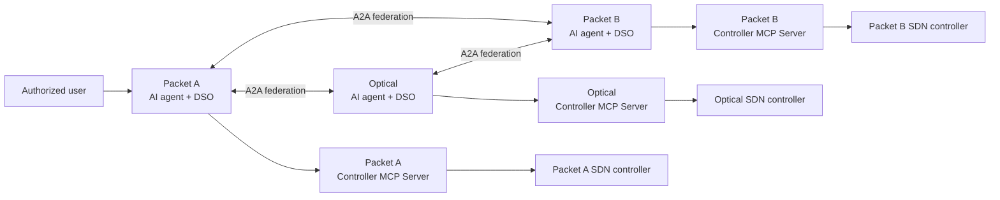
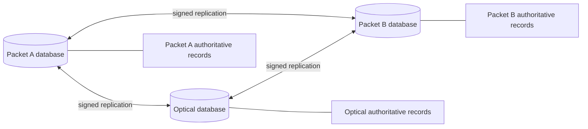
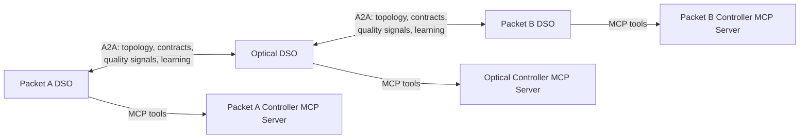
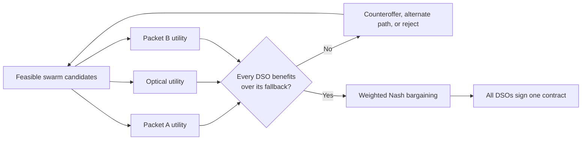
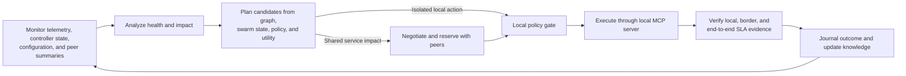

# Federated multi-domain AI networking system

This architecture automates an end-to-end service that crosses three separately
owned networks: Packet Domain A, an Optical Domain, and Packet Domain B. It is
a federation, so no central orchestrator, controller, or database has authority
over all three networks.

Each domain runs the same autonomous control unit:

```text
AI agent + Domain Service Orchestrator + domain database
+ Controller MCP Server + local SDN controller
```



The AI agent reasons about requests, topology, evidence, and alternatives. The
DSO makes deterministic lifecycle decisions: identity and policy validation,
candidate verification, bargaining, reservations, commit authorization,
verification, auditing, and learning. The local controller alone changes the
network.

## Shared understanding, local ownership

Each DSO has its own physical database. It is authoritative for that domain's
raw telemetry, local policy, private cost model, controller credentials, local
controller receipts, and source topology/configuration records.

Every DSO also maintains a signed replica of the entire federation's topology:
nodes, interfaces, packet links, optical links, relationships, capacity,
operational state, and approved configuration revisions. This is similar to a
link-state database: every DSO can reason over the full packet-optical-packet
graph, while the originating domain remains the only writer for its records.



Topology/configuration replication starts when peers authenticate and exchange
A2A Agent Cards. They compare signed graph digests, request any missing snapshot
or delta records, validate owner identity, signatures, sequence numbers, and
expiry, then apply the records atomically. Later node, link, configuration, and
reservation updates propagate as signed deltas.

## A2A between domains, MCP inside a domain

A2A is the mandatory protocol for every DSO-to-DSO interaction. It provides
Agent Cards, message delivery, tasks, correlation context, and structured
artifacts. The federation defines A2A extensions for topology synchronization,
service contracts, swarm optimization, and continual learning.

MCP is used only within a domain. The DSO calls its own Controller MCP Server
to observe or change that domain's SDN-controlled network. A peer DSO cannot
call a different domain's MCP server.



The Controller MCP Server provides typed tools such as `get_topology`,
`get_telemetry`, `validate_change`, `reserve_resources`, `prepare_change`,
`commit_change`, `rollback_change`, and `verify_change`. Packet MCP servers map
them to routing, VPN, QoS, and traffic-engineering APIs. The Optical MCP server
maps them to transport, transponder, ROADM, spectrum, channel, and QoT APIs.

## Creating a cross-domain service

An authorized user can submit an intent to any DSO. For example, a request may
ask to connect `server-a` in Packet A to `server-b` in Packet B at 1 Gbps, with
latency, loss, availability, deadline, and maximum-cost requirements.

The receiving DSO becomes the initiating DSO for the request. It creates a
correlation ID and a versioned service contract. All affected DSOs then follow
the same service lifecycle.

```mermaid
flowchart LR
    I[User intent] --> V[Validate user and policy]
    V --> G[Read current federated graph]
    G --> S[Swarm discovers feasible paths\nand resource alternatives]
    S --> C[DSOs create local candidates\nand signed cost quotes]
    C --> B[Game-theoretic bargaining]
    B --> R[Each DSO reserves locally\nthrough its MCP server]
    R -->|All receipts valid| X[Each DSO commits its\nown configuration]
    R -->|Reject, timeout, or stale plan| F[Release or compensate]
    X --> Q[Endpoint and border verification]
    Q -->|SLA proven| A[Active service]
    Q -->|SLA not proven| F
```



Packet A may offer a packet path, border attachment, and QoS profile. The
Optical DSO may offer a transport route, wavelength/spectrum allocation, and
transponder configuration. Packet B offers its packet path and QoS profile.
Every candidate must be feasible in the synchronized graph and accepted by the
owning domain's policy before it can be negotiated.

## Swarm optimization and game theory

Swarm optimization searches for useful alternatives. Bounded virtual scouts use
the federated graph plus signed, time-decaying quality signals for capacity,
latency, loss, jitter, availability, optical QoT/gOSNR, risk, and cost class.
Ant Colony Optimization is appropriate for discrete path, spectrum, and
configuration choices. Particle Swarm Optimization can optimize continuous
parameters such as bandwidth shares or queue allocations.

Verified outcomes reinforce useful resources and old results decay. The swarm
therefore answers: **which feasible options should be considered?**

Game theory decides whether independent owners agree to one of those options.
Each domain calculates local utility from service value/settlement minus
capacity, opportunity, operational, energy, and risk cost. Each has a fallback,
such as retaining its current service state or rejecting a new request. Weighted
Nash bargaining selects a feasible contract only when it meets the SLA and
budget and benefits every participating domain over its fallback.



## Reservation, commit, and verification

After agreement, each DSO performs a local transaction through its Controller
MCP Server. It validates and reserves its named resources, stores a durable
receipt and rollback reference, then waits until all required peer reservation
summaries are valid. Each DSO rechecks policy, contract revision, topology
revision, configuration state, and reservation validity before committing.

This is a distributed saga. If a reservation fails, expires, becomes stale, or
the verified service does not meet its SLA, affected DSOs release resources or
roll back their own local transactions. No DSO writes directly to a peer's
controller.

## Continuous closed loops

Every DSO runs an independent MAPE-K closed loop:



Packet DSOs monitor packet loss, latency, jitter, queues, utilization, route
state, and endpoint probes. The Optical DSO monitors spectrum, QoT/gOSNR,
transponders, channels, and ROADMs. If a shared service is affected, remediation
re-enters bargaining before a controller change. A short-lived coordination
lease prevents the three loops from starting conflicting remediation workflows
for the same incident.

## Continual learning

Terminal service outcomes feed an asynchronous learning graph in every DSO.
Each domain learns from its local evidence and signed peer outcome summaries.
Packet domains learn packet-path and queue behavior; the Optical Domain learns
transport, spectrum, QoT, and transponder behavior.

Learning may improve QoS predictions, risk estimates, cost calibration, swarm
heuristics, and negotiation ranking. It is controlled through three levels:

- **L0:** measured observations and calibration facts.
- **L1:** shadow or advisory ranking of already feasible candidates.
- **L2:** reviewed updates to approved policy, cost, or risk parameters.

Learning cannot create a new controller action, alter peer-owned configuration,
weaken hard safety constraints, or bypass policy, bargaining, reservation,
commit authorization, and verification.

For schemas, LangGraph node definitions, message contracts, cost formulas, and
all detailed diagrams, see the [domain-agent architecture](domain-agent-architecture.md).
