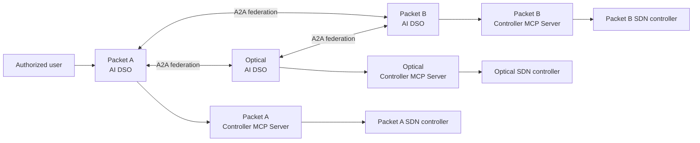
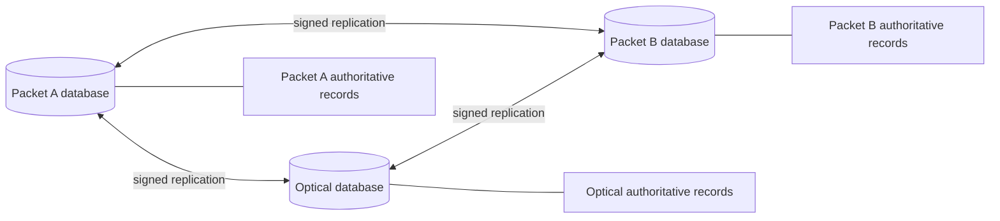
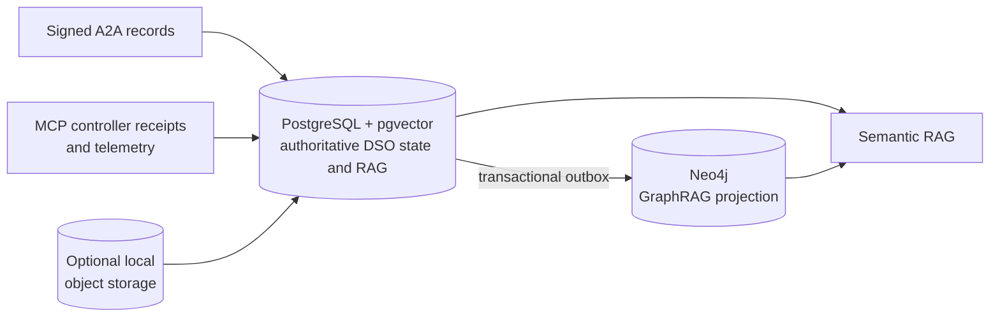
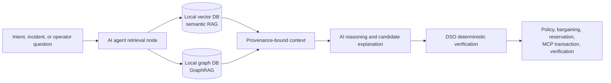
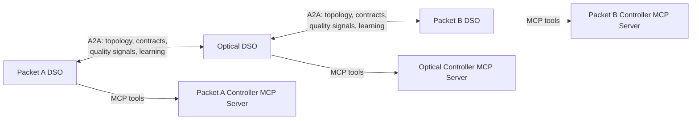
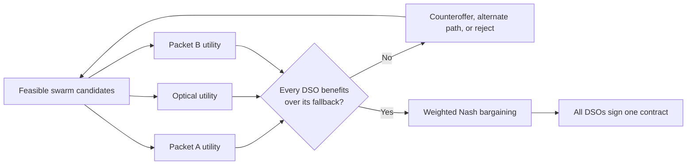
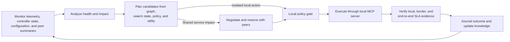

# Federated multi-domain AI networking system

This architecture automates an end-to-end service that crosses three separately
owned networks: Packet Domain A, an Optical Domain, and Packet Domain B. It is
a federation, so no central orchestrator, controller, or database has authority
over all three networks.

This is a technical architecture and research design for an Elsevier *Computer
Networks* paper. The recommended contribution is a precise inter-domain service
protocol under changing state and partial failure, with selective LLM assistance.
Existing work already covers many individual components; see the
[literature assessment](related-work-and-novelty.md). The behaviors below are
proposed requirements, not experimentally verified guarantees.

Each domain runs the same autonomous control unit:

```text
AI Domain Service Orchestrator + domain database
+ Controller MCP Server + local SDN controller
```



The **AI agent is the Domain Service Orchestrator (DSO)**. It is one persistent
runtime hosting the domain workflows. Its non-generative nodes handle identity
and policy validation,
candidate verification, bargaining, reservations, commit authorization,
verification, auditing, and learning. Three named nodes may conditionally call
an LLM for grounded reasoning. The local controller alone changes the network.

The [LangGraph node catalogue](langgraph-node-catalog.md) identifies the
algorithm, policy, retrieval, protocol, MCP, or conditional LLM method used by
every node.

## Shared understanding, local ownership

Each DSO has its own physical database. It is authoritative for that domain's
raw telemetry, local policy, private cost model, controller credentials, local
controller receipts, and source topology/configuration records.

Every DSO also maintains a signed replica of the entire federation's topology:
nodes, interfaces, packet links, optical links, relationships, capacity,
operational state, and approved configuration revisions. This is similar to a
link-state database: every DSO can reason over the full packet-optical-packet
graph, while the originating domain remains the only writer for its records.

Replication is eventual: peers may temporarily hold different revisions. A
matching digest identifies equal content, not proof that no newer state exists.
Sharing the complete approved graph is an explicit disclosure assumption. Local
databases preserve each operator's control authority, but do not hide its shared
topology from peers.



Topology/configuration replication starts when peers authenticate and exchange
A2A Agent Cards. They compare signed graph digests, request any missing snapshot
or delta records, validate owner identity, signatures, sequence numbers, and
expiry, then apply the records atomically. Later node, link, configuration, and
reservation updates propagate as signed deltas.

### Recommended database stack per domain

Each DSO deploys a small local database stack, not one shared federation
database:

| Store | Recommended technology | Responsibility |
|---|---|---|
| System of record and vector RAG | PostgreSQL with `pgvector` | ACID service contracts, A2A message journal, reservations, controller receipts, audit records, policies, configuration/source metadata, and embedded RAG chunks. |
| Telemetry store | PostgreSQL time-partitioned tables; TimescaleDB where telemetry volume warrants it | Time-stamped packet, optical, controller, and service measurements. |
| GraphRAG projection | Neo4j | Traversable multi-domain topology, service, resource, configuration, evidence, incident, candidate, reservation, and outcome relationships. |
| Optional evidence archive | Domain-local object storage | Large raw artifacts such as PCAPs, optical traces, snapshots, and documents; PostgreSQL stores their digests and references. |

`pgvector` is the vector database component for the initial deployment. It keeps
RAG chunks and embeddings beside the contract and provenance records that govern
their use. Neo4j is a separate read-optimized GraphRAG projection. PostgreSQL
is authoritative; an outbox event updates Neo4j after a committed source change.
The DSO refuses a GraphRAG result if its graph revision or source digest lags the
current service/topology decision.



## RAG and GraphRAG knowledge layer

Every AI agent has two local retrieval stores.

- A **vector database** supports RAG over unstructured material: runbooks,
  design documents, policy text, controller/MCP tool documentation, incident
  reports, change records, and approved learning releases.
- A **graph database or graph projection** supports GraphRAG over the federated
  topology plus service, configuration, reservation, evidence, incident, and
  outcome relationships.



RAG answers semantic questions such as which operational procedure applies to a
QoT alarm. GraphRAG answers relationship questions such as which active services
traverse an impaired optical link, which packet paths remain connected, or which
configuration revisions affect a candidate. The DSO binds retrieval results to
their source IDs, graph/configuration revisions, and expiry. Retrieved text or
AI output cannot itself authorize a controller change.

The GraphRAG workflow also uses deterministic graph algorithms. BFS checks
reachability, finds nearby impacted services/resources, and calculates hop-based
neighborhoods. Bounded DFS enumerates simple end-to-end path alternatives and
detects cycles. Constraint-aware shortest-path ranking then applies latency,
capacity, QoS, risk, and configuration compatibility requirements. The swarm
optimizer explores the resulting bounded feasible candidate set.

## A2A between domains, MCP inside a domain

A2A is the mandatory protocol for every DSO-to-DSO interaction. It provides
Agent Cards, message delivery, tasks, correlation context, and structured
artifacts. The federation defines A2A extensions for topology synchronization,
service contracts, swarm optimization, and continual learning.

MCP is used only within a domain. The DSO calls its own Controller MCP Server
to observe or change that domain's SDN-controlled network. A peer DSO cannot
call a different domain's MCP server.



The Controller MCP Server provides typed tools such as `get_topology`,
`get_telemetry`, `validate_change`, `reserve_resources`, `prepare_change`,
`commit_change`, `rollback_change`, and `verify_change`. Packet MCP servers map
them to routing, VPN, QoS, and traffic-engineering APIs. The Optical MCP server
maps them to transport, transponder, ROADM, spectrum, channel, and QoT APIs.

## Creating a cross-domain service

An authorized user can submit an intent to any DSO. For example, a request may
ask to connect `server-a` in Packet A to `server-b` in Packet B at 1 Gbps, with
latency, loss, availability, deadline, and maximum-cost requirements.

The receiving DSO becomes the initiating DSO for the request. It creates a
correlation ID and a versioned service contract. All affected DSOs then follow
the same service lifecycle.

The initial intake accepts a structured intent schema. An arbitrary natural-language
request needs a separately specified translator and validated canonical output;
the current three conditional LLM nodes do not include an intent translator.

```mermaid
flowchart LR
    I[User intent] --> V[Validate user and policy]
    V --> G[Read current federated graph]
    G --> S[Constrained path search\nwith optional swarm exploration]
    S --> C[DSOs create local candidates\nand signed cost quotes]
    C --> B[Game-theoretic bargaining]
    B --> R[Each DSO reserves locally\nthrough its MCP server]
    R -->|All receipts valid| X[Each DSO commits its\nown configuration]
    R -->|Reject, timeout, or stale plan| F[Release or compensate]
    X --> Q[Endpoint and border verification]
    Q -->|Checks pass for observation window| A[Active service]
    Q -->|Checks fail or evidence missing| F
```



Packet A may offer a packet path, border attachment, and QoS profile. The
Optical DSO may offer a transport route, wavelength/spectrum allocation, and
transponder configuration. Packet B offers its packet path and QoS profile.
Every candidate must be feasible in the synchronized graph and accepted by the
owning domain's policy before it can be negotiated.

Graph connectivity is only one feasibility condition. The optical controller
must validate the spectrum, transponder, and optical quality constraints modeled
by the experiment. A later state change can invalidate an initially feasible plan.

## Swarm optimization and game theory

Swarm optimization searches for useful alternatives. Bounded virtual scouts use
the federated graph plus signed, time-decaying quality signals for capacity,
latency, loss, jitter, availability, optical QoT/gOSNR, risk, and cost class.
Ant Colony Optimization is an optional stochastic search method for discrete
choices. Report its seeds and computational budget and compare it with simpler
feasible-path search. Particle Swarm Optimization is a later option for continuous
parameters. Neither method adds generative LLM nodes.

Verified outcomes reinforce useful resources and old results decay. The swarm
therefore answers: **which feasible options should be considered?**

Game theory decides whether independent owners agree to one of those options.
Each domain calculates local utility from service value/settlement minus
capacity, opportunity, operational, energy, and risk cost. Each has a fallback,
such as retaining its current service state or rejecting a new request. Weighted
Nash bargaining selects a feasible contract only when it meets the SLA and
budget and benefits every participating domain over its fallback.

The recommended prototype shares signed, candidate-specific utility gains and
agreed weights so peers can reproduce the bargaining calculation. Private cost
coefficients remain local, but these disclosed gains still reveal information.
If a domain does not permit that disclosure, a different agreement mechanism
must be specified. Nash bargaining does not by itself establish truthful reporting
or a Nash equilibrium.



## Reservation, commit, and verification

After agreement, each DSO performs a local transaction through its Controller
MCP Server. It validates and reserves its named resources, stores a durable
receipt and rollback reference, then waits until all required peer reservation
summaries are valid. Each DSO rechecks policy, contract revision, topology
revision, configuration state, and reservation validity before committing. The
controller must enforce the expected resource/configuration conditions when it
accepts the operation; a DSO-side check followed by an unconditional write leaves
a race. If an adapter cannot enforce this condition, document and evaluate the
weaker guarantee.

This is a distributed saga, not simultaneous physical activation. Partial
completion and failed compensation are possible. Lost acknowledgements trigger
receipt reconciliation before retry or compensation. DSOs release unused
reservations, attempt supported rollback, and retain an explicit unresolved or
degraded state when recovery cannot be verified. No DSO writes directly to a
peer's controller. See the [protocol requirements](domain-agent-architecture.md#research-protocol-requirements).

## Continuous closed loops

Every AI DSO runs an independent MAPE-K closed loop. It remains active through
periodic scheduling and event-driven wakeups from telemetry, topology changes,
peer A2A messages, reservation expiry, verification failures, and new intent:



Packet DSOs monitor packet loss, latency, jitter, queues, utilization, route
state, and endpoint probes. The Optical DSO monitors spectrum, QoT/gOSNR,
transponders, channels, and ROADMs. If a shared service is affected, remediation
re-enters bargaining before a controller change. A short-lived coordination
lease coordinates remediation conversations for the same incident. Conflict
exclusion additionally requires durable coordination epochs and controller-side
rejection of superseded epochs. During a partition, a DSO cannot assume that
missing peer responses grant authority. The precise replacement and expiry rules
must be specified and validated before claiming conflicting actions are prevented.

## Continual learning

Terminal service outcomes feed an asynchronous learning graph in every DSO.
Each domain learns from its local evidence and signed peer outcome summaries.
Packet domains learn packet-path and queue behavior; the Optical Domain learns
transport, spectrum, QoT, and transponder behavior.

Learning may improve QoS predictions, risk estimates, cost calibration, swarm
heuristics, and negotiation ranking. It is controlled through three levels:

- **L0:** measured observations and calibration facts.
- **L1:** shadow or advisory ranking of already feasible candidates.
- **L2:** reviewed updates to approved policy, cost, or risk parameters.

Learning cannot create a new controller action, alter peer-owned configuration,
weaken hard safety constraints, or bypass policy, bargaining, reservation,
commit authorization, and verification.

Learning remains an optional extension for the first paper. Compare it against
fixed policies on held-out cases, and distinguish retrieval of past incidents
from model training. A federation of DSOs does not imply federated model training.

## Vulnerabilities and coordination limitations

These are architectural risks and unresolved protocol requirements, not confirmed
exploits in an implemented system. The absence of majority voting is not itself
a vulnerability: service authorization requires consent from every affected
resource owner. The main coordination gap is specifying and validating recovery
when agents disagree, lose communication, or replace a failed coordinator.

### Voting cannot replace domain consent

Keep explicit, signed acceptance of the same contract from **every participating
domain**, followed by valid reservations and independent local controller
authorization. Unrelated federation members do not vote on that service. A
coordinator organizes the exchange; it does not acquire authority over peers.

For example, Packet A and Packet B may approve a 100 Gbit/s service while the
optical domain rejects it because spectrum is unavailable. A 2–1 majority cannot
create capacity or authorize the optical resources. The DSOs must find another
feasible agreement or reject the request. Bargaining weights influence allocation
selection; they are not voting power that can override an owner's rejection.

### Risks, consequences, and required controls

| Vulnerability or limitation | Potential consequence | Required control or design decision |
| --- | --- | --- |
| Majority approval incorrectly treated as execution authority | Two domains attempt to override another owner's policy or resource rejection. | Require acceptance from every affected owner and enforce local controller authorization for each operation. |
| Competing or superseded recovery coordinators | Concurrent loops issue incompatible repairs for the same service. | Define coordinator nomination and replacement, durable grants and epochs, and controller rejection of superseded requests. Lease expiry alone does not establish exclusion. |
| A required participant is unreachable, slow, or refuses agreement | New service establishment or shared-service recovery can stall even while other domains are healthy. | Bound negotiation and reservation lifetimes; defer or reject the dependent change. Silence is not consent. Continue monitoring and independently preauthorized protection within scope. |
| Peers approve against stale or inconsistent evidence | An accepted allocation is no longer feasible when execution begins. | Bind approvals to contract and dependency revisions; enforce resource conditions at controller acceptance. Matching votes or digests alone do not establish current feasibility. |
| Unanimous agreement followed by partial execution or a lost receipt | Some domains apply changes while others fail; an uncertain retry may duplicate effects. | Reconcile durable receipts, use operation-scoped idempotency, and attempt supported compensation. Retain explicit partial, degraded, or unresolved outcomes. Agreement is not atomic physical activation. |
| Several agents repeat the same unsupported diagnosis or misleading report | Apparent agreement amplifies an error rather than validating network state. | Validate attributable observations and controller evidence. LLM opinions are advisory; signatures prove attribution, not truth. The initial cooperative-operator model does not establish tolerance of malicious peers. |

### Coordinator failover requirements

Before claiming recovery coordination is safe, specify and test:

1. How a candidate coordinator is nominated and which participants must acknowledge it.
2. How grants, service/contract references, and ordered coordination epochs survive restart.
3. When a replacement may act, how controllers enforce its authority, and how already accepted operations from an earlier epoch are reconciled.
4. Which clock and expiry assumptions apply, and how partitions affect replacement.
5. How missing approvals or unknown operation outcomes defer new shared-service changes without granting authority by timeout.

These responsibilities belong in the existing incident, `remediation_dispatch`,
`bargaining_solution_gate`, `reservation_barrier`, `commit_authorization_gate`,
and `controller_transaction` paths. A generic LLM voting node is not required.
See the [protocol requirements](domain-agent-architecture.md#research-protocol-requirements)
and [evaluation plan](implementation-roadmap.md#journal-evaluation-plan) for the
corresponding failure experiments.

If a later design requires a fault-tolerant shared coordination log, a consensus
protocol such as Raft may support leader election and replicated decisions under
its non-Byzantine failure assumptions. Such a quorum decides coordination state;
it does not replace each operator's service approval or make physical execution
atomic. This is an optional future mechanism, not part of the current design.
[Raft paper](https://raft.github.io/raft.pdf).

## Research validation

The [journal evaluation plan](implementation-roadmap.md#journal-evaluation-plan)
requires a baseline with the same federation, graph, algorithms, and controller
tools but no LLM calls. Separate experiments compare context freshness checks,
centralized orchestration, bargaining, and optional swarm search. Measure verified
service success, SLA violation duration, recovery latency, invalid operations,
unresolved transactions, communication overhead, and model cost. A successful
three-domain demonstration establishes feasibility; it does not alone establish
novelty, scalability, or a correctness guarantee.

For schemas, LangGraph node definitions, message contracts, cost formulas, and
all detailed diagrams, see the [domain-agent architecture](domain-agent-architecture.md).
