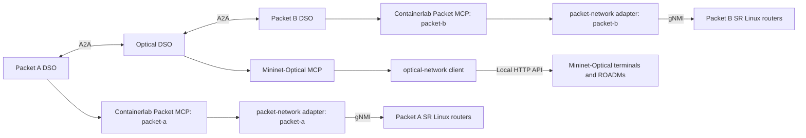

# Containerlab and Mininet-Optical MCP server design

**Status:** required design, recorded 22 September 2026. The MCP servers are
not implemented. Specify their interfaces on the planning VM; deploy and
validate them in the separate implementation/testbed environment.

The data plane needs two MCP server implementations: **Containerlab Packet MCP**
and **Mininet-Optical MCP**. The Containerlab implementation is reused in two
independent domain instances. This gives **two server types and three runtime
endpoints**, preserving the architecture's one-controller-boundary-per-domain
rule.

| Server implementation | Runtime instance | Authorized DSO | Backend and resource scope |
| --- | --- | --- | --- |
| Containerlab Packet MCP | `packet-a-mcp` | Packet A | `packet-network` adapter; `pe-a1`, `p-a1`, `p-a2`, `gw-a`; Packet A endpoint operations |
| Containerlab Packet MCP | `packet-b-mcp` | Packet B | Same implementation with separate configuration; `gw-b`, `p-b1`, `p-b2`, `pe-b1`; Packet B endpoint operations |
| Mininet-Optical MCP | `optical-mcp` | Optical | `optical-network` adapter and the Mininet-Optical control API; terminals and `r1`–`r4` |

These implement the existing **Controller MCP Server** role. They do not add
another orchestrator. Each DSO calls only its own instance; agreements and peer
evidence continue to travel over A2A.

## Observation support for the agentic decision loop

The [adaptive decision loop](docs/old/domain-agent-architecture.md#adaptive-agent-decision-loop)
requires a versioned catalogue of permitted read/validate operations, separate
from mutation candidates. Entries specify tool ID, owning domain, typed bounded
parameters, returned evidence schema, freshness, and query cost/budget accounting.
Examples are owned interface/path status, optical channel/QoT observations, and
Packet B's fresh receiver results; advertise only capabilities the adapter
actually supplies. Unsupported measurements remain explicitly unavailable.

The model proposes a catalogue ID and arguments. Existing deterministic DSO nodes
validate identity, scope, arguments, and budget before invoking local MCP. Peer
evidence requests travel over A2A and are executed only by the peer's own DSO;
no model or peer gains direct access to another owner's MCP endpoint. Return
timestamped, attributable observations or typed errors, not fabricated health.
Record the request, result, and subsequent decision. Read-only acquisition never
reserves or mutates resources; configuration changes retain all existing gates.

This is a planned interface refinement for the agentic systems study, not an
implemented server or permission to expose shell/device commands. B0–B4 share
the same authorized observation/action capabilities and declared query budgets.

## Required allocation support for the full system

ACO, PSO, Nash bargaining, and continual learning are all required by the
[coupled method](docs/old/agentic-system-method.md). The current tools cannot enforce
PSO's continuous per-service bandwidth allocations. Implement the resource
simulator first; measured allocation claims additionally require owner-scoped
service classification, packet shaping/scheduling, capacity accounting, readback,
and independent measurements of competing flows. Expose typed allocation
operations only after their backend behavior is implemented and validated.

The optical owner validates channel choice, capacity contribution, and modeled
quality. Do not invent optical power/modulation controls or concurrent wavelength
capabilities. Learning consumes attributable observations and actual outcomes;
predictor releases do not change the MCP action allowlist or another owner's policy.

## Containerlab Packet MCP

Containerlab supplies topology and node lifecycle. Router configuration and
telemetry use the existing gNMI adapter, rather than treating Containerlab as a
routing controller. Reuse [inventory.py](packet-network/inventory.py),
[gnmi.py](packet-network/gnmi.py),
[backup_path.py](packet-network/backup_path.py) and
[telemetry.py](packet-network/telemetry.py) behind a typed, domain-scoped
service interface.

Each instance must bind its domain, inventory, credentials, receipt store and
permitted endpoint operations at deployment. A caller-supplied `domain_id` is
checked against that binding; it cannot switch the instance to another domain.
The two instances may share code, but must not share an unrestricted privileged
backend or credentials that authorize both router sets.

The initial resource profile includes owned inventory, configured routes,
interface observations, path readiness, retaining the current path, activating
the backup and restoring the primary. Packet A owns sender operations; Packet B
owns receiver operations and receiver evidence. A DSO receives remote delivery
evidence through its peer, without access to the peer's MCP endpoint. Endpoint
execution must use a constrained interface; unrestricted Docker access would
defeat domain scoping.

Selecting a healthy backup during provisioning needs an explicit policy and
action contract. The current recovery procedure's rehearsal `--force` flag
must not become implicit provisioning authorization. Per-service bandwidth
reservation, VPN creation and QoS programming remain unsupported in this fixture.

## Mininet-Optical MCP

Wrap [spec.py](optical-network/spec.py) and
[client.py](optical-network/client.py) for inventory, supported channels,
observed optical state, monitor readings, retaining a verified channel and
configuring/retuning to channel 1 or 2. Bind the backend address and permitted
resources in deployment configuration; tools must not accept arbitrary backend
URLs, shell commands or unrestricted HTTP requests.

The optical API currently uses loopback HTTP. Place the MCP backend adapter
where it can reach that API, with an explicit process/network placement design;
`localhost` in an unrelated container is not the emulator's loopback. The DSO
connects to the MCP endpoint rather than directly to the emulator API.

Expose modeled OSNR/gOSNR, coverage, collection time and missing-data reasons
separately from service health. Current channel observation comes from terminal
monitors, not installed-rule readback. A carried channel does not establish
packet delivery. One wavelength is carried at a time, both share the same fibre
route, and an optical cut has no alternate path in this profile.

Retaining an unchanged verified channel must avoid disruptive resets. A real
retune must retain progress and report partial or uncertain outcomes when it
fails. Native spectrum reservations, concurrent multi-channel allocation and
optical protection must not be advertised as implemented capabilities.

## Shared tool and result contract

Use common versioned schemas and error semantics where the operations mean the
same thing. The table is a target interface, not an inventory of callable tools.

| Tool group | Required meaning |
| --- | --- |
| `get_capabilities` | Supported observations, named actions, resource scope, transaction guarantees and explicit unsupported features |
| `get_inventory` / `get_topology` | Owned nodes, ports, links, attachments and source revisions |
| `get_configuration` / `get_telemetry` | Attributed configuration and observations with timestamps, coverage and missing-data reasons |
| `get_service_evidence` | Domain-local verification evidence; Packet B supplies receiver measurements, Optical supplies optical observations |
| `validate_change` | Validate a named action against ownership, policy, capabilities and current evidence without mutation |
| `reserve_resources` / `prepare_change` | Only the declared adapter-supported hold/preparation semantics, with durable references and expiry |
| `commit_change` | Accept an authorized prepared action, enforce supported conditions and record application separately |
| `get_transaction` / `verify_change` | Reconcile durable receipts and return fresh local evidence; an acknowledgement alone is not verification |
| `rollback_change` / `release_reservation` | Perform only declared compensation/release operations and report unresolved outcomes explicitly |

The v1 specification must define concrete input/output schemas and capability
advertisement rules for these groups. Unsupported operations return an explicit
unsupported result; naming a reservation tool does not create physical bandwidth
or spectrum isolation. Distinguish adapter-local serialization from a guarantee
enforced by the device against every possible writer.

Mutating requests bind authenticated caller identity, local domain, service and
contract revision, action/candidate digest, evidence/configuration dependencies,
operation key, deadline, and applicable reservation/coordination references.
Persist acceptance and application outcomes separately. Repeating an operation
key must reconcile its prior outcome; a changed payload cannot reuse that key.
Results must distinguish refused, unsupported, unknown, partially applied and
verified outcomes. Each server reports only the evidence and authority it owns;
the DSO determines the aggregate service outcome.

## Bootstrap and experiment boundary

Keep shared Containerlab deploy/destroy/configure-all, optical process
start/stop/global cleanup, namespace attachment and fault injection in trusted
testbed administration. They are not runtime DSO tools. If a later lab-management
MCP interface is needed, give it a separately authorized administrative scope;
do not add global host powers to the domain endpoints above.

DSOs and LLM calls receive no generic shell, raw Docker socket or arbitrary gNMI
write tool. The server enforces named operations and ownership below tool
dispatch. Separate endpoints alone do not establish isolation; the resource
credentials and execution paths must enforce it too.

## Design handoff and implementation order

1. Freeze the two server capability profiles, three instance identities,
   deployment placement and backend access boundaries in the v1 specification.
2. Define shared schemas, domain action payloads, policy checks, receipt/state
   transitions and acceptance cases before choosing server SDK/transport details.
3. Plan the Containerlab and Mininet-Optical adapters as separate implementation
   packages, reusing schema/receipt code without sharing cross-domain authority.
4. Cover the [known findings](docs/old/known-issues.md): F2/F3/F4/F6/F10 for packet
   observation/actions; F7/F8 for optical changes/evidence; F1/F5/F9 for the
   administrative lifecycle; C1 for authorization and C2 for retained evidence.
5. Validate in the designated testbed: wrong-domain denial, supported and
   unsupported actions, stale evidence, failed reads, duplicate requests,
   partial application and reconciliation. Verify forwarding independently of
   MCP success and preserve outcomes after server restart.

This supplies the backend-specific design for
[roadmap Phase 2](docs/old/implementation-roadmap.md#phase-2--local-controller-mcp-server-and-transaction-safety)
and the [local controller contract](docs/old/domain-agent-architecture.md#local-sdn-controller-mcp-servers).
Server implementation and live validation remain future work.
