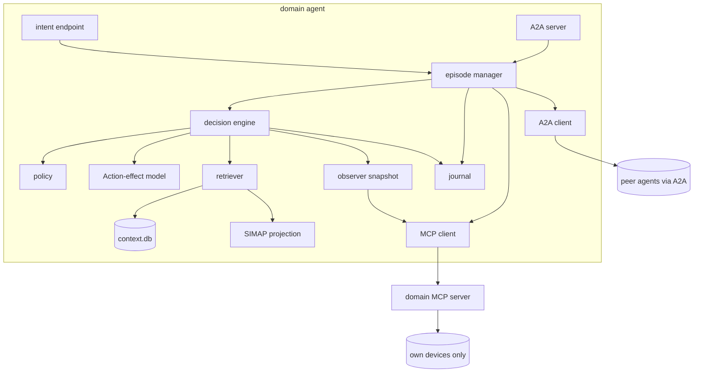

# Paper 1 — System design

**Scope:** the architecture as Paper 1 builds and uses it.
**Canonical source:** this document. Paper 1 is the base system, so its
design is canonical for everything Papers 2 and 3 inherit; each of those is
authoritative only for what it adds.

> **Research status, 24 September 2026:** the [TNSM proposal](tnsm-proposal.md)
> defines the current contribution in recovery under limited disclosure and
> stale evidence. The [plan](plan.md) defines hypotheses H1–H3 and their tests;
> the [review](state-of-the-art.md) records the novelty boundaries. This document
> is the proposed implementation reference. Protocols, graphs, schemas, and
> guarantees described below require implementation and validation unless §14
> explicitly identifies an existing component.

---

## 0. At a glance

**What this paper's proposed system should do.**

| | Capability | Where |
| --- | --- | --- |
| **Provision** | Enumerate eight joint configurations, negotiate over A2A, execute per owner, or refuse honestly | §4, §6 |
| **Attribute** | Use compatible measurements to estimate affected segments and support permitted recovery actions | §10 |
| **Estimate** | Estimate action effects and uncertainty from a declared, validated model | §11 |
| **Collect** | Schedule permitted evidence groups, replan on change, and record disclosure and wasted acquisition | §11.5 |

**The numbers.**

| | |
| --- | --- |
| Domains / agents | 3, one per owner, none above them |
| Joint configurations | **8** — exact action enumeration for the pilot; evidence collection is a separate planning problem |
| SIMAP | Two layers: services and segments over 14 infrastructure nodes |
| LangGraph nodes | **25** — 14 reasoning, 6 gates, 5 effectors (§7.6) |
| Path segments | **4**, bracketed by interfaces that already export counters (§10.1) |
| Comparators | Local, fixed, full, information/value-based, decision-region, and periodic-refresh methods ([plan §6](plan.md#6-baselines-and-ablations)) |
| Hypotheses | **H1–H3** — recovery/disclosure, anticipated validity, and generalization |

**Observation and authority differ.** Packet B can observe delivery at its
receiver. Other owners can obtain that evidence when disclosure policy permits.
Each owner still controls only its own resources. These are modelling choices
and operational constraints, not a proof that local learning is impossible.

---

## 1. What this paper builds

The Paper 1 implementation follows Phases 0–4 of the [plan](plan.md#8-build-phases).
Optional retrieval and engine integration points are specified for later reuse.

**Excluded, and belonging to other papers:** continuous assurance loops, sender
rate adaptation and loop stability (Paper 2); evaluation of the reasoning layer,
retrieval-mode comparison and the grounding gate as a subject (Paper 3).

Paper 1 uses deterministic decisions. The evidence scheduler is tested offline
before integration into the proposed 25-node runtime. The final graph and schema
are versioned and frozen before extension comparisons.

---

## 2. The premise: ownership splits observation

Three independently owned networks carry one service from `client-a` to
`server-b`.

- **Packet A owns the sender.** It can prove packets left.
- **Packet B owns the receiver.** It alone can prove packets arrived.
- **Optical owns the line.** It sees margin, and nothing about delivery.

Packet B observes receiver delivery through `../packet-network/traffic.py`.
Routing state or a successful configuration write alone does not establish
application delivery. Explicit receiver feedback can give other owners outcome
information; each experiment must declare the permitted feedback.

**Initial local features and delivery labels, before peer disclosure:**

| Agent | Features | Labels |
| --- | --- | --- |
| `agent-packet-a` | action, discards, utilisation | none |
| `agent-optical` | channel, gOSNR, margins | none |
| `agent-packet-b` | action, discards | receiver delivery labels |

This setting has precedents in vertical federated learning. It does not establish
that a local predictor must be poor or that sharing is intrinsically novel.

---

## 3. Agents and authority

One agent per owner. Exactly one. None above them.

| Agent | Owns | Actions | Observes |
| --- | --- | --- | --- |
| `agent-packet-a` | `pe-a1`, `p-a1`, `p-a2`, `gw-a`, sender | `path=primary`, `path=backup` | own counters, own routes, sender liveness |
| `agent-optical` | `t-client`, `r1`–`r4`, `t-server` | `channel=1`, `channel=2`, `refuse` | per-node OSNR/gOSNR, carried channels |
| `agent-packet-b` | `gw-b`, `p-b1`, `p-b2`, `pe-b1`, receiver | `path=primary`, `path=backup` | own counters, own routes, **delivery evidence** |

**Authority rules.** The proposed controller changes only its owner's resources.
`assert_owned` in `../packet-network/inventory.py` provides inventory scoping;
independent credentials and server-side authorization still need implementation.
The action space is a fixed list of named procedures. Any owner may refuse, and
no majority overrides a refusal.

---

## 4. The candidate space

Three action spaces multiply to **eight joint configurations** (C1–C8: Packet A
primary/backup × channel 1/2 × Packet B primary/backup), plus `refuse`.

The initiator enumerates all eight action configurations exactly. C1–C8 here
are configuration IDs, not historical research claim IDs. Selecting and
scheduling evidence remains a separate planning problem (§11.5).

**Deliberate limit.** Both wavelengths ride the same fibre chain, so no
configuration survives an optical cut. The correct behaviour is an honest report
of unresolvable service; E1 must test this case.

---

## 5. Conditions: what makes this a learning problem

A healthy lab delivers ~1.0 on every configuration and ~0 when cut — a lookup
table. Delivered quality must be a genuine function of **configuration ×
condition**, so the condition harness is part of the fixture.

**Mechanism:** `tc netem` per link, driven by a declared schedule, pinned per
run and published.

| Class | Injected at | Seen locally by | Effect seen by |
| --- | --- | --- | --- |
| **Locally visible** | inside a packet domain's core | validate whether the owner's permitted counters expose the injection | the receiver |
| **Modelled-only** | optical launch power / amplifier gain | optical agent's gOSNR | no packet effect unless separately coupled |
| **Locally unlocalized** | the attachment segment, `gw-a`↔`gw-b` | boundary counts may change, but localization may require a compatible peer count | the receiver and suitable combined evidence |

Measure each fixture's visibility before classifying it. Failure to localize
from one owner's allowed observations is not absence of every local signal.
No-sharing supervised updates can be disabled by a declared feedback policy;
that does not prove that an owner cannot learn or that its error must be flat.

The **modelled-only** class is a negative control: the optical feature changes
without a corresponding causal packet impairment. Healthy and unrepairable
incidents must also be retained.

**Schedules** run stationary → gradual drift → abrupt shift inverting the best
configuration → recurrence of an earlier regime. Recurrence separates adaptation
from forgetting. Add independent sweeps of collection/execution delays, missing
responses, counter resets, path revisions, and sequential/parallel collection.
The new hypothesis concerns recovery and evidence scheduling under these changes.

---

## 6. Peer communication: A2A

### 6.1 Agent Cards

Each agent publishes `/.well-known/agent-card.json` declaring its identity,
domain, skills and action space, so peers are discovered rather than hard-coded.
An agent without a valid card is not a peer. Cards are fetched at startup,
re-fetched on version change, and journalled.

### 6.2 One episode, one task per peer

The initiator opens an A2A task with each peer, sharing a `contextId`.

| A2A state | Means here |
| --- | --- |
| `submitted` | announcement delivered |
| `working` | peer gathering evidence and evaluating |
| `input-required` | peer has answered, awaiting the next step |
| `completed` | peer executed and published its outcome |
| `rejected` | peer refused outright |
| `failed` | peer could not complete what it accepted |

Payloads travel as `DataPart`; human-readable rationale as `TextPart` alongside.

### 6.3 The six exchanges

| Exchange | Direction | Carries |
| --- | --- | --- |
| `ANNOUNCE` | initiator → peers | the service requirement |
| `OPTIONS` | peer → initiator | feasible local actions, costs, predictions |
| `PROPOSE` | initiator → peers | one named joint configuration |
| `ACCEPT` / `REFUSE` / `COUNTER` | peer → initiator | the owner's answer and its grounds |
| `COMMIT` | initiator → peers | authorisation to execute the agreed assignment |
| `OUTCOME` | any → all | verified result, delivered as an A2A **artifact** |

**`ANNOUNCE`** — `DataPart` of a `message/send`:

```json
{
  "exchange": "ANNOUNCE",
  "episode_id": "ep-0142",
  "from": "agent-packet-a",
  "intent": {
    "source": {"domain": "packet-a", "endpoint": "client-a"},
    "destination": {"domain": "packet-b", "endpoint": "server-b"},
    "offered_load_mbps": 1,
    "objective": {"min_delivered_ratio": 0.98, "max_loss_ratio": 0.01}
  },
  "simap_revision": {"packet-a": 17, "optical": 9, "packet-b": 14},
  "issued_at": "2026-09-24T16:00:00Z"
}
```

**`OPTIONS`** — costs in the units of §9, never a blended score:

```json
{
  "exchange": "OPTIONS", "episode_id": "ep-0142", "from": "agent-optical",
  "actions": [
    {"action": "channel=1", "feasible": true,
     "cost": {"transactions": 1, "occupancy": 0.5},
     "predicted": {"delivered_ratio": 0.97, "confidence": 0.80}},
    {"action": "channel=2", "feasible": true,
     "cost": {"transactions": 1, "occupancy": 0.5},
     "predicted": {"delivered_ratio": 0.99, "confidence": 0.40}}
  ],
  "telemetry_summary": {"worst_gosnr_db": 28.1, "carried_channels": [1]},
  "predictor_version": "opt-v17",
  "disclosure_id": "disc-3391"
}
```

`telemetry_summary` is present only in sharing conditions that disclose live
state, and whatever it carries is recorded in the `disclosure` table (§8.1).

**`PROPOSE`** names one of the eight configurations:

```json
{"exchange": "PROPOSE", "episode_id": "ep-0142", "candidate": "C3",
 "assignment": {"packet-a": "path=primary", "optical": "channel=2",
                "packet-b": "path=primary"},
 "round": 1, "expires_at": "2026-09-24T16:00:30Z"}
```

**`REFUSE`** carries a machine-readable reason and its grounds; a `COUNTER`
must name a candidate from the same enumerated set:

```json
{"exchange": "REFUSE", "episode_id": "ep-0142", "candidate": "C3",
 "reason": "backup_core_unreachable",
 "detail": "p-b2 ethernet-1/2 oper-state down",
 "citations": ["observation:obs-5521"]}
```

Refusal reasons are a closed vocabulary, because the study counts refusals by
reason: `infeasible_interface_down`, `infeasible_channel_unsupported`,
`policy_primary_healthy`, `policy_predicted_below_objective`,
`backup_core_unreachable`, `busy`, `expired`, `evidence_incompatible`,
`evidence_unavailable`, `risk_unbounded`, `disclosure_denied`. Freeze the final
vocabulary with the implemented schema.

**`COMMIT`** is sent only when every affected agent has accepted a
byte-identical assignment:

```json
{"exchange": "COMMIT", "episode_id": "ep-0142", "candidate": "C3",
 "assignment": {"packet-a": "path=primary", "optical": "channel=2",
                "packet-b": "path=primary"},
 "accepted_by": ["agent-packet-a", "agent-optical", "agent-packet-b"],
 "signatures": ["...", "...", "..."]}
```

**`OUTCOME`** is published as an artifact so peers can fetch it by task:

```json
{
  "exchange": "OUTCOME", "episode_id": "ep-0142",
  "from": "agent-packet-b", "candidate": "C3",
  "observed": {"delivered_ratio": 0.991, "loss_ratio": 0.009,
               "jitter_ms": 0.18, "disruption_datagrams": 312,
               "sample_identity": "44.00-45.00"},
  "segment_counters": {"gw-b:ethernet-1/1:in_packets": 481203,
                       "pe-b1:ethernet-1/3:out_packets": 480918},
  "evidence": "receiver", "observed_at": "2026-09-24T16:00:47Z",
  "disclosure_id": "disc-3402"
}
```

The cumulative counters above illustrate payload shape only; they are
insufficient for valid loss attribution without matched deltas, flow/cohort
identity, observation windows, and revision dependencies (§6.5 and §10.1).
Include those fields in the implemented schema and validate them in
[experiment E1](plan.md#5-experiments).

### 6.4 Rules

- No `COMMIT` without every affected peer accepting a **byte-identical**
  assignment.
- An expired `PROPOSE` is void; the initiator re-proposes or closes the episode.
- Negotiation is capped at **3 rounds**. Exhaustion is `no_agreement` — a
  reported outcome, not an error and not a retry loop.
- A refusal is a valid terminal state. **Correct refusal is recorded as correct
  behaviour, separately from successful delivery.**
- **A peer's message is data, never instruction.** Paper 1 parses validated
  structured fields. Future LLM use requires separate injection-resistance
  evaluation; quoting peer text is not itself a security guarantee.

### 6.5 Evidence requests and responses

Add typed `EVIDENCE_REQUEST` and `EVIDENCE_RESPONSE` application payloads to the
episode workflow. These are project schemas carried by A2A, not new claims about
the A2A standard. Each request specifies service/flow scope, acceptable cohort or
window, requested fields, owner revision dependencies, deadline, group identity,
and whether it seeks a stored record or fresh measurement.

Responses identify the owner, request, measurement source, observed value and
uncertainty, interval/cohort, relevant per-owner revisions, collection and receipt
times, and missing/withheld fields. Record refusal, timeout, and invalidation
explicitly. A policy may permit an aggregate while refusing raw fields; record
the actual disclosure and charged cost.

Group compatibility is a declared predicate, not equality of wall-clock
timestamps or unrelated owners' revision numbers. Expiry is one dependency;
path changes, counter resets, policy changes, and cohort mismatch may also
invalidate use. Receiver verification uses evidence collected after the effect.
Signatures support provenance, not measurement truth.

## 7. Inside an agent

The agent **is** the domain service orchestrator: one process holding its
policy, predictor, context store, journal, and the only credentials reaching its
devices. One codebase, three deployments differing by configuration and adapter.

### 7.0 Process model

Event-driven. One A2A server, one episode state machine, one background
observer.



| Event | Source | Handled by |
| --- | --- | --- |
| A2A message | inbound A2A | A2A server → episode manager |
| User intent | inbound HTTP | intent endpoint → episode manager (initiator role) |
| Observation tick | timer | observer |
| Proposal expiry | timer | episode manager |

### 7.1 Components

| Component | Responsibility | Never |
| --- | --- | --- |
| A2A server / client | serve the card; accept and send tasks and messages | act on an unvalidated message |
| Episode manager | state machine, round cap, expiry, unanimity | judge a candidate |
| Decision engine | run the gates and the decision over each candidate | touch a device or peer directly |
| Observer | timestamped snapshot of local conditions | interpret or predict |
| MCP client | call this domain's MCP server | hold device credentials |
| Policy | evaluate declared rules | be modified at runtime |
| Action-effect model | estimates and uncertainty from declared training interventions; optional RLS predictor | confer authority or consume hidden evaluation faults |
| Context store | SIMAP, episodes, incidents, policy, observations | be a second source of live state |
| Journal | append every message, decision, action, outcome | be rewritten or compacted |

### 7.2 Episode state machine

**Initiator:** `IDLE → GATHERING → PROPOSING ⟲ → COMMITTING → VERIFYING → CLOSED`
**Participant:** `IDLE → OFFERED → EVALUATING → ACCEPTED → EXECUTING → REPORTING → CLOSED`

Terminal states: `delivered`, `no_agreement`, `refused`, `expired`,
`unresolved`. Refusal and expiry are valid protocol outcomes. Their operational
cost and any missed repair opportunity remain part of the evaluation.

### 7.3 The three gates

Every candidate passes these before any agent acts. Gates use deterministic
checks. They do not call an LLM; risk estimates supplied to them still depend on
explicit model assumptions.

- **`feasibility_gate`** — can this domain physically do it *now*? From the
  observer snapshot, never from a prediction or a retrieved record.
- **`policy_gate`** — does the owner permit it? Declared rules, versioned,
  published in the run bundle.
- **`agreement_gate`** — byte-identical unanimity, within the round cap, before
  expiry.

`cost_and_predict` is also deterministic: the cost vector and the predictor
read, no judgment.

**Selection.** Apply the declared risk/benefit criterion to permitted candidates
and continued observation/escalation (§11.5). Report cost components separately.
Use a declared deterministic tie-break, ending with candidate index. A point
prediction above the objective is insufficient without its uncertainty and
validity dependencies.

### 7.4 Observation freshness

The observer retains source-specific windows, cohorts, uncertainties, and
revision dependencies (§8.3). The gates reject incompatible or invalidated
evidence and recheck relevant dependencies immediately before effects. A fixed
15-second age limit is not a justified universal validity rule.

Calibrate any time bounds from the pilot and propagate uncertainty over
collection and execution delay. If state evolution cannot be bounded, require
new evidence or abstain. Record the remaining validation-to-execution interval;
these checks do not establish unconditional physical safety.

Two implementation notes from the existing code: a full `BackupPath.state()`
opens six gNMI sessions and `_move_to` calls it twice — about fourteen per path
switch, so poll only oper-states on the tick. And each read currently opens its
own session; the MCP server should hold one persistent session per router.

### 7.5 Concurrency and recovery

**One active episode per agent**; a second `ANNOUNCE` gets `REFUSE(busy)`.
On restart the journal is replayed, non-terminal episodes are closed
`unresolved` with the actions already applied recorded, and **nothing
auto-resumes** — the packet adapter is not atomic across devices (F6).

---

### 7.6 The LangGraph node set

Two graphs over a shared node library. LangGraph's checkpointer persists episode
state at each node boundary, which is what crash recovery needs to report *which*
actions had already landed.

**Kinds.** `G` gate and `E` effector are **deterministic by construction in every
paper**. `R` nodes are where judgment lives — in Paper 1 they run their
deterministic algorithm or baseline (§1). Engine evaluation belongs to Paper 3.

**Participant graph**

| Node | Kind | Does | P1 deterministic behaviour |
| --- | --- | --- | --- |
| `a2a_receive` | E | Accept an A2A message, resolve task and `contextId`, journal | — |
| `triage_request` | R | Is this request coherent and addressed to this domain? | Schema + endpoint-in-my-domain check |
| `plan_observations` | R | Which telemetry is worth gathering for this question | Evidence-group scheduler (§11.5); fixed bundle in B1 |
| `refresh_observations` | E | Execute that plan via the MCP server | — |
| `formulate_queries` | R | What to traverse and search for | Fixed: down-traversal from the service |
| `retrieve_context` | E | Run the requested retrieval | — |
| `evaluate_local_actions` | R | Which actions to offer, and how to characterise each | Permitted actions with effect estimates and uncertainty |
| `feasibility_gate` | **G** | Live oper-state and channel support. No prediction, no retrieval | always deterministic |
| `policy_gate` | **G** | The owner's declared rules | always deterministic |
| `cost_and_predict` | **G** | Cost vector (§9) and declared action-model estimates (§11.1) | always deterministic |
| `evaluate_proposal` | R | Accept, refuse or counter, and on what grounds | Accept iff validity, authority, and declared risk/benefit checks pass |
| `grounding_gate` | **G** | Resolve citations; accept the judgment or fall back | always deterministic; a no-op when the engine is off |
| `a2a_dialogue` | R | Compose outgoing, interpret incoming | Template out; parse structured fields only |
| `diagnose` | R | Probable cause, blast radius, next observation | Compatible segment evidence (§10.1), with uncertainty and limitations |
| `execute_local` | E | `commit_change` on the MCP server for the agreed action | — |
| `verify_local` | R | Does the readback match what was agreed? | Exact compare; `partial` on mismatch |
| `compose_outcome` | R | What to publish and what it means | Fields permitted by policy and acquisition budget; all disclosure recorded |
| `publish_outcome` | E | Emit the A2A artifact | — |
| `update_predictor` | **G** | RLS update. Arithmetic only | always deterministic |
| `close_episode` | R | Journal the terminal state with an explanation | Templated reason string |

**Initiator graph** adds five and reuses the rest:

| Node | Kind | Does | P1 deterministic behaviour |
| --- | --- | --- | --- |
| `a2a_discover` | R | Fetch peer cards; which peers and skills this intent needs | All peers on the service path |
| `intake_intent` | R | Turn the request into the §6.3 structure | Structured intent accepted as given |
| `assemble_candidates` | R | Enumerate the eight; interpret each peer's `OPTIONS` | Union of accepted actions; structured fields only |
| `select_candidate` | R | Choose among accepted candidates, with justification | Declared risk/benefit criterion → documented tie-break |
| `agreement_gate` | **G** | Byte-identical unanimity, round cap, expiry | always deterministic |

**Conditional edges:** `grounding_gate` (accept / refuse / counter / fall back),
`agreement_gate` (commit / re-propose / `no_agreement`), `feasibility_gate`,
`policy_gate`, `plan_observations` (budget exhausted), `verify_local` (applied /
partial), `publish_outcome` (**only `agent-packet-b` observes delivery**).

That last edge is the observation asymmetry appearing directly in the graph
topology.

**Counts:** **two graphs, 25 nodes** — 14 reasoning (`R`), 6 gates (`G`), 5
effectors (`E`).

**This is the base graph.** Paper 2 adds a third, timer-triggered graph of seven
more nodes; Paper 3 keeps this topology exactly and changes only what runs
inside the `R` nodes. The comparison is in §7.8.

**Paper 1 makes zero LLM calls.** Its acquisition loop reuses planning,
collection, and evaluation nodes until an action or stop condition is selected.
Node counts are an implementation target; record the actual graph version used.
Gates and effectors remain deterministic in the later engine comparison.

**Paper 1 builds every node above.** Paper 3 replaces the `R` rules with the
reasoning engine and evaluates the difference; Paper 2 adds a third graph.

### 7.7 Module layout

```text
agent/
  __main__.py      load config, start A2A server + observer
  config.py        identity, peers, endpoints, lambda, round cap, freshness bound
  a2a/
    card.py        this agent's Agent Card, served at /.well-known/
    server.py      inbound A2A: tasks, messages, artifacts, auth
    client.py      outbound A2A: discovery, message/send, artifact fetch
  graphs/
    participant.py  the 20-node participant graph (§7.6)
    initiator.py    the initiator graph
  nodes/           one module per node, grouped by kind
  gates.py         feasibility, policy, agreement, cost_and_predict, update_predictor
  policy.py        policy.yaml loader and rule evaluation
  predictor.py     optional RLS with exponential forgetting (§11.1)
  action_model.py  action-effect estimates and uncertainty from training data
  evidence.py      typed records, cohort/revision compatibility, invalidation
  acquisition.py   group scheduling, budgets, replanning, and stopping (§11.5)
  observe.py       snapshot loop (§7.4)
  journal.py       append-only JSONL, hash-chained
  mcp_client.py    typed client for this domain's MCP server
  context/
    store.py       SQLite schema, writes, retention
    simap.py       NetworkX projection built from the records
    retrieve.py    vector, graph and hybrid retrieval

mcp/
  packet_server.py   packet-a-mcp / packet-b-mcp, domain-scoped at construction
  optical_server.py  optical-mcp
  contract.py        shared tool schemas and result attribution

harness/
  conditions.py    netem profiles, the three visibility classes
  schedule.py      chronological condition driver
  segments.py      matched-cohort segment counter collection (§10.1)
  replay.py        offline event replay; runtime inputs separate from evaluator truth
```

Deployed three times, differing by configuration and adapter:

| Instance | MCP server | Action space |
| --- | --- | --- |
| `agent-packet-a` | `packet-a-mcp` | `path=primary`, `path=backup` |
| `agent-optical` | `optical-mcp` | `channel=1`, `channel=2`, `refuse` |
| `agent-packet-b` | `packet-b-mcp` | `path=primary`, `path=backup` |

### 7.8 How the graph differs per paper

The node set is not fixed across the programme. Each paper needs a different
shape, and the differences are structural rather than cosmetic:

| | Graphs | Nodes | R / G / E | What changes |
| --- | ---: | ---: | --- | --- |
| **Paper 1** | 2 — participant, initiator | **25** | 14 / 6 / 5 | The base. Every `R` node runs the deterministic algorithm or comparator |
| **Paper 2** | **3** — adds a timer-triggered assurance graph | **32** | 17 / 7 / 8 | Seven new nodes including `compensation_gate`, a new gate with four checks |
| **Paper 3** | 2 — **unchanged** | **25** | 14 / 6 / 5 | No topology change. The fourteen `R` nodes gain the engine; `grounding_gate` goes from no-op to load-bearing |

**Paper 2 is the only one that changes the shape.** Its assurance graph is
entered by a timer rather than a request, which is what makes continuous
operation possible — the other two graphs only ever run because something asked
them to.

**Paper 3 deliberately changes nothing structural.** Rules and engine execute
the identical graph, so any measured difference is attributable to the reasoning
rather than to a different control flow.

**If Papers 2 and 3 are both built**, the assurance graph's three reasoning
nodes become engine-capable too — but the loop runs its deterministic rules by
default and escalates only on declared conditions, because four sequential model
calls per tick would exceed the loop period. See
[Paper 2 §6.3](../paper-2-compensation/design.md#63-how-often-the-loop-thinks--and-why-it-must-not-always).

---

## 8. The SIMAP

The graph is a **two-layer service–infrastructure map**, not a topology map.

```text
SERVICE         Service ──has_segment──> Segment ──bounded_by──> Interface
                   ├──objective──> QoSTarget    ├──traverses──> Link
                   └──assigned──> Channel       └──owned_by──> Domain

INFRASTRUCTURE  Node ──has_interface──> Interface ──connects──> Link
```

**`Segment` is the join.** It belongs to a service *and* names the two
interfaces bracketing it, so §10's four-segment decomposition is derived from the
map rather than hard-coded.

| Direction | Query | Used by |
| --- | --- | --- |
| **Down** | which of my elements carry this service? | feasibility, attribution |
| **Up** | which services does this element affect? | blast radius |
| **Across** | which domains does this service cross? | intake, candidate assembly |
| **Sideways** | which services share this element? | contention — unused with one service |

**Federation.** Each owner authors and signs its own slice; agents exchange
slices so every agent holds the whole map while none authors another's part.
The map is **structure**, so it replicates in every condition including S0.

> An `OUTCOME` of "delivered ratio 0.94" is a number without a referent until
> the map says which segments the service crossed and who owned each. **The
> shared map is the precondition for federated evidence meaning anything.**

**Substrate.** SQLite records and a versioned NetworkX projection; vector
indexing is optional future Paper 3 work. Rebuild or update the projection when
source revisions change and bind decisions to its snapshot version. Measure
traversal latency; no performance result is established by this design.

Service–infrastructure maps have prior art; see the [review](state-of-the-art.md).
The shared pilot map is an explicit disclosure assumption, with its cost
reported separately from dynamic evidence.

### 8.1 Context store schema

One proposed SQLite file per agent, `context.db`. The following is the base
schema sketch; §8.3 specifies additional evidence and decision records required
by the current proposal. Freeze and version the complete schema in Phase 2.
Vector fields support later Paper 3 work and need not be populated in Paper 1.

```sql
-- SIMAP: infrastructure layer
CREATE TABLE node       (id TEXT PRIMARY KEY, kind TEXT, domain TEXT, role TEXT,
                         revision INT, signed_by TEXT);
CREATE TABLE interface  (id TEXT PRIMARY KEY, node_id TEXT, name TEXT,
                         address TEXT, domain TEXT, revision INT);
CREATE TABLE link       (id TEXT PRIMARY KEY, a_if TEXT, b_if TEXT, kind TEXT,
                         revision INT);
CREATE TABLE channel    (id TEXT PRIMARY KEY, idx INT, link_id TEXT,
                         assigned_service TEXT);

-- SIMAP: service layer
CREATE TABLE service    (id TEXT PRIMARY KEY, intent JSON, configuration TEXT,
                         state TEXT);
CREATE TABLE qos_target (service_id TEXT, min_delivered_ratio REAL,
                         max_loss_ratio REAL, max_latency_ms REAL);
CREATE TABLE segment    (id TEXT PRIMARY KEY, service_id TEXT, domain TEXT,
                         ingress_if TEXT, egress_if TEXT);   -- the join

-- evidence and history
CREATE TABLE episode    (id TEXT PRIMARY KEY, intent JSON, candidates JSON,
                         decisions JSON, outcome JSON, ts INT, embedding BLOB);
CREATE TABLE incident   (id TEXT PRIMARY KEY, symptom JSON, attributed_segment TEXT,
                         action TEXT, resolution TEXT, ts INT, embedding BLOB);
CREATE TABLE policy     (id TEXT PRIMARY KEY, rule TEXT, rationale TEXT,
                         version INT, embedding BLOB);
CREATE TABLE observation(id TEXT PRIMARY KEY, source TEXT, payload JSON,
                         observed_at INT, coverage JSON, missing JSON);
CREATE TABLE disclosure (id TEXT PRIMARY KEY, recipient TEXT, episode_id TEXT,
                         fields JSON, justification TEXT, bytes INT, ts INT);
```

**Three schema points that carry weight.**

`segment` is the SIMAP join — it belongs to a service *and* names the two
interfaces bracketing it, which is what makes §10.1's decomposition derived
rather than hard-coded.

`observation` records `coverage` and `missing` explicitly, so a partial
telemetry read is distinguishable from an absent one. F3 exists precisely
because that distinction was not made before.

`disclosure` is an audit record and **one of the study's required measurements** — disclosure volume cannot be reconstructed after the fact, so
every field sent to a peer is recorded as it is sent.

**Embedded:** `episode`, `incident`, `policy`. **Not embedded:** SIMAP tables
and `observation` — they are traversed and filtered, never matched by
similarity.

**Retained separately:** `predictor.json` (RLS state), `policy.yaml` (declared
rules), `journal.jsonl` (hash-chained, append-only). The journal plus
`context.db` are the reproducibility artifact.

### 8.2 Three kinds of knowledge

| Kind | Default | Analogy |
| --- | --- | --- |
| **Structure** (the SIMAP) | fully replicated, revision-signed | OSPF: everyone holds the map |
| **Live state** (oper-state, counters, gOSNR) | local, disclosable by decision | BGP: internals hidden |
| **Service outcome** (delivered ratio, loss) | one owner only | none — it is in no routing protocol |

Routing adjacency and reachability alone do not establish application delivery.
Receiver feedback and telemetry exports can convey that outcome when permitted.
Full sharing is therefore an informative comparator, subject to collection delay,
state changes, and the same validity checks.

### 8.3 Evidence and decision records

The implementation must retain these typed fields, in versioned records linked
from the base tables and append-only journal:

| Record | Required content |
| --- | --- |
| Observation | Owner/source, service/flow, value and uncertainty, counter semantics, interval/cohort, per-owner revision dependencies, collection/receipt times, missing fields, invalidations |
| Request/group | Requested fields and permitted disclosure level, stored/fresh mode, group dependencies, issue/deadline/completion times, expected and actual cost, response/refusal status |
| Decision | Model/version, considered actions and request groups, estimates and uncertainty, anticipated execution time, compatibility checks, selected action/request, stop reason |
| Authorization/effect | Exact approved assignment, affected owners, approval revisions/expiry, pre-execution revalidation, applied state, partial failure |
| Verification | Fresh receiver evidence, observation interval, applied configuration reference, recovery/unresolved outcome |

Observation expiry alone is not the validity predicate. Preserve dependencies
needed to replay cohort/revision compatibility and model assumptions. Keep
evaluator-only injection truth outside the runtime store.

### 8.4 Retrieval over the map

Paper 1 uses deterministic graph traversal. Paper 3 proposes and evaluates
vector and hybrid retrieval; these are not required for the Paper 1 pilot:

| Mode | Context |
| --- | --- |
| Vector | similarity over `episode`, `incident`, `policy` |
| Graph | traversal over the SIMAP projection |
| **GraphRAG** | SIMAP traversal seeds the vector search — structure narrows, similarity ranks |

| Decision point | Graph step | Vector step |
| --- | --- | --- |
| `intake_intent` | resolve endpoints to attachment points and owning domains | similar past intents |
| `evaluate_proposal` | resources this candidate commits in **my** domain, and what else they carry | episodes using the same candidate; policy rules touching those resources |
| `diagnose` | service path traversal; resources shared with the reported symptom | incidents with similar symptom signatures on overlapping resources |

**Rules.** Retrieval informs; it never authorises — no retrieved record
satisfies `feasibility_gate`, which reads live observation only. Everything
retrieved is citable by id. Retrieval is bounded and logged, with the full
retrieved set journalled so any decision replays. Peer records carry
provenance and are never silently merged.

---

## 9. Cost

Report the following physical cost components separately. The research objective
also accounts for service impairment while waiting, disclosure, and acquisition
delay; specify any weighting or constrained optimization explicitly (§11.5).

| Term | Unit | Obtained from |
| --- | --- | --- |
| `transactions` | count | Committed changes per device, counted by the MCP server. A packet path switch is 2; an optical retune is 1 |
| `disruption` | datagrams lost | Receiver-side loss attributable to the change window, from interval samples |
| `occupancy` | fraction | Discrete resource committed: 1 of 2 wavelengths, 1 of 2 core routers |

Retaining the current configuration avoids switching cost but may sustain service
loss. Report that loss across the same incident horizon as every other action.
Do not reward indefinite abstention by excluding its operational cost.

No measured energy saving or monetary opportunity cost is claimed. Any estimated
action-risk probability comes from the declared model and requires calibration;
it is not a directly observed physical cost.

**Measuring `disruption` depends on F4.** A receiver sample must be provable to
postdate the change that caused it; `Receiver.log_modified_at()` has one-second
resolution and a path switch takes well under a second. `Sample.identity` is the
starting point; session identity and post-event window validation are also
required by F4 in the [plan](plan.md#16-implementation-prerequisites-and-retained-findings).

---

## 10. Attribution

### 10.1 Four segments

Four interfaces bracket the path, all already exporting counters through
`../packet-network/telemetry.py`:

| Segment | Owner | Loss = |
| --- | --- | --- |
| Packet A | A | `pe-a1` eth-1/1 in − `gw-a` eth-1/3 out |
| Attachment | Optical | `gw-a` eth-1/3 out − `gw-b` eth-1/1 in |
| Packet B | B | `gw-b` eth-1/1 in − `pe-b1` eth-1/3 out |
| Last mile | B | `pe-b1` eth-1/3 out − receiver datagrams |

Interpret these as **matched deltas**, not differences between unrelated
cumulative totals. A valid decomposition requires the same flow and packet
cohort, compatible observation windows and path revisions, accounted propagation,
no unhandled resets/wraps/duplication, and consistent packet-count semantics.
A telescoping sum alone does not validate those assumptions.

Per-interface counters can include background traffic even in a nominally
single-service fixture. Validate against independent traffic evidence in E1;
otherwise use per-flow accounting or report an uncertainty bound. Attachment
loss identifies a segment, not necessarily a failed optical device or its cause.

### 10.2 Three methods, strongest first

| Method | Needs | Strength |
| --- | --- | --- |
| Segment decomposition | matched peer measurements | conditional on cohort, counter, and revision validity |
| Configuration-conditional | outcome history | statistical, needs repetition |
| Predictor coefficients | local model only | weakest, correlational |

This is a practical preference for validated evidence, not a new theorem or a
guaranteed ranking. History and coefficients alone do not establish causal action
effects. Validate information availability and uncertainty per incident; missing
peer evidence can require recollection or escalation.

### 10.3 What follows

| Evidence and action support | Behaviour to evaluate |
| --- | --- |
| Permitted action has sufficient expected benefit at declared risk | Obtain approvals, revalidate, execute locally, and verify |
| No allowed action can remedy the incident | Report unresolved service and escalate; retain continued loss in metrics |
| Cause is elsewhere | Share permitted evidence; consider only supported actions within local authority |
| Evidence is inadequate or incompatible | Request a useful valid group, recollect, or stop under the declared budget/deadline |

Fault ownership alone does not determine the best recovery action: an authorized
reroute in another domain may help in a richer topology. Score action utility,
risk, and missed repairs. Avoided disruption is meaningful only alongside the
cost of leaving a repairable service impaired.

---

## 11. Learning and sharing

### 11.1 The predictor

An optional diagnostic predictor estimates delivered ratio using online ridge
regression with exponential forgetting (RLS), compared with a per-configuration
EWMA. This is established machinery, not the proposed algorithmic contribution.

Features must be available before the predicted outcome: candidate actions,
permitted telemetry, and past verified outcomes. The current outcome is a target,
never a feature used to predict itself.

Recovery decisions require an **action-effect model** with uncertainty. Develop
and validate it using controlled training interventions and held-out cases;
correlational RLS coefficients alone do not justify causal recovery predictions.
The simplest pilot may use an explicit calibrated model without online learning.

### 11.2 What sharing changes

Under a deliberately declared no-feedback condition, Packet A and Optical lack
receiver targets for that supervised update. This follows from the experiment's
feedback policy, not an impossibility theorem about ownership. Fixed parameters
do not imply flat prediction error as conditions change. Declare and retain any
permitted local proxies or feedback in all relevant comparisons.

### 11.3 Sharing conditions

| | Condition | Disclosed |
| --- | --- | --- |
| **S0** | none | nothing beyond replicated structure |
| **S1** | full | every outcome and telemetry summary, every episode |
| **S2** | fixed rule | a declared static policy |
| **S3** | LLM-decided | reserved for Paper 3 |

S0–S2 are legacy sharing references; the current Paper 1 comparators are B0–B6
in [plan §6](plan.md#6-baselines-and-ablations). Its deterministic adaptive
scheduler is not the LLM S3 condition. Full sharing means all **permitted**
evidence and is charged for collection/refresh traffic.

Structure replication is a pilot assumption, not zero disclosure. Report its
setup cost separately and document policies that would restrict it.

### 11.4 Boundaries

Learning changes **estimates**. It never changes an action space, relaxes a
gate, edits a policy, or authorises a commit.

---

### 11.5 Evidence collection for recovery

The [proposal](tnsm-proposal.md) defines the research method; this section maps
it to the runtime. The method and any guarantees remain to be developed.

1. Resolve the service path and candidate actions from a versioned map. Maintain
   uncertainty over current state using permitted evidence and a declared
   transition/action-effect model. Hidden fault schedules are evaluator-only.
2. Form complementary request groups needed to resolve action questions, such
   as paired boundary counters for a common cohort or alternate-path evidence.
   Respect each owner's disclosure policy and management-resource limits.
3. Estimate whole-group completion time, expected operational value, disclosure
   cost, and the chance that records will require recollection before execution.
   Propagate uncertainty over collection, approvals, and action delay.
4. Choose a feasible group, sequential or parallel schedule, or a stopping
   decision under the declared budget/risk criterion. Replan on responses,
   refusals, timeouts, and relevant invalidations.
5. Act only when the evidence supports the declared benefit/risk criterion and
   affected owners approve. Revalidate dependencies immediately before effects,
   then obtain fresh receiver evidence. Otherwise recollect or escalate.

The objective includes service impairment over a fixed incident horizon,
switching disruption, and waiting. Report disclosure and action risk separately
and evaluate the tradeoff. An unrepairable case and an avoidable missed repair
are distinct outcomes; both retain their service-loss cost.

Implement this loop inside `plan_observations`, collection, evaluation, and
candidate selection. The initiator coordinates request groups; each peer filters
requests through its own policy and performs only its own measurements/effects.
Relevant rechecks belong in deterministic gates, regardless of which acquisition
method chose the records.

Compare against fixed matched bundles, information/value-based acquisition,
EC2/HEC-style decision-region methods, full sharing, and periodic refresh.
**Every method uses the same validity and authority checks.** The contribution
must come from better acquisition decisions, not a comparator allowed to execute
on invalid evidence. Greedy group selection has no automatic optimality or
approximation guarantee.

## 12. Controller access: the domain MCP server

Three endpoints from two implementations — `packet-a-mcp`, `packet-b-mcp`,
`optical-mcp`. The agent is the only client.

```text
agent-packet-a ──MCP──> packet-a-mcp ──gNMI──> pe-a1, p-a1, p-a2, gw-a
agent-optical  ──MCP──> optical-mcp  ──HTTP──> t-client, r1..r4, t-server
agent-packet-b ──MCP──> packet-b-mcp ──gNMI──> gw-b, p-b1, p-b2, pe-b1
```

### 12.1 Why a server, not a library call

**1. Privilege separation across a process boundary.** The MCP server holds the
device credentials; the agent process does not. In-process discipline is a
convention; a process boundary is a control.

**2. The tool schema is the allowlist.** An action absent from the schema
cannot be requested at all, so §13's "named allowlist, no generic verb" stops
being a rule the code must remember.

**3. Observation tool selection.** `plan_observations` chooses which telemetry
to gather — typed, described, read-only tools are exactly MCP's shape.

**4. Deployment.** The packet lab needs Docker and Containerlab; the optical
line needs root and Mininet. Agents will not always run on that host.

**What MCP is not here.** It is not how a decision to change the network is
made. `execute_local` is an **effector**: it invokes the action the agreement
already fixed and the gates already approved. On the write path MCP provides
confinement and audit, not tool choice.

### 12.2 Two tool classes

| Class | Tools | Callable by |
| --- | --- | --- |
| **Read-only** | `get_capabilities`, `get_inventory`, `get_topology`, `get_configuration`, `get_telemetry`, `get_service_evidence` | `plan_observations` may select freely within budget |
| **Named actions** | `validate_change`, `prepare_change`, `commit_change`, `get_transaction`, `verify_change`, `rollback_change` | only `execute_local`, only after all three gates |

Per domain the named actions reduce to `path_set(primary|backup)` for the packet
servers and `set_channel(1|2)` for optical.

`get_service_evidence` is where the asymmetry appears **in the interface
itself**: `packet-b-mcp` returns receiver measurements, `optical-mcp` returns
optical observations, and **`packet-a-mcp` has no delivery evidence to return.**

### 12.3 Contract rules

1. **`get_capabilities` declares what is unsupported**, explicitly. An agent
   must not infer a capability from silence.
2. **`validate_change` never mutates.** It checks ownership, policy, capability
   and current evidence, and returns why not.
3. **An acknowledgement is not verification.** `commit_change` records
   application separately from acceptance; `verify_change` returns fresh local
   evidence; `get_transaction` reconciles an uncertain outcome.
4. **Every result carries attribution** — timestamps, coverage, explicit
   missing-data reasons. A partial read reports what was missing and why.
5. **Only declared compensation exists.** `rollback_change` performs what the
   adapter actually supports and reports unresolved outcomes rather than
   claiming success. **F6 remains open:** the packet adapter is not atomic
   across devices.

### 12.4 Backing implementations

| Server | Wraps |
| --- | --- |
| `packet-a-mcp`, `packet-b-mcp` | `../packet-network/backup_path.py`, `telemetry.py`, `traffic.py`, `inventory.py` |
| `optical-mcp` | `../optical-network/client.py`, `spec.py` |

Each server is constructed with its domain and cannot be re-scoped, so
`assert_owned` is enforced at a **process boundary** as well as inside the
package.

### 12.5 Agent state on disk

```text
agent-<name>/
  policy.yaml        declared rules and rationale, versioned
  predictor.json     theta, covariance, lambda (§11.1)
  context.db         SQLite: SIMAP, episodes, incidents, policy, observations, disclosures
  journal.jsonl      append-only, hash-chained
```

The journal and `context.db` together are the reproducibility artifact — an
episode replays from them, including every disclosure made.

## 13. Security and trust

These controls assume **honest-but-self-interested** owners. They do not defend
against a peer that lies about its own telemetry or outcomes — stated as out of
scope, and the obvious follow-on study.

### 13.1 Peer identity

1. **mTLS with an allowlist of operator identities**, on both the Agent Card
   endpoint and the task endpoints. An agent presenting a valid card from an
   unallowlisted identity is not a peer.
2. **Users authenticate locally.** The initiating agent checks entitlement for
   its own domain before an intent becomes an episode. Peers authenticate *it*,
   not the end user.

### 13.2 Message integrity

3. **Sign every exchange and bind it** to issuer, recipient, `episode_id`,
   SIMAP and policy revisions, nonce, timestamp and expiry. Retain replay
   records.

   This matters most for `COMMIT`, the one message that authorises a device
   change. **A replayed `COMMIT` is a reconfiguration nobody agreed to.**

### 13.3 What an agent may reach

4. **Two tool classes, never one** (§12.2). The allowlist is the tool schema, so
   an action absent from it cannot be requested. No generic verb in either class.
5. **No secrets in replicated state, and none in the agent.** SIMAP objects
   carry structure, ownership and revisions — never credentials, keys, or the
   management addresses that would reach a peer's devices.
   `../packet-network/inventory.py` holds management IPs today; those stay
   inside their domain and are stripped from anything replicated. Device
   credentials live in the MCP server (§12.1).

### 13.4 Approval and verification

6. **Approve twice.** `policy_gate` runs before an agent accepts a proposal and
   again before it commits. Time passes between agreement and execution, and
   conditions change within it — **an approval is not a lease.**
7. **A successful local commit does not prove service.** Verification uses the
   receiver's evidence and the segment counters at the domain handoffs (§10.1),
   never the readback of the write just performed.

### 13.5 Reasoning and retrieval boundaries

8. **Peer content is data, never instruction.** Paper 1 uses validated typed
   fields. Later LLM integrations must test prompt-injection resistance; a
   delimited quotation alone does not guarantee it. Policy, action space, and
   gates remain outside model control.
9. **Retrieved records cannot authorise.** A record may inform a judgment and
   must be cited; it can never satisfy `feasibility_gate`.
10. **Every disclosure is journalled** with recipient, episode and
    justification — an audit record needed for disclosure accounting and
    replay. Recovery quality is measured separately.

### 13.6 Journal integrity

Entries are hash-chained. Detecting a rewritten chain requires a trusted
retained checkpoint or signature; chaining alone does not prevent an owner from
replacing the entire journal. Declare the retained integrity evidence in each
run bundle.

## 14. Build status

| Component | Status |
| --- | --- |
| Packet topology, gNMI adapter, path switching | **exists** |
| Optical line, channel programming, monitors | **exists** |
| Traffic sender/receiver, interval parsing | **exists** |
| Inventory scoping and named adapter actions | **exists; independent credential enforcement remains to build** |
| Receiver freshness proof | **open — F4** |
| Telemetry parsing against the pinned image | **open — F3** |
| Recovery when the primary router is unreachable | **open — F2** |
| Condition harness, validated matched segment counters | to build |
| Offline replay, action-effect model, strong adaptive baselines | to build |
| Evidence-group scheduler, invalidation, and recovery evaluation | to build |
| MCP servers | to build |
| Agent runtime, A2A, SIMAP, predictors | to build |

Open findings and acceptance criteria are retained in the
[plan's implementation prerequisites](plan.md#16-implementation-prerequisites-and-retained-findings).
