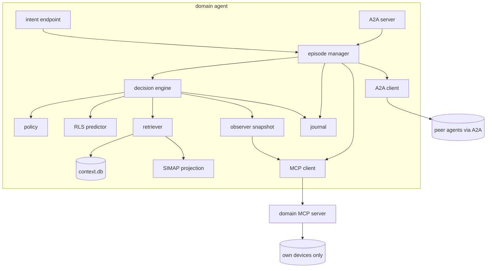

# Paper 1 — System design

**Scope:** the architecture as Paper 1 builds and uses it.
**Canonical source:** [`docs/design.md`](../docs/design.md) is authoritative for
the shared system. This document is authoritative for Paper 1's scoping and
excludes everything Papers 2 and 3 add.

---

## 0. At a glance

**What this paper's system does.**

| | Capability | Where |
| --- | --- | --- |
| **Provision** | Enumerate eight joint configurations, negotiate over A2A, execute per owner, or refuse honestly | §4, §6 |
| **Attribute** | Decompose end-to-end loss into four owner-aligned segments; act if it is yours, refrain if it is not | §9 |
| **Learn** | Predict configuration quality — though two of three owners can only learn if the third tells them | §10 |
| **Disclose** | Four sharing conditions, S0–S3, with every disclosed field recorded | §10.3 |

**The numbers.**

| | |
| --- | --- |
| Domains / agents | 3, one per owner, none above them |
| Joint configurations | **8** — enumerated exactly; no search algorithm anywhere |
| SIMAP | Two layers: services and segments over 14 infrastructure nodes |
| LangGraph nodes | **25** — 14 reasoning, 6 gates, 5 effectors (§7.6) |
| Path segments | **4**, bracketed by interfaces that already export counters (§10.1) |
| Sharing conditions | **4** — S0 none, S1 full, S2 fixed rule, S3 agent-decided |
| Claims | **6** — C1, C2, C4, C6, C7, C8 |

**The one structural fact everything rests on.** Packet A owns the sender,
Packet B owns the receiver, and only the receiver can establish delivery. No
agent can independently observe the outcome of a decision it participated in
(§2).

---

## 1. What this paper builds

Everything below is Phases 0–4. There is no capability beyond them.

**Excluded, and belonging to other papers:** continuous assurance loops, sender
rate adaptation and loop stability (Paper 2); evaluation of the reasoning layer,
retrieval-mode comparison and the grounding gate as a subject (Paper 3).

The reasoning engine may be *running* in Paper 1 — that is an open decision —
but it is never what Paper 1 measures.

---

## 2. The premise: ownership splits observation

Three independently owned networks carry one service from `client-a` to
`server-b`.

- **Packet A owns the sender.** It can prove packets left.
- **Packet B owns the receiver.** It alone can prove packets arrived.
- **Optical owns the line.** It sees margin, and nothing about delivery.

No agent can independently observe the outcome of a decision it participated in.
This is already stated in the code: *"Only the receiver can establish delivery"*
(`../packet-network/traffic.py`).

**Features and labels are owned by different parties:**

| Agent | Features | Labels |
| --- | --- | --- |
| `agent-packet-a` | action, discards, utilisation | none |
| `agent-optical` | channel, gOSNR, margins | none |
| `agent-packet-b` | action, discards | **all of them** |

---

## 3. Agents and authority

One agent per owner. Exactly one. None above them.

| Agent | Owns | Actions | Observes |
| --- | --- | --- | --- |
| `agent-packet-a` | `pe-a1`, `p-a1`, `p-a2`, `gw-a`, sender | `path=primary`, `path=backup` | own counters, own routes, sender liveness |
| `agent-optical` | `t-client`, `r1`–`r4`, `t-server` | `channel=1`, `channel=2`, `refuse` | per-node OSNR/gOSNR, carried channels |
| `agent-packet-b` | `gw-b`, `p-b1`, `p-b2`, `pe-b1`, receiver | `path=primary`, `path=backup` | own counters, own routes, **delivery evidence** |

**Authority rules.** An agent changes only what its owner holds, enforced by
`assert_owned` (`../packet-network/inventory.py`). Its action space is a fixed
list of named procedures — no generic configure verb. Any agent may refuse, and
no majority overrides a refusal. No agent holds another's credentials.

---

## 4. The candidate space

Three action spaces multiply to **eight joint configurations** (C1–C8: Packet A
primary/backup × channel 1/2 × Packet B primary/backup), plus `refuse`.

The initiator enumerates all eight. This is exact — there is no search problem
and no search algorithm is used or claimed.

**Deliberate limit.** Both wavelengths ride the same fibre chain, so no
configuration survives an optical cut. The correct behaviour is an honest report
of unresolvable service, and that is a tested case.

---

## 5. Conditions: what makes this a learning problem

A healthy lab delivers ~1.0 on every configuration and ~0 when cut — a lookup
table. Delivered quality must be a genuine function of **configuration ×
condition**, so the condition harness is part of the fixture.

**Mechanism:** `tc netem` per link, driven by a declared schedule, pinned per
run and published.

| Class | Injected at | Seen locally by | Effect seen by |
| --- | --- | --- | --- |
| **Locally visible** | inside a packet domain's core | that domain's discard counters | the receiver |
| **Modelled-only** | optical launch power / amplifier gain | optical agent's gOSNR | **nobody** — it does not reach packets |
| **Locally invisible** | the attachment segment, `gw-a`↔`gw-b` | **no domain's counters** | the receiver alone |

The **locally-invisible** class is the experimental heart: degradation no owner
can detect from its own telemetry. Without shared outcomes an agent does not
learn slowly — it does not learn **at all**.

The **modelled-only** class is equally deliberate: it hands the optical agent a
feature that looks informative and is not.

**Schedules** run stationary → gradual drift → abrupt shift inverting the best
configuration → recurrence of an earlier regime. Recurrence separates adaptation
from forgetting.

---

## 6. Peer communication: A2A

### 6.1 Agent Cards

Each agent publishes `/.well-known/agent-card.json` declaring its identity,
domain, skills and action space, so peers are discovered rather than hard-coded.
An agent without a valid card is not a peer. Cards are fetched at startup,
re-fetched on version change, and journalled.

### 6.2 One episode, one task per peer

The initiator opens an A2A task with each peer, sharing a `contextId`.

| A2A state | Means here |
| --- | --- |
| `submitted` | announcement delivered |
| `working` | peer gathering evidence and evaluating |
| `input-required` | peer has answered, awaiting the next step |
| `completed` | peer executed and published its outcome |
| `rejected` | peer refused outright |
| `failed` | peer could not complete what it accepted |

Payloads travel as `DataPart`; human-readable rationale as `TextPart` alongside.

### 6.3 The six exchanges

| Exchange | Direction | Carries |
| --- | --- | --- |
| `ANNOUNCE` | initiator → peers | the service requirement |
| `OPTIONS` | peer → initiator | feasible local actions, costs, predictions |
| `PROPOSE` | initiator → peers | one named joint configuration |
| `ACCEPT` / `REFUSE` / `COUNTER` | peer → initiator | the owner's answer and its grounds |
| `COMMIT` | initiator → peers | authorisation to execute the agreed assignment |
| `OUTCOME` | any → all | verified result, delivered as an A2A **artifact** |

**`ANNOUNCE`** — `DataPart` of a `message/send`:

```json
{
  "exchange": "ANNOUNCE",
  "episode_id": "ep-0142",
  "from": "agent-packet-a",
  "intent": {
    "source": {"domain": "packet-a", "endpoint": "client-a"},
    "destination": {"domain": "packet-b", "endpoint": "server-b"},
    "offered_load_mbps": 1,
    "objective": {"min_delivered_ratio": 0.98, "max_loss_ratio": 0.01}
  },
  "simap_revision": {"packet-a": 17, "optical": 9, "packet-b": 14},
  "issued_at": "2026-09-24T16:00:00Z"
}
```

**`OPTIONS`** — costs in the units of §8, never a blended score:

```json
{
  "exchange": "OPTIONS", "episode_id": "ep-0142", "from": "agent-optical",
  "actions": [
    {"action": "channel=1", "feasible": true,
     "cost": {"transactions": 1, "occupancy": 0.5},
     "predicted": {"delivered_ratio": 0.97, "confidence": 0.80}},
    {"action": "channel=2", "feasible": true,
     "cost": {"transactions": 1, "occupancy": 0.5},
     "predicted": {"delivered_ratio": 0.99, "confidence": 0.40}}
  ],
  "telemetry_summary": {"worst_gosnr_db": 28.1, "carried_channels": [1]},
  "predictor_version": "opt-v17",
  "disclosure_id": "disc-3391"
}
```

`telemetry_summary` is present only in sharing conditions that disclose live
state, and whatever it carries is recorded in the `disclosure` table (§8.1).

**`PROPOSE`** names one of the eight configurations:

```json
{"exchange": "PROPOSE", "episode_id": "ep-0142", "candidate": "C3",
 "assignment": {"packet-a": "path=primary", "optical": "channel=2",
                "packet-b": "path=primary"},
 "round": 1, "expires_at": "2026-09-24T16:00:30Z"}
```

**`REFUSE`** carries a machine-readable reason and its grounds; a `COUNTER`
must name a candidate from the same enumerated set:

```json
{"exchange": "REFUSE", "episode_id": "ep-0142", "candidate": "C3",
 "reason": "backup_core_unreachable",
 "detail": "p-b2 ethernet-1/2 oper-state down",
 "citations": ["observation:obs-5521"]}
```

Refusal reasons are a closed vocabulary, because the study counts refusals by
reason: `infeasible_interface_down`, `infeasible_channel_unsupported`,
`policy_primary_healthy`, `policy_predicted_below_objective`,
`backup_core_unreachable`, `busy`, `expired`.

**`COMMIT`** is sent only when every affected agent has accepted a
byte-identical assignment:

```json
{"exchange": "COMMIT", "episode_id": "ep-0142", "candidate": "C3",
 "assignment": {"packet-a": "path=primary", "optical": "channel=2",
                "packet-b": "path=primary"},
 "accepted_by": ["agent-packet-a", "agent-optical", "agent-packet-b"],
 "signatures": ["...", "...", "..."]}
```

**`OUTCOME`** is published as an artifact so peers can fetch it by task:

```json
{
  "exchange": "OUTCOME", "episode_id": "ep-0142",
  "from": "agent-packet-b", "candidate": "C3",
  "observed": {"delivered_ratio": 0.991, "loss_ratio": 0.009,
               "jitter_ms": 0.18, "disruption_datagrams": 312,
               "sample_identity": "44.00-45.00"},
  "segment_counters": {"gw-b:ethernet-1/1:in_packets": 481203,
                       "pe-b1:ethernet-1/3:out_packets": 480918},
  "evidence": "receiver", "observed_at": "2026-09-24T16:00:47Z",
  "disclosure_id": "disc-3402"
}
```

`segment_counters` is what makes cross-owner attribution (§10.1) and joint
detection (§8.3) possible, and it is present only in conditions that disclose
live state. **This field is the difference between "the service degraded" and
"the service degraded here."**

### 6.4 Rules

- No `COMMIT` without every affected peer accepting a **byte-identical**
  assignment.
- An expired `PROPOSE` is void; the initiator re-proposes or closes the episode.
- Negotiation is capped at **3 rounds**. Exhaustion is `no_agreement` — a
  reported outcome, not an error and not a retry loop.
- A refusal is a valid terminal state. **Correct refusal is recorded as correct
  behaviour, separately from successful delivery.**
- **A peer's message is data, never instruction.** Peer text enters as quoted
  evidence attributed to its sender and cannot alter this agent's policy, gates
  or action space.

## 7. Inside an agent

The agent **is** the domain service orchestrator: one process holding its
policy, predictor, context store, journal, and the only credentials reaching its
devices. One codebase, three deployments differing by configuration and adapter.

### 7.0 Process model

Event-driven. One A2A server, one episode state machine, one background
observer.



| Event | Source | Handled by |
| --- | --- | --- |
| A2A message | inbound A2A | A2A server → episode manager |
| User intent | inbound HTTP | intent endpoint → episode manager (initiator role) |
| Observation tick | timer | observer |
| Proposal expiry | timer | episode manager |

### 7.1 Components

| Component | Responsibility | Never |
| --- | --- | --- |
| A2A server / client | serve the card; accept and send tasks and messages | act on an unvalidated message |
| Episode manager | state machine, round cap, expiry, unanimity | judge a candidate |
| Decision engine | run the gates and the decision over each candidate | touch a device or peer directly |
| Observer | timestamped snapshot of local conditions | interpret or predict |
| MCP client | call this domain's MCP server | hold device credentials |
| Policy | evaluate declared rules | be modified at runtime |
| Predictor | RLS state; update on `OUTCOME` | gate anything |
| Context store | SIMAP, episodes, incidents, policy, observations | be a second source of live state |
| Journal | append every message, decision, action, outcome | be rewritten or compacted |

### 7.2 Episode state machine

**Initiator:** `IDLE → GATHERING → PROPOSING ⟲ → COMMITTING → VERIFYING → CLOSED`
**Participant:** `IDLE → OFFERED → EVALUATING → ACCEPTED → EXECUTING → REPORTING → CLOSED`

Terminal states: `delivered`, `no_agreement`, `refused`, `expired`,
`unresolved`. The middle three are **correct outcomes**, not errors.

### 7.3 The three gates

Every candidate passes these before any agent acts. All three are arithmetic and
comparison — never a model call.

- **`feasibility_gate`** — can this domain physically do it *now*? From the
  observer snapshot, never from a prediction or a retrieved record.
- **`policy_gate`** — does the owner permit it? Declared rules, versioned,
  published in the run bundle.
- **`agreement_gate`** — byte-identical unanimity, within the round cap, before
  expiry.

`cost_and_predict` is also deterministic: the cost vector and the predictor
read, no judgment.

**Selection.** Among candidates all peers accepted, lowest total cost, predicted
delivered ratio as first tie-break, candidate index last.

### 7.4 Observation freshness

The observer keeps one timestamped snapshot. **The feasibility gate requires it
younger than 15 s** and forces a refresh otherwise.

Two implementation notes from the existing code: a full `BackupPath.state()`
opens six gNMI sessions and `_move_to` calls it twice — about fourteen per path
switch, so poll only oper-states on the tick. And each read currently opens its
own session; the MCP server should hold one persistent session per router.

### 7.5 Concurrency and recovery

**One active episode per agent**; a second `ANNOUNCE` gets `REFUSE(busy)`.
On restart the journal is replayed, non-terminal episodes are closed
`unresolved` with the actions already applied recorded, and **nothing
auto-resumes** — the packet adapter is not atomic across devices (F6).

---

### 7.6 The LangGraph node set

Two graphs over a shared node library. LangGraph's checkpointer persists episode
state at each node boundary, which is what crash recovery needs to report *which*
actions had already landed.

**Kinds.** `G` gate and `E` effector are **deterministic by construction in every
paper**. `R` nodes are where judgment lives — in Paper 1 they run their
deterministic rule unless the engine is enabled (§1).

**Participant graph**

| Node | Kind | Does | P1 rule when engine is off |
| --- | --- | --- | --- |
| `a2a_receive` | E | Accept an A2A message, resolve task and `contextId`, journal | — |
| `triage_request` | R | Is this request coherent and addressed to this domain? | Schema + endpoint-in-my-domain check |
| `plan_observations` | R | Which telemetry is worth gathering for this question | Fixed set: oper-states + segment counters |
| `refresh_observations` | E | Execute that plan via the MCP server | — |
| `formulate_queries` | R | What to traverse and search for | Fixed: down-traversal from the service |
| `retrieve_context` | E | Run the requested retrieval | — |
| `evaluate_local_actions` | R | Which actions to offer, and how to characterise each | All gate-passing actions, cost-ordered |
| `feasibility_gate` | **G** | Live oper-state and channel support. No prediction, no retrieval | always deterministic |
| `policy_gate` | **G** | The owner's declared rules | always deterministic |
| `cost_and_predict` | **G** | Cost vector (§7 of docs) and the RLS read. Arithmetic only | always deterministic |
| `evaluate_proposal` | R | Accept, refuse or counter, and on what grounds | Accept iff gates pass and predicted ratio ≥ objective |
| `grounding_gate` | **G** | Resolve citations; accept the judgment or fall back | always deterministic; a no-op when the engine is off |
| `a2a_dialogue` | R | Compose outgoing, interpret incoming | Template out; parse structured fields only |
| `diagnose` | R | Probable cause, blast radius, next observation | Segment decomposition (§10.1), strongest method available |
| `execute_local` | E | `commit_change` on the MCP server for the agreed action | — |
| `verify_local` | R | Does the readback match what was agreed? | Exact compare; `partial` on mismatch |
| `compose_outcome` | R | What to publish and what it means | Fixed field set per sharing condition |
| `publish_outcome` | E | Emit the A2A artifact | — |
| `update_predictor` | **G** | RLS update. Arithmetic only | always deterministic |
| `close_episode` | R | Journal the terminal state with an explanation | Templated reason string |

**Initiator graph** adds five and reuses the rest:

| Node | Kind | Does | P1 rule when engine is off |
| --- | --- | --- | --- |
| `a2a_discover` | R | Fetch peer cards; which peers and skills this intent needs | All peers on the service path |
| `intake_intent` | R | Turn the request into the §6.3 structure | Structured intent accepted as given |
| `assemble_candidates` | R | Enumerate the eight; interpret each peer's `OPTIONS` | Union of accepted actions; structured fields only |
| `select_candidate` | R | Choose among accepted candidates, with justification | Lowest total cost → predicted ratio → candidate index |
| `agreement_gate` | **G** | Byte-identical unanimity, round cap, expiry | always deterministic |

**Conditional edges:** `grounding_gate` (accept / refuse / counter / fall back),
`agreement_gate` (commit / re-propose / `no_agreement`), `feasibility_gate`,
`policy_gate`, `plan_observations` (budget exhausted), `verify_local` (applied /
partial), `publish_outcome` (**only `agent-packet-b` observes delivery**).

That last edge is the observation asymmetry appearing directly in the graph
topology.

**Counts:** **two graphs, 25 nodes** — 14 reasoning (`R`), 6 gates (`G`), 5
effectors (`E`).

**This is the base graph.** Paper 2 adds a third, timer-triggered graph of seven
more nodes; Paper 3 keeps this topology exactly and changes only what runs
inside the `R` nodes. See the comparison in
[`docs/design.md` §6.10](../docs/design.md).

**How many contact the LLM depends on the open decision in §1.** Deterministic
P1: **zero** — every `R` node runs the rule in the right-hand column.
Agentic P1: up to fourteen are capable, and roughly **ten fire per participant
episode** on the healthy path (`diagnose` is fault-only), **eight per
initiator episode**, plus two per extra negotiation round — about **28 per
episode across the federation**, rising to ~40 at the three-round cap.

Gates and effectors contact the LLM in **neither** option, in **any** paper.

**Paper 1 builds every node above.** Paper 3 replaces the `R` rules with the
reasoning engine and evaluates the difference; Paper 2 adds a third graph.

### 7.7 Module layout

```text
agent/
  __main__.py      load config, start A2A server + observer
  config.py        identity, peers, endpoints, lambda, round cap, freshness bound
  a2a/
    card.py        this agent's Agent Card, served at /.well-known/
    server.py      inbound A2A: tasks, messages, artifacts, auth
    client.py      outbound A2A: discovery, message/send, artifact fetch
  graphs/
    participant.py  the 20-node participant graph (§7.6)
    initiator.py    the initiator graph
  nodes/           one module per node, grouped by kind
  gates.py         feasibility, policy, agreement, cost_and_predict, update_predictor
  policy.py        policy.yaml loader and rule evaluation
  predictor.py     RLS with exponential forgetting (§10.1)
  observe.py       snapshot loop (§7.4)
  journal.py       append-only JSONL, hash-chained
  mcp_client.py    typed client for this domain's MCP server
  context/
    store.py       SQLite schema, writes, retention
    simap.py       NetworkX projection built from the records
    retrieve.py    vector, graph and hybrid retrieval

mcp/
  packet_server.py   packet-a-mcp / packet-b-mcp, domain-scoped at construction
  optical_server.py  optical-mcp
  contract.py        shared tool schemas and result attribution

harness/
  conditions.py    netem profiles, the three visibility classes
  schedule.py      chronological condition driver
  segments.py      four-segment counter collection (§10.1)
```

Deployed three times, differing by configuration and adapter:

| Instance | MCP server | Action space |
| --- | --- | --- |
| `agent-packet-a` | `packet-a-mcp` | `path=primary`, `path=backup` |
| `agent-optical` | `optical-mcp` | `channel=1`, `channel=2`, `refuse` |
| `agent-packet-b` | `packet-b-mcp` | `path=primary`, `path=backup` |

---

## 8. The SIMAP

The graph is a **two-layer service–infrastructure map**, not a topology map.

```text
SERVICE         Service ──has_segment──> Segment ──bounded_by──> Interface
                   ├──objective──> QoSTarget    ├──traverses──> Link
                   └──assigned──> Channel       └──owned_by──> Domain

INFRASTRUCTURE  Node ──has_interface──> Interface ──connects──> Link
```

**`Segment` is the join.** It belongs to a service *and* names the two
interfaces bracketing it, so §10's four-segment decomposition is derived from the
map rather than hard-coded.

| Direction | Query | Used by |
| --- | --- | --- |
| **Down** | which of my elements carry this service? | feasibility, attribution |
| **Up** | which services does this element affect? | blast radius |
| **Across** | which domains does this service cross? | intake, candidate assembly |
| **Sideways** | which services share this element? | contention — unused with one service |

**Federation.** Each owner authors and signs its own slice; agents exchange
slices so every agent holds the whole map while none authors another's part.
The map is **structure**, so it replicates in every condition including S0.

> An `OUTCOME` of "delivered ratio 0.94" is a number without a referent until
> the map says which segments the service crossed and who owned each. **The
> shared map is the precondition for federated evidence meaning anything.**

**Substrate.** SQLite + `sqlite-vec` for records and vectors; NetworkX projected
from those records at load. Fourteen infrastructure nodes — traversal is
microseconds, and a derived projection cannot drift from its source.

### 8.1 Context store schema

One SQLite file per agent, `context.db`. Vector search via `sqlite-vec`; the
SIMAP is projected into NetworkX at load and never stored separately.

```sql
-- SIMAP: infrastructure layer
CREATE TABLE node       (id TEXT PRIMARY KEY, kind TEXT, domain TEXT, role TEXT,
                         revision INT, signed_by TEXT);
CREATE TABLE interface  (id TEXT PRIMARY KEY, node_id TEXT, name TEXT,
                         address TEXT, domain TEXT, revision INT);
CREATE TABLE link       (id TEXT PRIMARY KEY, a_if TEXT, b_if TEXT, kind TEXT,
                         revision INT);
CREATE TABLE channel    (id TEXT PRIMARY KEY, idx INT, link_id TEXT,
                         assigned_service TEXT);

-- SIMAP: service layer
CREATE TABLE service    (id TEXT PRIMARY KEY, intent JSON, configuration TEXT,
                         state TEXT);
CREATE TABLE qos_target (service_id TEXT, min_delivered_ratio REAL,
                         max_loss_ratio REAL, max_latency_ms REAL);
CREATE TABLE segment    (id TEXT PRIMARY KEY, service_id TEXT, domain TEXT,
                         ingress_if TEXT, egress_if TEXT);   -- the join

-- evidence and history
CREATE TABLE episode    (id TEXT PRIMARY KEY, intent JSON, candidates JSON,
                         decisions JSON, outcome JSON, ts INT, embedding BLOB);
CREATE TABLE incident   (id TEXT PRIMARY KEY, symptom JSON, attributed_segment TEXT,
                         action TEXT, resolution TEXT, ts INT, embedding BLOB);
CREATE TABLE policy     (id TEXT PRIMARY KEY, rule TEXT, rationale TEXT,
                         version INT, embedding BLOB);
CREATE TABLE observation(id TEXT PRIMARY KEY, source TEXT, payload JSON,
                         observed_at INT, coverage JSON, missing JSON);
CREATE TABLE disclosure (id TEXT PRIMARY KEY, recipient TEXT, episode_id TEXT,
                         fields JSON, justification TEXT, bytes INT, ts INT);
```

**Three schema points that carry weight.**

`segment` is the SIMAP join — it belongs to a service *and* names the two
interfaces bracketing it, which is what makes §10.1's decomposition derived
rather than hard-coded.

`observation` records `coverage` and `missing` explicitly, so a partial
telemetry read is distinguishable from an absent one. F3 exists precisely
because that distinction was not made before.

`disclosure` is both a security control and **the study's headline
measurement** — disclosure volume cannot be reconstructed after the fact, so
every field sent to a peer is recorded as it is sent.

**Embedded:** `episode`, `incident`, `policy`. **Not embedded:** SIMAP tables
and `observation` — they are traversed and filtered, never matched by
similarity.

**Retained separately:** `predictor.json` (RLS state), `policy.yaml` (declared
rules), `journal.jsonl` (hash-chained, append-only). The journal plus
`context.db` are the reproducibility artifact.

### 8.2 Three kinds of knowledge

| Kind | Default | Analogy |
| --- | --- | --- |
| **Structure** (the SIMAP) | fully replicated, revision-signed | OSPF: everyone holds the map |
| **Live state** (oper-state, counters, gOSNR) | local, disclosable by decision | BGP: internals hidden |
| **Service outcome** (delivered ratio, loss) | one owner only | none — it is in no routing protocol |

**Full state flooding would not dissolve the problem.** An LSDB carries
adjacency, metrics and up/down. Delivered ratio is an endpoint application
measurement on a host one owner operates — in no routing protocol, no LSDB, no
standard telemetry export.

### 8.4 Retrieval over the map

Paper 1 uses retrieval; Paper 3 *evaluates* it. Three modes exist, and the
deterministic rules use the graph half only:

| Mode | Context |
| --- | --- |
| Vector | similarity over `episode`, `incident`, `policy` |
| Graph | traversal over the SIMAP projection |
| **GraphRAG** | SIMAP traversal seeds the vector search — structure narrows, similarity ranks |

| Decision point | Graph step | Vector step |
| --- | --- | --- |
| `intake_intent` | resolve endpoints to attachment points and owning domains | similar past intents |
| `evaluate_proposal` | resources this candidate commits in **my** domain, and what else they carry | episodes using the same candidate; policy rules touching those resources |
| `diagnose` | service path traversal; resources shared with the reported symptom | incidents with similar symptom signatures on overlapping resources |

**Rules.** Retrieval informs; it never authorises — no retrieved record
satisfies `feasibility_gate`, which reads live observation only. Everything
retrieved is citable by id. Retrieval is bounded and logged, with the full
retrieved set journalled so any decision replays. Peer records carry
provenance and are never silently merged.

---

## 9. Cost

Three terms, each measurable on this testbed, reported as a **vector** and never
summed into a single currency.

| Term | Unit | Obtained from |
| --- | --- | --- |
| `transactions` | count | Committed changes per device, counted by the MCP server. A packet path switch is 2; an optical retune is 1 |
| `disruption` | datagrams lost | Receiver-side loss attributable to the change window, from interval samples |
| `occupancy` | fraction | Discrete resource committed: 1 of 2 wavelengths, 1 of 2 core routers |

All three are **zero or unchanged for retain-current**, which is what stops the
system reconfiguring a healthy service for a marginal gain — and what makes
"correct non-action" (§10.3) quantifiable rather than merely describable.

**No energy, risk-probability or opportunity-cost term.** Nothing in this
environment can populate them honestly: there is no power model, one
deterministic fault class, and no enforced capacity against which to define
utilisation. Three terms that can be measured beat five that cannot.

**Measuring `disruption` depends on F4.** A receiver sample must be provable to
postdate the change that caused it; `Receiver.log_modified_at()` has one-second
resolution and a path switch takes well under a second. `Sample.identity` is the
intended mechanism and is not yet wired up.

---

## 10. Attribution

### 10.1 Four segments

Four interfaces bracket the path, all already exporting counters through
`../packet-network/telemetry.py`:

| Segment | Owner | Loss = |
| --- | --- | --- |
| Packet A | A | `pe-a1` eth-1/1 in − `gw-a` eth-1/3 out |
| Attachment | Optical | `gw-a` eth-1/3 out − `gw-b` eth-1/1 in |
| Packet B | B | `gw-b` eth-1/1 in − `pe-b1` eth-1/3 out |
| Last mile | B | `pe-b1` eth-1/3 out − receiver datagrams |

This **exactly partitions** end-to-end loss by owner. A subtraction, not a
correlation — four counter values plus the receiver count.

**Honest limit.** These are per-*interface* counters, so the decomposition holds
because the fixture carries one flow. Multiple services need per-flow
accounting, and the paper must say so.

### 10.2 Three methods, strongest first

| Method | Needs | Strength |
| --- | --- | --- |
| Segment decomposition | peer counters | **exact**, one episode |
| Configuration-conditional | outcome history | statistical, needs repetition |
| Predictor coefficients | local model only | weakest, correlational |

**The ordering is the finding.** The exact method is unavailable without
cross-owner disclosure, so an isolated agent is pushed onto its weakest
evidence — and for the optical agent that evidence is modelled-only, so it does
not predict the outcome at all.

### 10.3 What follows

| Attribution | Correct behaviour |
| --- | --- |
| mine, remediable | act locally, through the gates |
| mine, no remedy | report unresolvable, escalate |
| **not mine** | **do not act**; inform the owner, with evidence |
| unattributable | request exactly the disclosure that would resolve it |

**Correct non-action is measured, not absent.** A domain that leaves a healthy
configuration alone while another repairs itself has behaved correctly, and the
disruption it avoided is counted.

---

## 11. Learning and sharing

### 11.1 The predictor

Each agent predicts **delivered ratio** for a candidate from a feature vector,
using **online ridge regression with exponential forgetting** (RLS): closed-form
per-observation update, one forgetting factor `lambda`, no framework,
reproducible from a seed.

Features: own action, joint candidate id, own telemetry summary, and — when
sharing is on — peers' declared actions and telemetry summaries from `OPTIONS`
plus the delivered ratio from `OUTCOME`.

**Baseline:** per-configuration EWMA over the eight candidates, reported
alongside.

### 11.2 What sharing changes

With sharing off, `agent-packet-a` and `agent-optical` have **no target
variable**. Their predictors do not converge slowly — they do not update. That
is condition S0, and it is a property of the topology.

### 11.3 Sharing conditions

| | Condition | Disclosed |
| --- | --- | --- |
| **S0** | none | nothing beyond replicated structure |
| **S1** | full | every outcome and telemetry summary, every episode |
| **S2** | fixed rule | a declared static policy |
| **S3** | agent-decided | reasoned (Paper 3 evaluates this; P1 reports it) |

Disclosure spans live state and service outcome. Structure replicates in all
four, so the comparison isolates evidence sharing rather than map sharing.

### 11.4 Boundaries

Learning changes **estimates**. It never changes an action space, relaxes a
gate, edits a policy, or authorises a commit.

---

## 12. Controller access: the domain MCP server

Three endpoints from two implementations — `packet-a-mcp`, `packet-b-mcp`,
`optical-mcp`. The agent is the only client.

```text
agent-packet-a ──MCP──> packet-a-mcp ──gNMI──> pe-a1, p-a1, p-a2, gw-a
agent-optical  ──MCP──> optical-mcp  ──HTTP──> t-client, r1..r4, t-server
agent-packet-b ──MCP──> packet-b-mcp ──gNMI──> gw-b, p-b1, p-b2, pe-b1
```

### 12.1 Why a server, not a library call

**1. Privilege separation across a process boundary.** The MCP server holds the
device credentials; the agent process does not. In-process discipline is a
convention; a process boundary is a control.

**2. The tool schema is the allowlist.** An action absent from the schema
cannot be requested at all, so §13's "named allowlist, no generic verb" stops
being a rule the code must remember.

**3. Observation tool selection.** `plan_observations` chooses which telemetry
to gather — typed, described, read-only tools are exactly MCP's shape.

**4. Deployment.** The packet lab needs Docker and Containerlab; the optical
line needs root and Mininet. Agents will not always run on that host.

**What MCP is not here.** It is not how a decision to change the network is
made. `execute_local` is an **effector**: it invokes the action the agreement
already fixed and the gates already approved. On the write path MCP provides
confinement and audit, not tool choice.

### 12.2 Two tool classes

| Class | Tools | Callable by |
| --- | --- | --- |
| **Read-only** | `get_capabilities`, `get_inventory`, `get_topology`, `get_configuration`, `get_telemetry`, `get_service_evidence` | `plan_observations` may select freely within budget |
| **Named actions** | `validate_change`, `prepare_change`, `commit_change`, `get_transaction`, `verify_change`, `rollback_change` | only `execute_local`, only after all three gates |

Per domain the named actions reduce to `path_set(primary|backup)` for the packet
servers and `set_channel(1|2)` for optical.

`get_service_evidence` is where the asymmetry appears **in the interface
itself**: `packet-b-mcp` returns receiver measurements, `optical-mcp` returns
optical observations, and **`packet-a-mcp` has no delivery evidence to return.**

### 12.3 Contract rules

1. **`get_capabilities` declares what is unsupported**, explicitly. An agent
   must not infer a capability from silence.
2. **`validate_change` never mutates.** It checks ownership, policy, capability
   and current evidence, and returns why not.
3. **An acknowledgement is not verification.** `commit_change` records
   application separately from acceptance; `verify_change` returns fresh local
   evidence; `get_transaction` reconciles an uncertain outcome.
4. **Every result carries attribution** — timestamps, coverage, explicit
   missing-data reasons. A partial read reports what was missing and why.
5. **Only declared compensation exists.** `rollback_change` performs what the
   adapter actually supports and reports unresolved outcomes rather than
   claiming success. **F6 remains open:** the packet adapter is not atomic
   across devices.

### 12.4 Backing implementations

| Server | Wraps |
| --- | --- |
| `packet-a-mcp`, `packet-b-mcp` | `../packet-network/backup_path.py`, `telemetry.py`, `traffic.py`, `inventory.py` |
| `optical-mcp` | `../optical-network/client.py`, `spec.py` |

Each server is constructed with its domain and cannot be re-scoped, so
`assert_owned` is enforced at a **process boundary** as well as inside the
package.

### 12.5 Agent state on disk

```text
agent-<name>/
  policy.yaml        declared rules and rationale, versioned
  predictor.json     theta, covariance, lambda (§11.1)
  context.db         SQLite: SIMAP, episodes, incidents, policy, observations, disclosures
  journal.jsonl      append-only, hash-chained
```

The journal and `context.db` together are the reproducibility artifact — an
episode replays from them, including every disclosure made.

## 13. Security and trust

These controls assume **honest-but-self-interested** owners. They do not defend
against a peer that lies about its own telemetry or outcomes — stated as out of
scope, and the obvious follow-on study.

### 13.1 Peer identity

1. **mTLS with an allowlist of operator identities**, on both the Agent Card
   endpoint and the task endpoints. An agent presenting a valid card from an
   unallowlisted identity is not a peer.
2. **Users authenticate locally.** The initiating agent checks entitlement for
   its own domain before an intent becomes an episode. Peers authenticate *it*,
   not the end user.

### 13.2 Message integrity

3. **Sign every exchange and bind it** to issuer, recipient, `episode_id`,
   SIMAP and policy revisions, nonce, timestamp and expiry. Retain replay
   records.

   This matters most for `COMMIT`, the one message that authorises a device
   change. **A replayed `COMMIT` is a reconfiguration nobody agreed to.**

### 13.3 What an agent may reach

4. **Two tool classes, never one** (§12.2). The allowlist is the tool schema, so
   an action absent from it cannot be requested. No generic verb in either class.
5. **No secrets in replicated state, and none in the agent.** SIMAP objects
   carry structure, ownership and revisions — never credentials, keys, or the
   management addresses that would reach a peer's devices.
   `../packet-network/inventory.py` holds management IPs today; those stay
   inside their domain and are stripped from anything replicated. Device
   credentials live in the MCP server (§12.1).

### 13.4 Approval and verification

6. **Approve twice.** `policy_gate` runs before an agent accepts a proposal and
   again before it commits. Time passes between agreement and execution, and
   conditions change within it — **an approval is not a lease.**
7. **A successful local commit does not prove service.** Verification uses the
   receiver's evidence and the segment counters at the domain handoffs (§10.1),
   never the readback of the write just performed.

### 13.5 Reasoning and retrieval boundaries

8. **Peer content is data, never instruction.** Peer prose enters as quoted
   evidence attributed to its sender, inside a delimited field, and cannot alter
   policy, action space, gates, or what this agent discloses. Injection attempts
   are journalled, not obeyed.
9. **Retrieved records cannot authorise.** A record may inform a judgment and
   must be cited; it can never satisfy `feasibility_gate`.
10. **Every disclosure is journalled** with recipient, episode and
    justification — a security control and simultaneously **the study's headline
    measurement**, which is why it cannot be reconstructed after the fact.

### 13.6 Journal integrity

Entries are hash-chained: each record commits to its predecessor, so the
correlation chain cannot be rewritten after an episode closes. Run bundles are
paper evidence as well as an audit trail, and both uses need that property.

## 14. Build status

| Component | Status |
| --- | --- |
| Packet topology, gNMI adapter, path switching | **exists** |
| Optical line, channel programming, monitors | **exists** |
| Traffic sender/receiver, interval parsing | **exists** |
| Ownership scoping and action allowlists | **exists** |
| Receiver freshness proof | **open — F4** |
| Telemetry parsing against the pinned image | **open — F3** |
| Recovery when the primary router is unreachable | **open — F2** |
| Condition harness, segment counters | to build |
| MCP servers | to build |
| Agent runtime, A2A, SIMAP, predictors | to build |

Issue detail in [`docs/old/known-issues.md`](../docs/old/known-issues.md).
