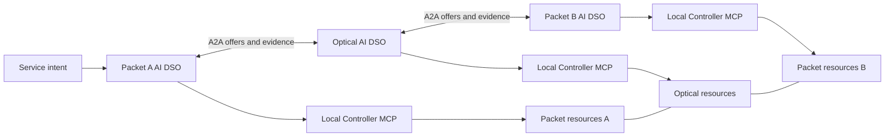

# Related work and novelty assessment

**Search date:** 16 September 2026. **Target venue:** Elsevier *Computer Networks*.
**Scope update, mechanism and collective-intelligence checks:** 23 September 2026;
the original catalogue date is unchanged. This is not an exhaustive new search.
**Project status:** architecture and research design; this report does not establish
implemented capabilities, measured improvements, formal guarantees, or acceptance
by the journal.

The original catalogue maps 40 relevant paper records and eight networking
specifications or drafts to the proposed architecture. Some records
belong to the same research family; they are not 40 independent implementations.
Supplemental mechanism and conceptual references below do not change that count.
The most important finding is that the broad combination of domain agents,
distributed orchestration, negotiation, retrieval, controller tools, and closed
loops already has substantial precedent. The architecture needs a more precise
networking contribution to support a strong novelty claim.

The recommendations are carried into the five paper priorities,
adaptive agent decision loop,
existing-node responsibilities,
and journal evaluation plan.
Those updates specify intended behavior and experiments; they do not turn the
candidate contributions into verified results.

## 1. Scope and evidence

The search covered publicly indexed international research through the search
date, including IEEE, ACM, Elsevier, Optica, ITU, arXiv, author and institutional
repositories, and IETF, ETSI, and OGF documents. Searches used English terms;
research published elsewhere or not indexed in English may be missing.

Search families included:

| Family | Representative searches |
| --- | --- |
| Domain autonomy | `multi-domain distributed intent resolution agents`; `federated service orchestration independent domains`; `distributed SDN controllers` |
| Packet and optical networks | `LLM multi-agent cross-domain optical orchestration`; `packet optical intent automation`; `MCP TeraFlowSDN optical network` |
| Negotiation and economics | `multi-domain optical Nash bargaining`; `LLM cross-domain resource negotiation`; `multi-broker service provisioning` |
| Retrieval and state | `GraphRAG optical network`; `network topology knowledge graph intent`; `telecommunications RAG` |
| Execution and assurance | `multi-domain reservation commit`; `network consistent updates`; `agentic closed-loop network verification`; `stale topology orchestration` |
| Learning and swarm methods | `multi-agent optical deep reinforcement learning`; `cross-domain agent collective memory`; `ant colony distributed network routing` |

Title searches, bibliographic checks, and references in retrieved papers extended
these searches. Primary publisher, author, institution, or specification sources
support the technical comparisons below. Search engines' relative publication
dates were not treated as bibliographic dates.

**This is a broad scoping review, not a certified exhaustive search of every paper
in the world.** It is not a systematic review based on exported Scopus/Web of
Science records, a registered protocol, or a complete citation graph. No invented
screening counts or completeness percentage are supplied. Full texts were not
accessible for every paper.

Evidence labels describe what was inspected, not paper quality:

- **Text:** relevant sections of an accessible manuscript or publisher text were inspected; this does not mean every equation or experiment was independently audited.
- **Abstract:** comparisons are limited to the primary abstract and bibliographic record.
- **Mixed:** publication metadata plus author slides or selected indexed text; the proceedings text was not fully accessible.

An abstract that does not mention a feature is **not evidence that the full paper
lacks it**. Consequently, the comparison identifies established overlaps and
questions to resolve, rather than assigning unsupported absence checkmarks.
Preprints and Internet-Drafts are explicitly distinguished from published papers
and established specifications. An arXiv citation identifies the version examined;
it does not prove that no later published version exists.

## 2. The system being assessed

The current design has independently owned packet A, optical, and packet B
domains. Each domain operates one persistent AI DSO: the agent and domain service
orchestrator are the same runtime. Its four workflows and shared context utility
contain 57 named nodes, with three conditional generative-LLM reasoning nodes.
The full study requires ACO, PSO, Nash bargaining, and continual predictor
learning. Two online reasoning nodes support observation/diagnostic decisions;
the third can propose bounded learning hypotheses. Each network belongs to a
different person or organization, not just a different technology layer.

Peers exchange service and topology information over A2A. Each DSO controls only
its own SDN controller through its Controller MCP server. Each maintains its own
PostgreSQL/pgvector store, graph projection in Neo4j, and operational evidence.
Approved topology and configuration advertisements are replicated among peers;
ownership of each record and authority to change devices remain local.

The design couples ACO discrete exploration, PSO continuous resource allocation,
owner utility evaluation, weighted Nash bargaining, verified service execution,
and continual performance-predictor updates. Retrieval grounds selected LLM
calls. Learning must change later estimates/decisions, not owner authority or
hard policy. None of these four mechanisms is optional in the full system. See the node catalogue
for the current workflow inventory.

The diagram describes the proposed implementation boundary. A2A communication,
MCP access, and local controller ownership are not themselves claims of novelty.

## 3. Closest competing work

Read these works before writing the introduction or claiming a research gap.
The right-hand column is our assessment, not a finding stated by the cited authors.

| Prior work | Established overlap | Consequence for this paper |
| --- | --- | --- |
| [EDAIR, NOMS 2025](#p01) | An intelligent agent represents each domain and collaborates on multi-domain intent resolution. | One agent per domain and distributed intent resolution are already precedents. Obtain its full text before making a detailed distinction. |
| [Xu et al., 2024–2025](#p02) | Multi-agent workflows orchestrate optical and other technological domains. | Cross-domain LLM orchestration is established; distinguish technological domains from independently authorized operators. |
| [Brodimas et al., 2025](#p04) | Agentic orchestration combines peer handoffs, retrieval, tools, and persistent state. | Agent orchestration with RAG and MCP is insufficient as the main contribution. |
| [Confucius, SIGCOMM 2025](#p05) | Structured multi-agent network workflows, retrieval, tools, and validation. | Workflow structure and grounded tool use need a stronger inter-operator distinction. |
| [Chergui et al., 2025](#p06) | Cross-domain agent negotiation uses collective memory and digital-twin feedback. | Negotiating agents that improve from experience are already explored. |
| [Carballo González et al., September 2026](#p07) | Federated operators, A2A negotiation, MCP-accessible context, and closed-loop resource management. | The broad combination is particularly close. Compare adaptive evidence/negotiation methods, decision traces, and measured packet–optical outcomes; do not assume a unique architecture. |
| [Tranoris and Trantzas, 2026](#p08) | Agentic intent handling is separated from deterministic orchestration and test-based assurance. | Selective cognition with controlled actuation is already a design precedent. |
| [DFSC, Computer Networks 2022](#p22) | Distributed, cost-aware orchestration across autonomous domains. | Removing a global orchestrator is not sufficient novelty. |
| [Sun et al., 2016–2017](#p25) | Nash bargaining supports cooperation in multi-domain elastic optical service provisioning. | Applying Nash bargaining to optical coordination alone is not new. |
| [NSI Connection Service](#s05) | Established cross-domain network-service coordination. | Supporting engineering precedent; the proposed contribution concerns the coupled agentic optimization/learning system. |

There is no verified basis here for claiming that this is the world's first
federated agentic networking architecture. Nor does this review prove that a
specific coupled optimization/bargaining/learning method proposed below is unprecedented. That requires a
deeper comparison against the closest full texts and their cited predecessors.

## 4. Annotated paper catalogue

### 4.1 Agentic and multi-domain orchestration

**P01. Pedro Martinez-Julia, Ved P. Kafle, and Hitoshi Asaeda — EDAIR: An Efficient Distributed AI Agent Architecture for Multi-Domain Intent Resolution.**
IEEE/IFIP NOMS, 2025. **Evidence: Abstract.** Each networking domain has an
intelligent agent; agents participate in distributed intent resolution. This is
one of the most direct architectural predecessors. The reviewed abstract does
not establish its detailed transaction or LLM architecture.
[Publisher / DOI](https://doi.org/10.1109/NOMS57970.2025.11073742).

**P02. Xiaonan Xu et al. — Large Language Model-Driven Cross-Domain Orchestration Using Multi-Agent Workflow.**
arXiv:2410.10831, 2024. **Evidence: Text.** Domain-specific agent groups connect
planning and execution across optical networking and robotics, including an
optical laboratory demonstration. Its use of multiple technological domains
must be distinguished from our independently owned administrative domains.
[Manuscript](https://arxiv.org/html/2410.10831v1).

**P03. Xiaonan Xu et al. — Cross-Domain Orchestration with Multi-Agent LLM Framework for Enhanced Task Automation.**
OFC, 2025, M3Z.10. **Evidence: Abstract.** Demonstrates orchestration spanning IP,
optical, and robotics domains. Closely related to P02; do not count it as an
unrelated confirmation of the same architectural idea.
[Publisher / DOI](https://doi.org/10.1364/OFC.2025.M3Z.10).

**P04. Dimitrios Brodimas, Alexios Birbas, Dimitrios Kapolos, and Spyros Denazis — Intent-Based Infrastructure and Service Orchestration Using Agentic-AI.**
IEEE Open Journal of the Communications Society, 6:7150–7168, 2025.
**Evidence: Text, selected publisher sections.** Includes initial intent
distribution, subsequent agent handoffs, RAG, MCP tools, and state management.
Its stated scope emphasizes intent fulfillment. Do not characterize the whole
architecture as centrally scheduled merely because it has an initial distributor.
[Publisher / DOI](https://doi.org/10.1109/OJCOMS.2025.3600706).

**P05. Zhaodong Wang et al. — Intent-Driven Network Management with Multi-Agent LLMs: The Confucius Framework.**
ACM SIGCOMM, 2025, pp. 347–362. **Evidence: Text.** Network management uses
structured planning, operational workflows, retrieval/memory, data interfaces,
and validation, with production experience at Meta. A useful systems baseline
for controlled LLM assistance, but its deployment setting should not be equated
automatically with independent operators.
[Author manuscript](https://minlanyu.seas.harvard.edu/writeup/sigcomm25.pdf);
[DOI](https://doi.org/10.1145/3718958.3750537).

**P06. Hatim Chergui et al. — Toward an Unbiased Collective Memory for Efficient LLM-Based Agentic 6G Cross-Domain Management.**
arXiv:2509.26200, 2025 (v1); revised 19 September 2026 (v2).
**Evidence: Text (v1); abstract and metadata (v2), rechecked 23 September 2026.**
RAN/edge agents negotiate resource
trade-offs with digital-twin feedback and memory of past outcomes. It directly
overlaps negotiation and continual improvement. Its A2A terminology should not,
without checking implementation details, be taken as proof of conformance to a
particular standardized A2A version.
[Manuscript](https://arxiv.org/html/2509.26200v1).
The v2 abstract additionally describes a Retrieval Bias Index, a tandem-queue
evaluation, and a Nash bargaining reference. This strengthens the overlap in
collective decision-making and owner trade-offs; it does not establish that its
negotiation algorithm is identical to ours. Inspect the revised full text before
making detailed distinctions. [Revised record](https://arxiv.org/abs/2509.26200v2).

**P07. Claudia Carballo González et al. — AI-Native Orchestration in the 6G Continuum: Evolving Operator Platforms with Agentic AI.**
arXiv:2609.08441, submitted 8 September 2026. **Evidence: Text.** Extends operator
platforms with federated agent coordination, A2A bargaining, MCP-accessible
telemetry/context, and closed-loop control. The evaluated resource scenario
concerns radio and edge capacity. This is a particularly close, recent
architectural overlap; a preprint is still relevant to novelty assessment.
[Record](https://arxiv.org/abs/2609.08441);
[Manuscript](https://arxiv.org/html/2609.08441v1).

**P08. Christos Tranoris and Kostis Trantzas — Agentic, intent-driven end-to-end service orchestration with test-driven quality assurance for 6G networks.**
ITU Journal on Future and Evolving Technologies, 7(2):114–132, 30 June 2026.
**Evidence: Abstract.** Intent contracts and derived tests connect agentic
reasoning to deterministic OpenSlice orchestration and assurance. Relevant to
our separation of model advice, execution authority, and verification. A related
earlier preprint has a different title and author list; do not merge their metadata.
[Official article](https://www.itu.int/pub/S-JNL-VOL7.ISSUE2-2026-A09);
[DOI](https://doi.org/10.52953/FPSZ2168).

**P09. Juan Parra-Ullauri et al. — Role-Based Agentic AI for Intent-Driven Network and Service Orchestration.**
arXiv:2606.20580, 2026. **Evidence: Abstract.** Organizes agent roles across
customer, strategy, service, and infrastructure layers, including separation of
domain knowledge. Relevant to role placement, but a hierarchy of roles is a
different axis from federation of independently controlled domains.
[Record](https://arxiv.org/abs/2606.20580).

**P10. Genze Jiang, Kezhi Wang, Xiaomin Chen, and Yizhou Huang — Agentic AI Empowered Intent-Based Networking for 6G.**
arXiv:2601.06640, 2026. **Evidence: Abstract.** Uses an orchestrating agent and
specialized networking agents with structured reasoning and execution.
Relevant to comparing hierarchical agent arrangements with peer DSOs and to
evaluating against simpler rule-based methods.
[Record](https://arxiv.org/abs/2601.06640).

### 4.2 Packet–optical agents, controller tools, and retrieval

**P11. Daniel Adanza et al. — Leveraging generative AI for intent-based networking operations in network slices.**
*Computer Networks*, 272:111647, 2025. **Evidence: Text, publisher sections and
author manuscript.** An LLM agent with RAG operates intent creation, queries,
and explanation through TeraFlowSDN. This is especially important because it is
both technically close and published in our target journal.
[Publisher / DOI](https://doi.org/10.1016/j.comnet.2025.111647);
[Author manuscript](https://research.chalmers.se/publication/550622/file/550622_Fulltext.pdf).

**P12. Daniel Adanza et al. — IntentLLM: An AI Chatbot to Create, Find, and Explain Slice Intents in TeraFlowSDN.**
IEEE NetSoft, 2024, pp. 307–309. **Evidence: Abstract.** Demonstrates natural
language interaction with slice intents. An earlier work in the P11 research
family; neither natural-language intent access nor an LLM interface to an SDN
controller should be presented as newly introduced here.
[Publisher / DOI](https://doi.org/10.1109/NetSoft60951.2024.10588917).

**P13. Ricard Vilalta et al. — Exposing Optical Network Control Capabilities to AI Agents Using Model Context Protocol and TeraFlowSDN.**
ONDM, 2026. **Evidence: Mixed.** Institutional publication metadata and an
official author tutorial document MCP exposure of optical controller functions
to agents. This is direct prior work for our Controller MCP interface; the
protocol wrapper cannot be our main novelty.
[DOI](https://doi.org/10.23919/ONDM68511.2026.11618834);
[Official tutorial](https://docbox.etsi.org/Workshop/2026/01_SNS4SNS/2_FEBRUARY/SNS4SNS26_SDG%20TFS%20Tutorial.pdf).

**P14. Zehao Wang et al. — Agentic AI for Scalable and Robust Optical Systems Control.**
arXiv:2602.20144, 2026; AgentOptics. **Evidence: Abstract.** Optical laboratory
control uses agentic workflows and MCP tools across multiple devices and task
types. Relevant to tool design and optical actuation; multi-device control does
not by itself establish multi-operator federation.
[Record](https://arxiv.org/abs/2602.20144).

**P15. Seyed Morteza Ahmadian, Paolo Monti, and Carlos Natalino — A T-API-Compliant ReAct Agentic Loop for Optical Networks: Generic vs. Domain-Specific Tool Abstractions.**
arXiv:2606.18000, 2026; record reports acceptance at ECOC 2026.
**Evidence: Abstract.** Compares generic and domain-specific optical tools.
Relevant to measuring the effect of typed controller operations, token usage,
and correctness instead of assuming that any MCP tool design is adequate.
[Record](https://arxiv.org/abs/2606.18000).

**P16. Mohammad Behnam Shariati et al. — Data Sovereign LLM-Assisted Automation Platform for Open Optical and Packet Transport Networks.**
IEEE ICMLCN, 2025. **Evidence: Abstract.** Combines data-governed automation,
LLM assistance, and an open packet/optical transport testbed. A direct reference
for both transport automation and sovereignty claims; keeping separate databases
does not alone provide the same data-governance guarantees.
[Institutional record](https://publica.fraunhofer.de/entities/publication/92de9715-b0fc-4fb7-a009-c7598b18b486);
[DOI](https://doi.org/10.1109/ICMLCN64995.2025.11140539).

**P17. Xingyu Liu et al. — First Field-Operational GraphRAG Agent for Information Query in Large-Scale Hierarchical Optical Networks.**
OFC, 2026, Th1I.3. **Evidence: Abstract.** Uses graph-grounded language interaction
for information queries over operational optical networks. Consequently,
GraphRAG in optical networking is already represented in the literature; a
possible distinction would concern decision and execution consistency, not
merely querying graph relationships.
[Publisher / DOI](https://doi.org/10.1364/OFC.2026.Th1I.3).

**P18. Yang Xiong et al. — When Graph Meets Retrieval Augmented Generation for Wireless Networks: A Tutorial and Case Study.**
arXiv:2412.07189, 2024. **Evidence: Text.** Explains graph retrieval for networking
knowledge and intent-related use cases. Supports the design choice to combine
semantic retrieval with relational context, while showing that the combination
itself is established background.
[Manuscript](https://arxiv.org/html/2412.07189v1).

**P19. Andrei-Laurentiu Bornea et al. — Telco-RAG: Navigating the Challenges of Retrieval-Augmented Language Models for Telecommunications.**
Version examined: arXiv:2404.15939, 2024. **Evidence: Abstract and official
author presentation.** Addresses retrieval over complex telecommunications
standards. Useful for document retrieval baselines; standards question answering
and live graph-conditioned configuration decisions are different evaluation tasks.
[Record](https://arxiv.org/abs/2404.15939);
[Author presentation](https://www.itu.int/en/ITU-T/Workshops-and-Seminars/2024/0716/Documents/Antonio%20De%20Domenico.pdf).

### 4.3 Distributed orchestration before the recent LLM wave

**P20. Kévin Phemius, Mathieu Bouet, and Jérémie Leguay — DISCO: Distributed SDN controllers in a multi-domain environment.**
IEEE/IFIP NOMS, 2014. **Evidence: Abstract of author preprint.** Domain
controllers exchange network information and coordinate end-to-end services.
Relevant to controller federation, domain autonomy, and failure adaptation.
The preprint title uses “Distributed Multi-domain SDN Controllers.”
[DOI](https://doi.org/10.1109/NOMS.2014.6838273);
[Author preprint](https://arxiv.org/abs/1308.6138).

**P21. Teemu Koponen et al. — Onix: A Distributed Control Platform for Large-scale Production Networks.**
USENIX OSDI, 2010. **Evidence: Text.** Establishes distributed network-state
management and the trade-offs between consistency and scale. Relevant to the
replicated topology database, although a distributed control platform is not
automatically a federation of independent operators.
[Official paper page](https://www.usenix.org/conference/osdi10/onix-distributed-control-platform-large-scale-production-networks).

**P22. Chen Chen, Lars Nagel, Lin Cui, and Fung Po Tso — Distributed federated service chaining: A scalable and cost-aware approach for multi-domain networks.**
*Computer Networks*, 212:109044, 2022. **Evidence: Text, publisher sections.**
Distributed local orchestrators establish services using cost-aware decisions
and abstracted inter-domain information. A strong predecessor for federation
without a global orchestrator. The related 2021 conference version should be
grouped with this journal paper in a systematic review.
[Publisher / DOI](https://doi.org/10.1016/j.comnet.2022.109044).

**P23. Navdeep Uniyal et al. — 5GUK Exchange: Towards Sustainable End-to-End Multi-Domain Orchestration of Softwarized 5G Networks.**
*Computer Networks*, 178:107297, 2020. **Evidence: Abstract.** End-to-end
orchestration connects heterogeneous domains while retaining domain management
systems. Relevant to the centralized/hierarchical comparison and to measuring
the practical consequences of local ownership.
[Institutional record](https://research-information.bris.ac.uk/en/publications/5guk-exchange-towards-sustainable-end-to-end-multi-domain-orchest/);
[DOI](https://doi.org/10.1016/j.comnet.2020.107297).

**P24. Nassima Toumi, Olivier Bernier, Djamal-Eddine Meddour, and Adlen Ksentini — On cross-domain service function chain orchestration: An architectural framework.**
*Computer Networks*, 187:107806, 2021. **Evidence: Abstract and manuscript
sections.** Implements cross-domain orchestration over heterogeneous forwarding
technologies, drawing on ETSI MANO and SDN. Demonstrates that architectural
contributions require concrete cross-domain mechanisms and evaluation.
[Institutional record](https://www.eurecom.fr/en/publication/6433);
[DOI](https://doi.org/10.1016/j.comnet.2021.107806).

### 4.4 Negotiation, learning, and swarm optimization

**P25. Lu Sun, Xiaoliang Chen, and Zuqing Zhu — Multi-Broker based Service Provisioning in Multi-Domain SD-EONs: Why and How Should the Brokers Cooperate with Each Other?**
Journal of Lightwave Technology, 35(17):3722–3733, 2017.
**Evidence: Text.** Studies cooperative brokers, bargaining over provisioning
business, and coordinated allocation in elastic optical networks. Closely
related game theory exists, although bargaining over brokers' market shares
differs from agreeing the segments of one service across resource owners.
[Author manuscript](https://zuqingzhu.info/pub_doc/2017/jlt2016_Final_Submission.pdf).

**P26. Lu Sun et al. — Broker-based Cooperative Game in Multi-Domain SD-EONs: Nash Bargaining for Agreement on Market-Share Partition.**
ECOC, 2016. **Evidence: Text.** Earlier work in the P25 family explicitly
applies Nash bargaining in a multi-domain optical setting. This is sufficient
to reject a broad claim of first introducing Nash bargaining to optical-domain
cooperation.
[Author manuscript](https://zuqingzhu.info/pub_doc/2016/ECOC2016_nash_bargaining_submission.pdf).

**P27. Xiaoliang Chen, Roberto Proietti, and S. J. Ben Yoo — Building Autonomic Elastic Optical Networks with Deep Reinforcement Learning.**
IEEE Communications Magazine, 57(10), 2019. **Evidence: Text.** Discusses
autonomic optical control and multi-agent learning in multi-broker settings.
Relevant to closed-loop adaptation and learning under limited information;
learning-enabled optical coordination predates recent generative agents.
[Public author manuscript](https://par.nsf.gov/servlets/purl/10177137).

**P28. Pedro Martinez-Julia et al. — Enhancing Privacy in Multi-Domain Network Intent Negotiation.**
MobiSec, 2025, conference paper S4. **Evidence: Text.** Studies information
disclosure during distributed intent negotiation, with geographically separated
domains. A direct warning against presenting complete topology replication as
topology privacy preservation.
[Official conference manuscript](https://di0zxmb8pwajl.cloudfront.net/kiisc/conference/mobisec2025/programbook/S4.pdf).

**P29. Gianni Di Caro and Marco Dorigo — AntNet: Distributed Stigmergetic Control for Communications Networks.**
Journal of Artificial Intelligence Research, 9:317–365, 1998.
**Evidence: Abstract and bibliographic record.** Ant-inspired exploratory agents
learn routing information through distributed interaction. Establishes long
precedent for swarm routing. The later arXiv deposit date is not the original
publication year.
[DOI](https://doi.org/10.1613/jair.530);
[Author deposit](https://arxiv.org/abs/1105.5449).

### 4.5 Transactions, verification, and evaluation

**P30. Hector Garcia-Molina and Kenneth Salem — Sagas.**
ACM SIGMOD, 1987. **Evidence: Text.** Long-running transactions can be decomposed
into steps with compensating actions. This is foundational for the proposed
failure-recovery model. Compensation does not give simultaneous physical
activation or erase every externally visible intermediate effect.
[Institutional manuscript](https://www.cs.princeton.edu/techreports/1987/070.pdf);
[DOI](https://doi.org/10.1145/38713.38742).

**P31. Mark Reitblatt et al. — Abstractions for Network Update.**
ACM SIGCOMM, 2012. **Evidence: Text.** Examines correctness during network
reconfiguration, including per-packet and per-flow consistency. A valid initial
and final configuration do not alone establish safe intermediate forwarding.
Our service-level transaction mechanism needs to state which update property
it actually provides.
[Author manuscript](https://www.cs.princeton.edu/~dpw/papers/network-update-sigcomm12.pdf);
[DOI](https://doi.org/10.1145/2342356.2342427).

**P32. Changjie Wang et al. — NetConfEval: Can LLMs Facilitate Network Configuration?**
Proceedings of the ACM on Networking, CoNEXT, 2024.
**Evidence: Text, author materials.** Evaluates several network-configuration
tasks, including translation to formal representations and device configuration.
Useful for reproducible component benchmarks, but does not substitute for a
multi-domain service-lifecycle experiment.
[Author repository](https://github.com/RedHatResearch/conext24-NetConfEval);
[DOI](https://doi.org/10.1145/3656296).

**P33. Ioannis Protogeros, Rufat Asadli, Benjamin Hoffman, and Laurent Vanbever — Benchmarking LLM-Driven Network Configuration Repair.**
arXiv:2604.22513, 2026; Cornetto. **Evidence: Abstract.** Evaluates repair across
network configurations and uses verification to expose regressions. Supports
testing preservation of unaffected services, rather than only checking whether
the requested repair appears successful.
[Record](https://arxiv.org/abs/2604.22513).

**P34. Chang Liu, Xiaohui Xie, Xinyi Chen, and Yong Cui — NetConfArena: An Executable Benchmark for LLM Agents in Closed-Loop Network Configuration.**
arXiv:2608.23179, 2026. **Evidence: Abstract.** Uses executable, multi-device
network tasks and tests of actual outcomes. Relevant to trajectory-level
evaluation and the difference between a plausible tool response and a working
network service.
[Record](https://arxiv.org/abs/2608.23179).

**P35. Ahmed Twabi, Yepeng Ding, and Tohru Kondo — Agentic Patterns for Decentralized Network Protocol Configuration.**
Electronics, 15(11):2270, 2026. **Evidence: Text, indexed publisher sections.**
Compares agent arrangements on executable routing-protocol tasks. Its findings
challenge the assumption that adding more agents reliably improves outcomes;
observation, verification, and coordination overhead need explicit measurement.
[Publisher / DOI](https://doi.org/10.3390/electronics15112270).

**P36. Eduardo Baena et al. — Who Knows What? Semantic Negotiation for Human-Supervised RAN Agentic Coordination.**
ACM HotMobile, 2026. **Evidence: Text.** Applications and a RAN expose constraints
through MCP; an LLM considers trade-offs with operator supervision and feedback.
Relevant to assembling situational context across boundaries. Its enterprise
RAN setting should not be assumed equivalent to sovereign transport operators.
[Author manuscript](https://ece.northeastern.edu/fac-ece/dkoutsonikolas/publications/hotmobile26.pdf).

**P37. Mariam Kiran et al. — Enabling intent to configure scientific networks for high performance demands.**
Future Generation Computer Systems, 79:205–214, 2018; iNDIRA.
**Evidence: Text, publisher sections.** Natural-language processing, semantic
RDF representations, state-aware interaction, and NSI/OpenNSA provisioning
support scientific cross-domain paths. Intent interpretation plus graph
knowledge and provisioning is not a new combination.
[Institutional record](https://escholarship.org/uc/item/2db7v922);
[DOI](https://doi.org/10.1016/j.future.2017.04.020).

**P38. Kalpana D. Joshi and Kotaro Kataoka — pSMART: A lightweight, privacy-aware service function chain orchestration in multi-domain NFV/SDN.**
*Computer Networks*, 178:107295, 2020. **Evidence: Text, publisher sections.**
Studies learning-based orchestration with reduced disclosure of domain
information. Relevant to comparing the cost and privacy implications of full
topology replication against abstracted or query-based domain interfaces.
[Publisher / DOI](https://doi.org/10.1016/j.comnet.2020.107295).

**P39. Inder Monga et al. — Software-Defined Network for End-to-end Networked Science at the Exascale.**
Future Generation Computer Systems, 110:181–201, 2020; SENSE.
**Evidence: Abstract and manuscript sections.** Model-based orchestration
coordinates network services across administrative domains, with deployed
testbeds and resource negotiation. Compare its orchestration and state models
before claiming new cross-domain service coordination semantics.
[Institutional manuscript](https://lss.fnal.gov/archive/2020/pub/fermilab-pub-20-684-ccd.pdf);
[DOI](https://doi.org/10.1016/j.future.2020.04.018).

**P40. Yanbo Song et al. — Full-Life Cycle Intent-Driven Network Verification: Challenges and Approaches.**
Version examined: arXiv:2212.09944, 2022. **Evidence: Abstract.** Proposes
verification across the intent lifecycle, including policy refinement and
conflicts. Establishes that checking intent correctness beyond initial
translation is an existing research direction. Verify the final IEEE Network
publication metadata before inserting the journal version into a manuscript.
[Record](https://arxiv.org/abs/2212.09944).

### 4.6 Specifications and drafts: separate from research papers

These documents constrain claims of novelty and interoperability. They are not
additional peer-reviewed experimental papers. Internet-Drafts are work in
progress, not adopted IETF standards.

| ID | Document and version | Relevance |
| --- | --- | --- |
| S01 | [RFC 8453: Framework for Abstraction and Control of TE Networks (ACTN), 2018](https://www.rfc-editor.org/rfc/rfc8453.html) | Established multi-domain transport control, abstraction, and controller hierarchy. |
| S02 | [RFC 9315: Intent-Based Networking — Concepts and Definitions, 2022](https://www.rfc-editor.org/rfc/rfc9315.html) | Terminology and intent lifecycle; distinguish intent from a configuration request. |
| S03 | [ETSI GS ZSM 009-1 V1.1.1, June 2021: Closed-Loop Automation; Part 1: Enablers](https://www.etsi.org/deliver/etsi_gs/ZSM/001_099/00901/01.01.01_60/gs_ZSM00901v010101p.pdf) | Closed-loop coordination and governance have an established foundation. |
| S04 | [ETSI GR ZSM 020 V1.1.1, January 2026: Study on the Utilization of Agents in Autonomous Networks](https://www.etsi.org/deliver/etsi_gr/ZSM/001_099/020/01.01.01_60/gr_ZSM020v010101p.pdf) | Direct standards-community context for agents in autonomous networks. |
| S05 | [OGF GFD.237: NSI Connection Service v2.1, December 2019](https://ogf.org/documents/GFD.237.pdf) | Network service agents, reservations, timeouts, reserveCommit/abort, and asynchronous completion. |
| S06 | [Cross-Domain Network Agent Architecture for Autonomous Operations, draft-yan-nmrg-cross-domain-agent-architecture-00, 2026](https://datatracker.ietf.org/doc/html/draft-yan-nmrg-cross-domain-agent-architecture-00) | Direct agent-based cross-domain architectural overlap; an individual Internet-Draft. |
| S07 | [Applicability of A2A to the Network Management, draft-yang-nmrg-a2a-nm-03, 2026](https://www.ietf.org/archive/id/draft-yang-nmrg-a2a-nm-03.html) | A2A use in network management is already being discussed. |
| S08 | [Integration of Network Management Agent into ACTN-Based Optical Network, draft-zhao-ccamp-actn-optical-network-agent-02, July 2026](https://datatracker.ietf.org/doc/html/draft-zhao-ccamp-actn-optical-network-agent-02) | Agents embedded in controller functions, provisioning/assurance, and possible MCP integration. Its A2A term is explicitly generic, not tied to one implementation. |

## 5. What is established and what might distinguish our work

| Proposed feature | Assessment from the reviewed literature |
| --- | --- |
| One intelligent agent for each networking domain | Direct precedent in P01; insufficient alone. |
| No global service orchestrator | Distributed federation exists in P20 and P22. |
| A2A plus MCP | Direct architectural overlap in P07 and S06–S08; controller MCP overlap in P13. |
| Agent and orchestrator merged into one runtime | A software decomposition choice; embedding agents into controller functions also appears in S08. |
| RAG and GraphRAG | Already studied in networking, including optical networks: P11, P17–P19. |
| Full graph replication and local databases | A consistency, disclosure, and scaling choice; distributed network state predates LLMs, e.g. P21. |
| Nash bargaining for optical coordination | Direct precedent in P25–P26. A new objective, mechanism, or proven property would need to be specified. |
| ACO/swarm routing | Long-standing precedent, e.g. P29. A group of DSOs is not itself proof of a new swarm algorithm. |
| Closed loops and learning | Precedents include P06, P27, and S03. |
| Collective intelligence among network agents | P01/P06/P07 already address forms of distributed collaboration. A collective-intelligence framing is not itself novelty; specify and test the contribution of peer feedback and learning. |
| LLM advice checked by non-LLM execution gates | Substantial overlap with P05 and P08. |
| Reservation, commit, and compensation | Prior foundations in S05, P30, and P39. |
| Coupled ACO/PSO search, Nash agreement, and continual predictor learning within cross-owner service agents | **Candidate systems contribution.** Specify the coupling and compare its outcomes and cost with existing systems and simpler methods; algorithm names and ownership alone are insufficient. |

LangGraph, Neo4j, PostgreSQL, and pgvector are implementation choices. The number
of workflow nodes is not a research contribution. Combining known parts can
support a systems paper when the combination resolves a demonstrated problem,
introduces a substantive mechanism, and reveals reproducible insights. An
architecture diagram and a successful happy-path demonstration alone do not
establish those conditions.

## 6. Recommended research question and candidate contributions

**Research question:** How can agents belonging to independent packet and optical
owners jointly search discrete service paths, allocate continuous resources,
negotiate mutually beneficial agreements, and improve future service decisions
from experience under changing conditions?

The organizing hypothesis is collective intelligence under independent ownership:
peer evidence and counteroffers can improve joint decisions, and verified outcomes
can improve later collaboration. Collective intelligence is not shared authority
or a fifth mechanism. Treat benefits as empirical questions, not automatic
consequences of agent count or message exchange.

**ACO, PSO, Nash bargaining, and continual learning are all required.** Their
specific interaction, implementation, and empirical consequences—not their mere
coexistence—are the candidate research contribution. The
coupled method is the mechanism specification.

### C1. An integrated cross-owner agentic networking system

Implement separate owner agents with local observations, objectives, controller
access, and refusal rights. Demonstrate end-to-end service delivery and assurance.
Distinguish actual independent administrative control from merely heterogeneous
packet and optical equipment under one owner.

Compare with EDAIR, Xu et al., Confucius, Brodimas et al., and the federated
operator-platform work. One agent per domain, A2A/MCP, and grounded tools alone
have substantial precedent.

### C2. A coupled search, allocation, bargaining, and learning method

ACO constructs discrete alternatives; PSO searches feasible continuous allocations;
owners evaluate gains; Nash selection finds a mutually acceptable proposal;
verified outcomes update performance predictors used in later search and utility
estimation. Grounded reasoning requests evidence and chooses supported replanning.

Specify variables, objectives, constraints, shared information, budgets, and
learning update/promotion rules. Show why coupling matters through required
component removals and ACO × PSO / learning × Nash interaction comparisons.
Neither ACO nor PSO inherently guarantees superiority to an exact or conventional
solver. No new Nash theorem or truthful reporting property is assumed.
E10/E11 additionally isolate adaptive peer feedback and its interaction with
predictor learning, with consumed-input traces and verified service outcomes.

### C3. Reproducible networking and adaptation findings

Demonstrate service/allocation quality, owner trade-offs, diagnosis/recovery,
adaptation to change, retention of earlier conditions, and total overhead.
Use chronological learn-after-scoring streams, frozen/memory-only comparisons,
independent measurements, and honest negative outcomes.
Distinguish the benefits of extra information, adaptive peer revision, and
planning placement using fixed-exchange A8, equal-information decision replay,
and the matched centralized B2. An improvement over A8 is not proof of an
improvement over B2 or of general emergent intelligence.

The single-flow eight-configuration emulator is an integration anchor. A richer
resource simulator and meaningful continuous allocation are required for the full
study. Claim measured allocation only after actual per-service enforcement is
implemented and checked; otherwise report those results as simulation.

### Targeted mechanism check, 23 September 2026

This check supplements, and may overlap, the original catalogue. It establishes
precedents, not the absence of the proposed exact combination. Access labels
apply to the evidence actually inspected.

| Primary source | Relevant precedent and implication |
| --- | --- |
| [ACO-based distributed multilayer routing and restoration in IP/MPLS over optical networks, Computer Networks 185 (2021), 107747](https://doi.org/10.1016/j.comnet.2020.107747) | Indexed publisher abstract/highlights: ACO for coordinated packet/optical routing and restoration already exists in the target journal. The direct publisher page was access-limited on recheck; obtain the full paper before detailed differences. |
| [Chaves et al., Impairment Aware Routing Algorithm for All-Optical Networks Based on Power Series and Particle Swarm Optimization](https://biblioteca.sbrt.org.br/articlefile/2619.pdf) | Indexed primary proceedings text: PSO trains a routing cost model. PSO applied to optical routing is not new; distinguish our proposed continuous service allocation. |
| [Sun et al., Broker-based Cooperative Game in Multi-Domain SD-EONs](https://zuqingzhu.info/pub_doc/2016/ECOC2016_nash_bargaining_submission.pdf) | Indexed author manuscript: Nash bargaining for broker agreement over cross-domain optical provisioning is precedent. Independent economic interests are not newly introduced by our design. |
| [Carballo González et al., AI-Native Orchestration in the 6G Continuum](https://arxiv.org/html/2609.08441v1) | Accessible author preprint: stateful agentic operation and negotiation across operator platforms. Compare the actual mechanisms and tested service setting, not framework names. |

Do not claim that the four-way combination is the first without a more focused
full-text review. Continual-learning comparisons must distinguish incremental
predictor updates, experience retrieval, reinforcement updates within a search,
and LLM fine-tuning; these are not interchangeable.

### Collective-intelligence positioning

Collective intelligence is an established research area, not a new term for
our combination of algorithms. [Casadei's 2023 survey](https://arxiv.org/abs/2304.05147v1)
maps artificial collective-intelligence concepts and engineering perspectives.
**Evidence: abstract and author bibliographic record**; used as conceptual
background, not as evidence of a particular packet–optical implementation.
The record identifies the corresponding *Artificial Life* article,
[DOI 10.1162/artl_a_00408](https://doi.org/10.1162/artl_a_00408).

For direct networking comparisons, P01 establishes per-domain collaborating
agents, P06 studies cross-domain negotiation and collective memory (with a Nash
reference in its revised abstract), and P07 studies operator-platform federation.
Do not claim a first networking "hivemind," equate shared memory with parameter
learning, or infer absent mechanisms from abstracts. Compare actual information
exchange, revision rules, ownership assumptions, learned objects, and outcomes.

Our proposed distinction is a specified and evaluated feedback loop joining
discrete ACO paths, continuous PSO allocations, owner-specific Nash gains,
verified service outcomes, and continually updated local predictors. E10 tests
peer-driven replanning against fixed exchange; E11 tests feedback × learning;
E09 controls planning placement. Whether that loop adds useful collective
capability remains a hypothesis to be implemented and tested.

## 7. Illustrative distinguishing experiment

Generate a chronological sequence of services spanning separate packet and optical
owners. Vary demand and resource quality, with owner preferences declared in
advance. ACO proposes discrete routes; PSO allocates continuous rates under
capacity constraints; Nash selects accepted owner gains; independent checks
measure service outcomes. Predictors update only after each scored episode.

Introduce a demand/quality shift, then a return to earlier conditions. Ask whether
learning changes search/allocation/agreements in useful ways, whether owners
benefit, whether previous knowledge is retained, and whether costs outweigh gains.

Repeat with each required ablation and matched objective-evaluation budgets.
A frozen learner still runs ordinary ACO/PSO; an owner-respecting no-Nash baseline
still needs consent. Keep hidden fault labels and future demand out of every
planner. Link simulator mechanism results to actual supported service operations
in the packet–optical emulator.

## 8. Design requirements to validate before making strong claims

| Requirement | Evidence or clarification |
| --- | --- |
| Independent ownership | Separate authority, policies, inventories, credentials, and refusal; label synthetic owners. |
| Meaningful ACO search | A richer candidate space and conventional/exact search references. |
| Meaningful PSO allocation | Actual continuous bandwidth variables and constraints; simulation-only unless enforcement is measured. |
| Nash semantics | Disclosed gains, fixed units/weights, disagreement values, no-agreement behavior, and no strategy-proofness claim. |
| Actual continual learning | Parameter updates with bounded replay, past-only validation, future decision use, adaptation, and forgetting tests. |
| Agent contribution | Traces show selected observations/replanning and actual consumed choices. |
| Collective contribution | Peer-input-to-revision and outcome-to-learning-to-later-decision links, A8 and B2 controls, and E10/E11 service/cost comparisons; sharing messages is insufficient. |
| Faithful verification | Independent receiver/resource checks; modeled QoT is not physical validation. |
| Reproducibility | Initial states, budgets, seeds, streams, update histories, negative outcomes, and runnable analysis. |

No model may authorize another owner's resources or invent an unimplemented
actuator. Those constraints enable a credible networking system; they do not
replace its optimization and learning contribution.

## 9. Evaluation needed for a defensible paper

The experimental plan
defines B0 (full), B1 (no generative reasoning, four mechanisms retained),
B2 (centralized planning, local approval retained), B3 (fixed diagnostic order),
and B4 (competent simpler system).

Required ablations replace ACO, PSO, Nash selection, and continual learning one at
a time, plus memory-only and reasoning/retrieval controls. Test ACO × PSO and
learning × Nash interactions. Add A8 fixed proposal exchange and E11's feedback ×
learning contrast, retaining consent and numerical fitness queries. E10 includes
equal-information replay and closed-loop service trials; E09 reuses B2 rather
than inventing a weaker centralized control. Match actions, constraints, evidence
opportunities, initial states, objective-evaluation/model/query budgets, and
development effort.

Measure verified service delivery, resource allocation, per-owner gains,
diagnosis/recovery, adaptation, forgetting, and total compute/communication/
training cost. Chronological episodes within one learned stream are dependent:
repeat whole streams and preserve that dependence in uncertainty estimates.
Do not freeze B0's learner throughout an experiment and then claim continual
learning was evaluated.

## 10. Recommended paper positioning

**Working title:** *Learning and Bargaining Agents for Cross-Owner Packet–Optical
Network Services*.

**Candidate contribution statement, without invented results:**

> We investigate collective intelligence in an agentic networking system for
> service provisioning and assurance across independently owned packet and
> optical domains. The system couples ACO-based discrete exploration,
> PSO-based continuous resource
> allocation, Nash bargaining among domain owners, and continual learning of
> network-performance estimates. Peer evidence and counteroffers drive bounded
> proposal revision while each owner retains local authority. We evaluate how
> these interactions affect service outcomes, owner benefit, adaptation,
> and overhead using matched
> centralized and fixed-exchange baselines, component and interaction studies,
> chronological workloads, and independent service verification.

This is planning language, not a final results abstract. The final paper must
name implemented capabilities, quantitative findings, fidelity, and limitations.
If simpler methods win, report that. Adding four components increases the
burden of evidence; it does not automatically increase novelty.

## 11. Remaining literature work before submission

Obtain closest full texts for packet–optical ACO, continuous allocation via PSO,
multi-domain Nash bargaining, continual networking predictors, and cross-owner
agentic systems. Search their backward/forward citations for coupled methods.
Compare decision variables, optimization/learning interaction, ownership,
evaluation profiles, baselines, and measured outcomes. Mark unavailable details
unknown rather than absent.

Refresh publication metadata and preprint status, normalize BibTeX, and group
conference/journal extensions. The original catalogue is a working bibliography,
not a novelty certificate. Supporting standards are interface references, not
the paper's contribution story.
